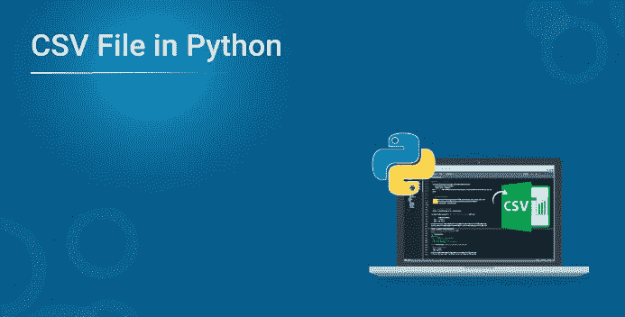
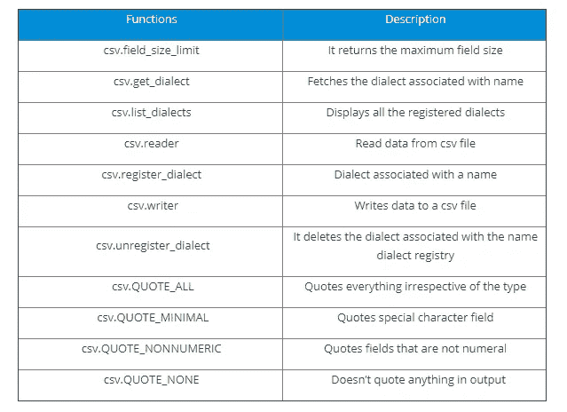
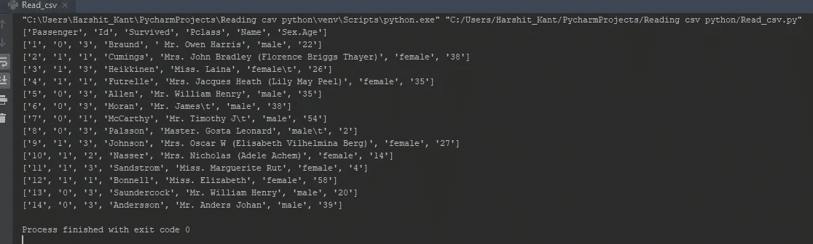
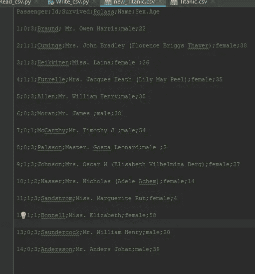
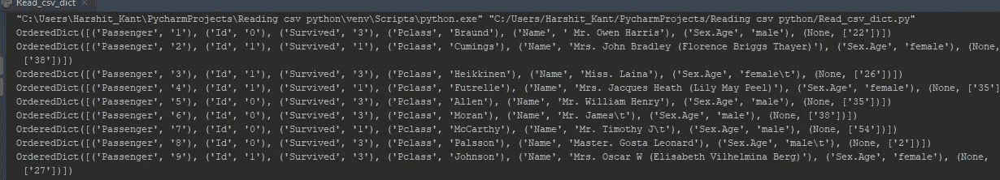
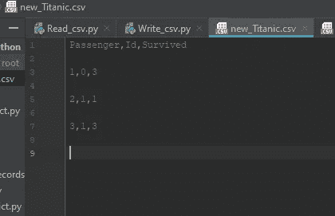
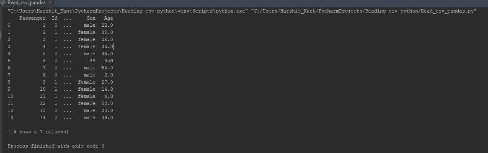

# 如何用 Python 读取一个 CSV 文件？

> 原文：<https://medium.com/edureka/python-csv-files-142035f639a9?source=collection_archive---------7----------------------->



您知道将表格数据存储到纯文本文件背后的机制是什么吗？答案是 CSV(逗号分隔值)文件，它允许将数据转换成纯文本格式。在这篇关于“如何在 Python 中读取 CSV 文件”的文章中，我们将学习如何在 Python 中读取、写入和解析 CSV 文件。

将详细讨论以下几个方面:

*   什么是 CSV 文件及其用途？
*   为什么使用 CSV 文件格式？
*   Python CSV 模块
*   CSV 模块功能
*   在 Python 中执行写、读 CSV 文件的操作

让我们开始吧。

# 什么是 CSV 文件及其用途？

CSV(逗号分隔值)是一种纯文本文件格式，用于存储表格数据，如电子表格或数据库。它本质上是将由数字和文本组成的表格数据存储到纯文本中。大多数在线服务允许用户将数据从网站导出为 CSV 文件格式。CSV 文件通常可以在 Excel 中打开，几乎所有的数据库都有不同的特定工具来导入相同的文件。

文件的每一行称为一条记录。每个记录都包含由逗号分隔的字段，这些字段也被称为“分隔符”，这是默认的分隔符，其他的包括竖线(|)、分号(；).下面给出的是一个由逗号分隔的普通 CSV 文件的结构，我使用的是 titanic CSV 文件。

## 结构

```
Passenger,Id,Survived,Pclass,Name,Sex.Age
1,0,3 Braund, Mr. Owen Harris ,male, 22
2,1,1 Cumings, Mrs. John Bradley (Florence Briggs Thayer), female,38
3,1,3 Heikkinen, Miss. Laina ,female, 26
4,1,1 Futrelle, Mrs. Jacques Heath (Lily May Peel),female,35
```

继续，让我们来谈谈使用 CSV 文件格式背后的原因。

# 为什么使用 CSV 文件格式？

CSV 是一个纯文本文件，这使得数据交换更容易，也更容易导入到电子表格或数据库存储中。例如，您可能希望将某个统计分析的数据导出到 CSV 文件中，然后将其导入到电子表格中进行进一步分析。总的来说，它使用户的工作体验非常容易编程。任何像 Python 这样支持文本文件或字符串操作的语言都可以直接使用 CSV 文件
。

接下来，让我们看看 Python 如何原生使用 CSV。

# Python CSV 模块

Python 使用一个 CSV 包，它是标准库的一部分，所以您不需要安装它。

```
import csv
```

现在让我向您展示不同的 CSV 功能。

## CSV 模块功能

在 CSV 模块下，您可以找到以下功能:



让我们继续从编码的角度来看 Python 中对 CSV 文件的不同操作。

## Python 中对 CSV 文件的操作

CSV 文件加载后，您可以执行多种操作。我将展示 Python 中对 CSV 文件的读写操作。

**用 Python 读取 CSV 文件:**

```
**import** csvwith open('Titanic.csv','r') as csv_file: #Opens the file in read mode csv_reader **=** csv.reader(csv_file) # Making use of reader method for reading the file **for** line **in** csv_reader: #Iterate through the loop to read line by line
            print(line)
```

**输出:**



这里，正如你从输出中看到的，我使用了 Titanic CSV 文件。并且所有字段都用逗号分隔，文件被读入 Python。

接下来，让我们看看如何写入 CSV 文件。

**用 Python 写 CSV 文件:**

```
**import** csvwith open('Titanic.csv', 'r') as csv_file:
        csv_reader **=** csv.reader(csv_file) with open('new_Titanic.csv', 'w') as new_file: # Open a new file named 'new_titanic.csv' under write mode csv_writer **=** csv.writer(new_file, delimiter**=**';') #making use of write method **for** line **in** csv_reader: # for each file in csv_reader
         csv_writer.writerow(line) #writing out to a new file from each line of the original file
```

**输出:**



**将 CSV 文件作为字典读取:**

```
**import** csvwith open('Titanic.csv','r') as csv_file: #Open the file in read mode
    csv_reader **=** csv.DictReader(csv_file) #use dictreader method to reade the file in dictionary**for** line **in** csv_reader: #Iterate through the loop to read line by line
print(line)
```

让我们看看如何将 CSV 文件作为字典写入。**输出:**



**写入 CSV 文件作为字典**

```
**import** csv
mydict **=** [{'Passenger':'1', 'Id':'0', 'Survived':'3'}, #key-value pairs as dictionary obj
{'Passenger':'2', 'Id':'1', 'Survived':'1'},
{'Passenger':'3', 'Id':'1', 'Survived':'3'}]fields **=** ['Passenger', 'Id', 'Survived'] #field names
filename **=** 'new_Titanic.csv' #name of csv filewith open('new_Titanic.csv', 'w')as new_csv_file: #open a new file 'new_titanic,csv' under write mode
writer **=** csv.DictWriter(new_csv_file, fieldnames**=**fields)
writer.writeheader() #writing the headers(field names)
writer.writerows(mydict) #writing data rows
```

我们来看看如何像熊猫一样用 python 读取一个 CSV 文件。

**输出:**



**像熊猫一样读取 CSV 文件:**

```
**import** pandas #install pandas package
result **=** pandas.read_csv('Titanic.csv') #read the csv file
print(result) # print result
```

**输出:**



这就把我们带到了文章的结尾“如何在 Python 中读取 CSV 文件”。希望你对 CSV 相关的所有概念都很清楚，怎么读写，怎么把 CSV 当字典读，怎么把 CSV 当熊猫读。

确保你尽可能多地练习，并恢复你的经验**。**

如果你想查看更多关于人工智能、DevOps、道德黑客等市场最热门技术的文章，你可以参考 [Edureka 的官方网站。](https://www.edureka.co/blog/?utm_source=medium&utm_medium=content-link&utm_campaign=python-csv-files)

请留意本系列中的其他文章，它们将解释 Python 和数据科学的各个方面。

> *1。*[*Python 中的机器学习分类器*](/edureka/machine-learning-classifier-c02fbd8400c9)
> 
> *2。*[*Python Scikit-Learn Cheat Sheet*](/edureka/python-scikit-learn-cheat-sheet-9786382be9f5)
> 
> *3。* [*机器学习工具*](/edureka/python-libraries-for-data-science-and-machine-learning-1c502744f277)
> 
> *4。* [*用于数据科学和机器学习的 Python 库*](/edureka/python-libraries-for-data-science-and-machine-learning-1c502744f277)
> 
> *5。*[*Python 中的聊天机器人*](/edureka/how-to-make-a-chatbot-in-python-b68fd390b219)
> 
> *6。* [*Python 集合*](/edureka/collections-in-python-d0bc0ed8d938)
> 
> *7。* [*Python 模块*](/edureka/python-modules-abb0145a5963)
> 
> *8。* [*Python 开发者技能*](/edureka/python-developer-skills-371583a69be1)
> 
> *9。* [*哎呀面试问答*](/edureka/oops-interview-questions-621fc922cdf4)
> 
> *10。* [*一个 Python 开发者的简历*](/edureka/python-developer-resume-ded7799b4389)
> 
> *11。*[*Python 中的探索性数据分析*](/edureka/exploratory-data-analysis-in-python-3ee69362a46e)
> 
> 12。 [*蛇与 Python 的游戏*](/edureka/python-turtle-module-361816449390)
> 
> *13。* [*Python 开发者工资*](/edureka/python-developer-salary-ba2eff6a502e)
> 
> *14。* [*主成分分析*](/edureka/principal-component-analysis-69d7a4babc96)
> 
> 15。[*Python vs c++*](/edureka/python-vs-cpp-c3ffbea01eec)
> 
> 16。 [*刺儿头教程*](/edureka/scrapy-tutorial-5584517658fb)
> 
> 17。[*Python SciPy*](/edureka/scipy-tutorial-38723361ba4b)
> 
> *18。* [*最小二乘回归法*](/edureka/least-square-regression-40b59cca8ea7)
> 
> *19。* [*Jupyter 笔记本小抄*](/edureka/jupyter-notebook-cheat-sheet-88f60d1aca7)
> 
> 20。 [*Python 基础知识*](/edureka/python-basics-f371d7fc0054)
> 
> *21。* [*Python 模式程序*](/edureka/python-pattern-programs-75e1e764a42f)
> 
> *22。* [*网页抓取用 Python*](/edureka/web-scraping-with-python-d9e6506007bf)
> 
> *23。* [*Python 装饰器*](/edureka/python-decorator-tutorial-bf7b21278564)
> 
> *24。*[*Python Spyder IDE*](/edureka/spyder-ide-2a91caac4e46)
> 
> *25。*[*Python 中使用 Kivy 的移动应用*](/edureka/kivy-tutorial-9a0f02fe53f5)
> 
> *26。* [*十大最佳学习书籍&练习 Python*](/edureka/best-books-for-python-11137561beb7)
> 
> *27。* [*机器人框架用 Python*](/edureka/robot-framework-tutorial-f8a75ab23cfd)
> 
> *28。*[*Python 中的贪吃蛇游戏*](/edureka/snake-game-with-pygame-497f1683eeaa)
> 
> *29。* [*Django 面试问答*](/edureka/django-interview-questions-a4df7bfeb7e8)
> 
> 三十岁。 [*十大 Python 应用*](/edureka/python-applications-18b780d64f3b)
> 
> 31。[*Python 中的哈希表和哈希表*](/edureka/hash-tables-and-hashmaps-in-python-3bd7fc1b00b4)
> 
> *32。*[*Python 3.8*](/edureka/whats-new-python-3-8-7d52cda747b)
> 
> *33。* [*支持向量机*](/edureka/support-vector-machine-in-python-539dca55c26a)
> 
> 34。 [*Python 教程*](/edureka/python-tutorial-be1b3d015745)

*原载于 2019 年 8 月 14 日*[*https://www.edureka.co*](https://www.edureka.co/blog/python-csv-files/)*。*