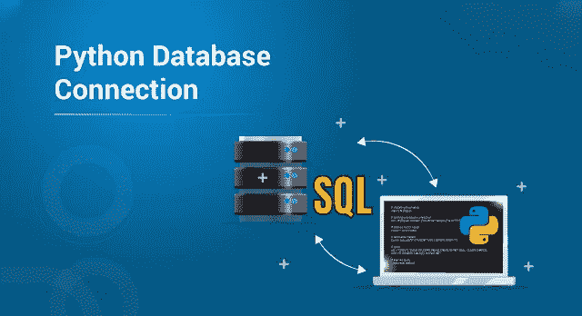
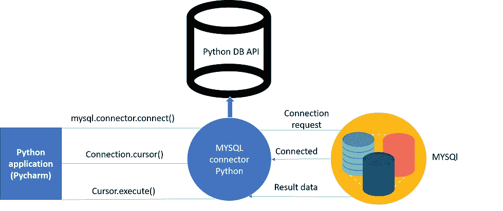
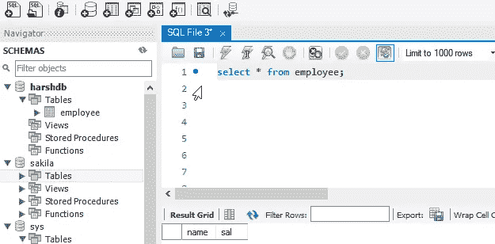
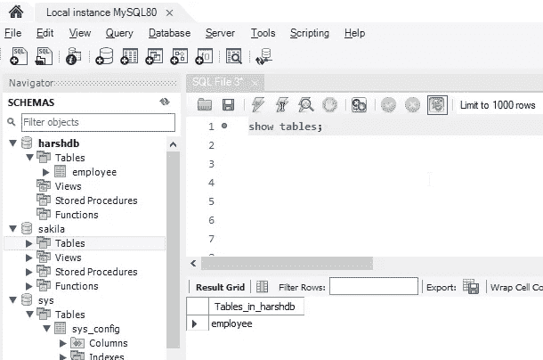
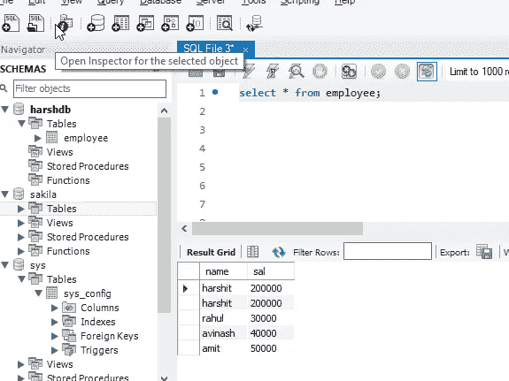
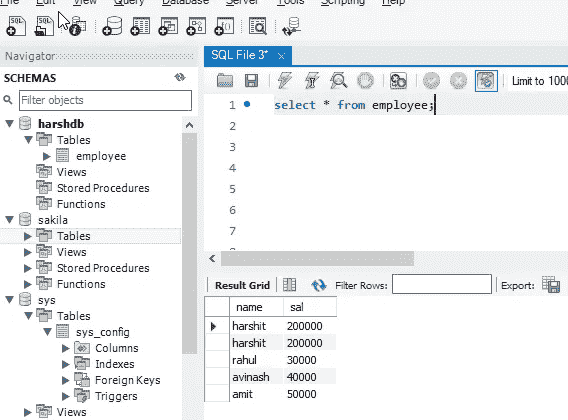
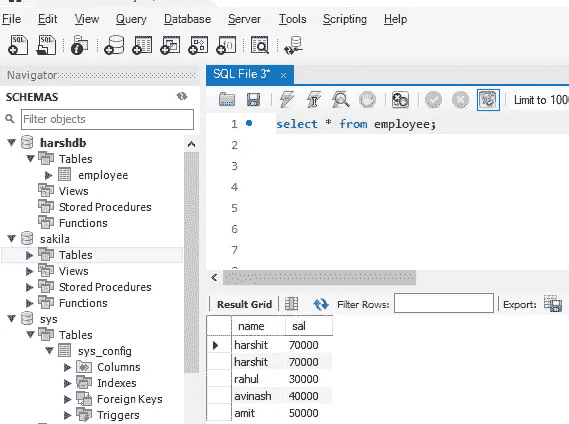
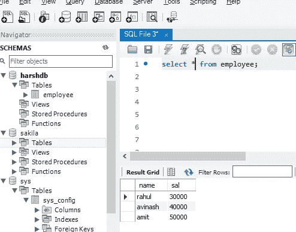

# Python 数据库连接-知道如何连接数据库

> 原文：<https://medium.com/edureka/python-database-connection-b4f9b301947c?source=collection_archive---------2----------------------->



Python Database Connection — Edureka

数据库对于存储和处理数据至关重要，即使您考虑像 Python 这样强大的编程语言。有没有想过这一大堆数据是存储在哪里或者从哪里获取的？在这篇关于“Python 数据库连接”的文章中，我将讨论同样的内容，并带您详细了解以下几个方面。

*   什么是数据库？
*   什么是 MySQLdb？
*   Python 如何连接数据库？
*   创建数据库
*   数据库操作-CRUD

我们开始吧:)

# 什么是数据库？

数据库基本上是结构化数据的集合，可以很容易地以各种方式进行检索、管理和访问。最简单的数据库形式之一是文本数据库。关系数据库是最流行的数据库系统，包括以下内容:

*   关系型数据库
*   Oracle 数据库
*   SQL server
*   赛贝斯
*   Informix
*   IBM db2
*   没有 SQL

在所有这些数据库中， **MySQL** 是最容易使用的数据库之一。让我向你详细介绍一下。

# 什么是 MySQLdb？

MySQLdb 是一个开源的免费关系数据库管理系统，使用结构化查询语言。现在这里最重要的问题之一是“什么是 SQL？”

SQL(结构化查询语言)是关系数据库的标准语言，允许用户对数据进行各种操作，如操作、创建、删除等。简而言之，SQL 允许您对数据做任何事情。

让我们继续深入 Python 数据库连接，在这里您将学习如何连接数据库。

# Python 如何连接数据库？

将 Python 与数据库连接起来非常简单。参考下图，该图说明了 Python 与数据库的连接，其中连接请求如何发送到 MySQL connector Python，如何从数据库接受连接请求，以及如何使用结果数据执行游标。



在连接到 MySQL 数据库之前，请确保您的计算机上安装了 MySQL 安装程序。它提供了一套全面的工具，有助于安装包含以下组件的 MySQL:

*   MySQL 服务器
*   所有可用的连接器
*   MySQL 工作台
*   MySQL 通知程序
*   Excel 和 Microsoft Visual Studio 工具
*   MySQL 示例数据库
*   MySQL 文档

在继续之前，您应该确保您的计算机上安装了 MySQL db。参考下面的命令在命令提示符和 pycharm 中安装 MySQL:

## 使用画中画:

## 命令:

`**import** mysql.connector`

## 输出:

C:UsersHarshit _ kantpycharmprojectstest 1 venvscriptpython . exe C:/Users/harsh it _ Kant/PycharmProjects/test1/venv/python-d b-conn . py

进程结束，退出代码为 0

在本文中，我们继续讨论 Python 数据库连接，让我们看看连接到数据库所需的参数:

*   **用户名-** 它只是你用来运行 MySQL 服务器的用户名，默认用户名是 *root。*
*   **密码-** 密码是用户在安装 MySQL 数据库时给出的。我在这里给出的密码是“密码 123”
*   **主机名-** 这基本上是运行 MySQL 的服务器名或 IP 地址，如果是“本地主机”，那么你的 IP 地址就是 127.0.0.0

我将从编码的角度展示 python 与 MySQL 数据库的连接。

## 示例:

```
**import** mysql.connectormydb**=**mysql.connector.connect(host**=**"localhost",user**=**"root",passwd**=**"password123") **//** I have used 'host','username','password'print(mydb)
```

## 输出:

C:UsersHarshit _ kantpycharmprojectstest 1 venvscriptpython . exe C:/Users/Harshit _ Kant/PycharmProjects/test1/venv/python-d b-conn . py
<MySQL . connector . connection _ cext .CMySQLConnection 对象位于 0x000001606D7BD6A0 >

进程结束，退出代码为 0

**说明:**这里的‘mydb’只是一个实例。从输出中，您可以清楚地看到它已经连接到数据库。

接下来在 Python 数据库连接中，您将学习如何创建数据库。

# 创建数据库:

一旦建立了数据库连接，您就可以创建自己的数据库了，它将作为 python 和 MySQL 服务器之间的桥梁。

让我们看看它的实现部分。

## 示例:

```
**import** mysql.connectormydb**=**mysql.connector.connect(host**=**"localhost",user**=**"root",passwd**=**"password123")mycursor**=**mydb.cursor()mycursor.execute("create database harshdb")
```

## **输出:**

c:/Users/harsh it _ Kant/PycharmProjects/test1/venv/python-d b-conn . py

进程结束，退出代码为 0

## **解释:**

*   在上面的程序中，我使用了 cursor，它基本上是一个用于与整个 MySQL 服务器通信的对象，通过它我可以创建自己的数据库。
*   您可以从输出中看到，我创建的名为“harshdb”的数据库是自定义的，因为您可以为您的数据库指定任何名称。

如果您想查看 MySQL 服务器中的数据库，可以在 pycharm 中实现以下代码:

# 示例:

```
**import** mysql.connectormydb**=**mysql.connector.connect(host**=**"localhost",user**=**"root",passwd**=**"password123")mycursor**=**mydb.cursor()mycursor.execute("show databases")**for** db **in** mycursor:
print(db)
```

## 输出:

C:UsersHarshit _ kantpycharmprojectstest 1 venvscriptpython . exe C:/Users/Harshit _ Kant/PycharmProjects/test1/venv/python-d b-conn . py
(' harshdb '，)
('information_schema '，)
('mysql '，)
('performance_schema '，)
('sakila '，)
('sys '，)
('world '，)

进程结束，退出代码为 0

**说明:**

*   通过实现上面写的代码，我试着显示了 MySQL 服务器中存在的所有数据库。

现在您已经创建了数据库，让我们通过在其中进行一些操作来深入研究 Python 数据库连接的一个最重要的方面。让我们详细了解一下这一点。

# 数据库操作[CRUD]:

为了掌握数据库编程和 MySQL 的扎实知识，程序员可以使用数据库和 SQL 执行许多操作。

我在下面演示了 CRUD 操作

*   **创建**–这是一条 SQL 语句，用于在表中创建一条记录，也可以说是用于创建一个表。
*   **读取-** 用于从数据库中提取有用的信息。
*   **Update-** 这个特定的 SQL 语句用于更新表中的记录或更新表。
*   **Delete-** 顾名思义，该命令用于删除表格。

让我们从编码的角度来详细看看每个方面。

## 创建操作:

```
**import** mysql.connectormydb**=**mysql.connector.connect(host**=**"localhost",user**=**"root",passwd**=**"password123",database**=**harshdb)mycursor**=**mydb.cursor()mycursor.execute("create table employee(name varchar(250),sal int(20))")
```

**输出:**

C:UsersHarshit _ kantpycharmprojectstest 1 venvscriptpython . exe C:/Users/harsh it _ Kant/PycharmProjects/test1/venv/python-d b-conn . py

进程结束，退出代码为 0

**解说:**

*   在上面给出的程序中，我创建了一个“雇员”表。
*   employee 表有两个字段“姓名”和“销售”。
*   这里，用于访问 harshdb 的用户 id 是“root ”,密码是“password123”。

下面给出的屏幕截图显示了表“雇员”，并返回字段“姓名”和“萨尔”。



为了查看我创建的表格，请参考以下 python 代码

```
**import** mysql.connectormydb**=**mysql.connector.connect(host**=**"localhost",user**=**"root",passwd**=**"password123",database**=**"harshdb")
mycursor**=**mydb.cursor()
mycursor.execute("show tables")**for** tb **in** mycursor:print(tb)
```

## 输出:

C:UsersHarshit _ kantpycharmprojectstest 1 venvscriptpython . exe C:/Users/Harshit _ Kant/PycharmProjects/test1/venv/python-d b-conn . py
(' employee '，)

进程结束，退出代码为 0

下面给出的截图显示了我创建的表“雇员”。



现在您已经看到了如何创建表，让我们看看用户如何从中获取值。

# 读取操作:

这种特殊的操作发生在不同的阶段。为此，第一步是填充表。

## **代码:**

```
**import** mysql.connectormydb**=**mysql.connector.connect(host**=**"localhost",user**=**"root",passwd**=**"password123",database**=**"harshdb")mycursor**=**mydb.cursor()sqlformula **=** "Insert into employee(name,sal) values(%s,%s)"**//**'values has placeholdersemployees **=** [("harshit",200000),("rahul", 30000),("avinash", 40000),("amit", 50000),]**//**Created an array of emplpoyeesmycursor.executemany(sqlformula, employees)**//**Passing the datamydb.commit()**//**SQL statement used **for** saving the changes
```

**输出:**

C:UsersHarshit _ kantpycharmprojectstest 1 venvscriptpython . exe C:/Users/harsh it _ Kant/PycharmProjects/test1/venv/python-d b-conn . py

进程结束，退出代码为 0

在上面的代码中，我通过用 Python 编写 SQL 语句，使用一组雇员填充了数据。下面的数据库截图将显示这些变化



这里，在创建数组时,' harshit '在记录中使用了两次。

**第 2 阶段:**在这个阶段，我们将使用“select”SQL 语句，在这里将进行实际的读取操作。

*   **fetchall()**–这个函数从最后执行的语句中获取所有数据。
*   **fetchone()-** 这个特殊的语句从最后执行的语句中取出一个数据。

**代码:**

```
**import** mysql.connectormydb**=**mysql.connector.connect(host**=**"localhost",user**=**"root",passwd**=**"password123",database**=**"harshdb")mycursor**=**mydb.cursor()mycursor.execute("select * from employee")myresult **=** mycursor.fetchall()**for** row **in** myresult:print(row)
```

**输出:**

('哈什特'，200000)
('哈什特'，200000)
('拉胡尔'，30000)
('阿维纳什'，40000)
('阿米特'，50000)

进程结束，退出代码为 0

**解释:**在上面的代码中，我们使用了函数‘fetchall()’。它从最后执行的语句中获取所有数据。

下面给出的是数据库的截图。



## 代码:

```
**import** mysql.connectormydb**=**mysql.connector.connect(host**=**"localhost",user**=**"root",passwd**=**"password123",database**=**"harshdb")mycursor**=**mydb.cursor()mycursor.execute("select name from employee")**//**selecting the field i want data to be fetched **from**myresult **=** mycursor.fetchone()**for** row **in** myresult:print(row)
```

## 输出:

C:UsersHarshit _ kantpycharmprojectstest 1 venvscriptpython . exe C:/Users/harsh it _ Kant/PycharmProjects/test1/venv/python-d b-conn . py
harsh it

进程结束，退出代码为 0

**解释:**在上面的代码中，我使用了函数“fetchone()”，它基本上从最后执行的语句中获取一个数据。

以上都是关于“读取操作”的，让我们深入了解一下更新操作。

# 更新操作:

这个 SQL 语句用于更新表中的记录。让我们实现代码，看看变化是如何发生的。

## 代码:

```
**import** mysql.connectormydb**=**mysql.connector.connect(host**=**"localhost",user**=**"root",passwd**=**"password123",database**=**"harshdb")mycursor**=**mydb.cursor()sql **=** "Update employee SET sal = 70000 WHERE name = 'harshit'"mycursor.execute(sql)mydb.commit()
```

## 输出:

C:UsersHarshit _ kantpycharmprojectstest 1 venvscriptpython . exe C:/Users/harsh it _ Kant/PycharmProjects/test1/venv/python-d b-conn . py

进程结束，退出代码为 0

**解释:**我们已经在上面给出的代码中更新了记录 harshit 的行“sal”。下面给出的截图会给你一个清晰的画面。



可以清楚地看到，记录“harshit”的“sal”行被更新为 70000。

这都是关于更新操作的，继续阅读“Python 数据库连接”文章，我们将看到最后一个操作是“删除”。

# 删除操作:

顾名思义，删除操作用于从表中删除记录。让我们从编码的角度来理解它。

## 代码:

```
import mysql.connector

mydb=mysql.connector.connect(host="localhost",user="root",passwd="password123",database="harshdb")
mycursor=mydb.cursor()

sql = "DELETE FROM employee  WHERE name = 'harshit'"

mycursor.execute(sql)

mydb.commit()
```

## 输出:

C:UsersHarshit _ kantpycharmprojectstest 1 venvscriptpython . exe C:/Users/harsh it _ Kant/PycharmProjects/test1/venv/python-d b-conn . py

进程结束，退出代码为 0

**解释:**在上面的代码中，我删除了一个记录‘harsh it’，因为它重复了两次。

下面给出的截图会给你一个更好的画面。



这就把我们带到了“Python 数据库连接”这篇文章的结尾。我希望你清楚所有与数据库相关的概念，MYSQL db，python 中的数据库操作。确保你尽可能多的练习，恢复你的经验。

如果你想查看更多关于人工智能、DevOps、道德黑客等市场最热门技术的文章，那么你可以参考 [Edureka 的官方网站。](https://www.edureka.co/blog/?utm_source=medium&utm_medium=content-link&utm_campaign=python-interview-questions)

请留意本系列中的其他文章，它们将解释 Python 和数据科学的各个方面。

> 1.[Python 中的机器学习分类器](/edureka/machine-learning-classifier-c02fbd8400c9)
> 
> 2. [Python Scikit-Learn 备忘单](/edureka/python-scikit-learn-cheat-sheet-9786382be9f5)
> 
> 3.[机器学习工具](/edureka/python-libraries-for-data-science-and-machine-learning-1c502744f277)
> 
> 4.[用于数据科学和机器学习的 Python 库](/edureka/python-libraries-for-data-science-and-machine-learning-1c502744f277)
> 
> 5.[Python 中的聊天机器人](/edureka/how-to-make-a-chatbot-in-python-b68fd390b219)
> 
> 6. [Python 集合](/edureka/collections-in-python-d0bc0ed8d938)
> 
> 7. [Python 模块](/edureka/python-modules-abb0145a5963)
> 
> 8. [Python 开发者技能](/edureka/python-developer-skills-371583a69be1)
> 
> 9.[哎呀面试问答](/edureka/oops-interview-questions-621fc922cdf4)
> 
> 10.[Python 开发者简历](/edureka/python-developer-resume-ded7799b4389)
> 
> 11.[Python 中的探索性数据分析](/edureka/exploratory-data-analysis-in-python-3ee69362a46e)
> 
> 12.[带 Python 的乌龟模块的贪吃蛇游戏](/edureka/python-turtle-module-361816449390)
> 
> 13. [Python 开发者工资](/edureka/python-developer-salary-ba2eff6a502e)
> 
> 14.[主成分分析](/edureka/principal-component-analysis-69d7a4babc96)
> 
> 15. [Python vs C++](/edureka/python-vs-cpp-c3ffbea01eec)
> 
> 16.[刺儿头教程](/edureka/scrapy-tutorial-5584517658fb)
> 
> 17. [Python SciPy](/edureka/scipy-tutorial-38723361ba4b)
> 
> 18.[最小二乘回归法](/edureka/least-square-regression-40b59cca8ea7)
> 
> 19. [Jupyter 笔记本小抄](/edureka/jupyter-notebook-cheat-sheet-88f60d1aca7)
> 
> 20. [Python 基础知识](/edureka/python-basics-f371d7fc0054)
> 
> 21. [Python 模式程序](/edureka/python-pattern-programs-75e1e764a42f)
> 
> 22.[Python 中的生成器](/edureka/generators-in-python-258f21e3d3ff)
> 
> 23. [Python 装饰器](/edureka/python-decorator-tutorial-bf7b21278564)
> 
> 24. [Python Spyder IDE](/edureka/spyder-ide-2a91caac4e46)
> 
> 25.[Python 中使用 Kivy 的移动应用](/edureka/kivy-tutorial-9a0f02fe53f5)
> 
> 26.[最好学的 10 本书&练习 Python](/edureka/best-books-for-python-11137561beb7)
> 
> 27.[用 Python 实现机器人框架](/edureka/robot-framework-tutorial-f8a75ab23cfd)
> 
> 28.[使用 PyGame 的 Python 中的贪吃蛇游戏](/edureka/snake-game-with-pygame-497f1683eeaa)
> 
> 29. [Django 采访问答](/edureka/django-interview-questions-a4df7bfeb7e8)
> 
> 30.[十大 Python 应用](/edureka/python-applications-18b780d64f3b)
> 
> 31.[Python 中的哈希表和哈希表](/edureka/hash-tables-and-hashmaps-in-python-3bd7fc1b00b4)
> 
> 32. [Python 3.8](/edureka/whats-new-python-3-8-7d52cda747b)
> 
> 33. [Python Visual Studio](/edureka/python-visual-studio-cef3ad98a9e2)
> 
> 34.[Python 中的支持向量机](/edureka/support-vector-machine-in-python-539dca55c26a)

*原载于 2019 年 7 月 2 日*[*https://www.edureka.co*](https://www.edureka.co/blog/python-database-connection/)*。*