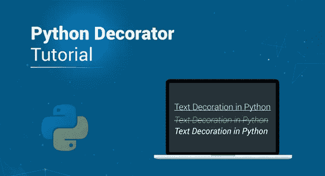

# Python Decorator:学习如何在 Python 中使用 Decorator

> 原文：<https://medium.com/edureka/python-decorator-tutorial-bf7b21278564?source=collection_archive---------0----------------------->



Python Decorator Tutorial — Edureka

python 中的函数提供了任何程序的运行逻辑的优化实现，多次执行都没有麻烦。python 中的 Decorators 也围绕着 Python 函数的概念。在本文中，我们将详细介绍 python decorator，包括 Python decorator 教程中的各种例子。本博客讨论了以下主题。

*   Python 中有哪些函数？

1.  一等品
2.  内部函数

*   Python 中的装饰者

1.  带参数的装饰器
2.  返回值

*   Python 中的花哨装饰

1.  类装饰者
2.  单例类
3.  嵌套装饰器

# Python 中有哪些函数？

Python 中的 Decorators 是一个高级主题。因此，在继续之前，请确保您完全了解 python 函数的概念。在继续学习 Python 中的 decorators 之前，有几个先决条件必须理解。

*   一等品
*   内部函数

## 一等品

在 python 中，一切都被当作一个对象，包括所有的数据类型和函数。因此，函数也被称为一级对象，可以作为参数传递。

让我们看一个例子来理解它是如何工作的。

```
def func1(name):
    return f"Hello {name}"
def func2(name):
    return f"{name}, How you doin?"
def func3(func4):
    return func4('Dear learner')

print(func3(func1))
print(func3(func2))
```

**输出:**

```
Hello Dear learner
Dear learner, how you doin?
```

在上面的示例中，我们使用了字符串插值来获取名称，并将 func1 和 func2 作为参数传递给 func3。

## 内部函数

在 python 中，可以在函数内部定义函数。这个函数叫做内部函数。这里有一个例子来展示我们如何在 python 中使用内部函数。

```
def func():
     print("first function")
     def func1():
           print("first child function")
     def func2():
           print(" second child function")
     func1()
     func2()
func()
```

**输出:**

```
first function
first child function
second child function
```

在上面的程序中，如何声明子函数并不重要。输出取决于子函数的执行方式。它们是用 func()局部限定的，所以不能单独调用。

如果你单独调用它们，你会得到一个错误，因为它们是作为变量存储在 func()中的，只有当 func()被调用时才能被调用。

## **从一个函数返回一个函数**

可以使用另一个函数返回一个函数。看一下下面的例子来理解这一点。

```
def func(n):
      def func1():
          return "edureka"
      def func2():
          return "python"
      if n == 1:
          return func1
      else:
          return func2
a  = func(1)
b = func(2)
print(a())
print(b())
```

## **输出:**

```
edureka
python
```

# Python 中的装饰者

Python 中的 Decorators 非常强大，它可以修改函数的行为，而不用永久地修改它。它基本上包装了另一个函数，因为两个函数都是可调用的，所以它返回一个可调用的。

事后看来，装饰者包装了一个函数并修改了它的行为。让我们看一个简单的例子来理解如何在 python 中使用 decorators。

```
def function1(function):
      def wrapper():
            print("hello")
            function()
            print("welcome to python edureka")
      return wrapper
def function2():
      print("Pythonista")
function2 = function1(function2)

function2()
```

## 输出:

```
hello
pythonista
welcome to python edureka
```

为了让程序员的工作变得简单一些，我们为 python decorators 提供了一个语法糖。看看下面的例子，了解它是如何工作的。

```
def function1(function):
      def wrapper():
           print("hello")
           function()
           print("how are you?")
      return wrapper
[@function1](http://twitter.com/function1)
def function2():
      print("pythonista")

function2()
```

## 输出:

```
hello
pythonista
how are you?
```

输出将类似于上面的程序，唯一的区别是我们使用了带有@符号的 pie 语法。

# 使用带参数的装饰器

当你有一个带参数的函数时，修饰函数就变得更棘手了，因为它在声明中也需要参数。为了解决这个问题，我们可以在内部包装函数中使用*args 和**kwargs。看一下下面的例子来理解这一点。

```
def function1(function):
      def wrapper(*args, **kwargs):
            print("hello")
            function(*args, **kwargs)
            print("welcome to edureka")
      return wrapper
[@function1](http://twitter.com/function1)
def function2(name):
      print(f"{name}")

function2("pythonista")
```

## 输出:

```
hello
pythonista
welcome to edureka
```

## 从修饰函数返回值

让我们看一个例子，看看我们如何从一个修饰函数返回值。

```
def function1(function):
     def wrapper(*args, **kwargs):
           function(*args, **kwargs)
           print("it worked")
     return wrapper
[@function1](http://twitter.com/function1)
def function2(name):
      print(f"{name}")

function2("python")
```

## 输出:

```
python
it worked
```

确保使用参数返回包装函数，以避免任何错误。

# Python 中的花哨装饰

现在我们已经知道了装饰器在 python 中是如何工作的，让我们借助一些例子来探索一个相当复杂的特性。

## 班级装饰者

在 python 中有两种方法来修饰一个类。第一个是你可以修饰类中的方法，python 中有内置的修饰器，比如@classmethod、@staticmethod 和@property。@classmethod 和@staticmethod 在不连接到类的任何其他实例的类中定义方法。@property 通常用于自定义类属性的 getters 和 setters。让我们看一个例子来理解这一点。

```
class Square:
        def __init__(self, side):
             self._side = side
        [@property](http://twitter.com/property)
        def side(self):
              return self._side
        [@side](http://twitter.com/side).setter
         def side(self, value):
               if value >= 0:
                  self._side = value
               else:
                  print("error")
         [@property](http://twitter.com/property)
          def area(self):
               return self._side ** 2
         [@classmethod](http://twitter.com/classmethod)
          def unit_square(cls):
               return cls(1)
s = Square(5)
print(s.side)
print(s.area)
```

## 输出:

```
5
25
```

装饰班级的另一种方法是装饰整个班级。让我们举个例子来理解这一点。

```
from dataclasses import dataclass
[@dataclass](http://twitter.com/dataclass)
class Cards:
       rank: str
       suit: str
```

装饰一个类并不反映它的方法。这几乎类似于编写一个函数的装饰器，唯一的区别是参数中的类而不是函数。

## 单例类

单例类只有一个实例。python 中有大量的单例，包括 True、None 等。让我们看一个例子来更好地理解这一点。

```
import functools

def singleton(cls):
      [@functools](http://twitter.com/functools).wraps(cls)
       def wrapper(*args, **kwargs):
             if not wrapper.instance:
                wrapper.instance = cls(*args, **kwargs)
             return wrapper.instance
       wrapper.instance = None
       return wrapper

[@singleton](http://twitter.com/singleton)
class One:
       pass

first = One()
second = One()
print(first is second)
```

## 输出:

```
True
```

使用“is”仅对相同实例的对象返回 true。上面的例子使用了与任何其他函数装饰器相同的方法。唯一的区别是我们使用了 cls 而不是函数。此外，第一个和第二个是完全相同的实例。

## 嵌套装饰者

你可以通过堆叠多个装饰器来使用它们。让我们举一个例子来理解这是如何工作的。

```
[@function1](http://twitter.com/function1)
[@function2](http://twitter.com/function2)
def function(name):
      print(f"{name}")
```

这就是我们如何通过将嵌套的装饰器相互堆叠来使用它们。在上面的例子中，这只是一个简单的描述，为了让它工作，你必须定义函数 1 和函数 2，并且在它们中包含包装函数。

## 装饰器中的参数

在装饰器中传递参数总是有用的。让我们考虑下面的例子。

```
import functools
def repeat(num):
      def decorator_repeat(func):
            [@functools](http://twitter.com/functools).wraps(func)
            def wrapper(*args, **kwargs):
                  for _ in range(num):
                       value = func(*args, **kwargs)
                  return value
             return wrapper
       return decorator_repeat 

[@repeat](http://twitter.com/repeat)(num=4)
def function(name):
      print(f"{name}")

function("python")
```

## 输出:

```
python
python
python
python
```

这就把我们带到了本文的结尾，在这里我们学习了如何在 Python 中用例子来使用 Decorator。我希望你清楚这篇文章中与你分享的所有内容。

如果你想查看更多关于人工智能、DevOps、道德黑客等市场最热门技术的文章，你可以参考 Edureka 的官方网站。

请留意本系列中的其他文章，它们将解释 Python 和数据科学的各个方面。

> 1.[Python 中的机器学习分类器](/edureka/machine-learning-classifier-c02fbd8400c9)
> 
> 2.[Python Scikit-Learn Cheat Sheet](/edureka/python-scikit-learn-cheat-sheet-9786382be9f5)
> 
> 3.[机器学习工具](/edureka/python-libraries-for-data-science-and-machine-learning-1c502744f277)
> 
> 4.[用于数据科学和机器学习的 Python 库](/edureka/python-libraries-for-data-science-and-machine-learning-1c502744f277)
> 
> 5.[Python 中的聊天机器人](/edureka/how-to-make-a-chatbot-in-python-b68fd390b219)
> 
> 6. [Python 集合](/edureka/collections-in-python-d0bc0ed8d938)
> 
> 7. [Python 模块](/edureka/python-modules-abb0145a5963)
> 
> 8. [Python 开发者技能](/edureka/python-developer-skills-371583a69be1)
> 
> 9.[哎呀面试问答](/edureka/oops-interview-questions-621fc922cdf4)
> 
> 10.[Python 开发者简历](/edureka/python-developer-resume-ded7799b4389)
> 
> 11.[Python 中的探索性数据分析](/edureka/exploratory-data-analysis-in-python-3ee69362a46e)
> 
> 12.[带 Python 的乌龟模块的贪吃蛇游戏](/edureka/python-turtle-module-361816449390)
> 
> 13. [Python 开发者工资](/edureka/python-developer-salary-ba2eff6a502e)
> 
> 14.[主成分分析](/edureka/principal-component-analysis-69d7a4babc96)
> 
> 15. [Python vs C++](/edureka/python-vs-cpp-c3ffbea01eec)
> 
> 16.[刺儿头教程](/edureka/scrapy-tutorial-5584517658fb)
> 
> 17. [Python SciPy](/edureka/scipy-tutorial-38723361ba4b)
> 
> 18.[最小二乘回归法](/edureka/least-square-regression-40b59cca8ea7)
> 
> 19. [Jupyter 笔记本小抄](/edureka/jupyter-notebook-cheat-sheet-88f60d1aca7)
> 
> 20. [Python 基础知识](/edureka/python-basics-f371d7fc0054)
> 
> 21. [Python 模式程序](/edureka/python-pattern-programs-75e1e764a42f)
> 
> 22.[Python 中的生成器](/edureka/generators-in-python-258f21e3d3ff)
> 
> 23.[用 Python 进行网页抓取](/edureka/web-scraping-with-python-d9e6506007bf)
> 
> 24. [Python Spyder IDE](/edureka/spyder-ide-2a91caac4e46)
> 
> 25.[Python 中使用 Kivy 的移动应用](/edureka/kivy-tutorial-9a0f02fe53f5)
> 
> 26.[十大最佳学习书籍&练习 Python](/edureka/best-books-for-python-11137561beb7)
> 
> 27.[用 Python 实现机器人框架](/edureka/robot-framework-tutorial-f8a75ab23cfd)
> 
> 28.[使用 PyGame 的 Python 中的贪吃蛇游戏](/edureka/snake-game-with-pygame-497f1683eeaa)
> 
> 29. [Django 面试问答](/edureka/django-interview-questions-a4df7bfeb7e8)
> 
> 30.[十大 Python 应用](/edureka/python-applications-18b780d64f3b)
> 
> 31.[Python 中的散列表和散列表](/edureka/hash-tables-and-hashmaps-in-python-3bd7fc1b00b4)
> 
> 32. [Python 3.8](/edureka/whats-new-python-3-8-7d52cda747b)
> 
> 33.[支持向量机](/edureka/support-vector-machine-in-python-539dca55c26a)
> 
> 34. [Python 教程](/edureka/python-tutorial-be1b3d015745)

*原载于 2019 年 9 月 23 日 https://www.edureka.co**的* [*。*](https://www.edureka.co/blog/python-decorator-tutorial/)