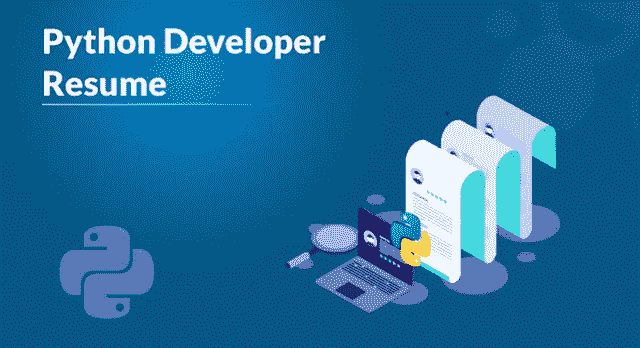
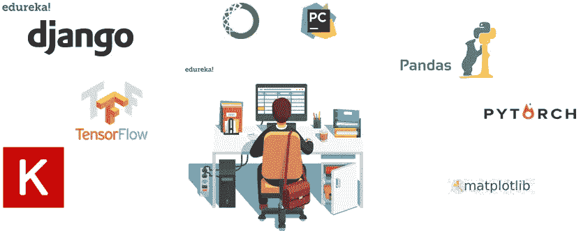
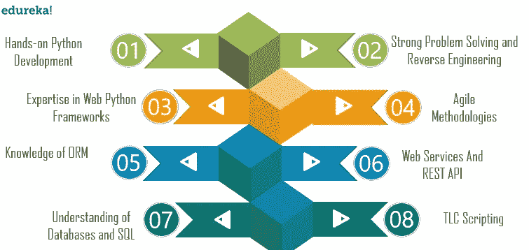
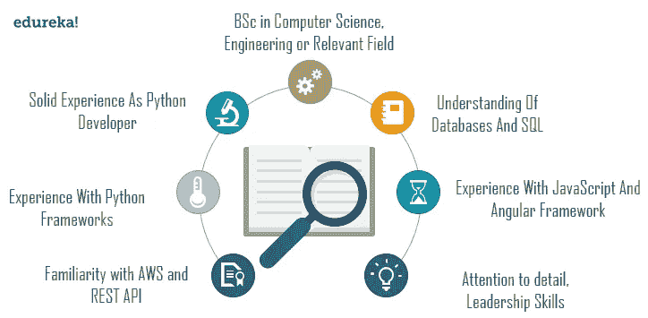
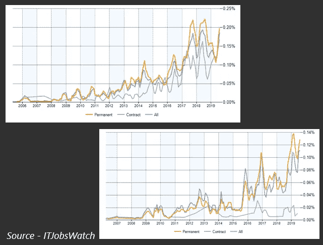
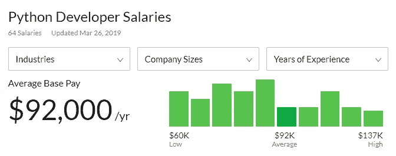
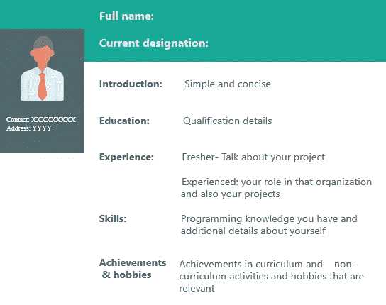

# 了解如何为 Python 开发人员制作简历

> 原文：<https://medium.com/edureka/python-developer-resume-ded7799b4389?source=collection_archive---------1----------------------->

Python Developer Resume — Edureka

Python 编程语言在过去的二十年里取得了很大的进步。由于对数据科学、人工智能和机器学习领域的巨大贡献，它已经成为 21 世纪最受欢迎的语言之一。越来越多的创新和技术进步对于任何 python 开发人员来说都有一个非常有前途的新的和巨大的工作机会。在本文中，我们将了解 python 开发人员简历构建的有效方面。以下是本文涵盖的主题:

*   谁是 Python 开发者？
*   工作说明
*   所需技能
*   如何打造自己的简历？
*   Python 开发人员工作趋势
*   薪资趋势
*   Python 开发人员简历示例

# 谁是 Python 开发者？

python 开发人员负责编写服务器端应用程序逻辑。对于 python 开发者来说，每天都有惊人的工作机会。公司正在转向 python 编程语言，这为 python 程序员和开发人员创造了机会。让我们来看看一家公司提供的 python 开发人员的典型职位描述。

# 工作说明

典型的工作描述如下:

> 我们正在寻找一个负责管理服务器和用户之间的数据交换的 python 开发人员。您的主要工作是开发所有服务器端逻辑，确保高性能和对前端请求的响应。您还将负责将同事构建的前端元素集成到应用程序中。因此，对前端技术的基本理解也是必须的。

为了获得更广泛的叙述，**这里是 python 开发人员的另一份工作描述**。

> 我们正在寻找一个 python 开发者加入我们的工程团队，帮助我们开发和维护各种软件产品。职责包括编写和测试代码、调试程序以及将应用程序与第三方 web 服务器集成。
> 
> 要想在这个职位上取得成功，你应该有使用服务器端逻辑的经验，并能在团队中很好地工作。最终，您将构建出符合我们业务需求的高度响应的 web 应用程序。

这是一个典型的 python 开发人员的工作描述，但它可能会根据不同的公司和他们对 python 开发人员简历的要求而有所不同。

# 所需技能

初级 python 开发人员所需的技能包括:

*   Python 开发实践
*   强大的问题解决和逆向工程能力
*   web python 框架方面的专业知识(django、flask 等)
*   敏捷方法
*   ORM(对象关系映射)知识
*   对 Web 服务和 REST API 有良好的理解
*   了解数据库和 SQL
*   TLC 脚本知识

其他技能包括:

*   强 DevOps
*   全栈开发经验
*   云服务知识
*   HTML，CSS，JavaScript，JQuery
*   出色的调试技能
*   软件开发生命周期

以下是有经验的或高级 python 开发人员所需的一些技能:

*   计算机科学，工程或相关领域的学士学位
*   作为 python 开发人员的丰富经验
*   使用 Python 框架的经验
*   使用 JavaScript 和 Angular 框架的经验
*   熟悉 AWS 和 REST API
*   关注细节和卓越的领导技能
*   了解数据库和 SQL

现在我们知道了初级和有经验的 python 开发人员需要的所有技能，让我们来看看如何创建 python 开发人员简历。

# 如何打造自己的简历？

有两种方法来制作简历，下面是我们可以定义简历的两个类别。

*   **功能性—** 根据相关的工作角色提及你的经历。
*   **按时间顺序—** 以事情发生的方式讲述你的经历。

在创建 python 开发人员简历时，您的方法应该满足以下几点:

*   在格式方面简洁明了
*   更新简历
*   对于少于 8 年的经验，简历不应该超过一页
*   2 年以上工作经验的实用简历
*   根据特定工作角色的技能优先级
*   提及你参与的活动
*   成就和爱好必须包括在内

# Python 开发人员工作趋势

让我们考虑一下 2019 年初级和高级 python 开发人员的各种工作趋势。

正如我们在上面的图表中所看到的，对于初级 python 开发人员来说，永久性工作的数量在过去 5 年中有了很大的飞跃。随着工作岗位超过 20%的增长，考虑到 it 行业的最新创新和进步，公司开始以指数速度转向 python 编程语言，这种增长只会从这里开始。

对于高级 python 开发人员的工作，它比以往任何时候都要高，在 python 编程领域的经验会让你比其他候选人更有优势，从而增加你获得这份工作的机会。

# 薪资趋势

让我们来考虑一下 2019 年 python 开发者的薪资趋势。

看一下这些统计数据，很明显一个 python 开发者平均一年能挣 92000 美元，在某些情况下甚至能达到 137000 美元。

印度初级 python 开发人员的平均年薪超过 50 万印度卢比，目前至少有 3 万个职位空缺。

对于一名高级 python 开发人员来说，平均工资为 60 万印度卢比，一年也可能高达 200 万印度卢比。随着需求的增加，拥有相关技能和经验的人很容易找到工作。以下是 python 开发人员简历的样本。

# Python 开发人员简历示例

在本文中，我们介绍了构建 python 开发者简历时需要涉及的各个方面。有了对工作和工资趋势的洞察，人们可以弥补任何 python 开发人员的机会数量。

如果你想查看更多关于人工智能、DevOps、道德黑客等市场最热门技术的文章，你可以参考 Edureka 的官方网站。

请留意本系列中的其他文章，它们将解释 Python 和数据科学的各个方面。

> 1.[Python 中的机器学习分类器](/edureka/machine-learning-classifier-c02fbd8400c9)
> 
> 2.[Python Scikit-Learn Cheat Sheet](/edureka/python-scikit-learn-cheat-sheet-9786382be9f5)
> 
> 3.[机器学习工具](/edureka/python-libraries-for-data-science-and-machine-learning-1c502744f277)
> 
> 4.[用于数据科学和机器学习的 Python 库](/edureka/python-libraries-for-data-science-and-machine-learning-1c502744f277)
> 
> 5.[Python 中的聊天机器人](/edureka/how-to-make-a-chatbot-in-python-b68fd390b219)
> 
> 6. [Python 集合](/edureka/collections-in-python-d0bc0ed8d938)
> 
> 7. [Python 模块](/edureka/python-modules-abb0145a5963)
> 
> 8. [Python 开发者技能](/edureka/python-developer-skills-371583a69be1)
> 
> 9.[哎呀面试问答](/edureka/oops-interview-questions-621fc922cdf4)
> 
> 10.[用 Python 进行网页抓取](/edureka/web-scraping-with-python-d9e6506007bf)
> 
> 11.[Python 中的探索性数据分析](/edureka/exploratory-data-analysis-in-python-3ee69362a46e)
> 
> 12.[带 Python 的乌龟模块的贪吃蛇游戏](/edureka/python-turtle-module-361816449390)
> 
> 13. [Python 开发者工资](/edureka/python-developer-salary-ba2eff6a502e)
> 
> 14.[主成分分析](/edureka/principal-component-analysis-69d7a4babc96)
> 
> 15. [Python vs C++](/edureka/python-vs-cpp-c3ffbea01eec)
> 
> 16.[刺儿头教程](/edureka/scrapy-tutorial-5584517658fb)
> 
> 17. [Python SciPy](/edureka/scipy-tutorial-38723361ba4b)
> 
> 18.[最小二乘回归法](/edureka/least-square-regression-40b59cca8ea7)
> 
> 19. [Jupyter 笔记本小抄](/edureka/jupyter-notebook-cheat-sheet-88f60d1aca7)
> 
> 20. [Python 基础知识](/edureka/python-basics-f371d7fc0054)
> 
> 21. [Python 模式程序](/edureka/python-pattern-programs-75e1e764a42f)
> 
> 22.[Python 中的发电机](/edureka/generators-in-python-258f21e3d3ff)
> 
> 23. [Python 装饰师](/edureka/python-decorator-tutorial-bf7b21278564)
> 
> 24. [Python Spyder IDE](/edureka/spyder-ide-2a91caac4e46)
> 
> 25.[在 Python 中使用 Kivy 的移动应用](/edureka/kivy-tutorial-9a0f02fe53f5)
> 
> 26.[十大最佳学习书籍&练习 Python](/edureka/best-books-for-python-11137561beb7)
> 
> 27.[使用 Python 的机器人框架](/edureka/robot-framework-tutorial-f8a75ab23cfd)
> 
> 28.[使用 PyGame 的 Python 中的贪吃蛇游戏](/edureka/snake-game-with-pygame-497f1683eeaa)
> 
> 29. [Django 面试问答](/edureka/django-interview-questions-a4df7bfeb7e8)
> 
> 30.[十大 Python 应用](/edureka/python-applications-18b780d64f3b)
> 
> 31.[Python 中的哈希表和哈希表](/edureka/hash-tables-and-hashmaps-in-python-3bd7fc1b00b4)
> 
> 32. [Python 3.8](/edureka/whats-new-python-3-8-7d52cda747b)
> 
> 33.[支持向量机](/edureka/support-vector-machine-in-python-539dca55c26a)
> 
> 34. [Python 教程](/edureka/python-tutorial-be1b3d015745)

*原载于 2019 年 8 月 13 日*[*https://www.edureka.co*](https://www.edureka.co/blog/python-developer-resume/)*。*