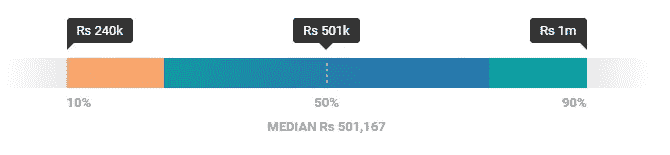
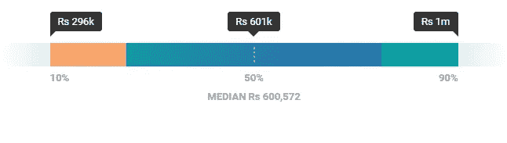

# Python 开发者平均工资是多少？

> 原文：<https://medium.com/edureka/python-developer-salary-ba2eff6a502e?source=collection_archive---------2----------------------->

Python Developer Salary — Edureka

Python 每天都在攀登新的高度，原因有很多。Python 已经吞并了它的竞争对手，从而提高了全世界对 Python 认证的需求。在本文中，您将了解市场为 Python 开发人员提供了什么。

在继续之前，让我们看一下本文中讨论的所有主题:

*   谁是 Python 开发者？
*   Python 开发人员工作趋势
*   Python 开发人员的平均工资基于:

1.  经验
2.  位置
3.  技能组合

所以让我们开始吧。:)

# 谁是 Python 开发者？

Python 开发者是使用 Python 设计、编程和交付软件应用的人。一些最重要的职责是为后端组件编写有效的代码，测试和调试程序，创建可以与现有应用程序集成的应用程序，等等。这些开发人员目前的工资趋势也显著增加，但在了解之前，这里有一项调查，解释了为什么 Python 开发人员的工资很高。

蟒蛇在 2019 年的受欢迎程度破纪录。根据 Stackoverflow 的说法，Python 已经成为最受质疑的语言，远远落后于其强劲的竞争对手 JavaScript。GitHub 让 Python 在流行度竞赛中独占鳌头。请看下图:

*来源:GitHub*

正如你所看到的，Python 以 28.73%的流行度份额高居榜首，并有 4.5%的大幅增长。这对 Python 来说是一个巨大的数字和巨大的成功。在过去的五年里，Python 有 18.2%的增长，而另一方面，Java 却急剧下降到 Python 之下。

# Python 开发人员工作趋势:

受欢迎程度的提高与就业市场的上升成正比。Python 开发者在全世界都有很大的需求。2019 年 8 月，Indeed 显示了一个 Python 开发者的大约 69K 个空缺。纽约市拥有最多的 Python 开发人员职位，其次是芝加哥和旧金山。

# Python 开发人员的平均工资:

Python 开发人员的工资取决于各种其他因素，如经验、地点、技能等。

## 体验:

工资等级因经验而异。在印度，初级开发人员的最低年薪可能为 2.4L。然而，上限取决于开发人员的组织和技能。根据 PayScale 截至 2019 年 6 月的一项调查，平均而言，一名入门级 Python 开发者在印度的年收入约为**50 万卢比**(印度卢比)，在美国的年收入约为**8.8 万美元**。

印度:

美国:

*资料来源:薪级表*

在另一项由 Indeed 进行的调查中，平均工资约为 51 万英镑。看看下面的图片:

**印度:**

**美国:**

*来源:确实*

在高级 Python 开发人员级别，这些开发人员在大约 1-4 年的经验后，可能平均收入约为 **800K+** 。软件开发人员的薪资涨幅最大，仅次于高级职位。为了让你对此有一个清晰的概念，这里有一张来自 PayScale 的图片:

*资料来源:薪级表*

## 位置:

Python 开发人员的工资也因地域而异。在美国，Python 开发者的最佳地点似乎是加州，平均年薪为 12.2 万美元。这里是 Python 开发者在美国的前五个位置。

*资料来源:Gooroo*

在印度，拥有 Python 技能的软件开发人员的最佳工作地点是哈里亚纳邦的古尔冈，平均年薪为 73.1 万卢比以上。看看印度 Python 开发者的五大最佳地点。

*资料来源:薪级表*

## **技能组合:**

具备 Python 知识和其他技能证明是影响 Python 开发人员工资的一个非常重要的因素。与 Python 一起最受欢迎的技能是 AWS 和 Django。下面是 CV Compiler 进行的一项调查的图片，展示了 Python 开发人员需要具备的 10 大技能。

*资料来源:CV 编译器*

根据 PayScale，了解 Django 的初级 Python 开发人员的平均工资是 60 万卢比(INR ),比本文前面提到的平均工资要高得多。

*资料来源:薪级表*

这就把我们带到了这篇关于 Python 开发者工资的文章的结尾。我希望你已经明白了一切。

如果你想查看更多关于人工智能、DevOps、道德黑客等市场最热门技术的文章，那么你可以参考 [Edureka 的官方网站。](https://www.edureka.co/blog/?utm_source=medium&utm_medium=content-link&utm_campaign=python-developer-salary)

请留意本系列中的其他文章，它们将解释 Python 和数据科学的各个方面。

> 1.[Python 中的机器学习分类器](/edureka/machine-learning-classifier-c02fbd8400c9)
> 
> 2. [Python Scikit-Learn 备忘单](/edureka/python-scikit-learn-cheat-sheet-9786382be9f5)
> 
> 3.[机器学习工具](/edureka/python-libraries-for-data-science-and-machine-learning-1c502744f277)
> 
> 4.[用于数据科学和机器学习的 Python 库](/edureka/python-libraries-for-data-science-and-machine-learning-1c502744f277)
> 
> 5.[Python 中的聊天机器人](/edureka/how-to-make-a-chatbot-in-python-b68fd390b219)
> 
> 6. [Python 集合](/edureka/collections-in-python-d0bc0ed8d938)
> 
> 7. [Python 模块](/edureka/python-modules-abb0145a5963)
> 
> 8. [Python 开发者技能](/edureka/python-developer-skills-371583a69be1)
> 
> 9.[哎呀面试问答](/edureka/oops-interview-questions-621fc922cdf4)
> 
> 10.[Python 开发者简历](/edureka/python-developer-resume-ded7799b4389)
> 
> 11.[Python 中的探索性数据分析](/edureka/exploratory-data-analysis-in-python-3ee69362a46e)
> 
> 12.[带 Python 的乌龟模块的贪吃蛇游戏](/edureka/python-turtle-module-361816449390)
> 
> 13.[用 Python 进行网页抓取](/edureka/web-scraping-with-python-d9e6506007bf)
> 
> 14.[主成分分析](/edureka/principal-component-analysis-69d7a4babc96)
> 
> 15. [Python vs C++](/edureka/python-vs-cpp-c3ffbea01eec)
> 
> 16.[刺儿头教程](/edureka/scrapy-tutorial-5584517658fb)
> 
> 17. [Python SciPy](/edureka/scipy-tutorial-38723361ba4b)
> 
> 18.[最小二乘回归法](/edureka/least-square-regression-40b59cca8ea7)
> 
> 19. [Jupyter 笔记本小抄](/edureka/jupyter-notebook-cheat-sheet-88f60d1aca7)
> 
> 20. [Python 基础知识](/edureka/python-basics-f371d7fc0054)
> 
> 21. [Python 模式程序](/edureka/python-pattern-programs-75e1e764a42f)
> 
> 22.[Python 中的生成器](/edureka/generators-in-python-258f21e3d3ff)
> 
> 23. [Python 装饰器](/edureka/python-decorator-tutorial-bf7b21278564)
> 
> 24. [Python Spyder IDE](/edureka/spyder-ide-2a91caac4e46)
> 
> 25.[Python 中使用 Kivy 的移动应用](/edureka/kivy-tutorial-9a0f02fe53f5)
> 
> 26.[十大最佳学习书籍&练习 Python](/edureka/best-books-for-python-11137561beb7)
> 
> 27.[用 Python 实现机器人框架](/edureka/robot-framework-tutorial-f8a75ab23cfd)
> 
> 28.[在 Python 中使用 PyGame 的贪吃蛇游戏](/edureka/snake-game-with-pygame-497f1683eeaa)
> 
> 29. [Django 面试问答](/edureka/django-interview-questions-a4df7bfeb7e8)
> 
> 30.[十大 Python 应用](/edureka/python-applications-18b780d64f3b)
> 
> 31.[Python 中的哈希表和哈希表](/edureka/hash-tables-and-hashmaps-in-python-3bd7fc1b00b4)
> 
> 32. [Python 3.8](/edureka/whats-new-python-3-8-7d52cda747b)
> 
> 33.[支持向量机](/edureka/support-vector-machine-in-python-539dca55c26a)
> 
> 34. [Python 教程](/edureka/python-tutorial-be1b3d015745)

*原载于 2019 年 8 月 13 日*[*https://www.edureka.co*](https://www.edureka.co/blog/python-developer-salary/)*。*