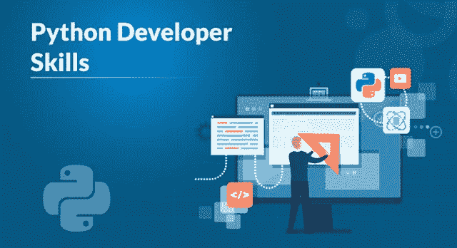
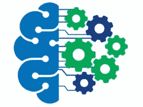

# 你需要知道的顶级 Python 开发者技能

> 原文：<https://medium.com/edureka/python-developer-skills-371583a69be1?source=collection_archive---------0----------------------->

Python Developer Skills — Edureka

随着 Python 越来越受欢迎，它已经成为业界最受欢迎和广泛使用的编程语言之一。在开发人员中制造一种兴奋感，人们一定会想知道为了成为 Python 开发人员，Python 开发人员的技能是什么。

在本文中，我将向您介绍成为 Python 开发人员所需的 10 大技能的结构化方法及其职业洞察力。

让我们来看看成为 Python 开发人员所需的 10 大技能:

*   核心 Python 的专业知识
*   对 Web 框架有很好的理解
*   对象关系映射器
*   数据科学之路
*   机器学习和人工智能
*   深度学习
*   理解多进程架构
*   分析技能
*   设计技巧
*   通讯技能

让我们开始吧。

# 核心 Python 的专业知识

这是成为 python 开发人员的敲门砖，为了成为一名开发人员，您应该掌握 Python 的核心概念，包括以下几个方面:

*   数据结构
*   哎呀概念
*   变量和数据类型
*   文件处理概念
*   异常处理
*   发电机
*   迭代器

让我们继续看下一个关于 Web 框架的技能。

# 对 Web 框架有很好的理解

一个优秀的 Python web 开发人员对两个 web 框架 Django 和 Flask 中的任何一个或两者都有着难以置信的了解。Django 是一个高级 Python Web 框架，它鼓励良好、干净和实用的设计，Flask 也是一个广泛使用的 Python 微型 Web 框架。对 HTML、CSS 和 JavaScript 等前端技术的扎实知识也是期望的。

接下来，让我们看看 Python 开发人员的下一项技能..

# 对象关系映射器

ORM 是计算机科学中的一种编程技术，当我们使用面向对象的编程语言在两个不兼容类型的系统之间转换数据时，它会派上用场。它创建了一个可以在任何编程语言中使用的“虚拟对象数据库”。程序员使用定制的 ORM 工具。

继续 Python 开发人员技能，让我们看看通向数据科学的道路。

# 数据科学之路

数据科学是机会的海洋。一旦你深入其中，那么从你的高中数学开始，你就应该知道某些先决条件，包括概率、统计等。同样的其他最常见的方面有。

*   数据可视化
*   数据分析
*   数据争论和数据清理
*   为数据科学使用 Python 包，如(NumPy、MatPlotlib、Scikit learn 等)。
*   良好的 SQL 知识。

# 机器学习和人工智能

当我们谈论机器学习和人工智能领域时，谁恰好属于数据科学。你应该从初学者的角度了解数据科学的所有方面，并且非常了解机器学习算法。它需要很好地理解如何从数据集获取数据，分析数据，可视化数据，从数据中产生洞察力，了解神经网络等。

接下来，让我们看看 Python 开发人员的另一项主要技能。

# 深度学习

深度学习是发展最快的领域之一，也恰好属于数据科学。深度学习也有几个方面，你应该在神经网络架构方面诚实自己，但在潜水之前，从数据科学基础开始，并了解 ML 和 AI 的各个方面。

其他方面包括:

*   自然语言处理
*   视频处理
*   音频处理

接下来，让我们看看 Python 开发人员的另一项技能。

# 了解多进程架构

您的团队可能由设计工程师组成，但是您也应该知道代码在部署和发布中是如何工作的。作为一名 Python 开发人员，你肯定应该了解 MVC(模型视图控制器)和 MVT(模型视图模板)架构。一旦你理解了多进程架构，你就可以解决与核心框架等相关的问题。

# 分析技能

成为一名优秀的 python 开发人员或者任何编程语言专家。一个人应该有很好的 Python 分析技巧。对算法有很好的理解，这样你就可以编写干净而不冗余的代码，能够编写优化的算法，以更好的方式可视化数据集，构建优秀的网站。

接下来，我们来看下一个 Python 开发者技能。

# **设计技巧**

当我谈到这个特殊的话题时。我所说的好的设计技巧实际上是指你应该能够设计可伸缩的产品，以一种高度可用的方式实现服务器。在设计网站的时候，你也应该记住 python 的框架，比如 Django 或者 Flask，因为 python 可以在客户端和服务器端编程中工作。

# 通讯技能

任何职业最重要的一个方面很大程度上取决于拥有良好的沟通技巧。如果你能够在团队中做出贡献，进行同行代码评审，以有效的方式交流，那么你的工作的一半就已经完成了。即使是在核心技术岗位上，你也应该特别与你的队友交流，并帮助解决问题或帮助他人。

*我希望我关于“Python 开发人员技能”的博客对你有用。*如果你想查看更多关于人工智能、DevOps、道德黑客等市场最热门技术的文章，你可以参考 [Edureka 的官方网站。](https://www.edureka.co/blog/?utm_source=medium&utm_medium=content-link&utm_campaign=python-developer-skills)

请留意本系列中的其他文章，它们将解释 Python 和数据科学的各个方面。

> 1.[Python 中的机器学习分类器](/edureka/machine-learning-classifier-c02fbd8400c9)
> 
> 2. [Python Scikit-Learn 备忘单](/edureka/python-scikit-learn-cheat-sheet-9786382be9f5)
> 
> 3.[机器学习工具](/edureka/python-libraries-for-data-science-and-machine-learning-1c502744f277)
> 
> 4.[用于数据科学和机器学习的 Python 库](/edureka/python-libraries-for-data-science-and-machine-learning-1c502744f277)
> 
> 5.[Python 中的聊天机器人](/edureka/how-to-make-a-chatbot-in-python-b68fd390b219)
> 
> 6. [Python 集合](/edureka/collections-in-python-d0bc0ed8d938)
> 
> 7. [Python 模块](/edureka/python-modules-abb0145a5963)
> 
> 8.[用 Python 进行网页抓取](/edureka/web-scraping-with-python-d9e6506007bf)
> 
> 9.[哎呀面试问答](/edureka/oops-interview-questions-621fc922cdf4)
> 
> 10.[Python 开发者简历](/edureka/python-developer-resume-ded7799b4389)
> 
> 11.[Python 中的探索性数据分析](/edureka/exploratory-data-analysis-in-python-3ee69362a46e)
> 
> 12.[带有 Python 的乌龟模块的贪吃蛇游戏](/edureka/python-turtle-module-361816449390)
> 
> 13. [Python 开发者工资](/edureka/python-developer-salary-ba2eff6a502e)
> 
> 14.[主成分分析](/edureka/principal-component-analysis-69d7a4babc96)
> 
> 15. [Python vs C++](/edureka/python-vs-cpp-c3ffbea01eec)
> 
> 16.[刺儿头教程](/edureka/scrapy-tutorial-5584517658fb)
> 
> 17. [Python SciPy](/edureka/scipy-tutorial-38723361ba4b)
> 
> 18.[最小二乘回归法](/edureka/least-square-regression-40b59cca8ea7)
> 
> 19. [Jupyter 笔记本小抄](/edureka/jupyter-notebook-cheat-sheet-88f60d1aca7)
> 
> 20. [Python 基础知识](/edureka/python-basics-f371d7fc0054)
> 
> 21. [Python 模式程序](/edureka/python-pattern-programs-75e1e764a42f)
> 
> 22.[Python 中的生成器](/edureka/generators-in-python-258f21e3d3ff)
> 
> 23. [Python 装饰器](/edureka/python-decorator-tutorial-bf7b21278564)
> 
> 24. [Python Spyder IDE](/edureka/spyder-ide-2a91caac4e46)
> 
> 25.[在 Python 中使用 Kivy 的移动应用](/edureka/kivy-tutorial-9a0f02fe53f5)
> 
> 26.[十大最好的学习书籍&练习 Python](/edureka/best-books-for-python-11137561beb7)
> 
> 27.[用 Python 实现机器人框架](/edureka/robot-framework-tutorial-f8a75ab23cfd)
> 
> 28.[使用 PyGame 的 Python 中的贪吃蛇游戏](/edureka/snake-game-with-pygame-497f1683eeaa)
> 
> 29. [Django 采访问答](/edureka/django-interview-questions-a4df7bfeb7e8)
> 
> 30.[十大 Python 应用](/edureka/python-applications-18b780d64f3b)
> 
> 31.[Python 中的散列表和散列表](/edureka/hash-tables-and-hashmaps-in-python-3bd7fc1b00b4)
> 
> 32. [Python 3.8](/edureka/whats-new-python-3-8-7d52cda747b)
> 
> 33.[支持向量机](/edureka/support-vector-machine-in-python-539dca55c26a)
> 
> 34. [Python 教程](/edureka/python-tutorial-be1b3d015745)

*原载于 2019 年 8 月 22 日*[*https://www.edureka.co*](https://www.edureka.co/blog/python-developer-skills/)*。*