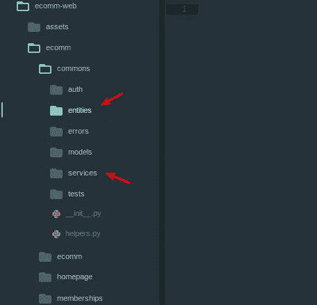
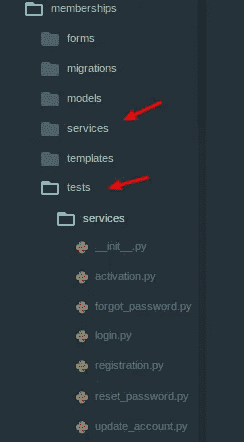

# Python(Django), Service Object & DDD

> 原文：<https://medium.easyread.co/python-django-service-object-ddd-cc8ca6b88e35?source=collection_archive---------0----------------------->

## Implementasi DDD & Service Object di framework berbasis MVC (Django)


Source: [https://www.djangoproject.com/s/img/logos/django-logo-positive.png](https://www.djangoproject.com/s/img/logos/django-logo-positive.png)

Dari pengalaman, saya pernah menggunakan *beberapa* framework berbasis MVC, diantaranya adalah :

*   Codeigniter (PHP)
*   CakePHP (PHP)
*   Laravel (PHP)
*   RubyOnRails (Ruby)
*   Sinatra (Ruby)
*   Scalatra (Scala)
*   PlayFramework (Scala)
*   ExpressJS (NodeJS)
*   Gin (Golang)
*   Gorilla (Golang), walaupun sebenarnya gorilla ini lebih tepat disebut dengan library / tools daripada sebuah framework.

Dan terakhir ini (semoga menjadi yang terakhir) adalah Django (Python). Alasan saya kenapa memilih Django:

*   No magic! `Explicit is better than implicit`
*   Management Command Line. Saya termasuk pengguna command line yang aktif, dan saya sangat suka sekali dengan framework yang menyediakan custom command line untuk keperluan development
*   Modular. Modular di sini bukan karena hasil dari *oprekan* atau imajinasi dari programmer, tapi django sendiri memang didesign *modular* dari awal, dimana bagi saya hal ini sangat bermanfaat karena proses development bisa dilakukan per context flow, yang artinya kita bisa fokus per context bukan semua controller campur aduk tidak karuan, dan hebatnya setiap module ini bisa plug and play di sistem yang lain.
*   Admin Generator. Saya termasuk orang yang **sangat sangat malas** untuk membuat halaman admin hanya untuk melakukan proses CRUD, dan django menyediakan proses ini *by design* bukan menggunakan plugin seperti di Rails dengan ActiveAdmin mereka. Dan hebatnya lagi, sistem admin ini bukan hanya sekedar CRUD tapi 100% customizable sampai ke templatenya pun bisa dicustom (kalau mau, kalau saya ogah bersentuhan dengan template).
*   Manajemen static files, yang sangat simpel, mudah dipahami
*   Manajemen deployment yang simpel
*   Jauh lebih hemat resource daripada Rails (ok, kalau ini pendapat saya pribadi, no debat, no flamewar!)
*   Very active development & community
*   Automate test framework per module! Extend dari python unittest + ditambah beberapa fungsionalitas tambahan untuk keperluan development.
*   Python! :)

Tapi di sini saya bukan menerangkan tutorial cara install atau hello world menggunakan django, tapi lebih ke bagaimana kita memanage sistem kita sesuai dengan ekspektasi bisnis, maintainable & readable dengan mengimplemen DDD, khususnya Service Object.

Sekilas tentang Service Object. Pattern ini sebenarnya saya pelajari ketika saya pernah bekerja menggunakan RubyOnRails. Jujur, di Rails saya malah belajar beberapa hal, yaitu :

*   Optimasi query database (percayalah, jika anda bekerja menggunakan RoR, pengetahuan tentang hal ini **penting** )
*   Thin controller, fat model
*   Kompleksitas testing
*   Core model

Sebenarnya, di framework manapun itu, ketika kita melakukan modelling itu sangat susah, minimal ini untuk saya pribadi. Kenapa ? Karena rata-rata setiap framework memiliki aturan / birokrasi mereka sendiri-sendiri, dan walaupun sama-sama berbasis MVC, tapi mereka memiliki aturan yang berbeda-beda.

Padahal dalam membuat sebuah modelling software, kita seharusnya tidak boleh terikat oleh aturan teknis apapun itu, misal :

*   Aturan penggunaan library X
*   Aturan penggunaan framework X
*   Aturan orm X
*   Atau semacamnya

Core model, harusnya simpel dan menunjukkan proses bisnis yang akan kita buat. Mungkin ada yang pernah mendengar istilah PO*O ? Contoh :

*   POJO: Pure Object Java Object
*   PORO: Pure Object Ruby Object
*   POPO: Pure Object Python Object

Nah, disinilah seharusnya core model kita dibentuk. Awal mula wacana *service object* itu muncul di permukaan adalah berawal dari *thin controller, fat model* .

Dulu (atau mungkin sekarang juga masih ada), banyak programmer (saya juga dulunya), selalu memasukkan **seluruh** logic di…controller! Padahal, di sebuah framework berbasis MVC, seharusnya controller itu tugasnya hanya sebatas request & response, tidak lebih. Hanya menerima parameter dari request dan kemudian memberikan response. Pertanyaannya adalah, lalu dimana logic seharusnya diletakkan ? Jawaban awalnya adalah di .. model. Dari sinilah, kemudian muncul istilah *thin controller fat model.* Dan dari sinilah pula, muncul masalah kedua.

Rata-rata setiap framework modern memiliki fitur:

*   Data modelling (modelling table/doc)
*   Migration

Model di setiap framework saat ini sudah terikat dengan ORM dari masing-masing framework, dan ORM ini sudah terikat pula dengan sub sistem seperti untuk auto migrate, dll.

Awalnya mungkin tidak masalah, tapi kemudian ketika sistem kita semakin lama semakin berkembang, yang terjadi adalah kita akan kesulitan dalam memaintain logic, karena *seluruh* logic ada di satu model, belum lagi dependensi antar logic yang artinya di sini adalah dependensi antar model. Dan *cons* yang terakhir adalah, kesulitan dalam refactoring & keperluan dalam membuat abstraksi karena keterikatan dengan aturan framework tadi.

Dari sinilah muncul ide tentang service object. Sekilas tentang pattern ini :

[](https://medium.com/selleo/essential-rubyonrails-patterns-part-1-service-objects-1af9f9573ca1) [## Essential RubyOnRails patterns — part 1: Service Objects

### Service objects (sometimes referred to as services) is a holy grail in Ruby On Rails development that helps to…

medium.com](https://medium.com/selleo/essential-rubyonrails-patterns-part-1-service-objects-1af9f9573ca1) 

Yang membuat saya tertarik adalah :

```
Service objects (sometimes referred to as *services*) is a holy grail in Ruby On Rails development that helps to [decompose your fat ActiveRecord models](http://blog.codeclimate.com/blog/2012/10/17/7-ways-to-decompose-fat-activerecord-models/) and keep your controllers slim and readable.
```

Dan setelah saya pelajari lebih dalam, dengan menggunakan pattern ini, kita bisa mendapat manfaat :

*   Membuat abstraksi sesuai kebutuhan bisnis flow software
*   Bebas dari aturan ORM
*   Bebas dari aturan request response
*   Dependency Injection, ketika kita membutuhkan manajemen dependensi dengan service lainnya, atau konsumsi ORM tertentu.
*   Mudah untuk ditest (unittest, integration test)

Ketika kita berhadapan dengan satu buah flow / aktivitas, maka yang perlu kita lakukan adalah membuat satu buah service terkait flow tersebut. Contoh:

*   Proses membuat product, maka akan ada ProductCreationService
*   Proses update product, maka akan ada ProductUpdaterService
*   dan semacamnya

Di dalam setiap service kita bisa mengkonsumsi library/service/orm tertentu, dan kalau kita mengimplemen DI (Dependency Injection), kita bisa mereplace objek-objek tadi dengan *mock class* lainnya untuk keperluan testing.

Service Object ini sangat popular di komunitas Rails, contoh:

*   [http://blog.codeclimate.com/blog/2012/10/17/7-ways-to-decompose-fat-activerecord-models/](http://blog.codeclimate.com/blog/2012/10/17/7-ways-to-decompose-fat-activerecord-models/)
*   [https://hackernoon.com/service-objects-in-ruby-on-rails-and-you-79ca8a1c946e](https://hackernoon.com/service-objects-in-ruby-on-rails-and-you-79ca8a1c946e)
*   [https://www.netguru.co/blog/service-objects-in-rails-will-help](https://www.netguru.co/blog/service-objects-in-rails-will-help)

Terlepas dari Rails, pattern ini sangat bermanfaat untuk memanage sebuah domain logic, dan saya pun akhirnya mengimplemen konsep ini di Django.

Bagaimana cara saya untuk mengimplemennya ?



Struktur folder di atas, adalah salah satu project yang saya buat menggunakan Django (1.11.x). Dan tentang bagaimana struktur codebase mungkin bisa dilihat di official site nya Django saja yak.

Yang ingin saya bahas di sini adalah :

*   Module commons
*   Commons.entities
*   Commons.services

Commons ini bukan `app` di Django. Tapi memang module terpisah yang sengaja saya buat dimana module ini terbebas dari seluruh aturan framework django.

Module `commons.entities` adalah tempat dimana saya memanage seluruh entitas.

Module `commons.services` adalah tempat dimana saya memanage seluruh **abstraksi** dari service saya.

Dengan adanya abstraksi ini, harapan saya core software ini bisa ditaruh di framework manapun itu, karena memang saya design dengan tujuan itu.

Penggunaan service object di sistem ini adalah :

*   Membuat abstraksi dari masing-masing service sesuai dengan domain logicnya.
*   Setiap abstraksi ini selalu extend dari `BaseService` yaitu parent service yang mengatur bagaiman seharusnya sebuah service itu di- `run` .

Salah satu contoh abstraksi service ini adalah :

```
from abc import ABCMeta, abstractmethod
from commons.services.base import BaseServiceclass ActivationService(BaseService):
 '''An abstract class to activate member's accountAttributes:
  _member_id: A UUID of member's id
  _code: An activation code
 '''
 __metaclass__ = ABCMetadef __init__(self, member_id=None, code=None):
  '''Initialize base value to activate member's accountArgs:
   member_id: A UUID of member's id
   code: A string of activation's code
  '''
  self._member_id = member_id
  self._code = code
```

Implementasi dari service ini adalah :

```
from django.contrib.auth.models import User
from django.core.exceptions import ValidationErrorfrom commons.errors.memberships import InvalidActivationCodeError, InvalidMembershipAccountError
from commons.services.memberships import ActivationService as AbstractActivationServicefrom memberships.models import Membersclass ActivationService(AbstractActivationService):def run(self):
        try:
            member = Members.objects.get(pk=self._member_id)
            if member.activation_code != self._code:
                raise InvalidActivationCodeError('Invalid activation code')# activate is_active status
            user = User.objects.get(pk=member.user.id)
            user.is_active = True
            user.save()# disable activation process for future
            member.activation_code = None
            member.save()return Trueexcept ValidationError:
            raise InvalidActivationCodeError('Invalid activation or member value')
        except User.DoesNotExist:
            raise InvalidMembershipAccountError('Invalid user account')
        except Members.DoesNotExist:
            raise InvalidMembershipAccountError('Invalid membership account')
```

dan ketika dipanggil di controller *hanya* seperti ini :

```
from django.views.generic.base import TemplateResponseMixin
from django.views import View
from django.contrib import messagesfrom commons.errors.memberships import InvalidActivationCodeError, InvalidMembershipAccountError
from memberships.services import ActivationServiceclass ActivationView(TemplateResponseMixin, View):
    template_name = 'memberships/activation.html'def get(self, request, member_id=None, code=None):
        try:
            activate = ActivationService(member_id, code)
            activate.run()messages.success(request, 'Your account has been activated.')
        except (InvalidMembershipAccountError, InvalidActivationCodeError) as e:
            messages.error(request, e)return self.render_to_response({})
```

dan ini contoh unittest nya :

```
import uuidfrom faker import Faker
from django.test import TestCase, override_settings
from django.contrib.auth.models import Userfrom commons.errors.memberships import InvalidActivationCodeError, InvalidMembershipAccountError
from memberships.services import RegistrationService, ActivationService
from memberships.models import Members[@override_settings](http://twitter.com/override_settings)(TEST_MODE=True)
class ActivationServiceTestCase(TestCase):def test_invalid_member_id(self):
  activate = ActivationService(str(uuid.uuid4()), 'code')with self.assertRaises(InvalidMembershipAccountError) as member_error:
   activate.run()exc = member_error.exception
  self.assertEqual('Invalid membership account', exc.message)def test_invalid_code(self):
  fake = Faker()

  email = fake.email()
  password = 'testing'payload = {
   'email': email,
   'username': fake.user_name(),
   'password': password,
   'password_confirm':password 
  }registration = RegistrationService(payload)
  self.assertTrue(registration.run())user = User.objects.get(email=email)
  member = Members.objects.get(user__id=user.id)with self.assertRaises(InvalidActivationCodeError) as code_error:
   activate = ActivationService(member.id, 'testing')
   activate.run()exc = code_error.exception
  self.assertEqual('Invalid activation code', exc.message)def test_activate_success(self):
  fake = Faker()

  email = fake.email()
  password = 'testing'payload = {
   'email': email,
   'username': fake.user_name(),
   'password': password,
   'password_confirm':password 
  }registration = RegistrationService(payload)
  self.assertTrue(registration.run())user = User.objects.get(email=email)
  member = Members.objects.get(user__id=user.id)activate = ActivationService(member.id, member.activation_code)
  self.assertTrue(activate.run())user = User.objects.get(email=email)
  self.assertTrue(user.is_active)
```

Ini contoh yang paling sederhana. Ketika kita bekerja menggunakan framework, dan ketika kita menaruh seluruh logic di controller, kira-kira apa yang harus kita lakukan untuk testing terhadap fitur tersebut ? Ada dua :

*   Buka browser, dan kemudian akses url controller tersebut, dan *klak klik* atau semacam inilah.
*   Jika lewat automate test, maka yang perlu kita lakukan adalah, benar-benar mengirimkan request ke controller tersebut. Rata-rata framework modern ~yang sehat~ sudah menyediakan fitur test seperti ini di test framework mereka masing-masing.

Padahal yang kita butuhkan hanya testing logic, dimana prosesnya hanyalah berikan input X maka ekspektasi nya adalah output Y, hanya untuk testing logic sederhana ini kita harus memberikan effort yang lumayan besar.

Dan di contoh ini ada beberapa service dari setiap `app` , misal :

*   ActivationService, service untuk menampung logic aktivasi data member
*   RegistrationService, service untuk menampung logic registrasi data member
*   dll

Di contoh di atas, kita bisa lihat kondisi yang ada di controller. Di sini saya bilang, bukan sebagai `thin controller` tapi lebih cocok disebut dengan `clean controller` .

Untuk struktur codebase di masing-masing `app` saya memanagenya seperti ini :



Module `memberships.services` adalah tempat saya menaruh seluruh services yang mengimplemen abstraksi dari `commons.services.memberships` .

Dan untuk unittest nya di sini, yang saya test adalah per service! Jadi tidak ada unittest model atau controller, karena bagi saya pribadi yang perlu saya test memang hanyalah logic flownya saja, saya tidak perlu testing ORM atau request responsenya.

Sistem yang saya kembangkan ini, masih bisa dibuat jauh lebih rapi lagi, apa yang saya tunjukkan ini hanyalah versi `MVP` nya, bagaimana saya agar bisa melakukan testing, maintain codebase saya dengan mudah & flow logic yang jelas.

Tujuan saya mengimplemen ini dari awal adalah, ketika suatu saat sistem ini berkembang, core sistem / core model nya ada di *state* yang aman, apa itu aman ? Aman di sini adalah terbebas dari campur tangan framework / library apapun itu, prinsip saya adalah framework / library yang mengikuti core, bukan kebalikannya.

Semoga tulisan saya ini bermanfaat :)