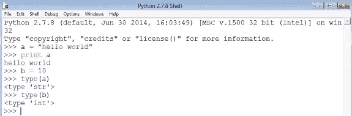
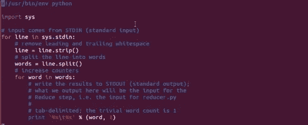
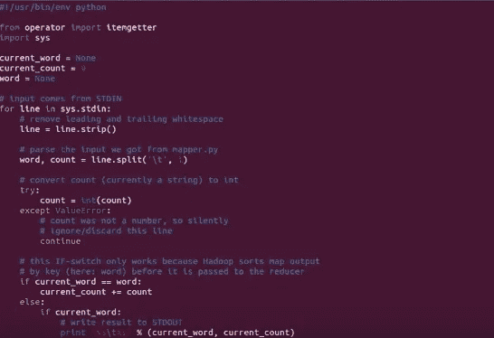
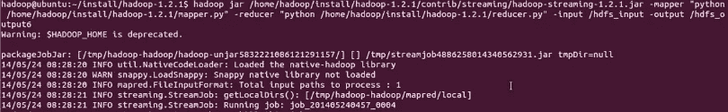
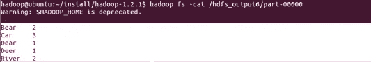
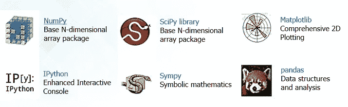

# 为什么您应该选择 Python 来处理大数据？

> 原文：<https://medium.com/edureka/python-for-big-data-4b7256e3132?source=collection_archive---------2----------------------->

Python 提供了大量的库来处理大数据。在开发代码方面，使用 Python 处理大数据比使用任何其他编程语言都要快得多。这两个方面使得世界各地的开发人员将 Python 作为大数据项目的首选语言。

在 python 中处理任何数据类型都非常容易。让我们用一个简单的例子来证明这一点。您可以从下面的快照中看到,“a”的数据类型是字符串,“b”的数据类型是整数。好消息是您不必担心处理数据类型。Python 已经搞定了。

现在百万美元的问题是；大数据的 Python 还是大数据的 Java？

对于大数据，我更喜欢 Python，因为在 java 中，如果你写 200 行代码，我用 Python 只用 20 行代码就能做同样的事情。一些开发人员说 Java 的性能比 Python 好，但我观察到，当您处理大量数据(以 GBs、TBs 等为单位)时，性能几乎相同，而使用 Python 处理大数据时，开发时间更少。

Python 最好的一点是对数据没有限制。您甚至可以使用简单的机器来处理数据，如商用硬件、笔记本电脑、台式机等。

Python 可用于编写 Hadoop MapReduce 程序和应用程序，以使用 PyDoop 包访问 Hadoop 的 HDFS API

PyDoop 最大的优势之一是 HDFS API。这允许您无缝地连接到 HDFS 安装，读写文件，并获取有关文件、目录和全局文件系统属性的信息。

PyDoop 的 MapReduce API 允许您用最少的编程工作解决许多复杂的问题。使用 PyDoop 可以在 Python 中实现高级 MapReduce 概念，如“计数器”和“记录读取器”。

在下面的例子中，我将运行一个用 Python 编写的简单 MapReduce 单词计数程序，该程序计算一个单词在输入文件中出现的频率。所以我们下面有两个文件——“mapper . py”和“reducer.py”，都是用 python 写的。

Fig: mapper.py

Fig: reducer.py

Fig: running the MapReduce job

这是一个非常基本的例子，但是当你编写一个复杂的 MapReduce 程序时，与用 Java 编写的相同的 MapReduce 程序相比，Python 将减少 10 倍的代码行数。

**为什么 Python 对数据科学家有意义**

数据科学家的日常任务涉及许多相互关联但不同的活动，例如访问和操作数据、计算统计数据以及围绕该数据创建可视化报告。这些任务还包括建立预测和解释模型，根据其他数据评估这些模型，将模型集成到生产系统中，等等。Python 有各种各样的开源库，几乎涵盖了数据科学家日常工作的所有内容。

SciPy(读作“叹息派”)是一个基于 Python 的数学、科学和工程开源软件生态系统。还有许多其他的库可以使用。

结论是，Python 是处理大数据的最佳选择。

如果你想查看更多关于人工智能、DevOps、道德黑客等市场最热门技术的文章，你可以参考 Edureka 的官方网站。

请留意本系列中的其他文章，它们将解释 Python 和数据科学的各个方面。

> *1。*[*Python 中的机器学习分类器*](/edureka/machine-learning-classifier-c02fbd8400c9)
> 
> *2。*[*Python Scikit-Learn Cheat Sheet*](/edureka/python-scikit-learn-cheat-sheet-9786382be9f5)
> 
> *3。* [*机器学习工具*](/edureka/python-libraries-for-data-science-and-machine-learning-1c502744f277)
> 
> *4。* [*用于数据科学和机器学习的 Python 库*](/edureka/python-libraries-for-data-science-and-machine-learning-1c502744f277)
> 
> *5。*[*Python 中的聊天机器人*](/edureka/how-to-make-a-chatbot-in-python-b68fd390b219)
> 
> *6。* [*Python 集合*](/edureka/collections-in-python-d0bc0ed8d938)
> 
> *7。* [*Python 模块*](/edureka/python-modules-abb0145a5963)
> 
> *8。* [*Python 开发者技能*](/edureka/python-developer-skills-371583a69be1)
> 
> *9。* [*哎呀面试问答*](/edureka/oops-interview-questions-621fc922cdf4)
> 
> *10。*[*Python 开发者简历*](/edureka/python-developer-resume-ded7799b4389)
> 
> *11。*[*Python 中的探索性数据分析*](/edureka/exploratory-data-analysis-in-python-3ee69362a46e)
> 
> *12。* [*蛇与蟒蛇的游戏*](/edureka/python-turtle-module-361816449390)
> 
> *13。* [*Python 开发者工资*](/edureka/python-developer-salary-ba2eff6a502e)
> 
> *14。* [*主成分分析*](/edureka/principal-component-analysis-69d7a4babc96)
> 
> 15。[*Python vs c++*](/edureka/python-vs-cpp-c3ffbea01eec)
> 
> *16。* [*刺儿头教程*](/edureka/scrapy-tutorial-5584517658fb)
> 
> *17。*[*Python SciPy*](/edureka/scipy-tutorial-38723361ba4b)
> 
> 18。 [*最小二乘回归法*](/edureka/least-square-regression-40b59cca8ea7)
> 
> 19。 [*Jupyter 笔记本小抄*](/edureka/jupyter-notebook-cheat-sheet-88f60d1aca7)
> 
> 20。 [*Python 基础知识*](/edureka/python-basics-f371d7fc0054)
> 
> *21。* [*Python 模式程序*](/edureka/python-pattern-programs-75e1e764a42f)
> 
> *22。* [*网页抓取用 Python*](/edureka/web-scraping-with-python-d9e6506007bf)
> 
> *23。* [*Python 装饰器*](/edureka/python-decorator-tutorial-bf7b21278564)
> 
> *24。*[*Python Spyder IDE*](/edureka/spyder-ide-2a91caac4e46)
> 
> *25。*[*Python 中使用 Kivy 的移动应用*](/edureka/kivy-tutorial-9a0f02fe53f5)
> 
> *26。* [*十大最佳学习书籍&练习 Python*](/edureka/best-books-for-python-11137561beb7)
> 
> *27。* [*机器人框架与 Python*](/edureka/robot-framework-tutorial-f8a75ab23cfd)
> 
> *28。*[*Python 中的贪吃蛇游戏*](/edureka/snake-game-with-pygame-497f1683eeaa)
> 
> *29。* [*Django 面试问答*](/edureka/django-interview-questions-a4df7bfeb7e8)
> 
> *30。* [*十大 Python 应用*](/edureka/python-applications-18b780d64f3b)
> 
> *31。*[*Python 中的哈希表和哈希表*](/edureka/hash-tables-and-hashmaps-in-python-3bd7fc1b00b4)
> 
> *32。*[*Python 3.8*](/edureka/whats-new-python-3-8-7d52cda747b)
> 
> 33。 [*支持向量机*](/edureka/support-vector-machine-in-python-539dca55c26a)
> 
> 34。 [*Python 教程*](/edureka/python-tutorial-be1b3d015745)

*原载于 2015 年 12 月 3 日 https://www.edureka.co***。**