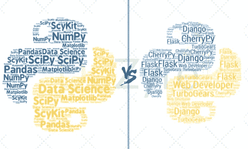
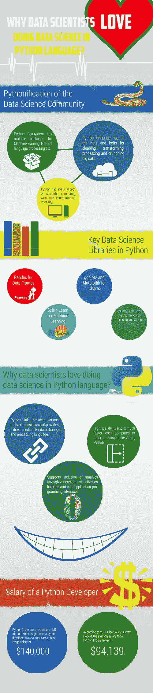

# 用于数据科学的 Python 与用于 Web 开发的 Python

> 原文：<https://medium.com/quick-code/python-for-data-science-vs-python-for-web-development-fcdbeb1c67cf?source=collection_archive---------0----------------------->

Python 编程在 web 应用程序开发、图形用户界面、数据分析、数据可视化等方面有各种框架和特性可以扩展。Python 编程语言可能不是 web 应用程序开发的理想选择，但被许多组织广泛用于评估大型数据集、数据可视化、运行数据分析或原型制作。Python 编程语言越来越受到数据科学用户的青睐，但作为一种 web 编程语言已经过时。这篇博文的目的是对使用 Python 语言的两种完全不同的目的进行比较，并帮助理解使用 Python 进行数据科学研究并不需要知道 Python 是一种 web 编程语言。

# 用于数据科学的 Python

从顶级金融机构到最小的大数据初创企业，各种规模和行业的组织都在使用 Python 编程语言来运营业务。更多附加信息请访问 [**数据科学课程**](https://onlineitguru.com/data-science-course.html)

Python 语言是最受欢迎的数据科学编程语言之一，不仅受到顶级大数据公司的欢迎，也受到科技初创企业的欢迎。Python 语言是 2019 年学习的顶级编程语言之一。

Python 语言属于前一类，在数值计算、机器学习和一些数据科学应用中得到了越来越多的采用。Python 语言可以做任何事情，除了性能相关和低级的东西。使用 Python 编程语言的最佳选择是用于数据分析和统计计算。学习用于 web 开发的 Python 编程需要程序员掌握像 Django 这样的各种 web 框架，这些框架可以帮助构建网站，而学习用于数据科学的 Python 需要数据科学家学习正则表达式的用法，使用科学库并掌握数据可视化概念。出于完全不同的目的，不了解 Python 语言的 web 编程概念的程序员或专业人员可以轻松地用 Python 编程语言从事数据科学研究。

Python 是一种有 23 年历史的强大的表达性动态编程语言，程序员可以编写一次代码并执行它，而无需使用单独的编译器。web 开发中的 Python 支持各种编程范式，如结构化编程、函数式编程和面向对象编程。Python 语言代码可以很容易地嵌入到各种需要编程接口的现有 web 应用程序中。然而，对于需要更快的执行速度和精确的数学计算的学术、研究和科学应用来说，Python 语言是一个卓越的选择。

Python web 编程要求程序员了解各种 python web 开发框架，这可能会令人望而生畏，因为 python web 开发框架的可用文档可能有些难以理解。但是不可否认的是，要用 Python 语言开发一个动态网站或者 web 应用，学习 web 框架是必不可少的。

# Python Web 开发框架

有几个免费的 Python web 应用程序框架，比如-

# 姜戈

Django 是为有期限的完美主义者设计的 python web 开发框架。用 django 进行 Python web 开发最适合于开发数据库驱动的 web 应用程序，这些应用程序具有自动管理界面和模板系统等吸引人的特性。对于不需要大量特性的 web 开发项目来说，Django 可能有些矫枉过正，因为它的文件系统和严格的目录结构令人困惑。一些使用 python web 开发 django 的公司有纽约时报、Instagram 和 Pinterest。

# 瓶

对于想要开始开发单页面 web 应用程序的初学者来说，这是一个简单而轻量级的解决方案。这个框架不支持验证、数据抽象层和许多其他框架包含的其他组件。它不是一个全栈框架，只用于小型网站的开发。

# 樱桃派

它强调 Python 约定，这样程序员就可以像使用面向对象的 Python 编程那样构建 web 应用程序。CherryPy 是其他流行的全栈框架如 TurboBears 和 Web2py 的基础模板。

还有很多其他的网络框架，比如金字塔、瓶子和塔等等。但是不管事实如何，不管 python 程序员使用哪个 web 框架，挑战在于他/她需要密切关注教程和文档的细节。

# 为什么用 Python 进行 Web 开发是不切实际的选择？

Python 编程语言可能是一种不切实际的 web 编程语言——

*   用于 web 开发的 Python 需要非标准且昂贵的主机，尤其是当程序员使用流行的 python web 框架来构建网站时。由于 PHP 语言对 web 编程如此有利，大多数用户对投资 [**Python 认证**](https://onlineitguru.com/python-training.html) 编程语言进行 web 开发不感兴趣。
*   与对 PHP、Java 或 Ruby on Rails 等其他 web 开发语言的需求不同，用于 web 开发的 Python 语言并不是一项普遍需要的技能。随着 Python 在机器学习和各种其他数据科学应用程序中的采用率越来越高，用于数据科学的 python 越来越受欢迎，是公司在数据科学家中最受欢迎的技能。
*   用于 web 开发的 Python 已经有了很大的进步，但是与 PHP 等其他 web 编程语言相比，它并没有很陡的学习曲线。

# 为什么 Python 最适合数据科学？

Python 编程是支持大数据、金融、统计和用类似英语的语法处理数字的核心技术。最近，丰富的 Python 数据科学生态系统的增长，包括用于机器学习、自然语言处理、数据可视化、数据探索、数据分析和数据挖掘的多个包，正在导致数据科学社区的 Python 化。今天，Python 数据科学语言拥有清理、转换、处理和运算大数据的所有基本要素。Python 是数据科学家工作岗位最需要的技能。在纽约，一名拥有 python 编程技能的数据科学家平均年薪为 14 万美元

数据科学家/ [**数据科学认证**](https://onlineitguru.com/data-science-course.html) 喜欢在编程环境中工作，通过帮助他们轻松记下他们的想法和模型，可以快速原型化。他们喜欢通过分析庞大的数据集得出结论来完成工作。Python 编程是数据科学应用程序中最通用、最强大的全能工具，因为它可以帮助数据科学家以最短的时间进行编码、调试、执行和获得结果，从而高效地完成所有这些工作。

伟大的企业数据科学家的真正价值是使用各种数据可视化，这些数据可视化可以帮助将数据模式和预测有效地传达给业务的各种利益相关者，否则这只是一个零和游戏。Python 几乎拥有高计算强度的科学计算的每个方面，这使它成为跨不同数据科学应用程序编程的最佳选择，因为程序员可以用一种语言进行所有的开发和分析。Python for data science 将企业的各个部门联系起来，为数据共享和处理语言提供了直接的媒介。

*   Python 有一个统一的设计理念，专注于数据科学的易用性、可读性和简单的学习曲线。
*   Python 具有很高的可伸缩性，与 Stata、Matlab 等其他语言相比速度更快。
*   越来越多的数据可视化库和很酷的应用程序编程接口被添加进来，以包含图形来描述数据分析的结果。
*   Python 有一个很大的社区，有很多数据科学或数据分析库，如 Sci-Kit learn、NumPy、Pandas、Statsmodels、SciPy 等。它们具有丰富的功能并经过了广泛的测试。Python 语言的数据分析库随着时间的推移不断增长。

# 用于数据科学中的数字处理和科学计算的 Python 编程

数据分析和 Python 编程语言是齐头并进的。如果您已经决定学习 Python 语言的数据科学，那么您脑海中的下一个问题将是——Python 库中完成大部分数据分析任务的最佳数据科学是什么？以下是全球企业数据科学家使用的顶级 Python 数据分析库-

# NumPy

它是用 Python 编程语言构建的高级工具的基础。该库不能用于高级数据分析，但对 NumPy 中面向阵列的计算的深入理解有助于数据科学家有效地使用 Pandas 库。

# SciPy

SciPy 用于技术和科学计算，具有用于集成、特殊功能、图像处理、插值、线性代数、优化、ODE 解算器和各种其他任务的各种模块。这个库用于处理 NumPy 数组和各种有效的数值例程。

# 熊猫

这是进行数据管理的最佳库，因为这个库使得处理缺失数据更容易，支持自动数据对齐，支持处理从多个数据源收集的不同索引的数据。

> 在 [**报名免费现场演示数据科学在线培训**](https://onlineitguru.com/data-science-course.html)

# SciKit

这是一个流行的机器学习库，具有各种回归、分类和聚类算法，支持梯度推进、向量机、朴素贝叶斯和逻辑回归。这个库被设计用来与 NumPy 和 SciPy 互操作。

# Matplotlib

这是一个 2D 绘图库，具有交互式功能，用于缩放和平移不同硬拷贝格式和跨各种平台的交互式环境中的出版物质量数字。

Matplotlib、NumPy 和 SciPy 是科学计算的基础。还有许多其他 Python 库，如用于 web 挖掘的 Pattern、用于自然语言处理的 NLTK、用于深度学习的 Theano、用于 web 抓取的 Scrappy、IPython、Statsmodels、Mlpy 等等。对于开始学习 Python 数据科学的人来说，他们需要精通上面提到的 Python 顶级数据分析库。