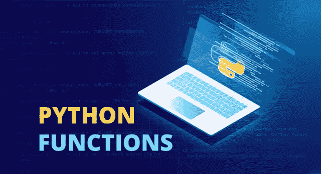
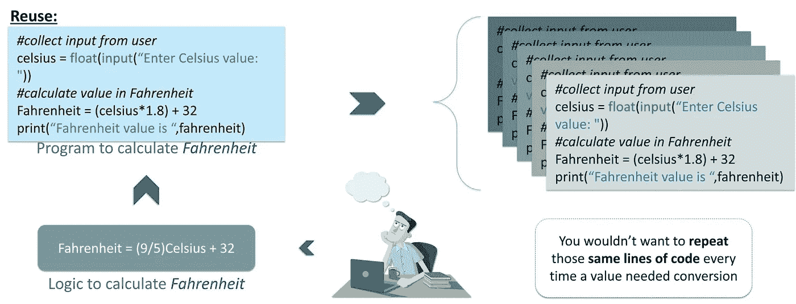

# Python 函数教程——Python 中函数的综合指南

> 原文：<https://medium.com/edureka/python-functions-f0cabca8c4a?source=collection_archive---------0----------------------->



Python Functions — Edureka

在当今快节奏的 IT 世界中，在对某项技术的深入了解方面领先他人总是一种优势。Python 是一种广泛使用的语言，为热情的学习者提供了“n”个机会。学习以正确的方式使用 Python 中的函数对于任何 Python 开发人员来说都是一项值得注意的技能。

在这篇 Python 函数的文章中，我们的目标是让您获得入门和使用 Python 处理函数所需的专业知识。在这篇 Python 函数文章中，我将涉及以下主题:

*   为什么需要 Python 函数？
*   什么是 Python 函数？
*   Python 函数的类型
*   Python 中的内置函数
*   Python 递归函数
*   Python Lambda 函数
*   Python 中的用户定义函数

让我们从了解我们为什么需要 Python 函数开始这篇文章。

# 为什么我们需要 Python 函数？

函数管理计算机程序的输入和输出。编程语言是为处理数据而设计的，函数是管理和转换这些数据的有效方法。

修改通常是为了推动像执行任务和寻找结果这样的结果。而且，这样做所需的操作或指令集来自逻辑功能代码块，这些代码块可以独立于主程序重用。

实际上，主代码也是一个函数，只是非常重要的一个函数。其他每个函数都是逻辑对齐的，并被维护为从主代码中执行。但是，如果这个函数以前没有定义，那么在使用它之前，您必须自己定义一个。这是因为定义中列出了它的操作步骤。



你是愿意把一段代码写 10 次，还是只写一次就用 10 次？

因此，功能只不过是用户想要执行的任务。但是，用一个名字定义它一次就可以让你重用那个功能，而不会让你的主程序看起来太吓人。这大大减少了代码行，甚至使调试更容易。

我们很快就会谈到这一点，但是使用函数的第一个原因是因为它的可重用性。事实上，即使是复杂的操作也可以组合成单一的任务，只需调用它的名字就可以运行，这也使得今天的计算机代码更加清晰。

每种编程语言都允许您创建和使用这些函数，只需调用一次就可以执行各种任务。而且，您可以调用它任意次，而不必担心每次都将它的代码逻辑地组织到您的主代码中。

让我们先通过一个简单的例子来试着理解他们对我们的需求。


比方说，你有一台电视机，它存储许多频道，接收它们的数字无线电广播，将它们转换成我们观看的内容，同时还为我们提供了各种其他功能的附加选项。

但这并不意味着每当你打开电视或换频道时，就有人在逻辑上为你观看的内容编写代码。更确切地说，工作中每个任务的功能已经被逻辑地定义了一次，并根据您尝试使用的特性不断地被重用。

所有这些都是通过从正在运行的主函数中调用不同的函数来实现的。因此，即使你把音量调大或调小，它定义的功能也会被重复调用。

而且，让一个系统运行主代码，在需要时不断调用这些函数，也使得在其上进行设计和创新变得更加容易。

需要注意的重要一点是，无论何时调用这个函数，它都会根据函数中指定的指令执行任务。

机器就是这样才能有不同的功能。计算器可能是这方面最常见的例子。它具有提供加、减、乘、除等功能。它的所有功能都已经明确地预定义在里面了，但是它只执行那些你选择通过按下相应的按钮来调用的功能。

程序员通过使用函数来减少编码时间和调试时间，从而减少整体开发时间。

接下来，让我们看看 Python 函数到底是什么。

# 什么是 Python 函数？

Python 中的函数是这种可重用性的经典例子。因此，为了服务于从 GUI 和数学计算到 web 开发和测试的广泛应用，Python 的解释器已经配备了许多随时可用的函数。此外，您还可以在您的程序中引入其他库或模块，这些库或模块包含随时可用的预定义函数。

你真正要做的就是下载所需的软件包，根据它们的文档，只需将它们导入到你的代码中，就可以免费使用所有有用的功能。

因此，一旦定义了函数，它就可以在你的任何代码中的任何地方被使用任何次数。现在，这是因为 Python 符合软件工程的 DRY 原则，该原则旨在用抽象代替任何重复的软件模式或代码，以避免冗余，并确保它们可以自由使用，而不会暴露其实现的任何内部细节。

DRY 扩展到**不要重复自己**，这个拥有可重用代码块的概念对于在 Python 中实现抽象非常重要。因此，为了使用一个函数，你真正需要的是它的名字、它的目的、它的参数(如果它接受任何参数的话)和它的结果类型(如果它返回任何参数的话)。

这几乎就像使用一辆汽车或一部电话，你不一定需要了解其组件的工作原理来使用它们。相反，它们已经被构建为服务于共同的目的，您可以直接使用它们来实现您的目标，并将您的宝贵时间用于实现您的应用程序的所有创新方面。而且，没有人真的希望*知道程序中的一个函数在内部是如何工作的，只要它能完成工作。*

所以，使用 Python，除非你必须写一个新的函数或者改变现有函数的工作方式，否则你甚至不需要了解内部发生了什么，直到它按照你需要的方式工作。这就像汽车或电话一样，你需要知道它是如何工作的，才能制造或修理它。同样，一旦你写了一个工作函数，你就可以重复使用它，而不必再看它里面的内容。

一个函数可以作为一个程序的一部分被调用，它只需编写一次，就可以在程序需要的时候被执行，从而使代码可重用。

函数是处理数据并产生一些输出的子程序。

**要定义一个 Python 函数，**你必须在你的函数名和**前使用***【def】*关键字，在它的末尾加上括号，后跟一个冒号(:)。****

Python 使用缩进来表示块，而不是括号，以使代码更具可读性。

Python 中的函数可以包含任意数量的参数，也可以不包含任何参数。所以，当你需要你的函数操作来自其他代码块或者主程序的变量时，它可以接受任意数量的参数并产生结果。

Python 函数也可以选择返回值。该值可以是函数执行的结果，甚至可以是在关键字“return”后指定的表达式或值。而且，在执行 return 语句之后，程序流会返回到函数调用旁边的状态，并从那里开始执行。

因此，要在代码中的任何地方调用 Python 函数，只需使用它的名称并在括号中传递参数(如果有的话)。

**命名函数的*规则*与命名变量相同。**以字母 a-z、A-Z 两种大写和小写开头&或下划线(_)。其名称的其余部分可以包含下划线(_)、数字(0–9)、任何大写或小写字母。

1.  不能选择保留的关键字作为标识符。
2.  良好的语法使用，以确保增强代码的可读性。

根据 Python 函数的功能来命名它是一个很好的做法。在函数声明的第一行下面使用 docstring。这是一个文档字符串，它解释了函数的作用。

接下来，在这个 Python 函数博客中，让我们看看 Python 中可用的函数类型。

# Python 函数的类型

Python 函数有很多种类型。它们中的每一个都以自己的方式非常重要。以下是不同类型的 Python 函数:

*   Python 内置函数
*   Python 递归函数
*   Python Lambda 函数
*   Python 用户定义函数

让我们详细检查一下这些功能。从内置函数开始，因为它们非常容易理解和实现。

# Python 内置函数:

Python 解释器有许多随时可用的函数。这些函数称为内置函数。例如， **print()** 函数将给定对象打印到标准输出设备(屏幕)或文本流文件。

在 Python 3.6 中，有 68 个内置函数。但是为了简单起见，让我们考虑一下主要使用的函数，我们可以从那里开始构建。

## Python abs()函数:

**定义**

abs()方法返回给定数字的绝对值。如果数字是一个复数，abs()返回它的大小。

**语法**

abs()方法的语法是:

```
abs(num)
```

**参数**

abs()方法采用单个参数:

*   **num** —要返回其绝对值的数字。该数字可以是:

1.  整数
2.  浮点数
3.  复数

**示例**

```
# random integer
integer = -20
print('Absolute value of -20 is:', abs(integer))

#random floating number
floating = -30.33
print('Absolute value of -30.33 is:', abs(floating))
```

**输出**

```
Absolute value of -20 is: 20 Absolute value of -30.33 is: 30.33
```

## Python all()函数:

**定义**

当给定 iterable 中的所有元素都为 true 时，all()方法返回 True。如果不是，则返回 False。

**语法**

all()方法的语法是:

```
all(iterable)
```

**参数**

all()方法采用单个参数:

*   **可迭代** —任何可迭代(列表、元组、字典等。)包含元素

**示例**

```
# all values true
l = [1, 3, 4, 5]
print(all(l))

# all values false
l = [0, False]
print(all(l))

# one false value
l = [1, 3, 4, 0]
print(all(l))

# one true value
l = [0, False, 5]
print(all(l))

# empty iterable
l = []
print(all(l))
```

**输出**

```
True
False
False
False
True
```

## Python ascii()函数:

**定义**

ascii()方法返回一个包含对象的可打印表示的字符串。它使用\x、\u 或\U escapes 对字符串中的非 ASCII 字符进行转义。

**语法**

ascii()方法的语法是:

```
ascii(object)
```

**参数**

ascii()方法接受一个对象(如字符串、列表等)。

**示例**

```
normalText = 'Python is interesting'
print(ascii(normalText))

otherText = 'Pythön is interesting'
print(ascii(otherText))

print('Pyth\xf6n is interesting')
```

**输出**

```
'Python is interesting'
'Pyth\xf6n is interesting'
Pythön is interesting
```

## Python bin()函数:

**定义**

bin()方法转换并返回给定整数的二进制等效字符串。如果参数不是整数，它必须实现 __index__()方法来返回一个整数。

**语法**

bin()方法的语法是:

```
bin(num)
```

**参数**

bin()方法采用单个参数:

*   **num** —要计算其二进制等效值的整数。
    如果不是整数，应该实现`__index__()`方法返回一个整数。

**示例**

```
number **=** 5
print('The binary equivalent of 5 is:', bin(number))
```

**输出**

```
The binary equivalent of 5 is: 0b101
```

## Python compile()函数:

**定义**

compile()方法从源代码中返回一个 Python 代码对象(普通字符串、字节字符串或 AST 对象)。

**语法**

compile()方法的语法是:

```
compile(source, filename, mode, flags=0, dont_inherit=False, optimize=-1)
```

**参数**

*   `source`–普通字符串、字节字符串或 AST 对象
*   `filename`–从中读取代码的文件。如果不是从文件中读取的，您可以自己命名
*   `mode`—`exec`或者`eval`或者`single`。
*   `eval`–只接受一个表达式。
*   `exec`–它可以接受包含 Python 语句、类和函数等的代码块。
*   `single`–如果它由一个单独的交互式陈述组成
*   `flags`(可选)和`dont_inherit`(可选)–控制哪些未来语句会影响源代码的编译。默认值:0
*   `optimize`(可选)–编译器的优化级别。默认值-1。

**例子**

```
codeInString = 'a = 5\nb=6\nsum=a+b\nprint("sum =",sum)'
codeObejct = compile(codeInString, 'sumstring', 'exec')

exec(codeObejct)
```

**输出**

```
sum = 11
```

## Python dict()函数:

**定义**

dict()构造函数用 Python 创建了一个字典。不同形式的 dict()构造函数有:

```
class dict(**kwarg)
class dict(mapping, **kwarg)
class dict(iterable, **kwarg)
```

**示例**

```
numbers = dict(x=5, y=0)
print('numbers = ',numbers)
print(type(numbers))

empty = dict()
print('empty = ',empty)
print(type(empty))
```

**输出**

```
empty = dict()
print('empty = ',empty)
print(type(empty))
```

## Python enumerate()函数:

**定义**

enumerate()方法向 iterable 添加 counter 并返回它(enumerate 对象)。

**语法**

enumerate()方法的语法是:

```
enumerate(iterable, start=0)
```

**参数**

enumerate()方法有两个参数:

*   **可迭代的** —支持迭代的序列、迭代器或对象
*   **start** (可选)— enumerate()从这个数字开始计数。如果省略 start，则以 0 为起点。

**示例**

```
grocery = ['bread', 'milk', 'butter']
enumerateGrocery = enumerate(grocery)

print(type(enumerateGrocery))

# converting to list
print(list(enumerateGrocery))

# changing the default counter
enumerateGrocery = enumerate(grocery, 10)
print(list(enumerateGrocery))
```

**输出**

```
<class 'enumerate'>
[(0, 'bread'), (1, 'milk'), (2, 'butter')]
[(10, 'bread'), (11, 'milk'), (12, 'butter')]
```

## Python eval()函数:

**定义**

eval()方法解析传递给该方法的表达式，并在程序中运行 python 表达式(代码)。

**语法**

eval()方法的语法是:

```
eval(expression, globals=None, locals=None)
```

**参数**

eval()接受三个参数:

*   **表达式** —该字符串作为 Python 表达式进行解析和计算
*   **globals** (可选)—字典
*   **locals** (可选)-一个映射对象。Dictionary 是 Python 中标准且常用的映射类型。

**举例**

```
x = 1 
print(eval('x + 1'))
```

**输出**

```
sum = 11
```

## Python 过滤器()函数:

**定义**

filter()方法从函数返回 true 的 iterable 的元素中构造一个迭代器。

**语法**

filter()方法的语法是:

```
filter(function, iterable)
```

**参数**

filter()方法有两个参数:

*   **函数** —测试 iterable 的元素是否返回 true 或 false 的函数
    如果没有，该函数默认为 Identity 函数—如果任何元素为 false，则返回 false
*   **iterable** —要过滤的 iterable，可以是集合、列表、元组或任何迭代器的容器

**示例**

```
# list of alphabets
alphabets = ['a', 'b', 'd', 'e', 'i', 'j', 'o']

# function that filters vowels
def filterVowels(alphabet):
    vowels = ['a', 'e', 'i', 'o', 'u']

    if(alphabet in vowels):
        return True
    else:
        return False

filteredVowels = filter(filterVowels, alphabets)

print('The filtered vowels are:')
for vowel in filteredVowels:
    print(vowel)
```

**输出**

```
The filtered vowels are:
a
e
i
o
```

## Python getattr()函数:

**定义**

getattr()方法返回一个对象的命名属性的值。如果没有找到，它将返回提供给该函数的默认值。

**语法**

getattr()方法的语法是:

```
getattr(object, name[, default])
```

**参数**

getattr()方法接受多个参数:

*   **对象** —要返回其命名属性值的对象
*   **名称** —包含属性名称的字符串
*   **默认(可选)** —未找到命名属性时返回的值

**示例**

```
class Person:
    age = 23
    name = "Adam"

person = Person()
print('The age is:', getattr(person, "age"))
print('The age is:', person.age)
```

**输出**

```
The age is: 23
The age is: 23
```

## Python help()函数:

**定义**

help()方法调用内置的 Python 帮助系统。

**语法**

help()方法的语法是:

```
help(object)
```

**参数**

help()方法采用一个参数中的最大值。

*   **对象**(可选)——你想要生成的帮助的给定`object`

**示例**

```
help('print')
```

## Python id()函数:

**定义**

函数的作用是:返回一个对象的标识(唯一的整数)。

**语法**

id()方法的语法是:

```
id(object)
```

**参数**

id()函数接受一个参数对象。

**例子**

```
class Foo:
    b = 5

dummyFoo = Foo()
print('id of dummyFoo =',id(dummyFoo))
```

**输出**

```
id of dummyFoo = 140343867415240
```

## Python len()函数:

**定义**

函数的作用是:返回一个对象的长度。

**语法**

len()方法的语法是:

```
len(s)
```

**参数**

**s** —一个序列(字符串、字节、元组、列表或范围)或一个集合(字典、集合或冻结集合)

**例子**

```
testList = []
print(testList, 'length is', len(testList))

testList = [1, 2, 3]
print(testList, 'length is', len(testList))

testTuple = (1, 2, 3)
print(testTuple, 'length is', len(testTuple))

testRange = range(1, 10)
print('Length of', testRange, 'is', len(testRange))
```

**输出**

```
[] length is 0
[1, 2, 3] length is 3
(1, 2, 3) length is 3
Length of range(1, 10) is 9
```

## Python max()函数:

**定义**

max()方法返回 iterable 中最大的元素或两个或多个参数中最大的元素。

**语法**

max()方法的语法是:

```
max(iterable, *iterables[,key, default])
max(arg1, arg2, *args[, key])
```

**参数**

max()可以处理两种形式的参数。

1.  `max(iterable, *iterables[, key, default])`

*   **iterable** —序列(元组、字符串)、集合(集、字典)或迭代器对象，其最大元素将被找到
*   ***iterables(可选)** —任意数量的 iterables，要找到其最大值
*   **key(可选)** —传递可重复项并根据其返回值进行比较的关键函数
*   **默认值(可选)** —如果给定的 iterable 为空，则为默认值

2.`max(arg1,arg2, *args[, key])`

*   **arg1** —强制比较的第一个对象(可以是数字、字符串或其他对象)
*   **arg2** —强制的第二个比较对象(可以是数字、字符串或其他对象)
*   ***args(可选)** —用于比较的其他对象
*   **key** —传递每个参数并根据其返回值进行比较的关键函数

**示例**

```
# using max(arg1, arg2, *args)
print('Maximum is:', max(1, 3, 2, 5, 4))

# using max(iterable)
num = [1, 3, 2, 8, 5, 10, 6]
print('Maximum is:', max(num))
```

**输出**

```
Maximum is: 5 
Maximum is: 10
```

## Python min()函数:

**定义**

min()方法返回 iterable 中的最小元素或两个或多个参数中的最小元素。

min()方法的语法是:

```
min(iterable, *iterables[,key, default])
min(arg1, arg2, *args[, key])
```

**参数**

min()可以处理两种形式的参数。

1.  `min(iterable, *iterables[, key, default])`

*   **iterable** —序列(元组、字符串)、集合(集、字典)或迭代器对象，要找到其最小元素
*   ***iterables(可选)** —任意数量的 iterables，要找到其最小值
*   **key(可选)** —传递可重复项并根据其返回值进行比较的关键函数
*   **默认值(可选)** —如果给定的 iterable 为空，则为默认值

2.`min(arg1, arg2, *args[, key])`

*   **arg1** —强制比较的第一个对象(可以是数字、字符串或其他对象)
*   **arg2** —强制比较的第二个对象(可以是数字、字符串或其他对象)
*   ***args(可选)** —用于比较的其他对象
*   **key** —传递每个参数并根据其返回值进行比较的关键函数

**例子**

```
# using min(arg1, arg2, *args)
print('Minimum is:', min(1, 3, 2, 5, 4))

# using min(iterable)
num = [3, 2, 8, 5, 10, 6]
print('Minimum is:', min(num))
```

**输出**

```
Minimum is: 1 
Minimum is: 2
```

## Python oct()函数:

**定义**

oct()方法接受一个整数，并返回它的八进制表示。如果给定的数字是一个 int，它必须实现 __index__()方法返回一个整数。

oct()方法的语法是:

```
oct(x)
```

**参数**

oct()方法采用单个参数 **x.**

该参数可以是:

*   整数(二进制、十进制或十六进制)
*   如果不是整数，必须实现`__index__()`方法返回整数

**示例**

```
# decimal number
print('oct(10) is:', oct(10))

# binary number
print('oct(0b101) is:', oct(0b101))

# hexadecimal number
print('oct(0XA) is:', oct(0XA))
```

**输出**

```
oct(10) is: 0o12
oct(0b101) is: 0o5
oct(0XA) is: 0o12
```

## Python pow()函数:

**定义**

pow()方法返回 x 的 y 次方，如果给定第三个参数(z)，则返回 x 的 y 模 z 次方，即 pow(x，y) % z。

pow()方法的语法是:

```
pow(x, y[, z])
```

**参数**

pow()方法有三个参数:

*   **x** —需要供电的号码
*   **y** —用 x 乘方的数字
*   **z(可选)** —用于模数运算的数字

**例子**

```
# positive x, positive y (x**y)
print(pow(2, 2))

# negative x, positive y
print(pow(-2, 2))

# positive x, negative y (x**-y)
print(pow(2, -2))

# negative x, negative y
print(pow(-2, -2))
```

**输出**

```
4
4
0.25
0.25
```

## Python reversed()函数:

**定义**

reversed()方法返回给定序列的反向迭代器。

reversed()方法的语法是:

```
reversed(seq)
```

**参数**

reversed()方法采用单个参数:

*   **seq** —应该反转的序列
    可以是支持序列协议(__len__()和 __getitem__()方法作为元组、字符串、列表或范围的对象
    可以是实现了 __reversed__()的对象

**示例**

```
# for string
seqString = 'Python'
print(list(reversed(seqString)))

# for tuple
seqTuple = ('P', 'y', 't', 'h', 'o', 'n')
print(list(reversed(seqTuple)))

# for range
seqRange = range(5, 9)
print(list(reversed(seqRange)))

# for list
seqList = [1, 2, 4, 3, 5]
print(list(reversed(seqList)))
```

**输出**

```
['n', 'o', 'h', 't', 'y', 'P']
['n', 'o', 'h', 't', 'y', 'P']
[8, 7, 6, 5]
[5, 3, 4, 2, 1]
```

## Python sum()函数:

**定义**

sum()方法返回给定序列的反向迭代器。

sum()方法的语法是:

```
sum(iterable, start)
```

**参数**

*   **iterable** — iterable(列表、元组、字典等)，其项目的总和将被找到。通常，iterable 的项目应该是数字。
*   **start** (可选)—该值被添加到 iterable 的项目总和中。start 的默认值为 0(如果省略)

**示例**

```
numbers = [2.5, 3, 4, -5]

# start parameter is not provided
numbersSum = sum(numbers)
print(numbersSum)

# start = 10
numbersSum = sum(numbers, 10)
print(numbersSum)
```

**输出**

```
4.5 
14.5
```

## Python type()函数:

**定义**

如果将单个参数(object)传递给内置的 type()，它将返回给定对象的类型。如果传递了三个参数(name、bases 和 dict ),它将返回一个新的类型对象。

type()方法的语法是:

```
type(object) 
type(name, bases, dict)
```

**参数**

*   如果将单个对象参数传递给 type()，它将返回给定对象的类型。

**举例**

```
numberList = [1, 2]
print(type(numberList))

numberDict = {1: 'one', 2: 'two'}
print(type(numberDict))

class Foo:
    a = 0

InstanceOfFoo = Foo()
print(type(InstanceOfFoo))
```

**输出**

```
<class 'dict'>
<class 'Foo'>
```

接下来，在这个 Python 函数博客上，让我们来看看 Python 中的递归函数。

# Python 递归函数

## Python 中什么是递归？

递归是根据事物本身来定义事物的过程。

物理世界的一个例子是放置两个彼此面对的平行镜子。它们之间的任何对象都将被递归反射。

## Python 递归函数

我们知道在 Python 中，一个函数可以调用其他函数。该函数甚至有可能调用自身。这些类型构造被称为递归函数。

下面是一个查找整数阶乘的递归函数的示例。

一个数的阶乘是从 1 到该数的所有整数的乘积。例如，5 的阶乘(记为 5！)就是 1*2*3*4*5 = 120。

**举例:**

```
# An example of a recursive function to
# find the factorial of a number

def calc_factorial(x):
    <em>"""This is a recursive function
    to find the factorial of an integer"""

    </em>if x == 1:
        return 1
    else:
        return (x * calc_factorial(x-1))

num = 4
print("The factorial of", num, "is", calc_factorial(num))
```

在上面的例子中， **calc_factorial()** 是一个递归函数，因为它调用自己。

当我们用一个正整数调用这个函数时，它会通过减少数字来递归调用自己。

每个函数调用将数字乘以数字 1 的阶乘，直到数字等于 1。

当数字减少到 1 时，我们的递归结束。这就是所谓的基础条件。每个递归函数必须有一个终止递归的基本条件，否则函数会无限地调用自己。

## 递归的优点

1.  递归函数使代码看起来干净优雅。
2.  使用递归可以将复杂的任务分解成更简单的子问题。
3.  使用递归比使用嵌套迭代更容易生成序列。

## 递归的缺点

1.  有时候递归背后的逻辑很难理解。
2.  递归调用是昂贵的(低效的),因为它们占用了大量的内存和时间。
3.  递归函数很难调试。

接下来，让我们看看 Python 中的 Lambda 函数。

# Python Lambda 函数

## 什么是 Lambda 函数？

在 Python 中，匿名函数是定义时没有名字的函数。

普通函数是使用`def`关键字定义的，而在 Python 中，匿名函数是使用`lambda`关键字定义的。

因此，匿名函数也被称为 lambda 函数。

## Python 中如何使用 Lambda 函数？

python 中的 Lambda 函数具有以下语法:

```
lambda arguments: expression
```

Lambda 函数可以有任意数量的参数，但只能有一个表达式。计算并返回表达式。Lambda 函数可以用在任何需要函数对象的地方。

**示例**

```
# Program to show the use of lambda functions

double = lambda x: x * 2

# Output: 10
print(double(5))
```

**输出**

```
10In [1]:
```

在上面的程序中，`lambda x: x * 2`是 Lambda 函数。这里 x 是参数，`x * 2`是被求值并返回的表达式。

这个函数没有名字。它返回一个分配给标识符`double`的函数对象，我们现在可以称它为普通函数。该声明

```
double = lambda x: x * 2
```

几乎和

```
def double(x): 
    return x * 2
```

接下来，在这个 Python 函数博客上，让我们看看如何在 Python 中使用用户定义的函数

# Python 用户定义函数

## Python 中的用户自定义函数是什么？

我们定义自己来完成某个特定任务的函数称为用户定义函数。我们在 Python 中定义和调用函数的方式已经讨论过了。

Python 自带的函数被称为内置函数。如果我们以库函数的形式使用他人编写的函数，我们可以称之为库函数。

我们自己编写的所有其他函数都属于用户定义的函数。因此，我们的用户定义函数可能是其他人的库函数。

## **自定义函数的优点**

1.  用户自定义函数有助于将一个大程序分解成小程序段，这使得程序易于理解、维护和调试。
2.  如果程序中出现重复代码。该函数可用于包含这些代码，并在需要时通过调用该函数来执行。
3.  从事大型项目的程序员可以通过创建不同的功能来划分工作量。

**语法**

```
def function_name(argument1, argument2, ...) :
      statement_1
      statement_2
      ....
```

**示例**

```
# Program to illustrate
# the use of user-defined functions

def add_numbers(x,y):
   sum = x + y
   return sum

num1 = 5
num2 = 6

print("The sum is", add_numbers(num1, num2))
```

**输出**

```
Enter a number: 2.4 
Enter another number: 6.5 
The sum is 8.9
```

接下来，让我们看看如何使用 Python 创建一个简单的应用程序。

# Python 程序创建一个简单的计算器应用程序

在这个示例中，您将学习创建一个简单的计算器，它可以根据用户的输入进行加、减、乘或除。

**代码**

```
# Program make a simple calculator that can add, subtract, multiply and divide using functions

# This function adds two numbers 
def add(x, y):
   return x + y

# This function subtracts two numbers 
def subtract(x, y):
   return x - y

# This function multiplies two numbers
def multiply(x, y):
   return x * y

# This function divides two numbers
def divide(x, y):
   return x / y

print("Select operation.")
print("1.Add")
print("2.Subtract")
print("3.Multiply")
print("4.Divide")

# Take input from the user 
choice = input("Enter choice(1/2/3/4):")

num1 = int(input("Enter first number: "))
num2 = int(input("Enter second number: "))

if choice == '1':
   print(num1,"+",num2,"=", add(num1,num2))

elif choice == '2':
   print(num1,"-",num2,"=", subtract(num1,num2))

elif choice == '3':
   print(num1,"*",num2,"=", multiply(num1,num2))

elif choice == '4':
   print(num1,"/",num2,"=", divide(num1,num2))
else:
   print("Invalid input")
```

**输出**

```
Select operation.
1.Add
2.Subtract
3.Multiply
4.Divide
Enter choice(1/2/3/4): 3
Enter first number: 15
Enter second number: 14
15 * 14 = 210
```

在这个程序中，我们要求用户选择所需的操作。选项 1、2、3 和 4 有效。取两个数，用一个`if...elif...else`分支来执行一个特定的部分。用户自定义函数`add()`、`subtract()`、`multiply()`和`divide()`评估各自的操作。

本教程中讨论的概念应该有助于您通过添加功能和可操作性来使用 Python 构建自己的函数。

当您试图通过简化过程来创建一个应用程序并使其适合您的个人需求时，这将非常方便。现在，在 Python 的直接帮助下，您应该也能够使用这些 Python 函数轻松地开发应用程序。

读完这篇关于 Python 函数的博客后，我很确定你想了解更多关于 Python 的知识。如果你想查看更多关于人工智能、DevOps、道德黑客等市场最热门技术的文章，你可以参考 Edureka 的官方网站。

请留意本系列中的其他文章，它们将解释 Python 和数据科学的各个方面。

> 1. [Python 教程](/edureka/python-tutorial-be1b3d015745)
> 
> 2. [](/edureka/python-functions-f0cabca8c4a) [Python 编程语言](/edureka/python-programming-language-fc1015de7a6f)
> 
> 3.[Python 中的文件处理](/edureka/file-handling-in-python-e0a6ff96ede9)
> 
> 4. [Python Numpy 教程](/edureka/python-numpy-tutorial-89fb8b642c7d)
> 
> 5. [Scikit 学习机器学习](/edureka/scikit-learn-machine-learning-7a2d92e4dd07)
> 
> 6. [Python 熊猫教程](/edureka/python-pandas-tutorial-c5055c61d12e)
> 
> 7. [Matplotlib 教程](/edureka/python-matplotlib-tutorial-15d148a7bfee)
> 
> 8. [Tkinter 教程](/edureka/tkinter-tutorial-f655d3f4c818)
> 
> 9.[请求教程](/edureka/python-requests-tutorial-30edabfa6a1c)
> 
> 10. [PyGame 教程](/edureka/pygame-tutorial-9874f7e5c0b4)
> 
> 11. [OpenCV 教程](/edureka/python-opencv-tutorial-5549bd4940e3)
> 
> 12.[用 Python 进行网页抓取](/edureka/web-scraping-with-python-d9e6506007bf)
> 
> 13. [PyCharm 教程](/edureka/pycharm-tutorial-d0ec9ce6fb60)
> 
> 14.[机器学习教程](/edureka/machine-learning-tutorial-f2883412fba1)
> 
> 15.[Python 中从头开始的线性回归算法](/edureka/linear-regression-in-python-e66f869cb6ce)
> 
> 16.[面向数据科学的 Python](/edureka/learn-python-for-data-science-1f9f407943d3)
> 
> 17. [Python 正则表达式](/edureka/python-regex-regular-expression-tutorial-f2d17ffcf17e)
> 
> 18.[Python 中的循环](/edureka/loops-in-python-fc5b42e2f313)
> 
> 19. [Python 项目](/edureka/python-projects-1f401a555ca0)
> 
> 20.[机器学习项目](/edureka/machine-learning-projects-cb0130d0606f)
> 
> 21.[Python 中的数组](/edureka/arrays-in-python-14aecabec16e)
> 
> 22.[集于 Python](/edureka/sets-in-python-a16b410becf4)
> 
> 23.[Python 中的多线程](/edureka/what-is-mutithreading-19b6349dde0f)
> 
> 24. [Python 面试问题](/edureka/python-interview-questions-a22257bc309f)
> 
> 25. [Java vs Python](/edureka/java-vs-python-31d7433ed9d)
> 
> 26.[如何成为一名 Python 开发者？](/edureka/how-to-become-a-python-developer-462a0093f246)
> 
> 27. [Python Lambda 函数](/edureka/python-lambda-b84d68d449a0)
> 
> 28.[网飞如何使用 Python？](/edureka/how-netflix-uses-python-1e4deb2f8ca5)
> 
> 29.[Python 中什么是套接字编程](/edureka/socket-programming-python-bbac2d423bf9)
> 
> 30. [Python 数据库连接](/edureka/python-database-connection-b4f9b301947c)
> 
> 31. [Golang vs Python](/edureka/golang-vs-python-5ac32e1ef2)
> 
> 32. [Python Seaborn 教程](/edureka/python-seaborn-tutorial-646fdddff322)
> 
> 33. [Python 职业机会](/edureka/python-career-opportunities-a2500ce158de)

*原载于 2019 年 1 月 29 日 www.edureka.co**[*。*](https://www.edureka.co/blog/python-functions)*