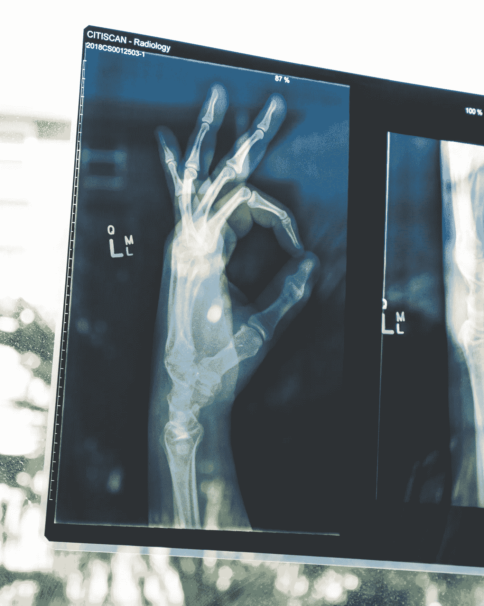

# 医疗保健中的 Python:推进管理和数据科学

> 原文：<https://medium.com/quick-code/python-in-healthcare-advancing-management-and-data-science-ae758ca0ee2c?source=collection_archive---------0----------------------->

众所周知，医疗保健组织每天都要处理来自患者和医疗机构的大量数据。根据 Statista 的数据，全球医疗保健数据量呈爆炸式增长，从 2013 年的约 153 艾字节增长到 2020 年的超过 2300 艾字节，并且还将继续增长。面对新冠肺炎疫情这样的全球性挑战，我们逐渐意识到高效的数据管理和及时的数据分析在从单个患者到整个世界的各个层面上是多么重要。

今天我要谈的是 Python，为什么医疗技术公司喜欢它，以及日益流行的编程语言在[医疗保健部门](https://qarea.com/industries/medicine-and-healthcare)高效数据管理、患者护理和数据科学方面无可争议的潜力。

# Python 是什么？

[Python](https://qarea.com/hire-developers/python) 是一种面向对象的高级动态编程语言，近 30 年来已经广泛应用于各行各业。Python 是通用的，这意味着你可以有效地使用它来构建任何东西，从简单的 web 和桌面应用程序到强大的数据管理系统，甚至复杂的机器学习和人工智能工具。今天，Python 是世界上第四种最常用的编程语言，因其易用性和多功能性而受到全球软件开发工程师的称赞。但是，与其他任何语言相比，Python 令人难以置信的灵活性和独特的功能已经证明了它们近年来在医疗保健领域的价值。

# 为什么健康技术开发者更喜欢 Python

以下是近年来 Python 在医疗保健软件开发排行榜上超过 Java 和 C++等其他编程语言的主要原因:

*   **提高生产率**

Python 清晰的语法、干净的面向对象设计和代码可重用性使软件开发人员能够比使用其他语言更快地编写代码和更有效地添加复杂的功能。

*   **动态语义**

Python 是一种动态类型语言，具有更短的设计周期和更少的源代码。这为增量开发带来了更多的灵活性，并节省了医疗保健项目的大量时间。他们只是编码、测试并部署到生产环境中。

*   **开源**

Python 可以免费使用和分发，甚至用于商业目的。这也意味着一个庞大的、充满活力的贡献者社区，他们分享知识并提供可能有助于您的医疗保健项目开发的解决方案。

*   **可用的库和框架**

涵盖几乎所有用例的大量高质量库和灵活框架消除了软件架构师重新发明轮子的需要。医疗保健项目不需要为需求列表上的每一个特性编写新的代码。

*   **测试驱动开发**

Python 出色的代码可读性和测试框架使得 TDD 简单且非常有效。这意味着医疗保健项目可以最大限度地减少修复漏洞所花费的时间，并大大降低产品维护的成本。

*   **互通**

在某些框架的帮助下，Python 提供了与其他编程语言和技术的良好互操作性，这使得基于 Python 的解决方案能够与几乎任何平台无缝集成。

*   **多功能**

Python 是通用的，它允许医疗保健项目通过使用单一语言来涵盖每个项目开发目标，从而降低整体项目复杂性和开发资源。

*   **HIPAA 合规性**

有许多免费且现成的用于数据安全和加密的 Python 包，使您的医疗保健开发项目可以轻松勾选 HIPAA 合规性清单上的每一个方框。

# 医疗保健中的 Python 用例

# 医院和病人护理管理

医院和诊所经常受到严重的资源限制，这使得有效的预算和人员分配成为一个大问题。一方面，低录取的班次超编会导致不必要的人工成本。另一方面，人手有限的繁忙一天可能会导致致命的后果。即使有了最佳的人员配备，你也不能总是确保预约、诊断设施和治疗都得到合理的安排和管理。

借助 TensorFlow、Pytorch 和 Scikit-Learn 等机器学习库，Python 可以提高医疗保健提供商的管理和成本控制能力，帮助他们变得更加可持续。使用 Python，healthtech 公司可以创建深度神经网络解决方案，该解决方案将分析患者入院率、EHR 和其他医院数据，以捕捉可用于优化运营管理的相关模式。因此，像人员配备、库存管理、急救护理和病人等待时间等事情将变得更加可预测和更具成本效益。行业分析师认为，到 2026 年，此类应用可能会为美国医疗保健经济每年节省 1500 亿美元。

# 诊断学

全世界每 10 个病人中就有一个受到医疗差错的影响。这在医疗保健中是一个非常严重的因素，因为即使是一次误诊或错误的处方也可能导致致命的后果。仅在美国，大约 10%的患者死亡是由诊断错误引起的，而成千上万的其他患者经历了对处方药物的不良反应。

Python 的机器学习能力可以有效地应用于构建强大的图像识别和医学数据处理工具。这些工具将能够从患者 EHR 数据中学习，识别特定的模式，并以非常高的准确度提供个性化的诊断和药物治疗见解。这包括心电图分析、超声波成像、磁共振成像、扩散张量成像和计算机断层扫描。

借助 Python 驱动的机器学习工具，医生可以将这些数据组合成一个单一的诊断结果，并制定更有效、更准确的治疗策略。这种先进的诊断技术将特别有助于肿瘤学家和病理学家。

# 预后

有许多患者特有的因素会影响疾病的进程。这需要医生处理难以想象的大量数据，以便能够估计病人的状况和潜在的并发症。由于不同疾病有如此多的相似体征和症状，即使是最好和最有经验的医生也很难预测每个患者的预期持续时间和疾病结果。

借助基于 Python 的框架、机器学习库和预测分析领域的最新突破，该语言可用于创建可靠的预测疾病预测工具。与现有的预测方法相比，这种 Python 驱动的技术实现起来耗时更少，维护起来更具成本效益。这些工具可以处理大量患者 EHR 数据，分析每个患者的当前诊断、疾病持续时间和治疗。

该系统将比较疾病的病程、给定的治疗计划、开出的药物和其他患者特定的因素，以分析效率并在任何严重并发症出现之前识别接下来可能发生的情况。这种解决方案也可以应用于姑息治疗，更准确、更及时地预测晚期疾病患者的死亡率。

# 数据科学

基于 Python 的数据管理和分析解决方案很可能成为医疗保健科学进步的巨大推动力。除了高效的统计计算，Python 还可以用于连接不同的数据库、平台和外部 API，将数据直接拉入数据科学管道。

借助强大、经济高效的 Python 算法和系统，医疗保健组织将能够处理数十亿字节的结构化和非结构化医疗保健数据，以帮助研究、开发和测试新的治疗方法，发现预防性护理解决方案，改善流行病控制等。

# 使用 Python 的医疗创业公司

1.  **DrChrono**
    创新的端到端医疗保健管理平台，具有可定制的工作流程，可简化 EHR 管理、患者护理调度、医疗计费和收入周期管理。
2.  **Qventus**
3.  **AiCure**

**Fathom Health**
一个医疗编码自动化平台，通过结构化和分析 EHR 数据集，利用深度学习和自然语言处理模型来加速医疗报销。