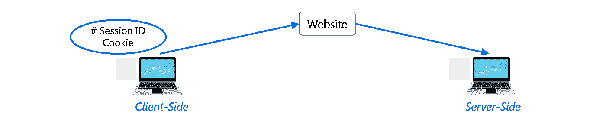

# 2021 年 100 大 Python 面试问答

> 原文：<https://medium.com/edureka/python-interview-questions-a22257bc309f?source=collection_archive---------2----------------------->


Python 是编程领域最受欢迎的技能。在本文中，我将向您介绍 Python 面试中最常见的问题。我们的 Python 面试问题是一个一站式资源，你可以在这里提高你的面试准备。我们有 100 多个关于 *Python 编程*基础的问题，它们将帮助不同专业水平的你从我们的文章中获得最大收益。

我们编制了一份顶级 Python 面试问题列表，分为 7 个部分，即:

*   基本面试问题
*   哎呀面试问题
*   基本 Python 程序
*   Python 库面试问题
*   网络搜集面试问题
*   数据分析面试问题
*   多项选择问题(MCQ)

# 基本 Python 面试问题

## Q1。Python 中 list 和 tuples 有什么区别？


## Q2。Python 的关键特性是什么？

*   Python 是一种**解释的**语言。这意味着，不像语言如 *C* 及其变体，Python 在运行前不需要编译。其他解释语言包括 *PHP* 和 *Ruby* 。
*   Python 是动态类型化的，这意味着当你声明变量时，你不需要声明它们的类型。你可以做类似于`x=111` 然后`x="I'm a string"`的事情而不会出错
*   Python 非常适合于**面向对象编程**，因为它允许定义类以及组合和继承。Python 没有访问说明符(像 C++的`public`、`private`)。
*   在 Python 中，**函数**是**一级对象**。这意味着它们可以被赋给变量，从其他函数返回并传递给函数。类也是第一类对象
*   编写 Python 代码很快，但是运行它通常比编译语言要慢。幸运的是，Python 允许包含基于 C 的扩展，所以瓶颈可以被优化掉，而且经常如此。numpy 包就是一个很好的例子，它真的很快，因为它所做的许多数字运算实际上并不是由 Python 完成的
*   Python 在很多领域都有应用——网络应用、自动化、科学建模、大数据应用等等。它还经常被用作“粘合”代码，以使其他语言和组件表现良好。

## Q3。python 是一种什么类型的语言？编程还是脚本？

Python 能够编写脚本，但在一般意义上，它被认为是一种通用编程语言

## Q4。Python 是怎样一种解释型语言？

解释语言是在运行前不在机器代码中的任何编程语言。因此，Python 是一种解释型语言。

## Q5。pep 8 是什么？

PEP 代表 **Python 增强提案。**这是一组规定如何格式化 Python 代码以获得最大可读性的规则。

## Q6。Python 中是如何管理内存的？

1.  python 中的内存管理由 ***Python 私有堆空间*** 管理。所有 Python 对象和数据结构都位于私有堆中。程序员无权访问这个私有堆。python 解释器负责这个。
2.  Python 对象的堆空间分配是由 Python 的内存管理器完成的。核心 API 为程序员提供了一些编程工具。
3.  Python 还有一个内置的垃圾收集器，它可以回收所有未使用的内存，这样就可以将这些内存用于堆空间。

## Q7。Python 中的命名空间是什么？

名称空间是一种命名系统，用于确保名称是唯一的，以避免命名冲突。

## Q8。什么是 PYTHONPATH？

它是导入模块时使用的环境变量。每当导入一个模块时，还会查找 PYTHONPATH 来检查各个目录中是否存在导入的模块。解释器用它来决定加载哪个模块。

## Q9。什么是 python 模块？说出 Python 中一些常用的内置模块？

Python 模块是包含 Python 代码的文件。这个代码可以是函数、类或变量。Python 模块是包含可执行代码的. py 文件。

一些常用的内置模块有:

*   操作系统（Operating System）
*   [计]系统复制命令（system 的简写）
*   数学
*   随意
*   数据存取时间
*   JSON

## Q10。Python 中的局部变量和全局变量是什么？

***全局变量:***

在函数外部或全局空间中声明的变量称为全局变量。程序中的任何函数都可以访问这些变量。

***局部变量:***

任何在函数中声明的变量都被称为局部变量。这个变量存在于局部空间，而不存在于全局空间。

***举例:***

```
a=2                       #Global Variable
def add(): 
b=3                       #Local Variable
c=a+b 
print(c) 
add()
```

***输出:*** 5

当您试图在函数 add()之外访问局部变量时，它将抛出一个错误。

## Q11。python 区分大小写吗？

是的。Python 是一种区分大小写的语言。

## Q12。Python 中什么是类型转换？

类型转换是指将一种数据类型转换成另一种数据类型。

1.  **int()** —将任何数据类型转换为整数类型
2.  **float()** —将任何数据类型转换为浮点类型
3.  **ord()** —将字符转换为整数
4.  **十六进制(** ) —将整数转换为十六进制
5.  **oct()** —将整数转换为八进制
6.  **tuple() —** 这个函数用来转换成一个元组。
7.  **set() —** 该函数返回转换为 set 后的类型。
8.  **list() —** 该函数用于将任何数据类型转换为列表类型。
9.  **dict() —** 这个函数用于将一个有序元组(键，值)转换成一个字典。
10.  **str() —** 用于将整数转换成字符串。
11.  **复数(实数，imag)** —此函数将实数转换为复数(实数，imag)。

## **Q13。如何在 Windows 上安装 Python 并设置路径变量？**

***Ans:*** 要在 Windows 上安装 Python，请遵循以下步骤:

*   从这个链接安装 python:[https://www.python.org/downloads/](https://www.python.org/downloads/)
*   之后，安装在你的电脑上。在命令提示符下使用以下命令查找 PYTHON 在 PC 上的安装位置:cmd python。
*   然后进入高级系统设置，添加一个新变量，命名为 PYTHON_NAME，粘贴复制的路径。
*   查找路径变量，选择其值，然后选择“编辑”。
*   如果值的末尾没有分号，请添加分号，然后输入%PYTHON_HOME%

## Q14。python 中需要缩进吗？

缩进对于 Python 来说是必要的。它指定了一个代码块。循环、类、函数等中的所有代码都在缩进块中指定。通常使用四个空格字符。如果您的代码不需要缩进，它将无法准确执行，还会抛出错误。

## Q15。Python 数组和列表有什么区别？

在 Python 中，数组和列表具有相同的数据存储方式。但是，数组只能保存单个数据类型元素，而列表可以保存任何数据类型元素。

***举例:***

```
import array as arr
My_Array=arr.array('i',[1,2,3,4])
My_list=[1,'abc',1.20]
print(My_Array)
print(My_list)
```

**输出:**

数组(' I '，[1，2，3，4]) [1，' abc '，1.2]

## Q16。Python 中有哪些函数？

函数是一段代码，只有在被调用时才会被执行。为了在 Python 中定义函数，使用了 **def** 关键字。

***举例:***

```
def Newfunc():
print("Hi, Welcome to Edureka")
Newfunc(); #calling the function
```

**输出:**

嗨，欢迎来到爱德华卡

## Q17。什么是 __init__？

__init__ 是 Python 中的方法或构造函数。当创建类的新对象/实例时，会自动调用此方法来分配内存。所有的类都有 __init__ 方法。

这里有一个如何使用它的例子。

```
class Employee:
def __init__(self, name, age,salary):
self.name = name
self.age = age
self.salary = 20000
E1 = Employee("XYZ", 23, 20000)
# E1 is the instance of class Employee.
#__init__ allocates memory for E1\. 
print(E1.name)
print(E1.age)
print(E1.salary)
```

***输出:***

XYZ

23

20000

## Q18。什么是 lambda 函数？

匿名函数称为 lambda 函数。该函数可以有任意数量的参数，但只能有一条语句。

***例如:***

```
a = lambda x,y : x+y 
print(a(5, 6))
```

***输出:***

11

## Q19。Python 中的 self 是什么？

self 是一个类的实例或对象。在 Python 中，这是作为第一个参数显式包含的。然而，在 Java 中却不是这样，它是可选的。它有助于区分带有局部变量的类的方法和属性。

init 方法中的 self 变量指的是新创建的对象，而在其他方法中，它指的是方法被调用的对象。

## 问题 20。怎么破、续、传功？


## 问题 21。[::-1}是做什么的？

[::-1]用于反转数组或序列的顺序。

***例如:***

```
import array as arr
My_Array=arr.array('i',[1,2,3,4,5])
My_Array[::-1]
```

***输出*** *:*

数组(' I '，[5，4，3，2，1])

## 问题 22。如何在 Python 中随机排列列表中的条目？

考虑下面的例子:

```
from random import shuffle
x = ['Keep', 'The', 'Blue', 'Flag', 'Flying', 'High']
shuffle(x)
print(x)
```

以下代码的输出如下所示。

```
['Flying', 'Keep', 'Blue', 'High', 'The', 'Flag']
```

## 问题 23。什么是 python 迭代器？

迭代器是可以被遍历或迭代的对象。

## 问题 24。如何在 Python 中生成随机数？

随机模块是用于生成随机数的标准模块。该方法定义为:

```
import random 
random.random
```

random.random()方法返回在[0，1]范围内的浮点数。该函数生成随机浮点数。与 random 类一起使用的方法是隐藏实例的绑定方法。可以做随机的实例来展示多线程程序创建不同的单个线程的实例。这里使用的其他随机发生器有:

1.  randrange(a，b):它选择一个整数并定义[a，b]之间的范围。它通过从指定的范围中随机选择元素来返回元素。它不构建 range 对象。
2.  uniform(a，b):它选择一个定义在[a，b]范围内的浮点数。Iyt 返回浮点数
3.  normalvariate(mean，sdev):用于正态分布，其中 mu 是平均值，sdev 是用于标准差的 sigma。
4.  所使用和实例化的随机类创建了独立的多个随机数生成器。

## 问题 25。range & xrange 有什么区别？

在很大程度上，xrange 和 range 在功能上是完全相同的。它们都提供了一种生成整数列表的方法，供您随意使用。唯一的区别是 range 返回一个 Python 列表对象，而 x range 返回一个 xrange 对象。

这意味着 xrange 实际上不像 range 那样在运行时生成静态列表。它用一种叫做让步的特殊技术创造出你需要的价值。这种技术用于一种称为发生器的对象。这意味着如果你有一个非常大的范围，比如说 10 亿，那么 xrange 就是可以使用的函数。

如果您有一个真正对内存敏感的系统，比如您正在使用的手机，这一点尤其正确，因为 range 会使用尽可能多的内存来创建您的整数数组，这会导致内存错误并使您的程序崩溃。这是一只渴望记忆的野兽。

## 问题 26。用 python 怎么写注释？

Python 中的注释以#字符开头。然而，有时也可以使用文档字符串(用三重引号括起来的字符串)进行注释。

***例如:***

```
#Comments in Python start like this 
print("Comments in Python start with a #")
```

***输出:***

Python 中的注释以#开头

## Q27。什么是酸洗和拆线？

Pickle 模块接受任何 Python 对象，将其转换为字符串表示形式，并使用 dump 函数将其转储到一个文件中，这个过程称为 pickle。而从存储的字符串表示中检索原始 Python 对象的过程被称为拆包。

## 问题 28。python 中的生成器有哪些？

返回一组可迭代项的函数称为生成器。

## 问题 29。你将如何大写字符串的第一个字母？

在 Python 中，capitalize()方法将字符串的第一个字母大写。如果字符串的开头已经包含一个大写字母，那么它将返回原始字符串。

## Q30。你如何将一个字符串转换成全部小写？

要将字符串转换成小写，可以使用 lower()函数。

***举例:***

```
stg='ABCD' 
print(stg.lower())
```

***输出:***

加快收寄投递系统

## Q31。如何在 python 中注释多行？

多行注释出现在多行中。所有要注释的行都要加上前缀#。你也可以用一个非常好的**快捷方法来注释多行**。你所需要做的就是按住 ctrl 键并在你想要包含#字符的每个地方点击**左键**,然后输入一次#字符。这将注释您引入光标的所有行。

## Q32。Python 中的 docstrings 是什么？

Docstrings 实际上不是注释，而是，它们是 ***文档字符串*** 。这些文档字符串在三重引号内。它们不赋给任何变量，因此，有时也可以用作注释。

***举例:***

```
"""
Using docstring as a comment.
This code divides 2 numbers
"""
x=8
y=4
z=x/y
print(z)
```

**输出:**

2.0

## Q33。is，not 和 in 运算符的目的是什么？

运算符是特殊函数。它们接受一个或多个值并产生相应的结果。

is:当 2 个操作数为真时返回真(例如:“a”是“a”)

not:返回布尔值的倒数

in:检查某个元素是否出现在某个序列中

## Q34。Python 中 help()和 dir()函数的用法是什么？

Help()和 dir()这两个函数都可以从 Python 解释器中访问，并用于查看内置函数的统一转储。

1.  Help()函数:help()函数用于显示文档字符串，也方便您查看与模块、关键字、属性等相关的帮助。
2.  Dir()函数:dir()函数用于显示定义的符号。

## Q35。每当 Python 退出时，为什么不是所有的内存都去分配？

1.  每当 Python 退出时，特别是那些循环引用其他对象或从全局名称空间引用的对象的 Python 模块，并不总是被释放或释放。
2.  不可能取消分配那些由 C 库保留的内存部分。
3.  退出时，因为有自己高效的清理机制，Python 会尝试释放/销毁所有其他对象。

## Q36。Python 中的字典是什么？

Python 中内置的数据类型称为 dictionary。它定义了键和值之间的一对一关系。字典包含一对键和它们对应的值。字典是按关键字索引的。

让我们举个例子:

以下示例包含一些键。国家、首都和总理。他们对应的数值分别是印度、德里、莫迪。

```
dict={'Country':'India','Capital':'Delhi','PM':'Modi'}print dict[Country]
```

***输出:***

```
India
```

同样，如果您希望打印大写字母，则:

```
print dict[Capital]
```

***输出:***

```
Delhi
```

同样，如果您希望打印 PM，则:

```
print dict[PM]
```

***输出:***

```
Modi
```

## Q37。python 中如何使用三元运算符？

三元运算符是用于显示条件语句的运算符。这包括 true 或 false 值以及必须对其进行评估的语句。

**语法**:

三元运算符将被给出为:
[on _ true]if[expression]else[on _ false]x，y = 25，50big = x if x < y else y

**例如:**

表达式的计算方式如下:if x

## Q38。这是什么意思:*args，**kwargs？我们为什么要用它？

当我们不确定要传递给函数多少个参数时，或者当我们想要传递一个存储的参数列表或元组给函数时，我们使用*args。* *当我们不知道有多少个关键字参数将被传递给一个函数时，可以使用 kwargs，或者它可以用于将一个字典的值作为关键字参数传递。标识符 args 和 kwargs 是约定俗成的，你也可以使用*bob 和**billy，但这并不明智。

## Q39。len()是做什么的？

***Ans:*** 用于确定字符串、列表、数组等的长度。

**举例:**

```
stg='ABCD' 
len(stg)
```

## Q40。解释 Python 中“re”模块的 split()、sub()、subn()方法。

为了修改字符串，Python 的“re”模块提供了 3 种方法。它们是:

*   split() —使用正则表达式模式将给定的字符串“拆分”成一个列表。
*   sub() —查找 regex 模式匹配的所有子字符串，然后用不同的字符串替换它们
*   subn() —它类似于 sub()，也返回新字符串以及替换数。

## Q41。什么是负指数，为什么使用负指数？

Python 中的序列是有索引的，它由正数和负数组成。正数用“0”作为第一个索引，用“1”作为第二个索引，这个过程就这样继续下去。

负数的索引从表示序列中最后一个索引的'-1 '开始，从倒数第二个索引的'-2 '开始，序列像正数一样向前推进。

负索引用于从字符串中删除任何新行空格，并允许字符串除了最后一个字符以外的字符被指定为 S[:-1]。负索引也用于显示以正确顺序表示字符串的索引。

## Q42。什么是 Python 包？

Python 包是包含多个模块的名称空间。

## Q43。Python 中如何删除文件？

要在 Python 中删除文件，需要导入 OS 模块。之后，需要使用 os.remove()函数。

***举例:***

```
import os 
os.remove("xyz.txt")
```

## Q44。python 的内置类型有哪些？

***Ans:***Python 中的内置类型如下——

*   整数
*   浮点型
*   复数
*   用线串
*   布尔代数学体系的
*   内置函数

## Q45。NumPy 数组比(嵌套的)Python 列表有什么优势？

1.  Python 的列表是高效的通用容器。它们支持(相当)有效的插入、删除、追加和连接，Python 的列表理解使它们易于构造和操作。
2.  它们有一定的局限性:它们不支持“矢量化”操作，如元素加法和乘法，并且它们可以包含不同类型的对象，这意味着 Python 必须存储每个元素的类型信息，并且在操作每个元素时必须执行类型调度代码。
3.  NumPy 不仅仅是更高效；也比较方便。你可以免费获得大量的向量和矩阵运算，这有时可以避免不必要的工作。并且它们也被有效地实施。
4.  NumPy 数组更快，你可以得到很多内置的 NumPy，FFT，卷积，快速搜索，基本统计，线性代数，直方图等。

## Q46。如何给 python 数组加值？

可以使用 **append()** 、 **extend()** 和 **insert (i，x)** 函数将元素添加到数组中。

***举例:***

```
a=arr.array('d', [1.1 , 2.1 ,3.1] )
a.append(3.4)
print(a)
a.extend([4.5,6.3,6.8])
print(a)
a.insert(2,3.8)
print(a)
```

***输出:***

数组(' d '，[1.1，2.1，3.1，3.4])

数组(' d '，[1.1，2.1，3.1，3.4，4.5，6.3，6.8])

数组(' d '，[1.1，2.1，3.8，3.1，3.4，4.5，6.3，6.8])

## Q47。如何删除 python 数组中的值？

可以使用 **pop()** 或 **remove()** 方法移除数组元素。这两个函数的区别在于前者返回删除的值，而后者不返回。

***例如:***

```
a=arr.array('d', [1.1, 2.2, 3.8, 3.1, 3.7, 1.2, 4.6])
print(a.pop())
print(a.pop(3))
a.remove(1.1)
print(a)
```

***输出:***

4.6

3.1

数组(' d '，[2.2，3.8，3.7，1.2])

## Q48。Python 有 OOps 概念吗？

Python 是一种面向对象的编程语言。这意味着任何程序都可以通过创建对象模型在 python 中求解。然而，Python 可以被视为过程语言和结构语言。

## Q49。深抄和浅抄有什么区别？

***浅复制*** 在创建新的实例类型时使用，它保留在新实例中复制的值。浅层复制用于复制引用指针，就像复制值一样。这些引用指向原始对象，在类的任何成员中所做的更改也会影响它的原始副本。浅拷贝允许更快地执行程序，它取决于所用数据的大小。

***深度复制*** 用于存储已经复制的值。深度复制不会复制指向对象的引用指针。它引用一个对象，并存储由其他对象指向的新对象。在原始副本中所做的更改不会影响使用该对象的任何其他副本。深度复制会降低程序的执行速度，因为它会为每个被调用的对象创建特定的副本。

## Q50。Python 中多线程是如何实现的？

1.  Python 有一个多线程包，但是如果你想要多线程来加速你的代码，那么使用它通常不是一个好主意。
2.  Python 有一个称为全局解释器锁(GIL)的构造。GIL 确保任何时候只有一个“线程”可以执行。一个线程获取 GIL，做一点工作，然后将 GIL 传递给下一个线程。
3.  这种情况发生得非常快，因此在人眼看来，您的线程似乎是并行执行的，但它们实际上只是轮流使用同一个 CPU 内核。
4.  所有这些 GIL 传递增加了执行的开销。这意味着如果你想让你的代码运行得更快，那么使用线程包通常不是一个好主意。

## Q51。python 中编译链接的过程是怎样的？

编译和链接允许新的扩展被正确地编译而没有任何错误，并且只有当它通过编译过程时，链接才能完成。如果使用动态加载，则取决于系统提供的样式。python 解释器可用于提供配置设置文件的动态加载，并将重建解释器。

***此为:***

1.  使用系统编译器支持的任何名称和语言创建文件。例如 file.c 或 file.cpp
2.  将这个文件放在正在使用的发行版的模块/目录中。
3.  在 Modules/目录下的 Setup.local 文件中添加一行。
4.  使用垃圾邮件文件运行该文件。o
5.  成功运行后，在顶层目录中使用 make 命令重新构建解释器。
6.  如果文件被更改，则使用命令“make Makefile”运行 rebuildMakefile。

## Q52。什么是 Python 库？举几个例子。

Python 库是 Python 包的集合。一些主要使用的 python 库是——Numpy、Pandas、Matplotlib、Scikit-learn 等等。

## Q53。拆分是用来做什么的？

split()方法用于在 Python 中分隔给定的字符串。

***举例:***

```
a="edureka python"
print(a.split())
```

***输出:***

['edureka '，' python']

## **Q54。如何在 python 中导入模块？**

可以使用 **import** 关键字导入模块。您可以通过三种方式导入模块-

```
import array           #importing using the original module name
import array as arr    # importing using an alias name
from array import *    #imports everything present in the array module
```

# 哎呀面试问题

## Q55。用一个例子解释 Python 中的继承。

继承允许一个类获得另一个类的所有成员(比如属性和方法)。继承提供了代码的可重用性，使得创建和维护应用程序变得更加容易。我们从其继承的类称为超类，被继承的类称为派生类/子类。

它们是 Python 支持的不同类型的继承:

1.  **单一继承**——派生类获得单一超类的成员。
2.  **多级继承** —派生类 d1 继承自基类 base1，d2 继承自 base2。
3.  分层继承——从一个基类中，你可以继承任意数量的子类
4.  **多重继承** —一个派生类从多个基类继承而来。

## Q56。Python 中的类是如何创建的？

Python 中的类是使用 **class** 关键字创建的。

***举例:***

```
class Employee:
def __init__(self, name):
self.name = name
E1=Employee("abc")
print(E1.name)
```

**输出:**

字母表

## Q57。Python 中的猴子补丁是什么？

**Ans:** 在 Python 中，术语 monkey patch 仅指运行时对类或模块的动态修改。

考虑下面的例子:

```
# m.py
class MyClass:
def f(self):
print "f()"
```

然后我们可以像这样运行猴子补丁测试:

```
import m
def monkey_f(self):
print "monkey_f()"

m.MyClass.f = monkey_f
obj = m.MyClass()
obj.f()
```

输出将如下所示:

```
monkey_f()
```

正如我们所看到的，我们确实在模块 *m* 之外使用我们定义的函数 *monkey_f()* 对 *MyClass* 中的 *f()* 的行为做了一些更改。

## Q58。python 支持多重继承吗？

多重继承意味着一个类可以从多个父类派生。Python 确实支持多重继承，不像 Java。

## Q59。Python 中的多态性是什么？

**Ans:** 多态性是指采取多种形式的能力。因此，例如，如果父类有一个名为 ABC 的方法，那么子类也可以有一个同名的方法，它有自己的参数和变量。Python 允许多态性。

## Q60。用 Python 定义封装？

封装意味着将代码和数据绑定在一起。封装示例中的 Python 类。

## Q61。用 Python 怎么做数据抽象？

数据抽象只提供所需的细节，并对外界隐藏实现。这可以在 Python 中通过使用接口和抽象类来实现。

## Q62。python 使用访问说明符了吗？

Python 不会剥夺对实例变量或函数的访问。Python 提出了在变量、函数或方法的名称前加上单下划线或双下划线的概念，以模仿受保护的和私有的访问说明符的行为。

## Q63。如何在 Python 中创建空类？

空类是指在其块中没有定义任何代码的类。它可以使用 *pass* 关键字创建。但是，您可以在类本身之外创建该类的对象。在 PYTHON 中，PASS 命令在执行时什么也不做。这是一个无效的声明。

***例如-***

```
class a:
    pass
obj=a()
obj.name="xyz"
print("Name = ",obj.name)
```

***输出:***

```
Name =  xyz
```

## Q64。object()是做什么的？

它返回一个无特征的对象，这个对象是所有类的基础。此外，它不需要任何参数。

# 基本 Python 程序

## Q65。用 Python 写一个程序来执行冒泡排序算法。

```
def bs(a):             # a = name of list
    b=len(a)-1         # minus 1 because we always compare 2 adjacent values

    for x in range(b):
        for y in range(b-x):
            if a[y]>a[y+1]:
                a[y],a[y+1]=a[y+1],a[y]
    return a
a=[32,5,3,6,7,54,87]
bs(a)
```

***输出:***

```
[3, 5, 6, 7, 32, 54, 87]
```

## Q66。用 Python 写一个程序产生星形三角形。

```
def pyfunc(r):
    for x in range(r):
        print(' '*(r-x-1)+'*'*(2*x+1))    
pyfunc(9)
```

***输出:***

```
 *
       ***
      *****
     *******
    *********
   ***********
  *************
 ***************
*****************
```

## Q67。用 Python 写一个产生斐波那契数列的程序。

```
# Enter number of terms needed                   #0,1,1,2,3,5....
a=int(input("Enter the terms"))
f=0                                         #first element of series
s=1                                         #second element of series
if a<=0:
    print("The requested series is
",f)
else:
    print(f,s,end=" ")
    for x in range(2,a):
        next=f+s                           
        print(next,end=" ")
        f=s
        s=next</pre>
```

**输出:**

```
Enter the terms 5 0 1 1 2 3
```

## Q68。用 Python 写一个程序，检查一个数是否是质数。

```
a=int(input("enter number"))     
if a>1:
    for x in range(2,a):
        if(a%x)==0:
            print("not prime")
            break
    else:
        print("Prime")
else:
    print("not prime")
```

**输出:**

```
enter number 3Prime
```

## Q69。用 Python 写一个程序，检查一个序列是不是回文。

```
a=input("enter sequence")
b=a[::-1]
if a==b:
    print("palindrome")
else:
    print("Not a Palindrome")
```

**输出:**

```
enter sequence 323 palindrome
```

## Q70。写一行程序来计算文件中大写字母的数量。即使文件太大而不适合内存，您的代码也应该工作。

让我们首先编写一个多行解决方案，然后将其转换为一行代码。

```
with open(SOME_LARGE_FILE) as fh:
count = 0
text = fh.read()
for character in text:
    if character.isupper():
count += 1
```

我们现在将尝试把它转换成一行。

```
count sum(1 for line in fh for character in line if character.isupper())
```

## Q71。用 Python 写一个数值数据集的排序算法。

以下代码可用于在 Python 中对列表进行排序:

```
list = ["1", "4", "0", "6", "9"]
list = [int(i) for i in list]
list.sort()
print (list)
```

## Q72。看下面的代码，写下 A0，A1，…An 的最终值。

```
A0 = dict(zip(('a','b','c','d','e'),(1,2,3,4,5)))
A1 = range(10)A2 = sorted([i for i in A1 if i in A0])
A3 = sorted([A0[s] for s in A0])
A4 = [i for i in A1 if i in A3]
A5 = {i:i*i for i in A1}
A6 = [[i,i*i] for i in A1]
print(A0,A1,A2,A3,A4,A5,A6)
```

以下是 A0，A1，… A6 的最终输出

```
A0 = {'a': 1, 'c': 3, 'b': 2, 'e': 5, 'd': 4} # the order may vary
A1 = range(0, 10) 
A2 = []
A3 = [1, 2, 3, 4, 5]
A4 = [1, 2, 3, 4, 5]
A5 = {0: 0, 1: 1, 2: 4, 3: 9, 4: 16, 5: 25, 6: 36, 7: 49, 8: 64, 9: 81}
A6 = [[0, 0], [1, 1], [2, 4], [3, 9], [4, 16], [5, 25], [6, 36], [7, 49], [8, 64], [9, 81]]
```

# Python 库面试问题

## Q73。解释什么是 Flask 及其好处？

Flask 是一个基于“Werkzeug，jinja 2 and good intentions”BSD 许可的用于 Python 的 web 微框架。Werkzeug 和 Jinja2 是它的两个依赖项。这意味着它对外部库的依赖性很小甚至没有。它使框架变得更轻，同时对更新的依赖性更小，安全缺陷更少。

会话基本上允许你记住从一个请求到另一个请求的信息。在 flask 中，会话使用签名的 cookie，因此用户可以查看会话内容并进行修改。只要会话具有密钥 Flask.secret_key，用户就可以修改会话。

## Q74。Django 比 Flask 好吗？

Django 和 Flask 将 web 浏览器中输入的 URL 或地址映射到 Python 中的函数。

Flask 比 Django 简单得多，但是 Flask 不会为您做很多事情，这意味着您需要指定细节，而 Django 会为您做很多事情，您不需要做很多工作。Django 由预先编写的代码组成，用户需要分析这些代码，而 Flask 让用户创建他们自己的代码，因此，使理解代码变得更简单。从技术上来说，两者都一样好，都有各自的优点和缺点。

## Q75。提到 Django，Pyramid 和 Flask 的区别。

*   Flask 是一个“微框架”,主要是为具有简单需求的小型应用程序构建的。在 flask 中，你必须使用外部库。烧瓶可以使用了。
*   金字塔是为更大的应用程序而构建的。它提供了灵活性，并让开发人员为他们的项目使用正确的工具。开发者可以选择数据库、URL 结构、模板风格等等。金字塔是可配置的。
*   Django 也可以像 Pyramid 一样用于更大的应用程序。它包括一个 ORM。

## Q76。讨论 Django 架构。

**Ans:** 姜戈 MVT 模式:


开发人员提供模型、视图和模板，然后将它们映射到一个 URL，Django 会神奇地将它们提供给用户。

## Q77。解释如何在 Django 中建立数据库。

可以使用 edit mysite/setting.py 命令，它是一个普通的 python 模块，模块级别代表 Django 设置。

Django 默认使用 SQLite 这对于 Django 用户来说很容易，因为它不需要任何其他类型的安装。如果您的数据库选择不同，您必须在数据库“默认”项中添加以下键，以匹配您的数据库连接设置。

*   **引擎**:你可以使用‘django . db . backends . sqlite3’，‘django . db . backeneds . MySQL’，‘django . db . backends . PostgreSQL _ psycopg 2’，‘django . db . backends . Oracle’等改变数据库
*   **名称**:您的数据库的名称。在这种情况下，如果您使用 SQLite 作为您的数据库，在这种情况下，数据库将是您的计算机上的一个文件，名称应该是一个完整的绝对路径，包括该文件的文件名。
*   如果你没有选择 SQLite 作为你的数据库，那么设置如密码，主机，用户等。必须添加。

我们将把下面几行代码添加到*设置. py* 文件中:

```
DATABASES = {
     'default': {
          'ENGINE' : 'django.db.backends.sqlite3',
          'NAME' : os.path.join(BASE_DIR, 'db.sqlite3'),
     }
}
```

## Q78。举例说明如何用 Django 编写视图？

这就是我们如何在 Django 中编写视图:

```
from django.http import HttpResponse
import datetime

def Current_datetime(request):
     now = datetime.datetime.now()
     html = "<html><body>It is now %s</body></html> % now
     return HttpResponse(html)
```

*以 HTML 文档的形式返回当前日期和时间*

## Q79。提及 Django 模板由什么组成。

模板是一个简单的文本文件。它可以创建任何基于文本的格式，如 XML、CSV、HTML 等。模板包含在评估模板时用值替换的变量和控制模板逻辑的标记(% tag %)。


## Q80。解释 Django 框架中 session 的使用？

Django 提供了一个会话，允许您基于每个站点的访问者存储和检索数据。Django 抽象了发送和接收 cookie 的过程，在客户端放置一个会话 ID cookie，在服务器端存储所有相关的数据。



所以数据本身并不存储在客户端。从安全角度来看，这很好。

## **Q81。列出 Django 中的继承风格。**

在 Django 中，有三种可能的继承方式:

1.  **抽象基类:**当您只想让父类保存您不想为每个子模型输出的信息时，可以使用这种风格。
2.  **多表继承:**如果您对一个现有的模型进行子类化，并且需要每个模型都有自己的数据库表，那么可以使用这种风格。
3.  **代理模型:**如果您只想修改模型的 Python 级行为，而不改变模型的字段，您可以使用这个模型。

# Web 抓取— Python 面试问题

## Q82。如何使用我已经知道 URL 地址的 Python 在本地保存图像？

我们将使用以下代码从 URL 地址本地保存图像

```
import urllib.request 
urllib.request.urlretrieve("URL", "local-filename.jpg")
```

## Q83。你怎么能得到任何网址或网页的谷歌缓存年龄？

使用以下 URL 格式:

`[http://webcache.googleusercontent.com/search?q=cache:URLGOESHERE](http://webcache.googleusercontent.com/search?q=cache:URLGOESHERE)`

请确保将“URLGOESHERE”替换为您想要检索其缓存并查看其时间的页面或站点的正确网址。例如，要检查 edureka.co 的 Google Webcache 年龄，您可以使用以下 URL:

`[http://webcache.googleusercontent.com/search?q=cache:edureka.co](http://webcache.googleusercontent.com/search?q=cache:edureka.co)`

## Q84。你需要从 IMDb 电影 250 强页面中删除数据。它应该只有电影名称、年份和分级字段。

我们将使用下面几行代码:

```
from bs4 import BeautifulSoup

import requests
import sys

url = '[http://www.imdb.com/chart/top'](http://www.imdb.com/chart/top')
response = requests.get(url)
soup = BeautifulSoup(response.text)
tr = soup.findChildren("tr")
tr = iter(tr)
next(tr)

for movie in tr:
title = movie.find('td', {'class': 'titleColumn'} ).find('a').contents[0]
year = movie.find('td', {'class': 'titleColumn'} ).find('span', {'class': 'secondaryInfo'}).contents[0]
rating = movie.find('td', {'class': 'ratingColumn imdbRating'} ).find('strong').contents[0]
row = title + ' - ' + year + ' ' + ' ' + rating

print(row)
```

上述代码将有助于从 IMDb 的 250 强名单中剔除数据

# 数据分析 Python 面试问题

## Q85。Python 中的地图函数是什么？

*map* 函数对作为第二个参数给出的 iterable 的所有元素执行作为第一个参数给出的函数。如果给定的函数有 1 个以上的参数，那么就有许多可迭代的函数。#点击链接了解更多类似功能。

## Q86。python numpy 比 lists 好吗？

我们使用 python numpy 数组而不是列表是因为以下三个原因:

1.  内存更少
2.  快的
3.  方便的

## Q87。如何获取 NumPy 数组中 N 个最大值的索引？

我们可以使用下面的代码获得 NumPy 数组中 N 个最大值的索引:

```
import numpy as np
arr = np.array([1, 3, 2, 4, 5])
print(arr.argsort()[-3:][::-1])
```

***输出***

```
[ 4 3 1 ]
```

## Q88。如何用 Python/ NumPy 计算百分位数？

我们可以用下面的代码计算百分位数

```
import numpy as np
a = np.array([1,2,3,4,5])
p = np.percentile(a, 50) #Returns 50th percentile, e.g. median
print(p)
```

***输出***

```
3
```

## Q89。NumPy 和 SciPy 有什么区别？

1.  在理想情况下，NumPy 只包含数组数据类型和最基本的操作:索引、排序、整形、基本的元素函数等等。
2.  所有的数字代码都存放在 SciPy 中。然而，NumPy 的一个重要目标是兼容性，所以 NumPy 试图保留它的任何一个前身所支持的所有特性。
3.  因此 NumPy 包含了一些线性代数函数，尽管这些函数更适合归入 SciPy。无论如何，SciPy 包含了功能更全面的线性代数模块，以及许多其他数值算法。
4.  如果你用 python 做科学计算，你可能应该同时安装 NumPy 和 SciPy。大多数新特性属于 SciPy 而不是 NumPy。

## Q90。如何使用 NumPy/SciPy 制作 3D 绘图/可视化？

像 2D 绘图一样，3D 图形超出了 NumPy 和 SciPy 的范围，但是就像在 2D 的情况下，存在与 NumPy 集成的包。Matplotlib 在 mplot3d 子包中提供了基本的 3d 绘图，而 Mayavi 利用强大的 VTK 引擎提供了广泛的高质量 3D 可视化功能。

# 多项选择问题(MCQ)

## Q91。下列哪一项陈述创建了字典？(可能有多个正确答案)

a) d = {}
b) d = { "约翰":40，"彼得":45}
c) d = {40:"约翰"，45:"彼得" }
d) d = (40:"约翰"，45:"50 ")

**答案:** b，c & d。

字典是通过指定键和值来创建的。

## Q92。哪一个是楼层划分？

a) /
b) //
c) %
d)以上均未提及

**答案:** b) //

当两个操作数都是整数时，python 会去掉小数部分，给出取整后的值，要得到准确的答案，请使用底数除法。对于 ex，5/2 = 2.5，但两个操作数都是整数，因此 python 中该表达式的答案是 2。要得到 2.5 作为答案，请使用//进行分频。所以，5//2 = 2.5

## Q93。标识符的最大可能长度是多少？

a) 31 个字符
b) 63 个字符
c) 79 个字符
d)以上都不是

**答案:** d)以上都不是

标识符可以是任意长度。

## Q94。为什么不鼓励以下划线开头的局部变量名？

a)它们被用来指示一个类的私有变量
b)它们使解释器
困惑 c)它们被用来指示全局变量
d)它们降低了执行速度

**答:** a)它们用来表示一个类的私有变量

因为 Python 没有私有变量的概念，所以前导下划线用来表示不能从类外部访问的变量。

## Q95。下列哪一项是无效的陈述？

a)ABC = 1000000
b)a b c = 1000 2000 3000
c)a，b，c = 1000，2000，3000
d)a _ b _ c = 1000000

**答案:** b) a b c = 1000 2000 3000

变量名中不允许有空格。

## Q96。下面的输出是什么？

```
try:
    if '1' != 1:
        raise "someError"
    else:
        print("someError has not occured")
except "someError":
    print ("someError has occured")
```

a)发生了某个错误
b)未发生某个错误
c)无效代码
d)以上都不是

**回答:** c)无效代码

新的异常类必须从 BaseException 继承。这里没有这样的传承。

## Q97。假设 list1 是[2，33，222，14，25]，list1[-1]是什么？

索引-1 对应于列表中的最后一个索引。

a)错误
b)无
c) 25
d) 2

**答案:** c) 25

索引-1 对应于列表中的最后一个索引。

## Q98。为了打开文件 c:scores.txt 进行写入，我们使用

a) outfile = open("c:scores.txt "，" r ")
b)outfile = open(" c:scores . txt "，" w ")
c)outfile = open(file = " c:scores . txt "，" r ")
d)outfile = open(file = " c:scores . txt "，" o ")

**答:** b)位置包含双斜线( )，w 用来表示文件正在被写入。

## Q99。下面的输出是什么？

```
f = None

for i in range (5):
    with open("data.txt", "w") as f:
        if i > 2:
            break

print f.closed
```

a)真
b)假
c)无
d)错误

**答案:** a)正确

with 语句与 open file 一起使用时，可以保证当 WITH 块退出时 file 对象关闭。

## Q100。try-except-else 的 else 部分什么时候执行？

a)总是
b)异常发生时
c)无异常发生时
d)异常发生时进入 except 块

**答:** c)无异常发生时

else 部分在没有异常发生时执行。

我希望这组 Python 面试问题能帮助你准备面试。万事如意！

如果你想查看更多关于人工智能、DevOps、道德黑客等市场最热门技术的文章，你可以参考 Edureka 的官方网站。

请留意本系列中的其他文章，它们将解释 Python 和数据科学的各个方面。

> 1. [Python 教程](/edureka/python-tutorial-be1b3d015745)
> 
> 2. [Python 编程语言](/edureka/python-programming-language-fc1015de7a6f)
> 
> 3. [Python 函数](/edureka/python-functions-f0cabca8c4a)
> 
> 4.[Python 中的文件处理](/edureka/file-handling-in-python-e0a6ff96ede9)
> 
> 5. [Python Numpy 教程](/edureka/python-numpy-tutorial-89fb8b642c7d)
> 
> 6. [Scikit 学习机器学习](/edureka/scikit-learn-machine-learning-7a2d92e4dd07)
> 
> 7. [Python 熊猫教程](/edureka/python-pandas-tutorial-c5055c61d12e)
> 
> 8. [Matplotlib 教程](/edureka/python-matplotlib-tutorial-15d148a7bfee)
> 
> 9. [Tkinter 教程](/edureka/tkinter-tutorial-f655d3f4c818)
> 
> 10.[请求教程](/edureka/python-requests-tutorial-30edabfa6a1c)
> 
> 11. [PyGame 教程](/edureka/pygame-tutorial-9874f7e5c0b4)
> 
> 12. [OpenCV 教程](/edureka/python-opencv-tutorial-5549bd4940e3)
> 
> 13.[用 Python 进行网页抓取](/edureka/web-scraping-with-python-d9e6506007bf)
> 
> 14. [PyCharm 教程](/edureka/pycharm-tutorial-d0ec9ce6fb60)
> 
> 15.[机器学习教程](/edureka/machine-learning-tutorial-f2883412fba1)
> 
> 16.[Python 中从头开始的线性回归算法](/edureka/linear-regression-in-python-e66f869cb6ce)
> 
> 17.[面向数据科学的 Python](/edureka/learn-python-for-data-science-1f9f407943d3)
> 
> 18.[Python 中的循环](/edureka/loops-in-python-fc5b42e2f313)
> 
> 19. [Python 正则表达式](/edureka/python-regex-regular-expression-tutorial-f2d17ffcf17e)
> 
> 20. [Python 项目](/edureka/python-projects-1f401a555ca0)
> 
> 21.[机器学习项目](/edureka/machine-learning-projects-cb0130d0606f)
> 
> 22.[Python 中的数组](/edureka/arrays-in-python-14aecabec16e)
> 
> 23.[在 Python 中设置](/edureka/sets-in-python-a16b410becf4)
> 
> 24.[Python 中的多线程](/edureka/what-is-mutithreading-19b6349dde0f)
> 
> 25. [Java vs Python](/edureka/java-vs-python-31d7433ed9d)
> 
> 26.[如何成为一名 Python 开发者？](/edureka/how-to-become-a-python-developer-462a0093f246)
> 
> 27. [Python Lambda 函数](/edureka/python-lambda-b84d68d449a0)
> 
> 28.[网飞如何使用 Python？](/edureka/how-netflix-uses-python-1e4deb2f8ca5)
> 
> 29.[Python 中什么是套接字编程](/edureka/socket-programming-python-bbac2d423bf9)
> 
> 30. [Python 数据库连接](/edureka/python-database-connection-b4f9b301947c)
> 
> 31. [Golang vs Python](/edureka/golang-vs-python-5ac32e1ef2)
> 
> 32. [Python Seaborn 教程](/edureka/python-seaborn-tutorial-646fdddff322)
> 
> 33. [Python 职业机会](/edureka/python-career-opportunities-a2500ce158de)

*原载于*[*https://www.edureka.co*](https://www.edureka.co/blog/interview-questions/python-interview-questions/)*2019 年 6 月 7 日*