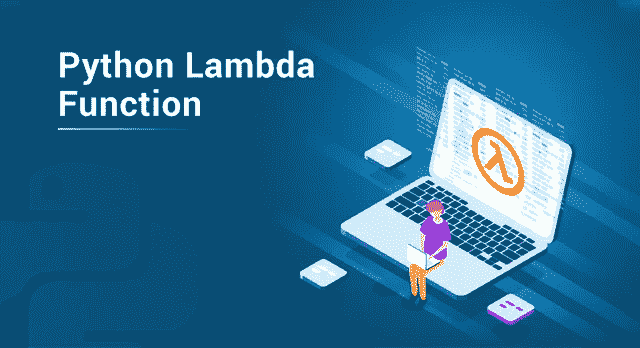
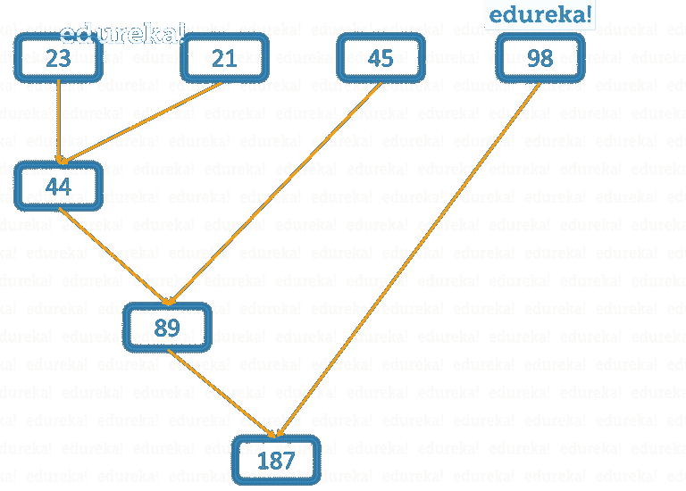

# 了解 Python Lambda 函数以及如何使用它们

> 原文：<https://medium.com/edureka/python-lambda-b84d68d449a0?source=collection_archive---------1----------------------->



Python Lambda Functions — Edureka

名称是用来指代或称呼任何实体的约定。我们周围几乎所有的东西都有名字。编程的世界也与此一致。但是一定要给所有东西起名字吗？或者你能有一些只是“匿名”的东西吗？答案是，可以。 ***Python*** 提供了 Lambda 函数，也称为匿名函数，实际上是无名的。因此，让我们按照下面的顺序继续学习 Python 的这些“匿名之谜”。

*   为什么需要 Python Lambda 函数？
*   什么是 Python Lambda 函数？
*   Lambda 函数怎么写？
*   匿名函数如何减少代码的大小？
*   用户定义函数中的 Python Lambda 函数
*   如何在中使用匿名函数:

1.  过滤器()
2.  地图()
3.  减少()

让我们开始吧:)

# 为什么要使用 Python Lambda 函数？

当你只需要某个函数一次时，匿名函数的主要目的就显现出来了。它们可以在任何需要的地方创建。由于这个原因，Python Lambda 函数也被称为抛弃函数，它与其他预定义函数(如 filter()、map()等)一起使用。与普通 python 函数相比，这些函数有助于减少代码行数。

为了证明这一点，让我们进一步学习 Python Lambda 函数。

# 什么是 Python Lambda 函数？

Python Lambda 函数是没有任何名称的函数。它们也被称为匿名函数或无名函数。lambda 这个词不是一个名字，而是一个关键词。该关键字指定后面的函数是匿名的。

现在您已经知道这些匿名函数指的是什么，让我们进一步看看您如何编写这些 Python Lambda 函数。

# 如何用 Python 写 Lambda 函数？

使用 lambda 运算符创建 Lambda 函数，其语法如下:

**语法:***λ参数:表达式*

Python **lambda 函数**可以有任意数量的参数，但它只需要一个表达式。输入或参数可以从 0 开始，直到任何极限。就像任何其他函数一样，没有输入的 lambda 函数也很好。因此，您可以使用以下任何格式的 lambda 函数:

**示例:**

*λ:“指定用途”*

这里，lambda 函数不接受任何参数。

**例如:**

*λa*₁*:“指定使用一个*₁*”*

这里，λ取一个输入，即 a₁.

同样的，你可以有拉姆达 a₁，a₂，a₃..aₙ.

让我们举几个例子来说明这一点:

**例 1:**

```
a = lambda x: x*x 
print(a(3)
```

**输出:** 9

**例 2:**

```
a = lambda x,y: x*y 
print(a(3,7))
```

**输出:** 21

如你所见，我在这里举了两个例子。第一个例子使用 lambda 函数，只有一个表达式，而第二个例子传递了两个参数。请注意，这两个函数都有一个表达式，后跟参数。因此，lambda 函数不能用在需要多行表达式的地方。

另一方面，普通的 python 函数可以在其函数定义中包含任意数量的语句。

# 匿名函数如何减少代码的大小？

在比较所需的代码量之前，我们先写下普通函数的语法，并与前面描述的 lambda 函数的语法进行比较。

Python 中的任何普通函数都是使用 **def** 关键字定义的，如下所示:

**语法:**

*def function_name(参数):*
*语句*

如您所见，lambda 函数所需的代码量比普通函数少得多。

现在让我们用普通函数重写我们之前举的例子。

**举例:**

```
def my_func(x): 
return x*x 
print(my_func(3))
```

**输出:** 9

如您所见，在上面的例子中，我们需要 my_func 中的 return 语句来计算 3 的平方值。相反，lambda 函数不使用这个 return 语句，但是，匿名函数的主体与函数本身写在同一行，在冒号符号之后。因此，函数的大小小于 my_func 的大小。

然而，上面例子中的 lambda 函数是使用其他变量 a 调用的。这样做是因为这些函数是无名的，因此需要调用某个名称。但是，这一事实可能会令人困惑，当您实际上需要指定其他名称来调用这些函数时，为什么还要使用这些无名函数呢？当然，在给我的函数命名为 a 之后，它就不再是无名的了！对吗？

这是一个合理的问题，但关键是，这不是使用这些匿名函数的正确方式。

匿名函数最好用在其他高阶函数**中，这些函数要么使用某个函数作为参数，要么返回一个函数作为输出。为了证明这一点，现在让我们进入下一个话题。**

# 用户定义函数中的 Python Lambda 函数:

如上所述，lambda 函数被用在其他函数中来标记最大的优势。

以下示例由 new_func 组成，它是一个普通的 python 函数，接受一个参数 x。然后将该参数添加到通过 lambda 函数提供的某个未知参数 y 中。

**例如:**

```
def new_func(x):
    return(lambda y: x+y)
t=new_func(3)
u=new_func(2)
print(t(3))
print(u(3))
```

**输出:**

6
5

如您所见，在上面的示例中，每当我们使用 new_func()时，都会调用 new_func 中存在的 lambda 函数。每次，我们都可以将单独的值传递给参数。

现在已经了解了如何在高阶函数中使用匿名函数，接下来让我们来了解它最流行的用途之一，即在 filter()方法、map()方法和 reduce()方法中。

# 如何在 filter()中使用 Anonymous 函数，映射()和 reduce()。

**过滤器()内的匿名函数:**

## 过滤(f):

filter()方法用于在作为参数传递的另一个函数的帮助下筛选给定 iterables(列表、集合等)，以测试所有元素的真或假。

此函数的语法为:

**语法:** *过滤(功能，可迭代)*

现在考虑以下示例:

**示例:**

```
my_list = [2,3,4,5,6,7,8]
new_list = list(filter(lambda a: (a/3 == 2), my_list))
print(new_list)
```

**输出:**【6】

这里，my_list 是传递给筛选函数的可迭代值的列表。此函数使用 lambda 函数检查列表中是否有任何值，当除以 3 时等于 2。输出由满足匿名函数中存在的表达式的列表组成。

## (地图):

Python 中的 map()函数是一个将给定函数应用于所有 iterables 并返回新列表的函数。

**语法:** *映射(函数，可迭代)*

让我们举一个例子来演示 map()函数中 lambda 函数的使用:

**示例:**

```
my_list = [2,3,4,5,6,7,8]
new_list = list(map(lambda a: (a/3 != 2), li))
print(new_list)
```

**输出:**

[真、真、真、真、假、真、真]

上面的输出显示，每当 iterables 的值被 3 除时不等于 2，则返回的结果应为 True。因此，对于 my_list 中的所有元素，当条件更改为 False 时，它将返回 true，但值 6 除外。

## (减少):

reduce()函数用于将其他一些函数应用于作为参数传递给它的元素列表，最后返回一个值。

此函数的语法如下:

**语法:** *约化(功能、顺序)*

**示例:**

```
from functools import reduce 
reduce(lambda a,b: a+b, [23,21,45,98])
```

上例如下图所示:



**产量:** 187

输出清楚地显示列表中的所有元素都被**连续添加**以返回最终结果。

至此，我们结束了这篇关于“Python Lambda”的文章。希望你对与你分享的一切都很清楚。 ***一定要尽可能多的练习，恢复你的经验。***

如果你想查看更多关于人工智能、DevOps、道德黑客等市场最热门技术的文章，你可以参考 Edureka 的官方网站。

请留意本系列中的其他文章，它们将解释 Python 和数据科学的各个方面。

> 1. [Python 教程](/edureka/python-tutorial-be1b3d015745)
> 
> 2. [Python 编程语言](/edureka/python-programming-language-fc1015de7a6f)
> 
> 3. [Python 函数](/edureka/python-functions-f0cabca8c4a)
> 
> 4.[Python 中的文件处理](/edureka/file-handling-in-python-e0a6ff96ede9)
> 
> 5. [Python Numpy 教程](/edureka/python-numpy-tutorial-89fb8b642c7d)
> 
> 6. [Scikit 学习机器学习](/edureka/scikit-learn-machine-learning-7a2d92e4dd07)
> 
> 7. [Python 熊猫教程](/edureka/python-pandas-tutorial-c5055c61d12e)
> 
> 8. [Matplotlib 教程](/edureka/python-matplotlib-tutorial-15d148a7bfee)
> 
> 9. [Tkinter 教程](/edureka/tkinter-tutorial-f655d3f4c818)
> 
> 10.[请求教程](/edureka/python-requests-tutorial-30edabfa6a1c)
> 
> 11. [PyGame 教程](/edureka/pygame-tutorial-9874f7e5c0b4)
> 
> 12. [OpenCV 教程](/edureka/python-opencv-tutorial-5549bd4940e3)
> 
> 13.[用 Python 进行网页抓取](/edureka/web-scraping-with-python-d9e6506007bf)
> 
> 14. [PyCharm 教程](/edureka/pycharm-tutorial-d0ec9ce6fb60)
> 
> 15.[机器学习教程](/edureka/machine-learning-tutorial-f2883412fba1)
> 
> 16.[Python 中从头开始的线性回归算法](/edureka/linear-regression-in-python-e66f869cb6ce)
> 
> 17.[面向数据科学的 Python](/edureka/learn-python-for-data-science-1f9f407943d3)
> 
> 18.[Python 中的循环](/edureka/loops-in-python-fc5b42e2f313)
> 
> 19. [Python 正则表达式](/edureka/python-regex-regular-expression-tutorial-f2d17ffcf17e)
> 
> 20. [Python 项目](/edureka/python-projects-1f401a555ca0)
> 
> 21.[机器学习项目](/edureka/machine-learning-projects-cb0130d0606f)
> 
> 22.[Python 中的数组](/edureka/arrays-in-python-14aecabec16e)
> 
> 23.[在 Python 中设置](/edureka/sets-in-python-a16b410becf4)
> 
> 24.[Python 中的多线程](/edureka/what-is-mutithreading-19b6349dde0f)
> 
> 25. [Python 面试问题](/edureka/python-interview-questions-a22257bc309f)
> 
> 26. [Java vs Python](/edureka/java-vs-python-31d7433ed9d)
> 
> 27.[如何成为一名 Python 开发者？](/edureka/how-to-become-a-python-developer-462a0093f246)
> 
> 28.[网飞如何使用 Python？](/edureka/how-netflix-uses-python-1e4deb2f8ca5)
> 
> 29.[Python 中什么是套接字编程](/edureka/socket-programming-python-bbac2d423bf9)
> 
> 30. [Python 数据库连接](/edureka/python-database-connection-b4f9b301947c)
> 
> 31. [Golang vs Python](/edureka/golang-vs-python-5ac32e1ef2)
> 
> 32. [Python Seaborn 教程](/edureka/python-seaborn-tutorial-646fdddff322)
> 
> 33. [Python 职业机会](/edureka/python-career-opportunities-a2500ce158de)

*原载于 2019 年 6 月 14 日*[*https://www.edureka.co*](https://www.edureka.co/blog/python-lambda/)*。*