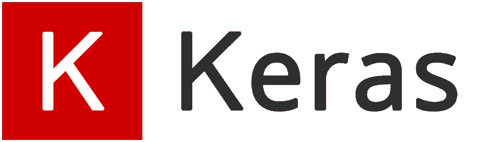

# 2020 年你必须知道的 10 大 Python 库

> 原文：<https://medium.com/edureka/python-libraries-8c943a1f742?source=collection_archive---------0----------------------->

# 十大 Python 库:

Python 是服务于各种目的的库的海洋，作为 Python 开发人员，您必须对最好的库有很好的了解。为了帮助你，这里有一篇文章向你展示了机器学习的 10 大 Python 库，它们是

*   张量流
*   sci kit-学习
*   Numpy
*   克拉斯
*   PyTorch
*   LightGBM
*   Eli5
*   SciPy
*   Theano
*   熊猫

# 介绍

Python 是最流行和使用最广泛的编程语言之一，已经取代了业界的许多编程语言。

Python 在开发人员中受欢迎有很多原因，其中之一是它拥有用户可以使用的惊人的大量库。

以下是 Python 受欢迎的几个重要原因:

*   Python 有大量的库。
*   Python 是初学者级别的编程语言，因为它简单易用。
*   从开发到部署和维护 Python 都希望他们的开发人员更有生产力。
*   可移植性是 Python 大受欢迎的另一个原因。
*   与 C、Java 和 C++相比，Python 的编程语法简单易学，而且水平很高。

因此，只有几行代码可以创建新的应用程序。

Python 的简单性吸引了许多开发人员为机器学习创建新的库。由于大量的库，Python 在机器学习专家中变得非常流行。

因此，在我们的十大 Python 库博客中，第一个库是 TensorFlow。

# **张量流**

## **什么是张量流？**

如果您目前正在从事 Python 中的机器学习项目，那么您可能听说过这个流行的开源库 TensorFlow。

这个库是由 Google 与 Brain 团队合作开发的。TensorFlow 是几乎所有谷歌机器学习应用的一部分。

TensorFlow 就像一个计算库，用于编写涉及大量张量运算的新算法，因为神经网络可以很容易地表示为计算图形，它们可以使用 TensorFlow 作为对张量的一系列运算来实现。另外，张量是代表你的数据的 N 维矩阵。

## 张量流的特征

TensorFlow 针对速度进行了优化，它利用 XLA 等技术进行快速线性代数运算。

**1。响应式结构**

使用 TensorFlow，我们可以轻松地可视化图表的每个部分，而使用 *Numpy* 或 *SciKit* 时，这不是一个选项。

**2。灵活**

Tensorflow 的一个非常重要的特性是，它的可操作性非常灵活，这意味着它具有模块化，并且您想将它的某些部分独立出来，它为您提供了这种选择。

**3。易于训练**

它很容易在 CPU 和 *GPU* 上进行分布式计算训练。

**4。并行神经网络训练**

TensorFlow 提供了流水线技术，你可以训练多个*神经网络*和多个 GPU，这使得模型在大规模系统上非常有效。

**5。大型社区**

不用说，如果它是由 Google 开发的，那么已经有一个庞大的软件工程师团队在持续改进稳定性。

**6。开源** 这个机器学习库最好的一点就是它是开源的，所以只要有互联网连接，任何人都可以使用。

## **tensor flow 的用途？**

你每天都在使用 TensorFlow，但间接使用谷歌语音搜索或谷歌照片等应用程序。以上是 TensorFlow 的应用。

TensorFlow 创建的所有库都是用 C 和 C++编写的。但是，它有一个复杂的 Python 前端。您的 Python 代码将被编译，然后在使用 C 和 C++构建的 TensorFlow 分布式执行引擎上执行。

张量流的应用数量实际上是无限的，这就是张量流的美妙之处。

因此，在这个“十大 Python 库”博客的下一篇文章中，我们有 Scikit-Learn！

# sci kit-学习

## **什么是 Scikit-learn？**

它是一个与 NumPy 和 SciPy 相关联的 Python 库。它被认为是处理复杂数据的最佳库之一。

这个图书馆正在发生许多变化。一个修改是交叉验证特性，提供了使用多个指标的能力。许多训练方法，如逻辑回归和最近邻法，都得到了一些小的改进。

## **sci kit-Learn 的特性**

**1。交叉验证:**有各种方法来检查监督模型对看不见的数据的准确性。

**2。无监督学习算法:**同样有大量的算法可供选择——从聚类、因子分析、主成分分析到无监督神经网络。

**3。特征提取:**用于从图像和文本中提取特征(如单词袋)

## **我们在哪里使用 Scikit-Learn？**

它包含许多用于实现标准机器学习和数据挖掘任务的算法，如降维、分类、回归、聚类和模型选择。

所以，在这个“十大 Python 库”博客的下一篇文章中，我们有 Numpy！

# Numpy

## **什么是 Numpy？**

Numpy 被认为是 Python 中最流行的机器学习库之一。

TensorFlow 和其他库在内部使用 Numpy 对张量执行多种操作。数组接口是 Numpy 最好也是最重要的特性。

## **Numpy 的特性**

**交互性:** Numpy 的交互性很强，很容易上手。

1.  **数学:**让复杂的数学实现变得非常简单。

**直观:**让编码变得真正简单，概念的掌握也变得容易。

**大量交互:**广泛使用，因此有大量开源贡献。

## **Numpy 的用途？**

该接口可用于将图像、声波和其他二进制原始流表示为 N 维实数数组。

为了实现这个用于机器学习的库，拥有 Numpy 的知识对于全栈开发者来说是很重要的。

所以在这个“十大 Python 库”博客的下一篇，我们有 Keras！

# 克拉斯

## **什么是 Keras？**

Keras 被认为是 Python 中最酷的机器学习库之一。它提供了一种更简单的表达神经网络的机制。Keras 还提供了一些最好的工具，用于编译模型、处理数据集、图形可视化等等。

在后端，Keras 在内部使用 Theano 或 TensorFlow。也可以使用一些最流行的神经网络，如 CNTK。与其他机器学习库相比，Keras 相对较慢。因为它通过使用后端基础设施来创建计算图，然后利用它来执行操作。Keras 的所有型号都是便携式的。

## Keras 的特点

*   在 CPU 和 GPU 上都运行流畅。
*   Keras 支持神经网络的几乎所有模型——全连接、卷积、池化、递归、嵌入等。此外，这些模型可以组合起来构建更复杂的模型。
*   Keras 本质上是模块化的，具有难以置信的表达能力、灵活性和创新研究的适应性。
*   Keras 是一个完全基于 Python 的框架，这使得它易于调试和探索。

## 我们在哪里使用 Keras？

你已经在不断地与 Keras 构建的功能进行交互——网飞、优步、Yelp、Instacart、Zocdoc、Square 和许多其他网站都在使用它。它在那些将深度学习置于产品核心的创业公司中尤其受欢迎。

Keras 包含许多常用神经网络构建模块的实现，如层、目标、激活函数、优化器和一系列工具，使处理图像和文本数据更加容易。

此外，它提供了许多预处理数据集和预训练模型，如 MNIST，VGG，盗梦空间，SqueezeNet，ResNet 等。

Keras 也是深度学习研究人员的最爱，排名第二。Keras 也被大型科学组织的研究人员采用，特别是欧洲核子研究中心和美国国家航空航天局。

因此，在这个“10 大 Python 库”博客的下一篇文章中，我们有 PyTorch！

# PyTorch

# **py torch 是什么？**

PyTorch 是最大的机器学习库，允许开发人员使用 GPU 加速执行张量计算，创建动态计算图形，并自动计算梯度。除此之外，PyTorch 还提供了丰富的 API 来解决与神经网络相关的应用问题。

这个机器学习库是基于 Torch 的，Torch 是一个用 C 实现的开源机器库，带有 Lua 中的包装器。

Python 中的这个机器库于 2017 年推出，自问世以来，该库越来越受欢迎，吸引了越来越多的机器学习开发者。

## PyTorch 的特点

**混合动力前端**

新的混合前端在渴望模式下提供易用性和灵活性，同时在 C++运行时环境中无缝过渡到图形模式以提高速度、优化和功能。

**分布式训练**

通过利用对集体操作的异步执行和可从 Python 和 C++访问的对等通信的本机支持，优化研究和生产中的性能。

**蟒蛇第一**

PyTorch 不是绑定到单一 C++框架的 Python。它被构建为深度集成到 Python 中，因此它可以与流行的库和包一起使用，如 Cython 和 Numba。

**库和工具**

一个活跃的研究人员和开发人员社区已经建立了一个丰富的工具和库生态系统，用于扩展 PyTorch 并支持从计算机视觉到强化学习等领域的开发。

## PyTorch 的应用？

PyTorch 主要用于自然语言处理等应用。

它主要是由脸书的人工智能研究小组开发的，优步用于概率编程的“Pyro”软件就是基于它开发的。

PyTorch 在多个方面优于 TensorFlow，最近几天受到了很多关注。

因此，在这个“十大 Python 库”博客的下一篇文章中，我们有 LightGBM！

# LightGBM

## **什么是 LightGBM？**

梯度推进是最好和最受欢迎的机器学习库之一，它通过使用重新定义的基本模型即决策树来帮助开发人员构建新的算法。因此，有一些特殊的库可用于快速有效地实现该方法。

这些库是 LightGBM、XGBoost 和 CatBoost。所有这些库都是帮助解决一个共同问题的竞争者，并且可以以几乎相似的方式被利用。

## LightGBM 的特点

极快的计算速度确保了高生产效率。

直观，因此使其用户友好。

比其他很多深度学习库训练速度更快。

当您考虑 NaN 值和其他规范值时，不会产生错误。

## LightGBM 有哪些应用？

这些库提供了高度可扩展、优化和快速的梯度提升实现，这使得它在机器学习开发者中很受欢迎。因为大部分机器学习全栈开发者都是用这些算法赢得了机器学习比赛。

因此，在这个“10 大 Python 库”博客的下一篇文章中，我们有 Eli5！

# Eli5

**什么是 Eli5？**

大多数情况下，机器学习模型预测的结果并不准确，而 Eli5 机器学习库内置的 Python 有助于克服这一挑战。它是一个结合了可视化和调试所有机器学习模型和跟踪所有工作步骤的一种算法。

## Eli5 的特性

此外，Eli5 还支持其他库 XGBoost、lightning、sci-kit-learn 和 sklearn-crfsuite 库。

## Eli5 有哪些应用？

需要在短时间内进行大量计算的数学应用。

在与其他 Python 包存在依赖关系的地方，Eli5 起着至关重要的作用。

遗留应用程序和在各个领域实现更新的方法。

所以，在这个“十大 Python 库”博客的下一篇文章中，我们有 SciPy！

# SciPy

## **什么是 SciPy？**

SciPy 是一个面向应用程序开发人员和工程师的机器学习库。但是，你仍然需要知道 SciPy 库和 SciPy 栈的区别。SciPy 库包含优化、线性代数、积分和统计模块。

## **SciPy 的特点**

SciPy 库的主要特点是使用 NumPy 开发，其数组最大限度地利用了 NumPy。

此外，SciPy 提供了所有高效的数值例程，如优化、数值积分和许多其他使用其特定子模块的例程。

SciPy 的所有子模块中的所有函数都有很好的文档记录。

## **SciPy 的应用？**

SciPy 是一个使用 NumPy 来求解数学函数的库。SciPy 使用 NumPy 数组作为基本数据结构，并附带了用于科学编程中各种常用任务的模块。

包括线性代数、积分(微积分)、常微分方程求解和信号处理在内的任务可以通过 SciPy 轻松执行。

所以，在这个“10 大 Python 库”博客的下一篇文章中，我们有答案！

# Theano

## **什么是 Theano？**

Theano 是 Python 中的一个计算框架机器学习库，用于计算多维数组。Theano 的工作方式类似于 TensorFlow，但效率不如 TensorFlow。因为它无法适应生产环境。

此外，与 TensorFlow 类似，Theano 也可以用在分布式或并行环境中。

**数字地图的特征**

*   **与 NumPy 的紧密集成** —能够在非编译函数中使用完整的 NumPy 数组。
*   **GPU 的透明使用** —执行数据密集型计算比在 CPU 上快得多。
*   **有效的符号微分**——对具有一个或多个输入的函数求导。
*   **速度和稳定性优化**——即使`x`非常小，也能得到`log(1+x)`的正确答案。这仅仅是显示该算法稳定性的一个例子。
*   **动态 C 代码生成** —比以往任何时候都更快地计算表达式，从而大大提高了效率。
*   **广泛的单元测试和自我验证** —检测和诊断模型中多种类型的错误和歧义。

## **我们在哪里使用了 Theano？**

Theano 表达式的实际语法是符号化的，对于习惯于普通软件开发的初学者来说，这可能会令人不快。具体来说，表达式在抽象意义上被定义，被编译，然后实际上被用来进行计算。

它专门处理深度学习中大型神经网络算法的计算类型。它是第一批同类库之一(开发始于 2007 年)，是深度学习研究和开发的行业标准。

Theano 是当今多个神经网络项目的强项，其受欢迎程度只会随着时间的推移而增长。

最后，在这个“十大 Python 库”博客上，我们有熊猫！

# **熊猫**

## **什么是熊猫？**

Pandas 是 Python 中的一个机器学习库，它提供了高级的数据结构和各种各样的分析工具。这个库最大的特点之一是能够使用一两个命令翻译复杂的数据操作。Pandas 有许多用于分组、组合数据和过滤的内置方法，以及时间序列功能。

## **熊猫的特征**

熊猫确保操纵数据的整个过程将变得更加容易。对诸如重新索引、迭代、排序、聚合、连接和可视化等操作的支持是 Pandas 的亮点。

## **熊猫的应用？**

目前，包含数百个新特性、错误修复、增强和 API 变化的 pandas 库的发行版较少。pandas 中的改进涉及到对数据进行分组和排序的能力，为 apply 方法选择最适合的输出，以及为执行定制类型操作提供支持。

当涉及到熊猫的使用时，数据分析是重中之重。但是，当与其他库和工具一起使用时，Pandas 确保了高功能性和良好的灵活性。

如果你想查看更多关于人工智能、DevOps、道德黑客等市场最热门技术的文章，你可以参考 Edureka 的官方网站。

请留意本系列中的其他文章，它们将解释 Python 和数据科学的各个方面。

> *1。*[*Python 中的机器学习分类器*](/edureka/machine-learning-classifier-c02fbd8400c9)
> 
> *2。*[*Python Scikit-Learn Cheat Sheet*](/edureka/python-scikit-learn-cheat-sheet-9786382be9f5)
> 
> *3。* [*机器学习工具*](/edureka/python-libraries-for-data-science-and-machine-learning-1c502744f277)
> 
> *4。* [*用于数据科学和机器学习的 Python 库*](/edureka/python-libraries-for-data-science-and-machine-learning-1c502744f277)
> 
> *5。*[*Python 中的聊天机器人*](/edureka/how-to-make-a-chatbot-in-python-b68fd390b219)
> 
> *6。* [*Python 集合*](/edureka/collections-in-python-d0bc0ed8d938)
> 
> *7。* [*Python 模块*](/edureka/python-modules-abb0145a5963)
> 
> *8。* [*Python 开发者技能*](/edureka/python-developer-skills-371583a69be1)
> 
> *9。* [*哎呀面试问答*](/edureka/oops-interview-questions-621fc922cdf4)
> 
> *10。*[*Python 开发者简历*](/edureka/python-developer-resume-ded7799b4389)
> 
> *11。*[*Python 中的探索性数据分析*](/edureka/exploratory-data-analysis-in-python-3ee69362a46e)
> 
> *12。* [*蛇与蟒蛇的游戏*](/edureka/python-turtle-module-361816449390)
> 
> *13。* [*Python 开发者工资*](/edureka/python-developer-salary-ba2eff6a502e)
> 
> *14。* [*主成分分析*](/edureka/principal-component-analysis-69d7a4babc96)
> 
> *15。*[*Python vs c++*](/edureka/python-vs-cpp-c3ffbea01eec)
> 
> 16。 [*刺儿头教程*](/edureka/scrapy-tutorial-5584517658fb)
> 
> 17。[*Python SciPy*](/edureka/scipy-tutorial-38723361ba4b)
> 
> 18。 [*最小二乘回归法*](/edureka/least-square-regression-40b59cca8ea7)
> 
> *19。* [*Jupyter 笔记本小抄*](/edureka/jupyter-notebook-cheat-sheet-88f60d1aca7)
> 
> 20。 [*Python 基础知识*](/edureka/python-basics-f371d7fc0054)
> 
> *21。* [*Python 模式程序*](/edureka/python-pattern-programs-75e1e764a42f)
> 
> *二十二。* [*用 Python 进行网页抓取*](/edureka/web-scraping-with-python-d9e6506007bf)
> 
> *23。* [*Python 装饰器*](/edureka/python-decorator-tutorial-bf7b21278564)
> 
> *24。*[*Python Spyder IDE*](/edureka/spyder-ide-2a91caac4e46)
> 
> *25。*[*Python 中使用 Kivy 的移动应用*](/edureka/kivy-tutorial-9a0f02fe53f5)
> 
> *26。* [*十大最佳学习书籍&练习 Python*](/edureka/best-books-for-python-11137561beb7)
> 
> *27。* [*机器人框架与 Python*](/edureka/robot-framework-tutorial-f8a75ab23cfd)
> 
> *28。*[*Python 中的贪吃蛇游戏*](/edureka/snake-game-with-pygame-497f1683eeaa)
> 
> *29。* [*Django 面试问答*](/edureka/django-interview-questions-a4df7bfeb7e8)
> 
> 三十。 [*十大 Python 应用*](/edureka/python-applications-18b780d64f3b)
> 
> *31。*[*Python 中的哈希表和哈希表*](/edureka/hash-tables-and-hashmaps-in-python-3bd7fc1b00b4)
> 
> *32。*[*Python 3.8*](/edureka/whats-new-python-3-8-7d52cda747b)
> 
> *33。* [*支持向量机*](/edureka/support-vector-machine-in-python-539dca55c26a)
> 
> *34。* [*Python 教程*](/edureka/python-tutorial-be1b3d015745)

*原载于 2018 年 12 月 17 日*[*【https://www.edureka.co】*](https://www.edureka.co/blog/python-libraries/)*。*