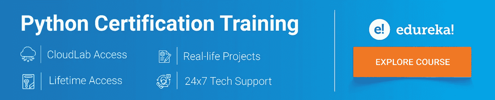
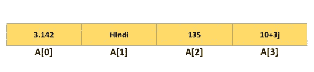

# 如何在 Python 中求 List 的长度？

> 原文：<https://medium.com/edureka/python-list-length-257aa17f13f1?source=collection_archive---------0----------------------->



Python 中的列表是一种有序且可变的集合数据类型。列表也可以有重复的条目。Python len()方法用于查找任何对象的长度。在本文中，我们将学习如何按照以下顺序在 python 中查找列表的长度:

1.  Python 中的列表
2.  如何在 Python 中求 List 的长度？

*   Len()方法
*   朴素方法

# Python 中的列表

Python 中实现了一个列表来存储各种类型数据的序列。然而，Python 中有六种能够存储序列的数据类型，但最常见和最可靠的类型是列表。



列表被定义为不同类型的值或项目的集合。列表中的项目用逗号(，)分隔，并用方括号[]括起来。

其定义如下:

```
list1 **=** ['edureka', 'python', 2019];
list2 **=** [1, 2, 3, 4, 5 ];
list3 **=** ["a", "b", "c", "d"];
```

# 如何在 Python 中求 List 的长度？

在 Python 中，有两种最常用的基本方法用于查找列表的长度:

*   Len()方法
*   朴素方法

## Len()方法

有一个名为 len()的内置函数，用于获取列表、元组、数组、字典等中的项目总数。len()方法接受一个参数，您可以在其中提供一个列表，它返回给定列表的长度。

len()方法是 Python 中查找列表长度最常用和最方便的方法之一。这是当今所有程序员采用的最常规的技术。

**语法:**

```
len(list)
```

List 参数是一个要计算元素个数的列表。它返回列表中元素的数量。

**举例:**

```
ListName = ["Hello", "Edureka", 1, 2, 3]
print ("Number of items in the list = ", len(ListName))
```

**输出:** 5

## 朴素方法

len()方法是 Python 中查找列表长度最常用的方法。但是有另一个基本方法可以提供列表的长度。

在朴素方法中，只需运行一个循环并增加计数器，直到列表的最后一个元素知道它的计数。这是在没有其他有效技术的情况下可以使用的最基本的策略。

**举例:**

```
ListName **=** [ "Hello", "Edureka", 1,2,3 ]
print ("The list is : " **+** str(ListName))
counter **=** 0
**for** i **in** ListName:
counter **=** counter **+** 1
print ("Length of list using naive method is : " **+** str(counter))
```

**输出:**

```
The list is : ["Hello", "Edureka", 1,2,3]
Length of list using naive method is : 5
```

这一切都是为了在 Python 中找到列表的长度。len()方法是最常用的方法。然而，您也可以使用基本的方法，在朴素方法的帮助下找到长度。

说到这里，我们的文章就到此为止了。如果你想查看更多关于人工智能、DevOps、道德黑客等市场最热门技术的文章，那么你可以参考 [Edureka 的官方网站。](https://www.edureka.co/blog/?utm_source=medium&utm_medium=content-link&utm_campaign=python-list-length)

请留意本系列中的其他文章，它们将解释 Python 和数据科学的各个方面。

> *1。*[*Python 中的机器学习分类器*](/edureka/machine-learning-classifier-c02fbd8400c9)
> 
> *2。*[*Python Scikit-Learn Cheat Sheet*](/edureka/python-scikit-learn-cheat-sheet-9786382be9f5)
> 
> *3。* [*机器学习工具*](/edureka/python-libraries-for-data-science-and-machine-learning-1c502744f277)
> 
> *4。* [*用于数据科学和机器学习的 Python 库*](/edureka/python-libraries-for-data-science-and-machine-learning-1c502744f277)
> 
> *5。*[*Python 中的聊天机器人*](/edureka/how-to-make-a-chatbot-in-python-b68fd390b219)
> 
> *6。* [*Python 集合*](/edureka/collections-in-python-d0bc0ed8d938)
> 
> *7。* [*Python 模块*](/edureka/python-modules-abb0145a5963)
> 
> *8。* [*Python 开发者技能*](/edureka/python-developer-skills-371583a69be1)
> 
> *9。* [*哎呀面试问答*](/edureka/oops-interview-questions-621fc922cdf4)
> 
> *10。* [*一个 Python 开发者的简历*](/edureka/python-developer-resume-ded7799b4389)
> 
> *11。*[*Python 中的探索性数据分析*](/edureka/exploratory-data-analysis-in-python-3ee69362a46e)
> 
> *12。* [*蛇与蟒蛇的游戏*](/edureka/python-turtle-module-361816449390)
> 
> *13。* [*Python 开发者工资*](/edureka/python-developer-salary-ba2eff6a502e)
> 
> *14。* [*主成分分析*](/edureka/principal-component-analysis-69d7a4babc96)
> 
> *15。*[*Python vs c++*](/edureka/python-vs-cpp-c3ffbea01eec)
> 
> *16。* [*刺儿头教程*](/edureka/scrapy-tutorial-5584517658fb)
> 
> *17。*[*Python SciPy*](/edureka/scipy-tutorial-38723361ba4b)
> 
> *18。* [*最小二乘回归法*](/edureka/least-square-regression-40b59cca8ea7)
> 
> *19。* [*Jupyter 笔记本小抄*](/edureka/jupyter-notebook-cheat-sheet-88f60d1aca7)
> 
> 20。 [*Python 基础知识*](/edureka/python-basics-f371d7fc0054)
> 
> *21。* [*Python 模式程序*](/edureka/python-pattern-programs-75e1e764a42f)
> 
> *22。*[*Python 中的*](/edureka/generators-in-python-258f21e3d3ff) 发电机
> 
> 23。 [*Python 装饰器*](/edureka/python-decorator-tutorial-bf7b21278564)
> 
> *二十四。*[*Python Spyder IDE*](/edureka/spyder-ide-2a91caac4e46)
> 
> *二十五。*[*Python 中使用 Kivy 的移动应用*](/edureka/kivy-tutorial-9a0f02fe53f5)
> 
> *26。* [*十大最佳学习书籍&练习 Python*](/edureka/best-books-for-python-11137561beb7)
> 
> *27。* [*机器人框架与 Python*](/edureka/robot-framework-tutorial-f8a75ab23cfd)
> 
> *28。*[*Python 中的贪吃蛇游戏*](/edureka/snake-game-with-pygame-497f1683eeaa)
> 
> *29。* [*Django 面试问答*](/edureka/django-interview-questions-a4df7bfeb7e8)
> 
> *30。*[*Python 中的套接字编程是什么*](/edureka/socket-programming-python-bbac2d423bf9)
> 
> *31。*[*Python 中的哈希表和哈希表*](/edureka/hash-tables-and-hashmaps-in-python-3bd7fc1b00b4)
> 
> *32。*[*Python 3.8*](/edureka/whats-new-python-3-8-7d52cda747b)
> 
> *33。* [*支持向量机*](/edureka/support-vector-machine-in-python-539dca55c26a)
> 
> *34。* [*Python 教程*](/edureka/python-tutorial-be1b3d015745)

*原载于 2019 年 10 月 9 日*[*https://www.edureka.co*](https://www.edureka.co/blog/python-list-length/)*。*