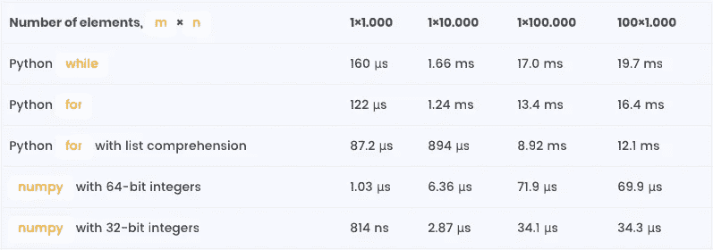

# Python 循环比较和性能测试

> 原文：<https://medium.com/duomly-blockchain-online-courses/python-loops-comparison-and-performance-testing-9240e7589b82?source=collection_archive---------3----------------------->


[Duomly — programming courses online](https://www.duomly.com)

本文最初发表于:[https://www . blog . duomly . com/loops-in-python-comparison-and-performance/](https://www.blog.duomly.com/loops-in-python-comparison-and-performance/)

Python 是当今最流行的编程语言之一。它是一种解释型的高级语言，语法优雅易读。然而，Python 通常比 Java、C#、尤其是 C、C++或 Fortran 慢得多。有时，性能问题和瓶颈可能会严重影响应用程序的可用性。

幸运的是，在大多数情况下，都有提高 Python 程序性能的解决方案。开发人员可以选择提高他们代码的速度。例如，一般的建议是使用优化的 Python 内置或第三方例程，通常用 C 或 Cython 编写。此外，使用局部变量比使用全局变量更快，所以在循环之前将全局变量复制到局部变量是一个好习惯。诸如此类。

最后，总是有可能用 C、C++或 Cython 编写自己的 Python 函数，从应用程序调用它们并替换 Python 瓶颈例程。但这通常是一种极端的解决方案，实践中很少需要。

使用 Python 循环时经常会出现性能问题，尤其是在大量迭代的情况下。有许多有用的技巧可以改进您的代码并使其运行得更快，但这超出了本文的范围。

本文比较了几种方法在对两个序列按元素求和时的性能:

*   使用 while 循环
*   使用 for 循环
*   对列表理解使用 for 循环
*   使用第三方库编号

然而，性能并不是开发软件时唯一关心的问题。此外，根据 Donald Knuth 在《计算机编程艺术》中的观点，“过早优化是编程中所有罪恶(或者至少是大部分罪恶)的根源”。毕竟，正如蒂姆·彼得斯在《Python 之禅》中所言，“可读性很重要”。

# 问题陈述

我们将尝试对两个序列进行元素求和。换句话说，我们将获得两个相同大小的序列(列表或数组),并创建第三个序列，其中的元素是通过将输入中的相应元素相加而获得的。

# 准备

我们将导入 Python 内置的包 random，并生成一个包含 100，000 个伪随机数(从 0 到 99，包括 0 和 99)的列表 r:

```
import random
r = [random.randrange(100) for _ in range(100_000)]
```

我们还将使用第三方包 numpy，所以让我们导入它:

```
import numpy as np
```

我们准备好出发了！

# 简单循环

让我们首先看看一些简单的 Python 循环。

**使用纯 Python**

我们将从两个各有 1000 个元素的列表开始。整数变量 n 表示每个列表的长度。通过从 r 中随机选择 n 个元素来获得列表 x 和 y:

```
n = 1_000
x, y = random.sample(r, n), random.sample(r, n)
```

我们来看看得到一个有 n 个元素的新列表 z 需要多少时间，每个元素都是来自 x 和 y 的对应元素之和。

我们将首先测试 while 循环的性能:

```
%%timeit
i, z = 0, []
while i < n:
    z.append(x[i] + y[i])
    i += 1
```

输出是:

每圈 160 秒±1.44 秒(平均标准偏差戴夫。7 次运行，每次 10000 个循环)

请注意，timeit 的输出取决于许多因素，每次都可能不同。

Python 中的 for 循环更适合这种情况，即遍历集合、迭代器、生成器等等。让我们看看它是如何工作的:

```
%%timeit
z = []
for i in range(n):
    z.append(x[i] + y[i])
```

输出是:

**每圈 122 s 188 ns(平均标准偏差。戴夫。7 次运行，每次 10000 个循环)**

在这种情况下，与 while 相比，for 循环更快，但也更优雅。

列表理解非常类似于普通的 for 循环。它们适用于简单的案例(比如这个)。除了更紧凑之外，它们通常还会稍微快一些，因为减少了一些开销:

```
%%timeit
z = [x[i] + y[i] for i in range(n)
```

输出是:

**每圈 87.2 秒 490 纳秒(平均标准差。戴夫。7 次运行，每次 10000 个循环)**

请记住，当你需要循环时，你不能在所有情况下都应用列表理解。一些更复杂的情况需要普通的 for 甚至 while 循环。

**使用 Python 和 NumPy**

numpy 是一个第三方 Python 库，通常用于数值计算。特别适合操作数组。它提供了许多有用的例程来处理数组，但也允许编写紧凑而优雅的代码，而没有循环。

实际上，循环以及其他对性能至关重要的操作都是在底层的 numpy 中实现的。这使得 numpy 例程比纯 Python 代码快得多。另一个优势是 numpy 处理变量和类型的方式。

让我们首先使用 Python 整数 x 和 y 的列表来创建相应的 64 位整数的 numpy 数组:

```
x_, y_ = np.array(x, dtype=np.int64), np.array(y, dtype=np.int64)
```

按元素对两个 numpy 数组 x_ 和 y_ 求和就像 x_ + y_ 一样简单。但是让我们检查一下性能:

```
%%timeit
z = x_ + y_
```

输出是:

**每循环 1.03 秒±5.09 纳秒(平均标准偏差。戴夫。7 次运行，每次 1000000 个循环)**

这几乎比我们使用列表理解时快了 85 倍。而且代码极其简单优雅。numpy 数组是处理大型数组的更好选择。数据越大，性能优势通常越大。

可能会更好。如果我们同意使用 32 位整数而不是 64 位整数，在某些情况下，我们可以节省内存和时间:

```
x_, y_ = np.array(x, dtype=np.int32), np.array(y, dtype=np.int32)
```

我们可以像以前一样添加这两个数组:

```
%%timeit
z = x_ + y_
```

输出是:

**每环路 814 纳秒±5.8 纳秒(平均标准偏差戴夫。7 次运行，每次 1000000 个循环)**

当 n 较大，即 10_000 和 100_000 时获得的结果如下表所示。它们显示了相同的关系，在这种情况下，使用 numpy 时性能会有更大的提升。

# 嵌套循环

现在让我们比较一下嵌套的 Python 循环。

**使用纯 Python**

我们将再次使用两个名为 x 和 y 的列表。它们中的每一个将包含 100 个具有 1.000 个伪随机整数元素的内部列表。因此，x 和 y 实际上将表示具有 100 行和 1.000 列的矩阵:

```
m, n = 100, 1_000
x = [random.sample(r, n) for _ in range(m)]
y = [random.sample(r, n) for _ in range(m)]
```

让我们看看使用两个嵌套的 while 循环添加它们的性能:

```
%%timeit
i, z = 0, []
while i < m:
    j, z_ = 0, []
    while j < n:
        z_.append(x[i][j] + y[i][j])
        j += 1
    z.append(z_)
    i += 1
```

输出是:

每圈 19.7 毫秒 271 秒(平均标准时间戴夫。7 次运行，每次 100 个循环)
同样，我们可以通过嵌套 for 循环获得一些性能提升:

```
%%timeit
z = []
for i in range(m):
    z_ = []
    for j in range(n):
         z_.append(x[i][j] + y[i][j])
    z.append(z_)
```

输出是:

**每循环 16.4 毫秒 303 秒(平均标准时间戴夫。7 次运行，每次 100 个循环)**
在某些情况下，嵌套的 for 循环可以与 lists comprehensions 一起使用，这带来了一个额外的好处:

```
%%timeit
z = [[x[i][j] + y[i][j] for j in range(n)] for i in range(m)]
```

输出是:

**每循环 12.1 毫秒 99.4 秒(平均标准时间戴夫。7 次运行，每次 100 个循环)**

我们可以看到，在嵌套循环的情况下，列表理解比普通 for 循环更快，而 for 循环比 while 循环更快。

在这种情况下，每个列表中有 100.000 (100×1.000)个整数元素。这个例子比有 100.000 个元素和一个循环的例子稍慢。这是所有三种方法(列表理解、普通 for 和 while 循环)的结论。

**使用 Python 和 NumPy**

numpy 非常适合处理多维数组。让我们使用 x 和 y 来创建相应的 64 位整数 numpy 数组:

```
x_, y_ = np.array(x, dtype=np.int64), np.array(y, dtype=np.int64)
```

让我们来看看性能:

```
%%timeit
z = x_ + y_
```

输出是:

**每循环 69.9 秒 909 纳秒(平均标准偏差戴夫。7 次运行，每次循环 10000 次)**
这比列表理解快 173 倍。但如果我们使用 32 位整数，速度可能会更快:

```
x_, y_ = np.array(x, dtype=np.int32), np.array(y, dtype=np.int32)
```

性能检查如前所述:

```
%%timeit
z = x_ + y_
```

输出是:

**每循环 34.3 秒 44.6 纳秒(平均标准偏差。戴夫。7 次运行，每次 10000 个循环)**
比 64 位整数快两倍。

# 结果摘要

下表总结了获得的结果:



[Duomly — programming online courses](https://www.duomly.com)

# 结论

本文比较了 Python 循环在元素级添加两个列表或数组时的性能。结果表明，列表理解比普通 for 循环快，而 for 循环又比 while 循环快。在这三种情况下，简单循环都比嵌套循环略快。

numpy 提供的例程和操作符可以大大减少代码量，提高执行速度。这在处理一维或多维数组时特别有用。

请记住，这里得到的结论或结果之间的关系并不是在所有情况下都适用、有效或有用的！它们是用于说明的。处理低效率的正确方法是发现瓶颈并执行自己的测试。


[Duomly — programming online courses](https://www.duomly.com)

感谢您的阅读。

本文由我们的队友米尔科提供。