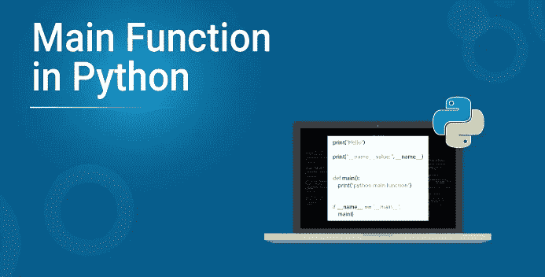
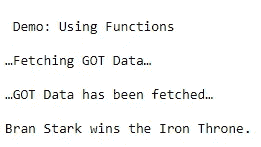
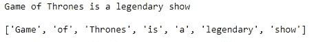
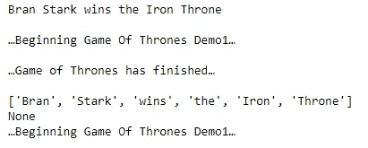
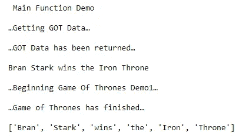

# Python 中的 Main 函数以及如何使用？

> 原文：<https://medium.com/edureka/python-main-function-1efc46766422?source=collection_archive---------0----------------------->



Python 是最受欢迎的编程语言之一。Python 中的 main 函数充当任何程序的执行点。在 Python 编程中定义 main 函数是开始执行程序的必要条件，因为它只有在程序直接运行时才会执行，而在作为模块导入时不会执行。

为了更好地理解 python main 函数，让我们来看看我将在本文中涉及的主题:

*   **什么是 Python 函数？**
*   **Python 中的主函数**
*   **一个基本的 Python main()**
*   **Python 执行模式**

让我们开始吧。

# 什么是 Python 函数？

函数是一个可重用的代码块，它构成了在编程语言中执行操作的基础。它们被用来对输入数据执行计算，并将输出呈现给最终用户。

我们已经知道，函数是为执行特定任务而编写的一段代码。Python 中有三种类型的函数，即内置函数、用户定义函数和匿名函数。现在，main 函数就像 Python 中的其他函数一样。

那么我们来了解一下 Python 中的主函数到底是什么？

# Python 中的主函数

在大多数编程语言中，有一个特殊的函数，每次程序运行时都会自动执行。这就是 main 函数，或者通常所说的 main()。它本质上是一个程序执行的起点。

在 Python 中，没有必要在每次编写程序时都定义 main 函数。这是因为 Python 解释器从文件的顶部开始执行，除非定义了特定的函数。因此，为 Python 程序的执行定义一个起点有助于更好地理解程序的工作方式。

# 基本的 Python main()

在大多数 Python 程序/脚本中，您可能会看到一个函数定义，后跟一个条件语句，如下例所示:

```
def main():
    print("Hello, World!") 
    if __name__== "__main__" :
main()
```

在上面的例子中，你可以看到，有一个名为' main()'的函数。随后是条件“if”语句，该语句检查 **__name__** 的值，并将其与字符串“ **__main__** ”进行比较。当评估为真时，它执行 main()。

在执行时，它打印“你好，世界！”。

当您处理要作为 Python 脚本执行和/或要导入到其他模块中的文件时，这种代码模式非常常见。

让我们来理解这段代码是如何执行的。在此之前，非常有必要了解一下，Python 解释器根据代码执行的方式来设置 **__name__** 。所以，让我们学习一下 Python 中的执行模式

# Python 执行模式

有两种主要方法可以让 Python 解释器执行代码:

*   最常见的方法是将文件作为 Python 脚本执行。
*   通过将必要的代码从一个 Python 文件导入到另一个文件。

无论选择哪种执行模式，Python 都定义了一个名为 **__name__** 的特殊变量，其中包含一个字符串。正如我之前所说，这个字符串的值取决于代码是如何执行的。

有时，当您从一个模块导入时，您会想知道某个特定模块的函数是否被用作导入，或者您是否只是使用原始函数。模块 py ( Python 脚本)文件。

为了帮助解决这个问题，Python 有一个特殊的内置变量，叫做 **__name__** 。根据您运行或执行脚本的方式，此变量被赋予字符串“ **__main__** ”。

所以，如果你是直接运行脚本，Python 就要把“ **__main__** ”赋值给 **__name__** ，即**_ _ name _ _**=“_ _ main _ _”。(这是后台发生的)。

因此，您最终将编写条件 if 语句，如下所示:

```
if __name__ == "__main__" :
          Logic Statements
```

因此，如果条件语句的计算结果为 True，则意味着。py (Python 脚本)文件正在运行或直接执行。

理解这一点很重要，如果您直接在 Python shell 或终端上运行某些东西，默认情况下，这个条件语句恰好为真。

结果就是程序员把所有必要的函数定义都写在上面，最后在最后写这个语句，来组织代码。

简而言之， **__name__** 变量帮助您检查文件是直接运行还是已经导入。

在编写具有主要功能的程序时，有几件事你应该记住。我把它们分成了四个简单的步骤。在编写包含 main 函数的 Python 程序时，您可以将这视为一个很好的术语。

## ***尽可能使用函数和类。***

很长时间以来，我们一直在学习面向对象编程的概念及其优势。将批量逻辑代码放在紧凑的函数或类中是绝对必要的。为什么？为了更好的代码可重用性、更好的理解和整体代码优化。这样，您就可以控制代码的执行，而不是让 Python 解释器一导入模块就执行代码。

让我们看看下面这段代码:

```
def get_got():
print("...Fetching GOT Data... n")
data="Bran Stark wins the Iron Throne. n"
print("...GOT Data has been fetched...n")
return data print("n Demo: Using Functions n")
got=get_got()
print(got)
```

在上面的例子中，我定义了一个名为“ **get_got** 的函数，它返回存储在变量“data”中的字符串。然后将它存储在名为“got”的变量中，然后打印出来。我写下了下面的输出:



## 使用 __name__ 来控制代码的执行。

现在你知道什么是 **__name__** 变量，如何以及为什么使用它。让我们看看下面的代码片段:

```
if __name__ == "__main__":
            got = "Game of Thrones is a legendary shown"
            print(got)
            new_got = str.split(got)
            print(new_got)
```

在上面的例子中，条件 if 语句将要比较变量 **__name__** 与字符串“ **__main__** ”的值。当且仅当计算结果为真时，执行下一组逻辑语句。因为我们直接运行程序，我们知道条件语句将为真。因此，语句被执行，我们得到期望的输出。这样，我们就可以使用 **__name__** 变量来控制你的代码的执行。您可以参考下面显示的输出:



## **创建一个函数 main()，其中包含要运行的代码。**

至此，您已经了解了执行 Python 代码的各种方式。您还知道为什么以及何时使用 main()函数。现在是应用它的时候了。请看下面这段代码:

```
print("n Main Function Demo n")
      def demo(got):
           print("...Beginning Game Of Thrones...n")
           new_got = str.split(got)
           print("...Game of Thrones has finished...n")
           return new_got 
     def main():
         got= "n Bran Stark wins the Iron Throne n"
         print(got)
         new_got = demo(got)
         print(new_got) 
if __name__ == "__main__":
main()
```

在上面的例子中，我已经使用了 main()的定义，它包含了我想要运行的程序逻辑。我还定义了一个名为“demo”的函数，以包含一段代码，必要时可以重复使用。此外，我已经更改了条件块，这样，它执行 main()。

这样，我把我要运行的代码放在 main()内，把编程逻辑放在一个名为' demo '的函数内，并在条件块内调用 main()。我已经吸收了代码的输出，并写在下面供您参考:



注意:如果您将这段代码作为脚本运行或者导入它，输出将是相同的。您可能会看到下面的输出:

## **从 main()调用其他函数。**

当您编写成熟的 Python 程序时，可以调用和使用许多函数。通常情况下，一些函数应该在程序开始执行时就被调用。因此，从 main()本身调用其他函数总是好的。

让我们看看下面的代码片段:

```
print("n Main Function Demo n")
     def demo(got):
         print("...Beginning Game Of Thrones Demo1...n")
         new_got = str.split(got)
         print("...Game of Thrones has finished...n")
         return new_got 
    def getgot():
         print("...Getting GOT Data...n")
         got="Bran Stark wins the Iron Throne n"
         print("...GOT Data has been returned...n")
         return got
   def main():
         got= getgot()
         print(got)
         new_got = demo(got)
         print(new_got)
         if __name__ == "__main__":
          main()
```

在上面的例子中，我定义了一个名为“ **getgot()** ”的函数来获取数据。并且这个函数是从 **main()** 本身内部调用的。

因此，从 **main()** 中调用其他函数来将更小的子任务组成整个任务总是好的，这些子任务可以独立执行。我还在下面的部分分享了上面代码的输出:



我希望您能够通读这篇文章，并对 Python 中的 main()函数及其用法有一个合理的理解。借助 Python 中的 **main()** 函数，我们可以在需要时执行大量功能，并控制执行流程。

如果你想查看更多关于人工智能、DevOps、道德黑客等市场最热门技术的文章，你可以参考 Edureka 的官方网站。

请留意本系列中的其他文章，它们将解释 Python 和数据科学的各个方面。

> *1。*[*Python 中的机器学习分类器*](/edureka/machine-learning-classifier-c02fbd8400c9)
> 
> *2。*[*Python Scikit-Learn Cheat Sheet*](/edureka/python-scikit-learn-cheat-sheet-9786382be9f5)
> 
> *3。* [*机器学习工具*](/edureka/python-libraries-for-data-science-and-machine-learning-1c502744f277)
> 
> *4。* [*用于数据科学和机器学习的 Python 库*](/edureka/python-libraries-for-data-science-and-machine-learning-1c502744f277)
> 
> *5。*[*Python 中的聊天机器人*](/edureka/how-to-make-a-chatbot-in-python-b68fd390b219)
> 
> *6。* [*Python 集合*](/edureka/collections-in-python-d0bc0ed8d938)
> 
> *7。* [*Python 模块*](/edureka/python-modules-abb0145a5963)
> 
> *8。* [*Python 开发者技能*](/edureka/python-developer-skills-371583a69be1)
> 
> *9。* [*哎呀面试问答*](/edureka/oops-interview-questions-621fc922cdf4)
> 
> *10。*[*Python 开发者简历*](/edureka/python-developer-resume-ded7799b4389)
> 
> *11。*[*Python 中的探索性数据分析*](/edureka/exploratory-data-analysis-in-python-3ee69362a46e)
> 
> *12。* [*蛇与蟒蛇的游戏*](/edureka/python-turtle-module-361816449390)
> 
> *13。* [*Python 开发者工资*](/edureka/python-developer-salary-ba2eff6a502e)
> 
> *14。* [*主成分分析*](/edureka/principal-component-analysis-69d7a4babc96)
> 
> *15。*[*Python vs c++*](/edureka/python-vs-cpp-c3ffbea01eec)
> 
> 16。 [*刺儿头教程*](/edureka/scrapy-tutorial-5584517658fb)
> 
> 17。[*Python SciPy*](/edureka/scipy-tutorial-38723361ba4b)
> 
> 18。 [*最小二乘回归法*](/edureka/least-square-regression-40b59cca8ea7)
> 
> *19。* [*Jupyter 笔记本小抄*](/edureka/jupyter-notebook-cheat-sheet-88f60d1aca7)
> 
> 20。 [*Python 基础知识*](/edureka/python-basics-f371d7fc0054)
> 
> *21。* [*Python 模式程序*](/edureka/python-pattern-programs-75e1e764a42f)
> 
> *二十二。* [*用 Python 进行网页抓取*](/edureka/web-scraping-with-python-d9e6506007bf)
> 
> *23。* [*Python 装饰器*](/edureka/python-decorator-tutorial-bf7b21278564)
> 
> *24。*[*Python Spyder IDE*](/edureka/spyder-ide-2a91caac4e46)
> 
> *25。*[*Python 中使用 Kivy 的移动应用*](/edureka/kivy-tutorial-9a0f02fe53f5)
> 
> *26。* [*十大最佳学习书籍&练习 Python*](/edureka/best-books-for-python-11137561beb7)
> 
> *27。* [*机器人框架与 Python*](/edureka/robot-framework-tutorial-f8a75ab23cfd)
> 
> *28。*[*Python 中的贪吃蛇游戏*](/edureka/snake-game-with-pygame-497f1683eeaa)
> 
> *29。* [*Django 面试问答*](/edureka/django-interview-questions-a4df7bfeb7e8)
> 
> 三十。 [*十大 Python 应用*](/edureka/python-applications-18b780d64f3b)
> 
> *31。*[*Python 中的哈希表和哈希表*](/edureka/hash-tables-and-hashmaps-in-python-3bd7fc1b00b4)
> 
> *32。*[*Python 3.8*](/edureka/whats-new-python-3-8-7d52cda747b)
> 
> *33。* [*支持向量机*](/edureka/support-vector-machine-in-python-539dca55c26a)
> 
> *34。* [*Python 教程*](/edureka/python-tutorial-be1b3d015745)

*原载于 2019 年 6 月 6 日*[*【https://www.edureka.co】*](https://www.edureka.co/blog/python-main-function/)*。*