# Python Matplotlib 指南——通过示例学习 Matplotlib 库

> 原文：<https://medium.com/edureka/python-matplotlib-tutorial-15d148a7bfee?source=collection_archive---------3----------------------->

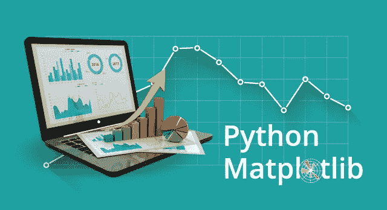

在我之前的博客中，我讨论了一个叫做 ***python NumPy*** 的 Python 数值库。在这篇博客中，我将谈论另一个库， **Python Matplotlib** 。matplotlib.pyplot 是一个用于 2D 图形的 python 包。以下是我将涉及 python matplotlib 所有主题的顺序:

*   什么是 Python Matplotlib？
*   图的类型
    –条形图
    –直方图
    –散点图
    –面积图
    –饼图
*   使用多个图

# 什么是 Python Matplotlib？

**matplotlib.pyplot** 是 *python 编程语言*中用于 2D 图形的绘图库。它可以用于 python 脚本、shell、web 应用服务器和其他图形用户界面工具包。

有几个工具包可用于扩展 python matplotlib 功能。其中一些是单独下载的，另一些可以随 matplotlib 源代码一起提供，但有外部依赖性。

*   **底图**:这是一个地图绘制工具包，有各种地图投影、海岸线和政治边界。
*   **Cartopy** :这是一个映射库，具有面向对象的地图投影定义，以及任意点、线、多边形和图像转换能力。
*   **Excel 工具** : Matplotlib 提供了与微软 Excel 交换数据的工具。
*   **Mplot3d** :用于三维绘图。
*   **NAT grid**:NAT grid 库的接口，用于空间数据的不规则网格化。

接下来，让我们继续这篇博客，探索 python matplotlib 中可用的不同类型的绘图。

# 地块类型

使用 python matplotlib 可以创建各种绘图。其中一些列举如下:

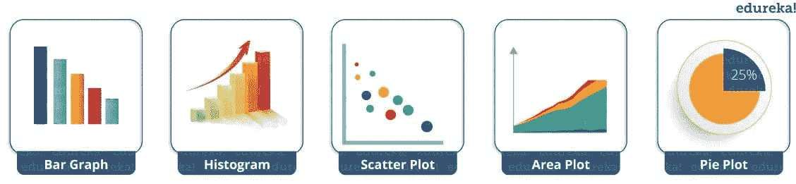

我将详细演示它们中的每一个。

但在此之前，让我向您展示 python matplotlib 中非常基本的代码，以便生成一个简单的图形。

```
from matplotlib import pyplot as plt
 #Plotting to our canvas
 plt.plot([1,2,3],[4,5,1])
 #Showing what we plotted
 plt.show()
```

***输出—***

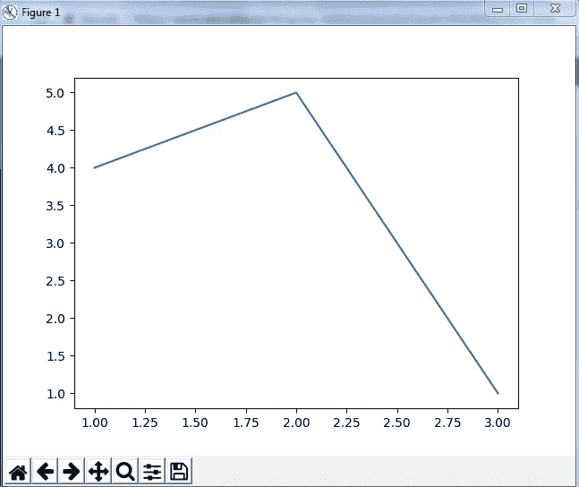

因此，通过三行代码，您可以使用 python matplotlib 生成一个基本图形。很简单，不是吗？
让我们看看如何给 python matplotlib 库创建的图表添加标题和标签，使其更有意义。考虑下面的例子:

```
from matplotlib import pyplot as plt

x = [5,2,7]
y = [2,16,4]
plt.plot(x,y)
plt.title('Info')
plt.ylabel('Y axis')
plt.xlabel('X axis')
plt.show()
```

***输出—***

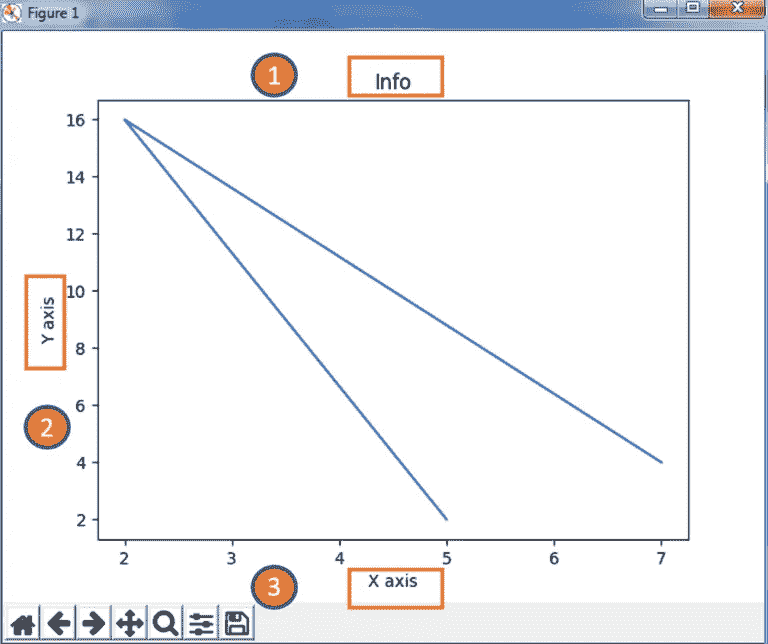

您甚至可以尝试许多样式技术来创建更好的图形。如果你想改变某条线的宽度或颜色，或者你想有一些网格线，你需要设计风格！因此，让我向您展示如何使用 python matplotlib 向图表添加样式。首先，您需要从 python matplotlib 库中导入样式包，然后使用如下代码所示的样式函数:

```
from matplotlib import pyplot as plt
from matplotlib import style

style.use('ggplot')
x = [5,8,10]
y = [12,16,6]
x2 = [6,9,11]
y2 = [6,15,7]
plt.plot(x,y,'g',label='line one', linewidth=5)
plt.plot(x2,y2,'c',label='line two',linewidth=5)
plt.title('Epic Info')
plt.ylabel('Y axis')
plt.xlabel('X axis')
plt.legend()
plt.grid(True,color='k')
plt.show()
```

***输出—***

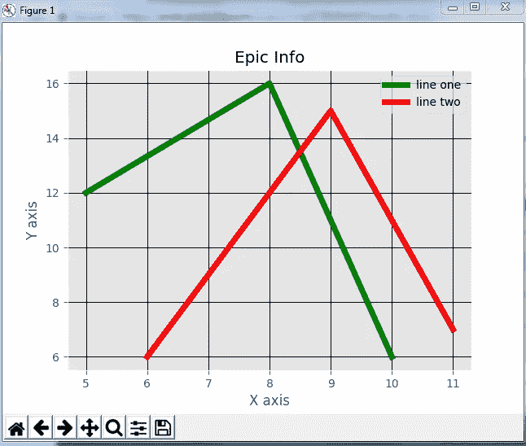

接下来，在这个 python matplotlib 博客中，我们将了解不同种类的情节。先说条形图吧！

# 条形图

首先，让我们理解为什么我们需要一个条形图。条形图使用条形来比较不同类别的数据。当您想要测量一段时间内的变化时，它非常适合。可以水平表示，也可以垂直表示。此外，要记住的重要一点是，棒线越长，价值就越大。现在，让我们使用 python matplotlib 实际实现它。

```
from matplotlib import pyplot as plt

plt.bar([0.25,1.25,2.25,3.25,4.25],[50,40,70,80,20],
label="BMW",width=.5)
plt.bar([.75,1.75,2.75,3.75,4.75],[80,20,20,50,60],
label="Audi", color='r',width=.5)
plt.legend()
plt.xlabel('Days')
plt.ylabel('Distance (kms)')
plt.title('Information')
plt.show()
```

***输出—***

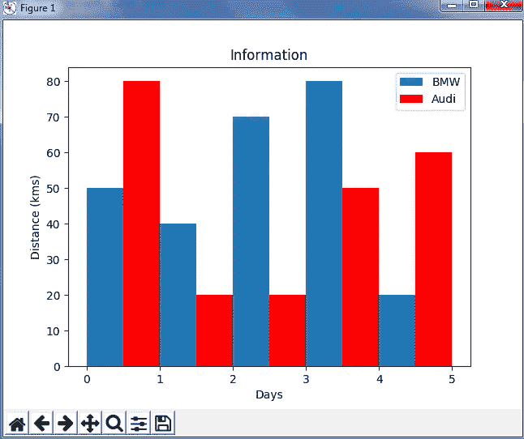

在上面的图中，我显示了宝马和奥迪两辆车在 5 天内行驶距离的比较。接下来，让我们继续使用 python matplotlib 的另一种绘图——直方图。

# 柱状图

让我先告诉你条形图和柱状图的区别。直方图用于显示分布，而条形图用于比较不同的实体。当您有数组或很长的列表时，直方图很有用。让我们考虑一个例子，在这个例子中，我必须相对于 bin 来绘制人口的年龄。现在，bin 指的是被分成一系列区间的值的范围。通常创建相同大小的媒体夹。在下面的代码中，我创建了间隔为 10 的容器，这意味着第一个容器包含从 0 到 9 的元素，然后是从 10 到 19 的元素，依此类推。

```
import matplotlib.pyplot as plt
population_age = [22,55,62,45,21,22,34,42,42,4,2,102,95,85,55,110,120,70,65,55,111,115,80,75,65,54,44,43,42,48]
bins = [0,10,20,30,40,50,60,70,80,90,100]
plt.hist(population_age, bins, histtype='bar', rwidth=0.8)
plt.xlabel('age groups')
plt.ylabel('Number of people')
plt.title('Histogram')
plt.show()
```

***输出—***

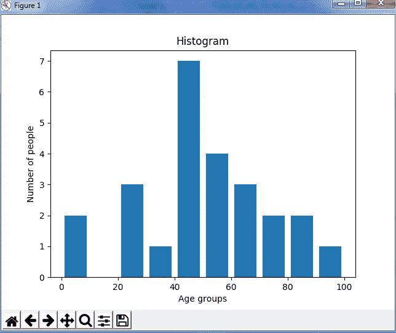

正如你在上面的图中看到的，我们得到了与箱子相关的年龄组。我们最大的年龄组在 40 到 50 岁之间。

# 散点图

通常，我们需要散点图来比较变量，例如，一个变量在多大程度上受另一个变量的影响，从而建立一个关系。数据显示为点的集合，每个点都有一个确定水平轴位置的变量值，另一个确定垂直轴位置的变量值。

考虑下面的例子:

```
import matplotlib.pyplot as plt
x = [1,1.5,2,2.5,3,3.5,3.6]
y = [7.5,8,8.5,9,9.5,10,10.5]

x1=[8,8.5,9,9.5,10,10.5,11]
y1=[3,3.5,3.7,4,4.5,5,5.2]

plt.scatter(x,y, label='high income low saving',color='r')
plt.scatter(x1,y1,label='low income high savings',color='b')
plt.xlabel('saving*100')
plt.ylabel('income*1000')
plt.title('Scatter Plot')
plt.legend()
plt.show()
```

***输出—***

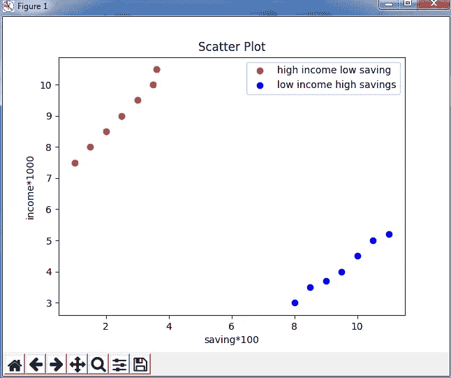

正如您在上面的图表中看到的，我根据上面代码中指定的输入绘制了两个散点图。数据显示为具有“高收入低薪金”和“低收入高薪金”的点数集合。

接下来，让我们了解面积图，或者你也可以说使用 python matplotlib 的堆栈图。

# 面积图

面积图与线图非常相似。它们也被称为堆栈图。这些图可用于跟踪构成一个完整类别的两个或多个相关组随时间的变化。例如，让我们将一天中完成的工作进行分类，比如睡觉、吃饭、工作和玩耍。考虑下面的代码:

```
import matplotlib.pyplot as plt
days = [1,2,3,4,5]

 sleeping =[7,8,6,11,7]
 eating = [2,3,4,3,2]
 working =[7,8,7,2,2]
 playing = [8,5,7,8,13]

 plt.plot([],[],color='m', label='Sleeping', linewidth=5)
 plt.plot([],[],color='c', label='Eating', linewidth=5)
 plt.plot([],[],color='r', label='Working', linewidth=5)
 plt.plot([],[],color='k', label='Playing', linewidth=5)

 plt.stackplot(days, sleeping,eating,working,playing, colors=['m','c','r','k'])

 plt.xlabel('x')
 plt.ylabel('y')
 plt.title('Stack Plot')
 plt.legend()
 plt.show()
```

***输出—***

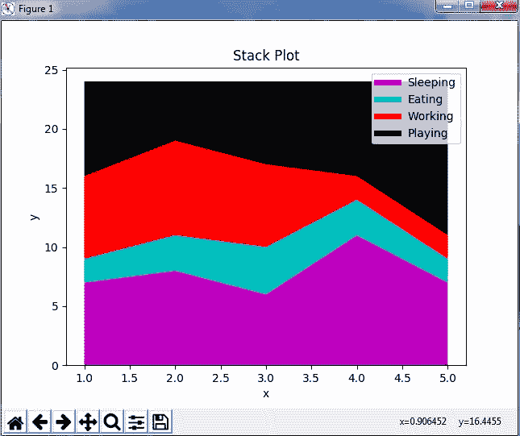

正如我们在上面的图片中看到的，我们根据类别花费了时间。因此，面积图或堆积图用于显示不同属性随时间变化的趋势。接下来，让我们来看看最后一个也是最常用的图表——饼状图。

# 圆形分格统计图表

饼图是指一个圆形图，它被分解成多个部分，即饼图的切片。它主要用于显示百分比或比例数据，其中每个饼图切片代表一个类别。让我们看看下面的例子:

```
import matplotlib.pyplot as plt

days = [1,2,3,4,5]

sleeping =[7,8,6,11,7]
eating = [2,3,4,3,2]
working =[7,8,7,2,2]
playing = [8,5,7,8,13]
slices = [7,2,2,13]
activities = ['sleeping','eating','working','playing']
cols = ['c','m','r','b']

plt.pie(slices,
  labels=activities,
  colors=cols,
  startangle=90,
  shadow= True,
  explode=(0,0.1,0,0),
  autopct='%1.1f%%')

plt.title('Pie Plot')
plt.show()
```

***输出—***

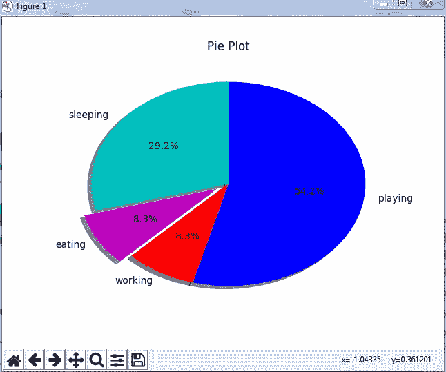

在上面的饼状图中，我将圆圈分为 4 个部分，分别代表不同的类别(玩耍、睡觉、吃饭和工作)以及它们所占的百分比。现在，如果您已经注意到这些切片加起来是 24 小时，但是饼图切片的计算是自动为您完成的。通过这种方式，饼图非常有用，因为您不必计算百分比或饼图的份额。

接下来，在 python matplotlib 中，让我们了解如何处理多个图。

# 使用多个图

我讨论了 python matplotlib 中的多种绘图类型，如条形图、散点图、饼图、面积图等。现在，让我告诉你如何处理多个情节。为此，我必须导入 numpy 模块，我在以前关于 Python Numpy 的博客中讨论过这个模块。让我实际地实现它，考虑下面的例子。

```
import numpy as np
import matplotlib.pyplot as plt

def f(t):
    return np.exp(-t) * np.cos(2*np.pi*t)
t1 = np.arange(0.0, 5.0, 0.1)
t2 = np.arange(0.0, 5.0, 0.02)
plt.subplot(221)
plt.plot(t1, f(t1), 'bo', t2, f(t2))
plt.subplot(222)
plt.plot(t2, np.cos(2*np.pi*t2))
plt.show()
```

***输出-***

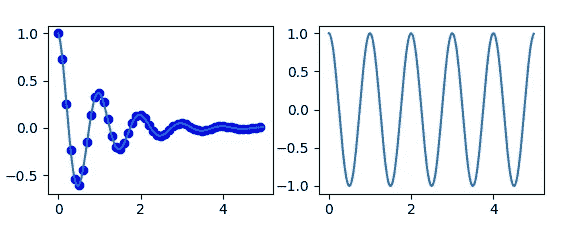

代码与你之前看到的例子非常相似，但是这里有一个新的概念，即子情节。subplot()命令指定 numrow、numcol、fignum，范围从 1 到 numrows*numcols。如果 numrows*numcols <10\. So subplot (221) is identical to subplot (2,2,1). Therefore, subplots help us to plot multiple graphs in which you can define it by aligning vertically or horizontally. In the above example, I have aligned it horizontally.

Apart from these, python matplotlib has some disadvantages. Some of them are listed below:

*   They are heavily reliant on other packages, such as NumPy.
*   It only works for python, so it is hard or impossible to be used in languages other than python. (But it can be used from Julia via PyPlot package).

We have come to an end of this python matplotlib tutorial. I have covered all the basics of matplotlib, so you can start practicing now. I hope you guys are clear about each and every aspect that I have discussed above.

If you wish to check out more articles on the market’s most trending technologies like Artificial Intelligence, DevOps, Ethical Hacking, then you can refer to Edureka’s official site.

Do look out for other articles in this series which will explain the various other aspects of Python and Data Science.

> 1\. [Python 教程](/edureka/python-tutorial-be1b3d015745)，该命令中的逗号是可选的
> 
> 2. [](/edureka/python-functions-f0cabca8c4a) [Python 编程语言](/edureka/python-programming-language-fc1015de7a6f)
> 
> 3. [Python 函数](/edureka/python-functions-f0cabca8c4a)
> 
> 4.[Python 中的文件处理](/edureka/file-handling-in-python-e0a6ff96ede9)
> 
> 5. [](/edureka/scikit-learn-machine-learning-7a2d92e4dd07) [Python Numpy 教程](/edureka/python-numpy-tutorial-89fb8b642c7d)
> 
> 6. [Scikit 学习机器学习](/edureka/scikit-learn-machine-learning-7a2d92e4dd07)
> 
> 7. [Python 熊猫教程](/edureka/python-pandas-tutorial-c5055c61d12e)
> 
> 8. [Tkinter 教程](/edureka/tkinter-tutorial-f655d3f4c818)
> 
> 9.[请求教程](/edureka/python-requests-tutorial-30edabfa6a1c)
> 
> 10. [PyGame 教程](/edureka/pygame-tutorial-9874f7e5c0b4)
> 
> 11. [OpenCV 教程](/edureka/python-opencv-tutorial-5549bd4940e3)
> 
> 12.[用 Python 进行网页抓取](/edureka/web-scraping-with-python-d9e6506007bf)
> 
> 13. [PyCharm 教程](/edureka/pycharm-tutorial-d0ec9ce6fb60)
> 
> 14.[机器学习教程](/edureka/machine-learning-tutorial-f2883412fba1)
> 
> 15.[Python 中从头开始的线性回归算法](/edureka/linear-regression-in-python-e66f869cb6ce)
> 
> 16.[面向数据科学的 Python](/edureka/learn-python-for-data-science-1f9f407943d3)
> 
> 17. [Python 正则表达式](/edureka/python-regex-regular-expression-tutorial-f2d17ffcf17e)
> 
> 18.[Python 中的循环](/edureka/loops-in-python-fc5b42e2f313)
> 
> 19. [Python 项目](/edureka/python-projects-1f401a555ca0)
> 
> 20.[机器学习项目](/edureka/machine-learning-projects-cb0130d0606f)
> 
> 21.[Python 中的数组](/edureka/arrays-in-python-14aecabec16e)
> 
> 22.[在 Python 中设置](/edureka/sets-in-python-a16b410becf4)
> 
> 23.[Python 中的多线程](/edureka/what-is-mutithreading-19b6349dde0f)
> 
> 24. [Python 面试问题](/edureka/python-interview-questions-a22257bc309f)
> 
> 25. [Java vs Python](/edureka/java-vs-python-31d7433ed9d)
> 
> 26.[如何成为一名 Python 开发者？](/edureka/how-to-become-a-python-developer-462a0093f246)
> 
> 27. [Python Lambda 函数](/edureka/python-lambda-b84d68d449a0)
> 
> 28.[网飞如何使用 Python？](/edureka/how-netflix-uses-python-1e4deb2f8ca5)
> 
> 29.[Python 中什么是套接字编程](/edureka/socket-programming-python-bbac2d423bf9)
> 
> 30. [Python 数据库连接](/edureka/python-database-connection-b4f9b301947c)
> 
> 31. [Golang vs Python](/edureka/golang-vs-python-5ac32e1ef2)
> 
> 32. [Python Seaborn 教程](/edureka/python-seaborn-tutorial-646fdddff322)
> 
> 33. [Python 职业机会](/edureka/python-career-opportunities-a2500ce158de)

*原载于 2017 年 8 月 8 日*[*www.edureka.co*](https://www.edureka.co/blog/python-matplotlib-tutorial)*。*