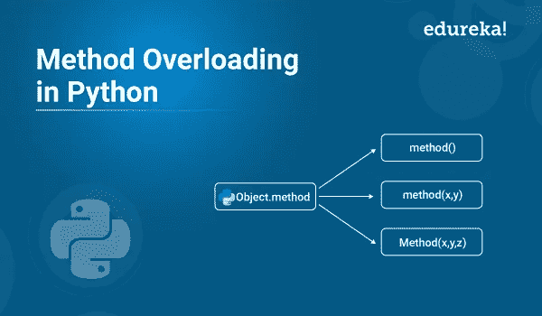

# Python 中什么是方法重载？

> 原文：<https://medium.com/edureka/python-method-overloading-6db228e1e0f5?source=collection_archive---------0----------------------->



Python 中的两个方法不能同名。Python 中的方法重载是一个允许同一个操作符有不同含义的特性。在本文中，我们将按照以下顺序来看看 Python 中的方法重载特性，以及如何使用它来重载方法:

*   什么是超载？
*   Python 中的方法重载
*   方法重载示例

# 什么是超载？

重载是函数或运算符基于传递给函数的参数或运算符所作用的操作数以不同方式表现的能力。

使用重载的一些**优势**是:

*   重载一个方法可以提高可重用性。例如，我们可以编写一个方法并重载它，而不是编写多个只有细微差别的方法。
*   重载也提高了代码的清晰度，消除了复杂性。

重载是一个非常有用的概念。然而，它也有一些与 T2 相关的缺点。

# Python 中的方法重载

在 Python 中，您可以创建一个可以以不同方式调用的方法。所以，你可以有一个有零个、一个或多个参数的方法。根据方法定义，我们可以用零个、一个或多个参数来调用它。

给定一个方法或函数，参数的数量可以由您指定。这个以不同方式调用同一个方法的过程叫做方法重载。

# 方法重载示例

现在你已经知道 Python 中什么是方法重载，让我们举个例子。这里，我们用一个方法 **Hello()** 创建了一个类。此方法的第一个参数设置为 None。这将为我们提供带或不带参数调用它的选项。

一个对象也是基于类创建的，我们将使用 0 和 1 个参数调用它的方法。

**例 1:**

```
#!/usr/bin/env python
**class** Person:
**def** Hello(self, name**=**None):
**if** name **is** **not** None:
print('Hello ' **+** name)
**else**:
print('Hello ')
# Create instance
obj **=** Person()
# Call the method
obj.Hello()
# Call the method with a parameter
obj.Hello('Edureka')
```

**输出:**

```
Hello
Hello Edureka
```

为了澄清方法重载，我们现在可以用两种方式调用方法 Hello():

```
obj.Hello()
obj.Hello('Edureka')
```

在上面的例子中，我们已经创建了一个方法，调用它的参数比定义的要少。此外，它不仅限于两个变量，您的方法可以有更多的变量是可选的。

现在让我们举另一个**例子**来理解 python 中的方法重载。

**例 2:**

在下面的例子中，我们将重载 area 方法。如果没有参数，则返回 0。如果我们有一个参数，那么它返回这个值的平方，并假设你在计算一个平方的面积。此外，如果我们有两个参数，那么它返回两个值的乘积，并假设您正在计算一个矩形的面积。

```
# class
**class** Compute:
# area method
**def** area(self, x **=** None, y **=** None):
**if** x !**=** None **and** y !**=** None:
**return** x ***** y
**elif** x !**=** None:
**return** x ***** x
**else**:
**return** 0
# object
obj **=** Compute()
# zero argument
print("Area Value:", obj.area())
# one argument
print("Area Value:", obj.area(4))
# two argument
print("Area Value:", obj.area(3, 5))
```

上面的代码将给出下面的**输出:**

```
Area Value: 0
Area Value: 16
Area Value: 15
```

说到这里，我们的文章就到此为止了。我希望你理解什么是 python 中的方法重载，以及它是如何工作的。

如果你想查看更多关于人工智能、DevOps、道德黑客等市场最热门技术的文章，你可以参考 Edureka 的官方网站。

请留意本系列中的其他文章，它们将解释 Python 和数据科学的各个方面。

> *1。*[*Python 中的机器学习分类器*](/edureka/machine-learning-classifier-c02fbd8400c9)
> 
> *2。*[*Python Scikit-Learn Cheat Sheet*](/edureka/python-scikit-learn-cheat-sheet-9786382be9f5)
> 
> *3。* [*机器学习工具*](/edureka/python-libraries-for-data-science-and-machine-learning-1c502744f277)
> 
> *4。* [*用于数据科学和机器学习的 Python 库*](/edureka/python-libraries-for-data-science-and-machine-learning-1c502744f277)
> 
> *5。*[*Python 中的聊天机器人*](/edureka/how-to-make-a-chatbot-in-python-b68fd390b219)
> 
> *6。* [*Python 集合*](/edureka/collections-in-python-d0bc0ed8d938)
> 
> *7。* [*Python 模块*](/edureka/python-modules-abb0145a5963)
> 
> *8。* [*Python 开发者技能*](/edureka/python-developer-skills-371583a69be1)
> 
> *9。* [*哎呀面试问答*](/edureka/oops-interview-questions-621fc922cdf4)
> 
> *10。*[*Python 开发者简历*](/edureka/python-developer-resume-ded7799b4389)
> 
> *11。*[*Python 中的探索性数据分析*](/edureka/exploratory-data-analysis-in-python-3ee69362a46e)
> 
> *12。* [*蛇与蟒蛇的游戏*](/edureka/python-turtle-module-361816449390)
> 
> *13。* [*Python 开发者工资*](/edureka/python-developer-salary-ba2eff6a502e)
> 
> *14。* [*主成分分析*](/edureka/principal-component-analysis-69d7a4babc96)
> 
> *15。*[*Python vs c++*](/edureka/python-vs-cpp-c3ffbea01eec)
> 
> 16。 [*刺儿头教程*](/edureka/scrapy-tutorial-5584517658fb)
> 
> 17。[*Python SciPy*](/edureka/scipy-tutorial-38723361ba4b)
> 
> 18。 [*最小二乘回归法*](/edureka/least-square-regression-40b59cca8ea7)
> 
> *19。* [*Jupyter 笔记本小抄*](/edureka/jupyter-notebook-cheat-sheet-88f60d1aca7)
> 
> 20。 [*Python 基础知识*](/edureka/python-basics-f371d7fc0054)
> 
> *21。* [*Python 模式程序*](/edureka/python-pattern-programs-75e1e764a42f)
> 
> *二十二。* [*用 Python 进行网页抓取*](/edureka/web-scraping-with-python-d9e6506007bf)
> 
> *23。* [*Python 装饰器*](/edureka/python-decorator-tutorial-bf7b21278564)
> 
> *24。*[*Python Spyder IDE*](/edureka/spyder-ide-2a91caac4e46)
> 
> *25。*[*Python 中使用 Kivy 的移动应用*](/edureka/kivy-tutorial-9a0f02fe53f5)
> 
> *26。* [*十大最佳学习书籍&练习 Python*](/edureka/best-books-for-python-11137561beb7)
> 
> *27。* [*机器人框架与 Python*](/edureka/robot-framework-tutorial-f8a75ab23cfd)
> 
> *28。*[*Python 中的贪吃蛇游戏*](/edureka/snake-game-with-pygame-497f1683eeaa)
> 
> *29。* [*Django 面试问答*](/edureka/django-interview-questions-a4df7bfeb7e8)
> 
> 三十。 [*十大 Python 应用*](/edureka/python-applications-18b780d64f3b)
> 
> *31。*[*Python 中的哈希表和哈希表*](/edureka/hash-tables-and-hashmaps-in-python-3bd7fc1b00b4)
> 
> *32。*[*Python 3.8*](/edureka/whats-new-python-3-8-7d52cda747b)
> 
> *33。* [*支持向量机*](/edureka/support-vector-machine-in-python-539dca55c26a)
> 
> *34。* [*Python 教程*](/edureka/python-tutorial-be1b3d015745)

*原载于 2019 年 8 月 15 日*[*【https://www.edureka.co】*](https://www.edureka.co/blog/python-method-overloading/)*。*