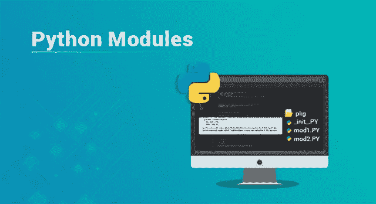
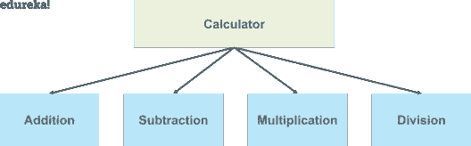
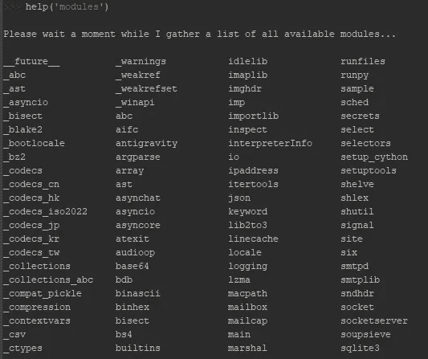
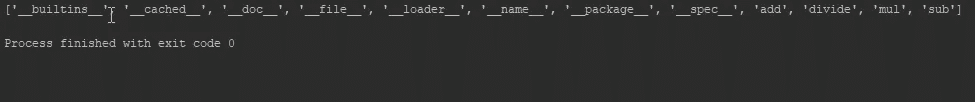

# 如何创建和使用 Python 模块？

> 原文：<https://medium.com/edureka/python-modules-abb0145a5963?source=collection_archive---------1----------------------->



Python Modules — Edureka

Python 编程语言是当今最流行的语言之一。它有许多应用程序，开发人员正在转向 python 来实现它提供给我们的功能。模块化编程方法将代码分解成独立的部分，这就是 python 模块的用武之地。本文将帮助您详细了解上述主题。

以下是本文将涉及的主题:

*   什么是 Python 模块？
*   如何创建 Python 模块？
*   如何使用 Python 模块？
*   Python 中的内置模块

# 什么是 Python 模块？

模块只是一个“程序逻辑”或“python 脚本”,可用于各种应用程序或功能。我们可以在一个模块中声明函数、类等。

重点是将代码分解成不同的模块，以便彼此之间没有或只有最低限度的依赖。在代码中使用模块有助于编写更少的代码，这是为重用代码而开发的单一过程。它还消除了反复编写相同逻辑的需要。

使用模块的另一个好处是程序可以很容易地设计，因为整个团队只处理整个代码的一部分或模块。

让我们用一个例子来理解这一点:

假设你想为计算器编写一个程序。会有像加、减、乘、除等运算。

我们将把代码分成单独的部分，我们可以简单地为所有这些操作创建一个模块，或者为每个操作创建单独的模块。然后我们可以在主程序逻辑中调用这些模块。

这个想法是为了最小化代码，如果我们创建模块，并不意味着我们只能为这个程序使用它，我们甚至可以为其他程序调用这些模块。



现在我们已经理解了模块的概念，让我们试着理解如何用 python 创建一个模块。

# 如何用 Python 创建模块？

用 python 创建一个模块类似于使用**编写一个简单的 python 脚本。py** 分机。对于上面的例子，让我们试着为各种操作制作一个模块。

```
def add(x,y):
     return x + y

def sub(x, y):
     return x - y

def prod(x, y):
    return x * y

def div(x, y):
    return x / y
```

将上述代码保存在一个文件 **Calc.py** 中。这就是我们如何在 python 中创建一个模块。我们在本模块中创建了不同的功能。我们可以在主文件中使用这些模块，让我们看看如何在程序中使用它们。

# 如何使用 Python 模块？

我们将使用 **import** 关键字将模块合并到我们的程序中， **from** 关键字用于从一个模块中获取少数或特定的方法或函数。让我们看看在你的程序中使用一个模块有哪些不同的方法。

假设我们有一个名为 **main.py.** 的文件

```
import calc as a
a = 10
b = 20

addition = a.add(a,b)
print(addition)
```

在上面的代码中，我们使用“**作为“**关键字创建了一个别名。使用 calc.py 模块中 add 函数指定的逻辑，上述代码的输出将是两个数字 a 和 b 的相加。

让我们看看另一种方法。

```
from calc import *
a = 20
b = 30

print(add(a,b))
```

在上面的代码中，我们已经使用星号导入了所有的函数，我们可以简单地提到函数名来获得结果。

## Python 模块路径

当我们导入一个模块时，解释器在 sys.path 中的内置模块目录中查找该模块，如果没有找到，它将按以下顺序查找该模块:

```
import sys 
print(sys.path)
```

当您运行上述代码时，您将获得目录列表。您可以在列表中进行更改以创建自己的路径。

内置模块用 C 语言编写，集成了 python 解释器。每个内置模块都包含用于某些特定功能的资源，如操作系统管理、磁盘输入/输出等。

标准库也有许多包含有用工具的 python 脚本。python 中有几个内置模块供我们使用，我们可以随时使用。

要获得 python 中所有模块的列表，可以在 python 控制台中编写以下命令。

```
help('modules')
```

您将获得 python 中所有模块的列表。下面是 python 中的几个模块。



## **dir()内置函数**

它返回包含模块中定义的名称的字符串的排序列表。该列表包含所有变量、函数、类等的名称。

```
import calc
print(dir(calc))
```

您将得到如下所示的列表输出:



类似地，您可以使用 dir()函数获取任何模块中定义的名称。

在本文中，我们学习了 python 中的模块，以及如何创建模块并在程序中使用它。我们还学习了 python 中的内置模块。Python 编程语言有着巨大的应用，通过使用模块，任务变得更加容易、可维护和高效。如果你想查看更多关于人工智能、DevOps、道德黑客等市场最热门技术的文章，那么你可以参考 [Edureka 的官方网站。](https://www.edureka.co/blog/?utm_source=medium&utm_medium=content-link&utm_campaign=python-modules)

请留意本系列中的其他文章，它们将解释 Python 和数据科学的各个方面。

> 1.[Python 中的机器学习分类器](/edureka/machine-learning-classifier-c02fbd8400c9)
> 
> 2. [Python Scikit-Learn 备忘单](/edureka/python-scikit-learn-cheat-sheet-9786382be9f5)
> 
> 3.[机器学习工具](/edureka/python-libraries-for-data-science-and-machine-learning-1c502744f277)
> 
> 4.[用于数据科学和机器学习的 Python 库](/edureka/python-libraries-for-data-science-and-machine-learning-1c502744f277)
> 
> 5.[Python 中的聊天机器人](/edureka/how-to-make-a-chatbot-in-python-b68fd390b219)
> 
> 6.[蟒蛇系列](/edureka/collections-in-python-d0bc0ed8d938)
> 
> 7.[用 Python 进行网页抓取](/edureka/web-scraping-with-python-d9e6506007bf)
> 
> 8. [Python 开发者技能](/edureka/python-developer-skills-371583a69be1)
> 
> 9.[哎呀面试问答](/edureka/oops-interview-questions-621fc922cdf4)
> 
> 10.[Python 开发者简历](/edureka/python-developer-resume-ded7799b4389)
> 
> 11.[Python 中的探索性数据分析](/edureka/exploratory-data-analysis-in-python-3ee69362a46e)
> 
> 12.[带有 Python 的乌龟模块的贪吃蛇游戏](/edureka/python-turtle-module-361816449390)
> 
> 13. [Python 开发者工资](/edureka/python-developer-salary-ba2eff6a502e)
> 
> 14.[主成分分析](/edureka/principal-component-analysis-69d7a4babc96)
> 
> 15. [Python vs C++](/edureka/python-vs-cpp-c3ffbea01eec)
> 
> 16.[刺儿头教程](/edureka/scrapy-tutorial-5584517658fb)
> 
> 17. [Python SciPy](/edureka/scipy-tutorial-38723361ba4b)
> 
> 18.[最小二乘回归法](/edureka/least-square-regression-40b59cca8ea7)
> 
> 19. [Jupyter 笔记本小抄](/edureka/jupyter-notebook-cheat-sheet-88f60d1aca7)
> 
> 20. [Python 基础知识](/edureka/python-basics-f371d7fc0054)
> 
> 21. [Python 模式程序](/edureka/python-pattern-programs-75e1e764a42f)
> 
> 22.[Python 中的生成器](/edureka/generators-in-python-258f21e3d3ff)
> 
> 23. [Python 装饰器](/edureka/python-decorator-tutorial-bf7b21278564)
> 
> 24. [Python Spyder IDE](/edureka/spyder-ide-2a91caac4e46)
> 
> 25.[在 Python 中使用 Kivy 的移动应用](/edureka/kivy-tutorial-9a0f02fe53f5)
> 
> 26.[十大最好的学习书籍&练习 Python](/edureka/best-books-for-python-11137561beb7)
> 
> 27.[用 Python 实现机器人框架](/edureka/robot-framework-tutorial-f8a75ab23cfd)
> 
> 28.[使用 PyGame 在 Python 中进行贪吃蛇游戏](/edureka/snake-game-with-pygame-497f1683eeaa)
> 
> 29. [Django 面试问答](/edureka/django-interview-questions-a4df7bfeb7e8)
> 
> 30.[十大 Python 应用](/edureka/python-applications-18b780d64f3b)
> 
> 31.[Python 中的哈希表和哈希表](/edureka/hash-tables-and-hashmaps-in-python-3bd7fc1b00b4)
> 
> 32. [Python 3.8](/edureka/whats-new-python-3-8-7d52cda747b)
> 
> 33.[支持向量机](/edureka/support-vector-machine-in-python-539dca55c26a)
> 
> 34. [Python 教程](/edureka/python-tutorial-be1b3d015745)

*原载于 2019 年 5 月 14 日*[*https://www.edureka.co*](https://www.edureka.co/blog/python-modules/)*。*