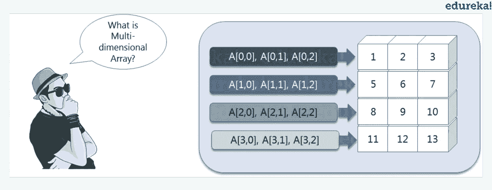
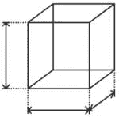
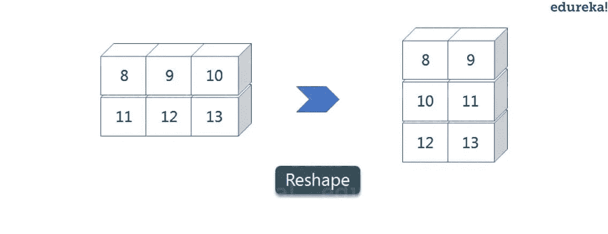
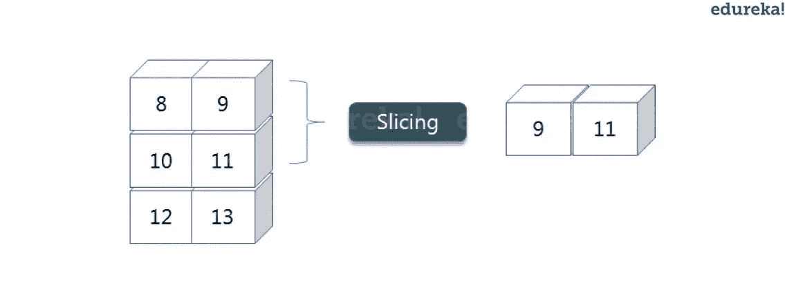
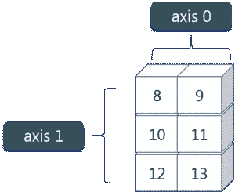
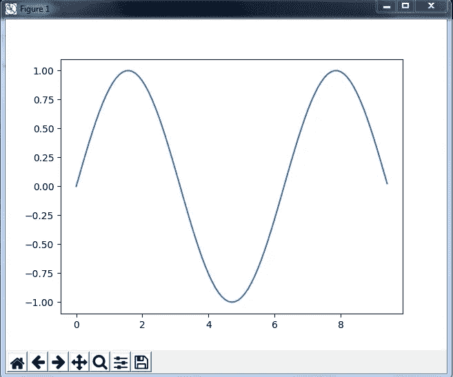
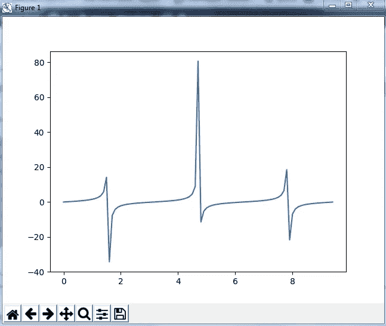

# Python NumPy 指南——通过示例了解 NumPy 数组

> 原文：<https://medium.com/edureka/python-numpy-tutorial-89fb8b642c7d?source=collection_archive---------0----------------------->


Python NumPy Tutorial - Edureka

Python 非常简单，可读性非常好，因为它非常像英语。在 [***Python 教程*** 、](/edureka/python-tutorial-be1b3d015745)中，你已经了解了 Python 的序列、列表、集合、元组等。在本 python numpy 教程中，您将按以下顺序理解 numpy 的各个方面:

*   什么是 Python NumPy 数组？
*   NumPy 数组 v/s 列表
*   数字运算
*   NumPy 特殊函数

所以，让我们开始吧！:-)

# **什么是 Python NumPy？**

***NumPy****是一个 Python 包，代表' ***数值 Python*** '。它是科学计算的核心库，包含一个强大的 N 维数组对象，提供集成 C、C++等的工具。这也是有用的线性代数，随机数能力等。NumPy 数组也可以用作通用数据的高效多维容器。现在，让我告诉你什么是 python numpy 数组。*

***NumPy 数组:** NumPy 数组是一个功能强大的 N 维数组对象，以行和列的形式出现。我们可以从嵌套的 Python 列表中初始化 numpy 数组，并访问它的元素。为了执行这些 numpy 操作，您会想到的下一个问题是:*

# *如何安装 NumPy？*

*要安装 Python NumPy，进入你的 ***命令提示符*** 并键入“***pip install NumPy***”。安装完成后，转到您的 IDE(例如:PyCharm)并简单地通过键入:"***import numpy as NP***"来导入它*

*继续学习 python numpy 教程，让我们了解什么是多维 numpy 数组。*

**

*Multi-Dimensional Array - Python NumPy Tutorial*

*这里，我有不同的元素，存储在各自的内存位置。之所以说它是二维的，是因为它既有行也有列。在上图中，我们有 3 列 4 行可用。*

*让我们看看它是如何在 PyCharm 中实现的:*

## *一维 NumPy 数组:*

```
***import** numpy as np
a**=**np.array([1,2,3])
print(a)**Output - [1 2 3]***
```

## *多维数组:*

```
*a**=**np.array([(1,2,3),(4,5,6)])
print(a)**Output - [[ 1 2 3]
          [4 5 6]]***
```

*你们中的许多人一定想知道，如果我们已经有了 python list，为什么还要使用 python numpy？所以，让我们用这个 python numpy 教程中的一些例子来理解一下。*

# *Python NumPy 数组 v/s 列表*

*我们使用 python numpy 数组而不是列表是因为以下三个原因:*

1.  *内存更少*
2.  *快的*
3.  *方便的*

*选择 python numpy 数组的第一个原因是，与 list 相比，它占用的内存更少。然后，它在执行方面非常快，同时，使用起来也非常方便。这就是 python numpy 数组相对于 list 的主要优势。别担心，我将在 PyCharm 中实际地逐一证明以上观点。考虑下面的例子:*

```
***import** numpy as np
**import** time
**import** sysS**=** range(1000)
print(sys.getsizeof(5)*****len(S)) D**=** np.arange(1000)
print(D.size*****D.itemsize)**Output -  14000
          4000***
```

*上面的输出显示 list(用 S 表示)分配的内存是 14000，而 numpy 数组分配的内存只有 4000。由此，您可以得出结论，这两者之间有一个主要的区别，这使得 python numpy 数组成为优于 list 的首选。*

*接下来，让我们谈谈 python numpy 数组与 list 相比如何更快更方便。*

```
***import** time
**import** sysSIZE **=** 1000000L1**=** range(SIZE)
L2**=** range(SIZE)
A1**=** np.arange(SIZE)
A2**=**np.arange(SIZE)start**=** time.time()
result**=**[(x,y) **for** x,y **in** zip(L1,L2)]
print((time.time()**-**start)*****1000)start**=**time.time()
result**=** A1**+**A2
print((time.time()**-**start)*****1000)**Output - 380.9998035430908
         49.99995231628418***
```

*在上面的代码中，我们用 ***定义了两个列表*** 和 ***两个 numpy 数组*** 。然后，我们用 ***比较*** 所用的时间，以便 ***找到列表*** 和***numpy 数组*** 的总和。如果您看到上述程序的输出，这两个值有显著的变化。List 用了 380 毫秒，而 numpy 数组用了将近 49 毫秒。因此，numpy 数组比 list 要快。现在，如果你注意到我们为一个列表运行了一个“for”循环，返回两个列表的连接，而对于 numpy 数组，我们只是通过简单地打印 A1+A2 来添加两个数组。这就是为什么与列表相比，使用 numpy 要容易和方便得多。*

*因此，上面的例子证明了为什么应该使用 python numpy array 而不是 list！*

*继续学习 python numpy 教程，让我们关注它的一些操作。*

# *Python NumPy 操作*

## *ndim :*

**

*可以求数组的维数，不管是二维数组还是一维数组。让我们来看看，实际上我们是如何找到维度的。在下面的代码中，借助' ndim '函数，我可以知道数组是一维的还是多维的。*

```
***import** numpy as np
a **=** np.array([(1,2,3),(4,5,6)])
print(a.ndim)**Output - 2***
```

*由于输出是 2，所以是二维数组(多维)。*

## ***项目大小**:*

**

*您可以计算每个元素的字节大小。在下面的代码中，我定义了一个一维数组，在“itemsize”函数的帮助下，我们可以找到每个元素的大小。*

```
***import** numpy as np
a **=** np.array([(1,2,3)])
print(a.itemsize)**Output - 4***
```

*所以在上面的 numpy 数组中，每个元素占用 4 个字节。*

## ***数据类型:***

**

*您可以找到存储在数组中的元素的数据类型。所以，如果你想知道一个特定元素的数据类型，你可以使用' dtype '函数，它将打印数据类型和大小。在下面的代码中，我定义了一个数组，并在其中使用了相同的函数。*

```
***import** numpy as np
a **=** np.array([(1,2,3)])
print(a.dtype)**Output - int32***
```

*如您所见，数组的数据类型是整数 32 位。同样，您可以分别使用' size '和' shape '函数找到数组的大小和形状。*

```
***import** numpy as np
a **=** np.array([(1,2,3,4,5,6)])
print(a.size)
print(a.shape)**Output - 6 (1,6)***
```

*接下来，让我们向前看，看看使用 python numpy 模块还可以执行哪些操作。我们还可以使用 python numpy 操作来执行整形和切片操作。但是，什么是重塑和切割呢？所以让我在这个 python numpy 教程里一个一个的解释一下。*

## ***重塑:***

**

*重塑是指改变行数和列数，为对象提供新的视图。现在，让我们举一个例子来重塑左边的数组:*

*如左图所示，我们有 3 列 2 行，转换为 2 列 3 行。让我给你演示一下这是怎么做的。*

```
***import** numpy as np
a **=** np.array([(8,9,10),(11,12,13)])
print(a)
a**=**a.reshape(3,2)
print(a)**Output - [[ 8 9 10] [11 12 13]] [[ 8 9] [10 11] [12 13]]***
```

## ***切片:***

**

*正如你所看到的,“整形”功能已经显示了它的魔力。现在，让我们来看另一个操作，即切片。切片基本上是从数组中提取一组特定的元素。这个切片操作与列表中的操作非常相似。考虑左边的例子:*

*在进入上面的例子之前，我们先来看一个简单的。我们有一个数组，我们需要一个给定数组中的特定元素(比如 3 个)。让我们考虑下面的例子:*

```
***import** numpy as np
a**=**np.array([(1,2,3,4),(3,4,5,6)])
print(a[0,2])**Output - 3***
```

*这里，数组(1，2，3，4)是 python numpy 数组的索引 0 ,( 3，4，5，6)是索引 1。因此，我们打印了从第零个索引开始的第二个元素。
向前一步，假设我们需要数组第 0 个和第 1 个索引的第 2 个元素。让我们看看如何执行此操作:*

```
***import** numpy as np
a**=**np.array([(1,2,3,4),(3,4,5,6)])
print(a[0:,2])**Output - [3 5]***
```

*这里 ***冒号代表所有行*** ，包括零。现在，为了获得第二个元素，我们将从这两行中调用 index 2，这将分别为我们提供值 3 和 5。*

*接下来，为了消除混淆，假设我们还有一行，我们不想打印它的第二个元素，就像上面的图像一样。在这种情况下我们能做什么？
考虑以下代码:*

```
***import** numpy as np
a**=**np.array([(8,9),(10,11),(12,13)])
print(a[0:2,1])**Output - [9 11]***
```

*正如您在上面的代码中看到的，只打印了 9 和 11。当我写 0:2 时，这不包括数组第三行的第二个索引。因此，只有 9 和 11 被打印出来，否则你将得到所有的元素，即[9 11 13]。*

## ***林空间:***

*这是 python numpy 中的另一个操作，它返回指定间隔内均匀分布的数字。考虑下面的例子:*

```
***import** numpy as np
a**=**np.linspace(1,3,10)
print(a) **Output - [ 1\. 1.22222222 1.44444444 1.66666667 1.88888889 2.11111111 2.33333333 2.55555556 2.77777778 3\. ]***
```

*正如您在结果中看到的，它打印了 1 到 3 之间的 10 个值。*

## ***最大/最小:***

*接下来，我们在 numpy 中有更多的操作，例如找到 numpy 数组的最小值、最大值和总和。让我们继续学习 python numpy 教程，并实际执行它。*

```
***import** numpy as npa**=** np.array([1,2,3])
print(a.min())
print(a.max())
print(a.sum())**Output - 1 3 6***
```

*你一定觉得这些都是很基本的，但是在这些知识的帮助下，你也可以完成很多更大的任务。现在，我们来理解一下 python numpy 中***轴*** 的概念。*

**

*如图所示，我们有一个 2*3 的 numpy 数组。这里，行被称为轴 1，列被称为轴 0。现在你一定想知道这些轴有什么用？*

*假设你想计算所有列的总和，那么你可以使用 axis。让我实际演示一下，如何在 PyCharm 中实现 axis:*

```
*a**=** np.array([(1,2,3),(3,4,5)])
print(a.sum(axis**=**0))**Output - [4 6 8]***
```

*因此，所有列的总和相加，其中 1+3=4，2+4=6，3+5=8。类似地，如果您将轴替换为 1，那么它将打印[6 12]，其中所有行都被添加。*

## ***平方根&标准差:***

*使用 python numpy 可以执行各种数学函数。你可以找到数组的平方根，标准差。所以，让我们实现这些操作:*

```
***import** numpy as np
a**=**np.array([(1,2,3),(3,4,5,)])
print(np.sqrt(a))
print(np.std(a))**Output - [[ 1\. 1.41421356 1.73205081]
          [ 1.73205081 2\. 2.23606798]]
            1.29099444874***
```

*正如您在上面看到的输出，所有元素的平方根都被打印出来了。此外，打印上述数组的标准偏差，即每个元素与 python numpy 数组的平均值相差多少。*

## ***加法运算:***

*您可以在 numpy 数组上执行更多的操作，即两个矩阵的加、减、乘、除。让我继续学习 python numpy 教程，并实际展示给你看:*

```
***import** numpy as np
x**=** np.array([(1,2,3),(3,4,5)])
y**=** np.array([(1,2,3),(3,4,5)])
print(x**+**y)**Output - [[ 2 4 6] [ 6 8 10]]***
```

*这是极其简单的！对吗？类似地，我们可以执行其他操作，如减法、乘法和除法。考虑下面的例子:*

```
***import** numpy as np
x**=** np.array([(1,2,3),(3,4,5)])
y**=** np.array([(1,2,3),(3,4,5)])
print(x**-**y)
print(x*****y)
print(x**/**y)**Output - [[0 0 0] [0 0 0]]
          [[ 1 4 9] [ 9 16 25]] 
          [[ 1\. 1\. 1.] [ 1\. 1\. 1.]]***
```

## ***垂直&水平堆叠:***

*接下来，如果您想要连接两个数组，而不仅仅是将它们相加，那么您可以使用两种方式来执行它— *垂直堆叠*和*水平堆叠*。我就在这个 python numpy 教程里一个一个展示吧。*

```
***import** numpy as np
x**=** np.array([(1,2,3),(3,4,5)])
y**=** np.array([(1,2,3),(3,4,5)])
print(np.vstack((x,y)))
print(np.hstack((x,y)))**Output - [[1 2 3] [3 4 5] [1 2 3] [3 4 5]]
          [[1 2 3 1 2 3] [3 4 5 3 4 5]]***
```

## ***拆线:***

*还有一个操作可以将一个 numpy 数组转换成一列，即*行程*。让我展示一下它是如何实际实现的:*

```
***import** numpy as np
x**=** np.array([(1,2,3),(3,4,5)])
print(x.ravel())**Output - [ 1 2 3 3 4 5]***
```

*让我们继续学习 python numpy 教程，看看它的一些特殊函数。*

# ***Python NumPy 特殊函数***

*numpy 中有各种特殊功能，如正弦、余弦、正切、对数等。首先，让我们从正弦函数开始，我们将学习绘制它的图形。为此，我们需要导入一个名为 *matplotlib* 的模块。继续学习 python numpy 教程，让我们看看这些图表是如何绘制的。*

```
***import** numpy as np
**import** matplotlib.pyplot as plt
x**=** np.arange(0,3*****np.pi,0.1)
y**=**np.sin(x)
plt.plot(x,y)
plt.show()*
```

****输出:****

**

*类似地，你可以绘制任何三角函数的图形，如 cos，tan 等。让我再给你看一个例子，你可以画出另一个函数的图形，比如说**。***

```
****import** numpy as np
**import** matplotlib.pyplot as plt
x**=** np.arange(0,3*****np.pi,0.1)
y**=**np.tan(x)
plt.plot(x,y)
plt.show()**
```

****输出:****

****

**继续 python numpy 教程，让我们看看 numpy 数组中的其他一些特殊功能，如 ***指数*** 和 ***对数函数*** 。现在在指数中， *e* 值等于 2.7，在对数中，它实际上是以 10 为底的*对数。当我们谈到自然对数，即以 e 为底的对数时，它被称为 Ln。让我们看看它是如何实际实现的:***

```
**a**=** np.array([1,2,3])
print(np.exp(a))**Output - [ 2.71828183   7.3890561   20.08553692]****
```

**正如你在上面的输出中看到的，指数值被打印出来，即 1 的幂是 *e，*得到的结果是 2.718……类似地， *e* 的 2 的幂得到的值接近 7.38，依此类推。接下来，为了计算 log，让我们看看如何实现它:**

```
****import** numpy as np
**import** matplotlib.pyplot as plt
a**=** np.array([1,2,3])
print(np.log(a))**Output - [ 0   0.69314718   1.09861229]****
```

**这里，我们计算了自然对数，给出了如上所示的值。现在，如果我们想要以 10 为基数的对数，而不是 Ln 或自然对数，您可以遵循下面的代码:**

```
****import** numpy as np
**import** matplotlib.pyplot as plt
a**=** np.array([1,2,3])
print(np.log10(a))**Output - [ 0   0.30103   0.47712125]****
```

**至此，我们结束了 python numpy 教程。我们已经介绍了 python numpy 的所有基础知识，所以您现在可以开始练习了。你练习得越多，你学到的就越多。**

**如果你想查看更多关于人工智能、DevOps、道德黑客等市场最热门技术的文章，那么你可以参考 [Edureka 的官方网站。](https://www.edureka.co/blog?utm_source=medium&utm_medium=content-link&utm_campaign=python-numpy-tutorial)**

**请留意本系列中的其他文章，它们将解释 Python 和数据科学的各个方面。**

> **1. [Python 教程](/edureka/python-tutorial-be1b3d015745)**
> 
> **2. [](/edureka/python-functions-f0cabca8c4a) [Python 编程语言](/edureka/python-programming-language-fc1015de7a6f)**
> 
> **3. [Python 函数](/edureka/python-functions-f0cabca8c4a)**
> 
> **4.[Python 中的文件处理](/edureka/file-handling-in-python-e0a6ff96ede9)**
> 
> **5. [Scikit 学习机器学习](/edureka/scikit-learn-machine-learning-7a2d92e4dd07)**
> 
> **6.[蟒蛇熊猫教程](/edureka/python-pandas-tutorial-c5055c61d12e)**
> 
> **7. [Matplotlib 教程](/edureka/python-matplotlib-tutorial-15d148a7bfee)**
> 
> **8. [Tkinter 教程](/edureka/tkinter-tutorial-f655d3f4c818)**
> 
> **9.[请求教程](/edureka/python-requests-tutorial-30edabfa6a1c)**
> 
> **10. [PyGame 教程](/edureka/pygame-tutorial-9874f7e5c0b4)**
> 
> **11. [OpenCV 教程](/edureka/python-opencv-tutorial-5549bd4940e3)**
> 
> **12.[用 Python 进行网页抓取](/edureka/web-scraping-with-python-d9e6506007bf)**
> 
> **13. [PyCharm 教程](/edureka/pycharm-tutorial-d0ec9ce6fb60)**
> 
> **14.[机器学习教程](/edureka/machine-learning-tutorial-f2883412fba1)**
> 
> **15.[Python 中从头开始的线性回归算法](/edureka/linear-regression-in-python-e66f869cb6ce)**
> 
> **16.[用于数据科学的 Python](/edureka/learn-python-for-data-science-1f9f407943d3)**
> 
> **17. [Python 正则表达式](/edureka/python-regex-regular-expression-tutorial-f2d17ffcf17e)**
> 
> **18.[Python 中的循环](/edureka/loops-in-python-fc5b42e2f313)**
> 
> **19. [Python 项目](/edureka/python-projects-1f401a555ca0)**
> 
> **20.[机器学习项目](/edureka/machine-learning-projects-cb0130d0606f)**
> 
> **21.[Python 中的数组](/edureka/arrays-in-python-14aecabec16e)**
> 
> **22.[Python 中的集合](/edureka/sets-in-python-a16b410becf4)**
> 
> **23.[Python 中的多线程](/edureka/what-is-mutithreading-19b6349dde0f)**
> 
> **24. [Python 面试问题](/edureka/python-interview-questions-a22257bc309f)**
> 
> **25. [Java vs Python](/edureka/java-vs-python-31d7433ed9d)**
> 
> **26.[如何成为一名 Python 开发者？](/edureka/how-to-become-a-python-developer-462a0093f246)**
> 
> **27. [Python Lambda 函数](/edureka/python-lambda-b84d68d449a0)**
> 
> **28.[网飞如何使用 Python？](/edureka/how-netflix-uses-python-1e4deb2f8ca5)**
> 
> **29.[Python 中的套接字编程是什么](/edureka/socket-programming-python-bbac2d423bf9)**
> 
> **30. [Python 数据库连接](/edureka/python-database-connection-b4f9b301947c)**
> 
> **31. [Golang vs Python](/edureka/golang-vs-python-5ac32e1ef2)**
> 
> **32. [Python Seaborn 教程](/edureka/python-seaborn-tutorial-646fdddff322)**
> 
> **33. [Python 职业机会](/edureka/python-career-opportunities-a2500ce158de)**

***原载于 2017 年 7 月 14 日*[*www.edureka.co*](https://www.edureka.co/blog/python-numpy-tutorial)*。***