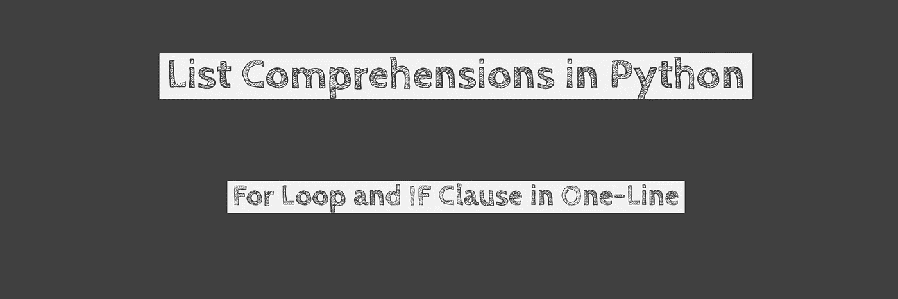

# Python 一行程序→列表理解

> 原文：<https://medium.com/quick-code/python-one-liner-list-comprehension-24e35a20bd1d?source=collection_archive---------0----------------------->



Source: Sandeep More

如果您正在使用 Python 语言，那么您应该认真寻找编写高效代码的方法，只要适用，就经常使用列表理解而不是 for 循环。在这篇文章中，我们将讨论它的优点、定义、语法、何时使用和何时不使用，并附有一些例子。

# 使用列表理解的优势

*   代码更加简洁易读
*   代码减少到更少的行数，因为循环被替换为一行代码
*   与 For 循环相比，代码使用的内存更少
*   代码执行要快得多
*   列表理解可以包含复杂的表达式和嵌套函数

# **定义和语法**

Python 中的**列表**是方括号中逗号分隔的表达式列表。

python 中的**列表理解**是使用 for 循环和 if 子句创建列表的更简洁的方式。

语法由方括号和一个表达式组成，后跟一个 for 子句，然后是零个或多个 for 或 if 子句，结果将是一个新的列表。

# 何时使用

我们应该使用这样的列表:

1.  我们需要序列数据类型，这是建立序列数据列表的最快方法之一。
2.  创建新的列表，其中每个输出项都是对序列或可迭代的给定输入成员的某种操作的结果
3.  当我们要对生成的输出列表执行一些操作时。

# **不使用时**

如果逻辑太长或太复杂，For 循环应该优先于列表理解。你可以遵循的一般规则是，如果列表理解大于两行，就使用普通的 for 循环。

# 列表理解示例

## 列表

```
*>>> books = ['aaa','bbb','ccc','ddd']**>>> languages = ['English','Spanish','French']*
```

有两个列表可用，我们需要建立一个包含所有书籍及其可用语言的列表。

## 传统 For 循环

使用传统的 for 循环，可以得到如下结果。注意，我们需要 3 行代码:

```
>>> for book in books:...     for language in languages:...             print((book,language))...('aaa', 'English')('aaa', 'Spanish')('aaa', 'French')('bbb', 'English')('bbb', 'Spanish')('bbb', 'French')('ccc', 'English')('ccc', 'Spanish')('ccc', 'French')('ddd', 'English')('ddd', 'Spanish')('ddd', 'French')
```

## 列表理解一行程序

下面的一行程序展示了如何使用列表理解来建立这样的列表

```
*>>> allbooks = [(book,language) for book in books for languages in language ]*>>> allbooks[('aaa', 'English'), ('aaa', 'Spanish'), ('aaa', 'French'), ('bbb', 'F'), ('bbb', 'r'), ('bbb', 'e'), ('bbb', 'n'), ('bbb', 'c'), ('bbb', 'h'), ('ccc', 'h'), ('ddd', 'h')]
```

新列表按照原始图书列表中图书的升序排列。通过改变 for 循环的顺序，以语言的升序排列列表，可以修改相同的示例，如下所示:

```
>>> allbooks = [(book,language) for language in languages for book in books ]>>> allbooks[('aaa', 'English'), ('bbb', 'English'), ('ccc', 'English'), ('ddd', 'English'), ('aaa', 'Spanish'), ('bbb', 'Spanish'), ('ccc', 'Spanish'), ('ddd', 'Spanish'), ('aaa', 'French'), ('bbb', 'French'), ('ccc', 'French'), ('ddd', 'French')]
```

## 用 IF 条件列出理解的一行程序

假设我们需要一份除英语之外的所有书籍及其语言的列表。我们可以通过编写如下 IF 子句来实现这一点，我们将获得所有没有英语语言的书籍的列表:

```
>>> allbooks = [(book,language) for book in books for language in languages if language !='English']>>> allbooks[('aaa', 'Spanish'), ('aaa', 'French'), ('bbb', 'Spanish'), ('bbb', 'French'), ('ccc', 'Spanish'), ('ccc', 'French'), ('ddd', 'Spanish'), ('ddd', 'French')]>>>
```

## 嵌套列表理解

上面提到的一个好处就是列表理解可以容纳复杂的表达式和嵌套函数。让我们以 2 x 2 矩阵为例:

```
>>> data = [...     [1,4],...     [2,3]]
>>> data[[1, 4], [2, 3]]
```

假设我们需要转置上面 2 x 2 矩阵中的行和列，那么可以用下面的一行代码来完成:

```
>>> [[row[i] for row in data] for i in range(2)][[1, 2], [4, 3]]
```

**再举几个例子:**

*构建前 10 个数字的列表*

```
>>> x=10>>> [x for x in range(10)][0, 1, 2, 3, 4, 5, 6, 7, 8, 9]>>> x9
```

*建立数字及其平方值的列表*

```
>>> x=[10,11,13,14]>>> [(x,x**2) for x in x ][(10, 100), (11, 121), (13, 169), (14, 196)]
```

以上只是一些小例子，但是如果你坚持使用并玩习惯列表理解的心理游戏，编码会更好更高效。

如果您习惯于映射和过滤 python 中的内置函数，那么开始使用列表理解，因为在某些情况下它们更快，并且与使用映射/过滤相比，代码更容易阅读

还要注意，列表理解不能代替 for 循环，因为每个 For 循环不能是列表理解，但是列表理解可以是 For 循环。结束这个话题，列表理解做了一件很好的工作，即“建立列表”

编码快乐！