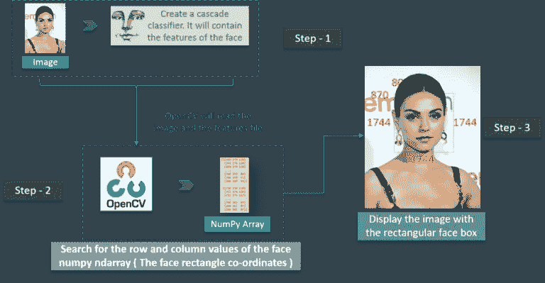
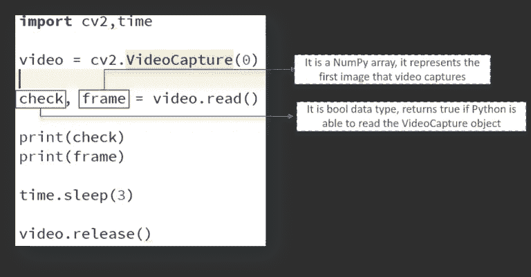
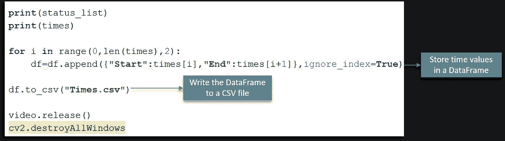

# OpenCV Python 教程——Python 中 OpenCV 的计算机视觉

> 原文：<https://medium.com/edureka/python-opencv-tutorial-5549bd4940e3?source=collection_archive---------1----------------------->


OpenCV Tutorial — Edureka

在这篇 OpenCV Python 教程文章中，我们将讨论在 Python 中使用 OpenCV 的计算机视觉的各个方面。长期以来，OpenCV 一直是软件开发中至关重要的一部分。学习 OpenCV 对开发人员来说是一笔很好的资产，有助于提高编码水平，也有助于建立软件开发职业生涯。

我们将检验以下概念:

*   什么是计算机视觉？
*   计算机如何读取图像？
*   OpenCV 是什么？
*   OpenCV 的基础知识
*   使用 OpenCV 进行图像检测
*   使用 OpenCV 的运动检测器

# 什么是计算机视觉？

为了简化这个问题的答案，让我们考虑一个场景。

我们都用脸书，对吗？假设你和你的朋友去度假，你点击了很多照片，你想把它们上传到脸书，你做到了。但是现在，找到你朋友的脸并在每张照片上做上标记，难道不会花很多时间吗？脸书很聪明，可以帮你标记人。

那么，你认为自动标记功能是如何工作的呢？简单来说，它的工作原理是计算机视觉。

计算机视觉是一个跨学科领域，研究如何让计算机从数字图像或视频中获得高层次的理解。

这里的想法是将人类视觉系统可以完成的任务自动化。因此，计算机应该能够识别诸如人脸、灯柱甚至雕像之类的物体。

# 计算机如何读取图像？

考虑下图:


我们可以看出这是纽约天际线的图像。但是，计算机能自己找出答案吗？答案是否定的！

计算机读取 0 到 255 范围内的任何图像。

对于任何彩色图像，都有 3 个原色通道——红色、绿色和蓝色。它的工作原理非常简单。

为每个原色形成一个矩阵，然后这些矩阵组合起来为各个 R、G、B 颜色提供一个像素值。

矩阵的每个元素提供关于像素亮度的数据。

考虑下面的图像:


如图所示，此处图像的大小可以计算为 B x A x 3。

注意:对于黑白图像，只有一个单通道。

接下来，让我们看看 OpenCV 到底是什么。

# OpenCV 是什么？

OpenCV 是一个 Python 库，旨在解决计算机视觉问题。OpenCV 最初是由英特尔在 1999 年开发的，但后来得到了 Willow Garage 的支持。

OpenCV 支持多种编程语言，如 C++、Python、Java 等。支持多种平台，包括 Windows、Linux 和 MacOS。

OpenCV Python 只不过是用于 Python 的原始 C++库的包装类。使用这种方法，所有 OpenCV 数组结构都可以与 NumPy 数组相互转换。

这使得它更容易与其他使用 NumPy 的库集成。比如 SciPy、Matplotlib 等库。

接下来，在本文中，让我们看看可以用 OpenCV 执行的一些基本操作。

# 用 OpenCV 的基本操作？

让我们看看各种概念，从加载图像到调整图像大小等等。

## 使用 OpenCV 加载图像:

```
Import cv2
# colored Image
Img = cv2.imread (“Penguins.jpg”,1)
# Black and White (gray scale)
Img_1 = cv2.imread (“Penguins.jpg”,0))
```

正如上面这段代码所示，第一个要求是导入 OpenCV 模块。

稍后我们可以使用 **imread** 模块读取图像。参数中的 1 表示它是彩色图像。如果参数是 0 而不是 1，这意味着导入的图像是黑白图像。这张图片的名字是“企鹅”。很简单，对吧？

## 图像形状/分辨率:

我们可以利用形状子功能打印出图像的形状。参考下文。

```
Import cv2
# Black and White (gray scale)
Img = cv2.imread (“Penguins.jpg”,0)
Print(img.shape)
```

对于图像的形状，我们指的是 NumPy 数组的形状。从执行代码中可以看出，矩阵由 768 行和 1024 列组成。

## 显示图像:

使用 OpenCV 显示图像非常简单明了。参考下文。

```
import cv2
# Black and White (gray scale)
Img = cv2.imread (“Penguins.jpg”,0)
cv2.imshow(“Penguins”, img)
cv2.waitKey(0)
# cv2.waitKey(2000)
cv2.destroyAllWindows()
```

正如你所看到的，我们首先使用 **imread 导入图像。**我们需要一个窗口输出来显示图像，对吗？

我们使用 **imshow** 函数通过打开一个窗口来显示图像。 **imshow** 函数有两个参数，即窗口名称和要显示的图像对象。

稍后，我们等待一个用户事件。**等待键**使窗口静止，直到用户按下一个键。传递给它的参数是以毫秒为单位的时间。

最后，我们使用 **destroyAllWindows** 根据 waitForKey 参数关闭窗口。

## 调整图像大小:

同样，调整图像大小也非常容易。下面是另一段代码:

```
import cv2
# Black and White (gray scale)
img = cv2.imread (“Penguins.jpg”,0)
resized_image = cv2.resize(img, (650,500))
cv2.imshow(“Penguins”, resized_image)
cv2.waitKey(0)
cv2.destroyAllWindows()
```

这里， **resize** 功能用于将图像调整到所需的形状。这里的参数是新的调整大小的图像的形状。

稍后，请注意图像对象从 **img** 变为 **resized_image，**，因为现在图像对象发生了变化。

其余的代码与前面的代码相比非常简单，对吗？

我肯定你们很想看看企鹅，对吧？这就是我们一直想要输出的图像！


还有另一种方法将参数传递给 resize 函数。参考下文。

```
Resized_image = cv2.resize(img, int(img.shape[1]/2), int(img.shape[0]/2)))
```

这里，我们得到的新图像形状是原始图像的一半。

接下来，让我们看看如何使用 OpenCV 进行人脸检测。

# 使用 OpenCV 进行人脸检测

起初这看起来很复杂，但是非常容易。让我带你经历整个过程，你会有同样的感觉。

**步骤 1:** 考虑到我们的先决条件，我们首先需要一个图像。稍后，我们需要创建一个级联分类器，它将最终给出我们的脸的特征。

**第二步:**这一步包括使用 OpenCV，它将读取图像和特征文件。因此，在这一点上，在主数据点上有 NumPy 数组。

我们需要做的就是搜索 face NumPy ndarray 的行和列值。这是面矩形坐标的数组。

**第三步:**最后一步是用矩形面部框显示图像。

看看下面的图片，为了便于阅读，我以图片的形式总结了 3 个步骤:

很简单，对吗？



首先，我们创建一个 **CascadeClassifier** 对象来提取面部特征，如前所述。包含面特征的 XML 文件的路径是这里的参数。

下一步将是读取上面有人脸的图像，并使用 **COLOR_BGR2GREY** 将其转换为黑白图像。接下来，我们搜索图像的坐标。这是使用**检测多尺度**完成的。

你问什么坐标？这是面部矩形的坐标。**比例因子**用于将形状值减少 5%,直到找到面部。因此，总的来说，值越小，精确度越高。

最后把脸印在窗户上。

## 添加矩形面框:

这个逻辑非常简单——就像使用 for 循环语句一样简单。看看下面的图片。


我们定义了使用 **cv2.rectangle** 创建矩形的方法，方法是传递图像对象、方框轮廓的 RGB 值和矩形的宽度等参数。

让我们来看看面部检测的完整代码:

```
import cv2
# Create a CascadeClassifier Object
face_cascade = cv2.CascadeClassifier("haarcascade_frontalface_default.xml")
# Reading the image as it is
img = cv2.imread("photo.jpg")
# Reading the image as gray scale image
gray_img = cv2.cvtColor(img,cv2.COLOR_BGR2GRAY)
# Search the co-ordintes of the image
faces = face_cascade.detectMultiScale(gray_img, scaleFactor = 1.05,
                                      minNeighbors=5)
for x,y,w,h in faces:
    img = cv2.rectangle(img, (x,y), (x+w,y+h),(0,255,0),3)
resized = cv2.resize(img, (int(img.shape[1]/7),int(img.shape[0]/7)))
cv2.imshow("Gray", resized)
cv2.waitKey(0) 
cv2.destroyAllWindows()
```

接下来，让我们看看如何使用 OpenCV 通过计算机网络摄像头捕捉视频。

# 使用 OpenCV 捕获视频

使用 OpenCV 捕捉视频也非常简单。下面的循环会给你一个更好的想法。看看这个:


图像被一个接一个地读取，因此由于帧的快速处理而产生视频，这使得各个图像移动。

## 捕捉视频:

看看下面的图片:


首先，我们像往常一样导入 OpenCV 库。接下来，我们有一个名为 **VideoCapture** 的方法，用于创建 VideoCapture 对象。此方法用于触发用户机器上的摄像头。该函数的参数表示程序应该使用内置摄像头还是附加摄像头。在这种情况下,“0”表示内置摄像头。

最后，**释放**方法用于在几毫秒内释放相机。

当您继续输入并尝试执行上面的代码时，您会注意到相机灯在一瞬间打开，稍后关闭。为什么会这样？

这是因为没有时间延迟来保持相机的功能。


看看上面的代码，我们有一个新的代码行叫做**time . sleep(3)**——这使得脚本停止 3 秒钟。请注意，传递的参数是以秒为单位的时间。因此，当代码执行时，网络摄像头将打开 3 秒钟。

## 添加窗口:

添加一个窗口来显示视频输出非常简单，可以与用于图像的相同方法相比较。但是，有一点小小的变化。查看以下代码:



我很肯定，除了一两行代码之外，您可以从上面的代码中得到最大的理解。

这里，我们定义了一个 NumPy 数组，用来表示视频捕获的第一幅图像——它存储在**帧**数组中。

我们还有**检查**——这是一个布尔数据类型，如果 Python 能够访问和读取 **VideoCapture** 对象，它将返回 **True** 。

查看下面的输出:


正如您所看到的，我们得到的输出为 **True** ，并且打印了帧数组的一部分。

但我们需要阅读视频的第一帧/图像才能开始，对吗？

要做到这一点，我们需要首先创建一个 frame 对象，它将读取 **VideoCapture** 对象的图像。


如上所示， **imshow** 方法用于捕捉视频的第一帧。

与此同时，我们试图捕捉视频的第一个图像/帧，但直接捕捉视频。

那么我们如何在 OpenCV 中捕捉视频而不是第一张图片呢？

## 直接捕捉视频:

为了捕捉视频，我们将使用 **while** 循环。而条件将是这样的，直到除非**【检查】**为**真。**如果是，那么 Python 会显示帧。

下面是代码片段图像:


如前所述，我们利用 **cvtColor** 函数将每一帧转换成灰度图像。

**等待键(1)** 将确保在每毫秒的间隙后生成一个新帧。

这里需要注意的是， **while** 循环完全用于帮助遍历帧并最终显示视频。

这里还有一个用户事件触发器。一旦用户按下“q”键，程序窗口关闭。

OpenCV 很容易掌握，对吗？我个人非常喜欢 OpenCV 的可读性，以及初学者使用 OpenCV 的速度。

接下来，让我们看看如何使用 OpenCV 来使用一个非常有趣的运动检测器用例。

# 用例:使用 OpenCV 的运动检测器

## 问题陈述:

一家研究人类行为的公司找到了你。你的任务是给他们一个摄像头，可以检测到运动或任何运动在它面前。这应该会返回一个图表，这个图表应该包含人/物体在摄像机前的时间。


因此，现在我们已经定义了我们的问题陈述，我们需要建立一个解决方案逻辑来以结构化的方式处理问题。

考虑下图:


最初，我们将图像保存在特定的帧中。

下一步是将图像转换成高斯模糊图像。这样做是为了确保我们计算出模糊图像和实际图像之间的明显差异。

此时，图像仍然不是一个对象。我们定义一个阈值来消除图像中的瑕疵，如阴影和其他噪声。

稍后定义对象的边界，我们在对象周围添加一个矩形框，就像我们在博客前面讨论的那样。

最后，我们计算对象出现和退出帧的时间。

很简单，对吧？

下面是代码片段:


这里也遵循同样的原则。我们首先导入包并创建 **VideoCapture** 对象，以确保我们使用网络摄像头捕捉视频。

while 循环遍历视频的各个帧。我们将彩色帧转换为灰度图像，然后将灰度图像转换为高斯模糊。

我们需要存储视频的第一个图像/帧，对吗？为此，我们只使用了 **if** 语句。

现在，让我们深入一点代码:


我们利用 **absdiff** 函数来计算第一个出现的帧和所有其他帧之间的差异。

**threshold** 函数提供了一个阈值，它会将小于 30 的差值转换为黑色。如果差值大于 30，它会将这些像素转换为白色。 **THRESH_BINARY** 用于此目的。

稍后，我们使用 **findContours** 函数来定义图像的轮廓区域。我们在这个阶段也添加了边框。

如前所述，**轮廓区域**功能可去除噪声和阴影。为了简单起见，它将只保留白色部分，其面积大于 1000 像素，正如我们为其定义的那样。

稍后，我们在工作框架中围绕我们的对象创建一个矩形框。

接下来是这段简单的代码:


如前所述，帧每 1 毫秒改变一次，当用户输入**‘q’，**时，循环中断，窗口关闭。

我们已经在这个 OpenCV Python 教程博客上讨论了所有的主要细节。我们的用例还剩下一件事，那就是我们需要计算物体在摄像机前的时间。

## 计算时间:


我们利用**数据帧**来存储时间值，在此期间目标检测和移动出现在帧中。

接下来是前面解释过的**视频捕捉**功能。但是在这里，我们有一个标志位，我们称之为**状态。**我们在记录开始时使用该状态为**零**，因为物体最初**不可见**。


如上图所示，当检测到对象时，我们将状态标志更改为 1。很简单，对吧？


我们将为每个扫描的帧制作一个状态列表，稍后在列表中使用 **datetime** 记录发生变化的日期和时间。



我们将时间值存储在**数据帧**中，如上图所示。最后，我们将把**数据帧**写入一个 CSV 文件，如图所示。

## 绘制运动检测图:

我们用例中显示结果的最后一步。我们正在显示表示双轴运动的图形。考虑下面的代码:


首先，我们从 **motion_detector.py** 文件导入**数据帧**。

下一步是将时间转换成可读的字符串格式，以便解析。

最后，使用**散景图在浏览器上绘制时间值的**数据帧**。**

**输出:**


我希望这篇文章能帮助你学习使用 Python 开始学习 OpenCV 所需的所有基础知识。

当您试图开发需要图像识别和类似原理的应用程序时，这将非常方便。现在，借助 Python 中的 OpenCV，您也应该能够使用这些概念轻松地开发应用程序。

如果你想查看更多关于人工智能、DevOps、道德黑客等市场最热门技术的文章，你可以参考 Edureka 的官方网站。

请留意本系列中的其他文章，它们将解释 Python 和数据科学的各个方面。

> 1. [Python 教程](/edureka/python-tutorial-be1b3d015745)
> 
> 2. [](/edureka/python-functions-f0cabca8c4a) [Python 编程语言](/edureka/python-programming-language-fc1015de7a6f)
> 
> 3. [Python 函数](/edureka/python-functions-f0cabca8c4a)
> 
> 4.[Python 中的文件处理](/edureka/file-handling-in-python-e0a6ff96ede9)
> 
> 5. [](/edureka/scikit-learn-machine-learning-7a2d92e4dd07) [Python Numpy 教程](/edureka/python-numpy-tutorial-89fb8b642c7d)
> 
> 6. [Scikit Learn 机器学习](/edureka/scikit-learn-machine-learning-7a2d92e4dd07)
> 
> 7. [Python 熊猫教程](/edureka/python-pandas-tutorial-c5055c61d12e)
> 
> 8. [Matplotlib 教程](/edureka/python-matplotlib-tutorial-15d148a7bfee)
> 
> 9. [Tkinter 教程](/edureka/tkinter-tutorial-f655d3f4c818)
> 
> 10.[请求教程](/edureka/python-requests-tutorial-30edabfa6a1c)
> 
> 11. [PyGame 教程](/edureka/pygame-tutorial-9874f7e5c0b4)
> 
> 12.[用 Python 进行网页抓取](/edureka/web-scraping-with-python-d9e6506007bf)
> 
> 13. [PyCharm 教程](/edureka/pycharm-tutorial-d0ec9ce6fb60)
> 
> 14.[机器学习教程](/edureka/machine-learning-tutorial-f2883412fba1)
> 
> 15.[Python 中从头开始的线性回归算法](/edureka/linear-regression-in-python-e66f869cb6ce)
> 
> 16.[面向数据科学的 Python](/edureka/learn-python-for-data-science-1f9f407943d3)
> 
> 17. [Python 正则表达式](/edureka/python-regex-regular-expression-tutorial-f2d17ffcf17e)
> 
> 18.[Python 中的循环](/edureka/loops-in-python-fc5b42e2f313)
> 
> 19. [Python 项目](/edureka/python-projects-1f401a555ca0)
> 
> 20.[机器学习项目](/edureka/machine-learning-projects-cb0130d0606f)
> 
> 21.[Python 中的数组](/edureka/arrays-in-python-14aecabec16e)
> 
> 22.[在 Python 中设置](/edureka/sets-in-python-a16b410becf4)
> 
> 23.[Python 中的多线程](/edureka/what-is-mutithreading-19b6349dde0f)
> 
> 24. [Python 面试问题](/edureka/python-interview-questions-a22257bc309f)
> 
> 25. [Java vs Python](/edureka/java-vs-python-31d7433ed9d)
> 
> 26.[如何成为一名 Python 开发者？](/edureka/how-to-become-a-python-developer-462a0093f246)
> 
> 27. [Python Lambda 函数](/edureka/python-lambda-b84d68d449a0)
> 
> 28.[网飞如何使用 Python？](/edureka/how-netflix-uses-python-1e4deb2f8ca5)
> 
> 29.[Python 中的 Socket 编程是什么](/edureka/socket-programming-python-bbac2d423bf9)
> 
> 30. [Python 数据库连接](/edureka/python-database-connection-b4f9b301947c)
> 
> 31. [Golang vs Python](/edureka/golang-vs-python-5ac32e1ef2)
> 
> 32. [Python Seaborn 教程](/edureka/python-seaborn-tutorial-646fdddff322)
> 
> 33. [Python 职业机会](/edureka/python-career-opportunities-a2500ce158de)

*原载于 2019 年 2 月 8 日 www.edureka.co*[](https://www.edureka.co/blog/python-opencv-tutorial/)**。**