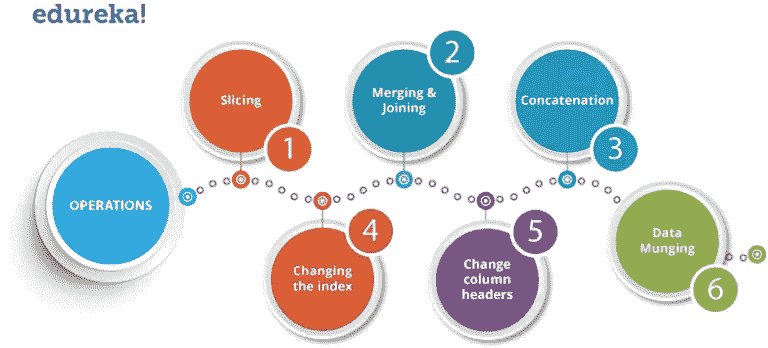
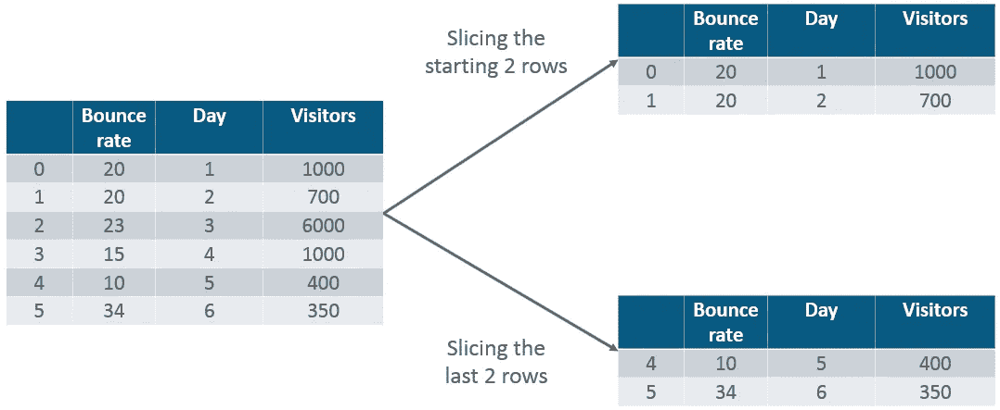
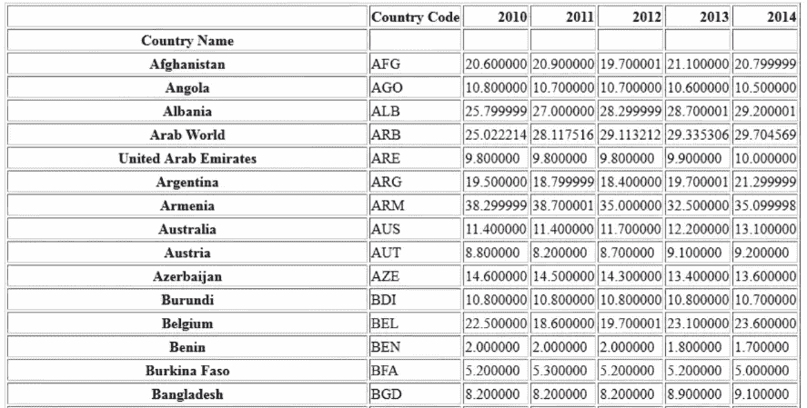
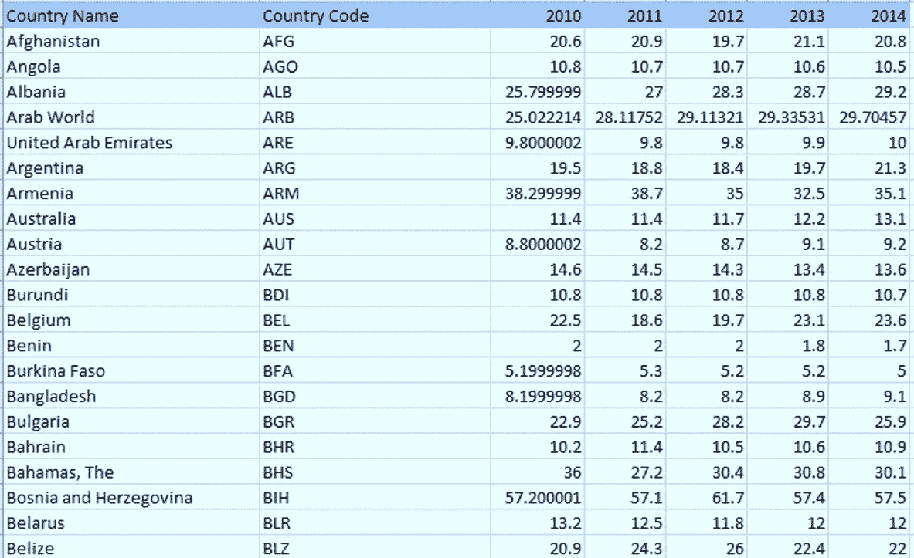
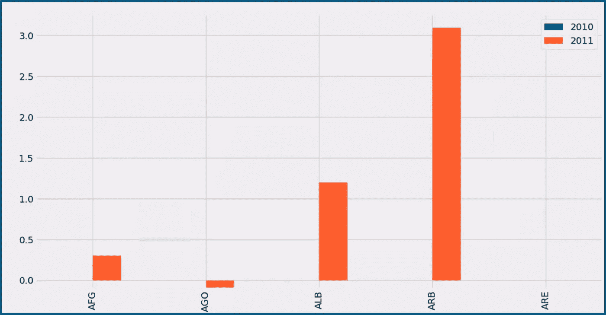

# Python 熊猫指南-学习熊猫进行数据分析

> 原文：<https://medium.com/edureka/python-pandas-tutorial-c5055c61d12e?source=collection_archive---------0----------------------->


Python Pandas Tutorial - Edureka

在这篇博客中，我们将讨论使用 Python 中的 Pandas 进行数据分析。在谈论熊猫之前，我们必须理解 Numpy 数组的概念。为什么？因为 Pandas 是一个开源软件库，构建在 ***NumPy*** 之上。在这个 Python 熊猫教程中，我将带您浏览以下主题，它们将作为即将到来的博客的基础:

1.  熊猫是什么？
2.  熊猫行动

2.1 对数据帧进行切片

2.2 合并和加入

2.3 串联

2.4 改变指数

2.5 更改列标题

2.6 数据管理

3.用例:分析青年失业数据

让我们开始吧。:-)

# 什么是蟒蛇熊猫？

Pandas 用于数据操作、分析和清理。Python pandas 非常适合不同类型的数据，例如:

*   具有异构类型列的表格数据
*   有序和无序时间序列数据
*   带有行列标签的任意矩阵数据
*   未标记的数据
*   任何其他形式的观察或统计数据集

# 熊猫怎么装？

要安装 Python Pandas，进入你的命令行/终端，键入“ ***pip install pandas*** ”或者，如果你的系统中已经安装了 ***anaconda*** ，只需键入“***conda install Pandas***”。一旦安装完成，进入你的 IDE (Jupyter，PyCharm 等)。)并简单地通过键入:" ***将熊猫导入为 pd*** "来导入它

继续 Python 熊猫教程，让我们看看它的一些操作:

# Python 熊猫运营

使用 Python pandas，您可以对序列、数据框、缺失数据、分组依据等执行大量操作。下面列出了一些常见的数据操作:



List of Python Pandas Operations - Python Pandas Tutorial

现在，让我们逐一了解所有这些操作。

## 分割数据帧

为了对数据进行切片，您需要一个数据框。别担心，数据框是一种二维数据结构，也是最常见的熊猫对象。首先，让我们创建一个数据框。

请参考下面的代码，了解它在 PyCharm 中的实现:

```
**import** pandas as pdXYZ_web**=** {'Day':[1,2,3,4,5,6], "Visitors":[1000, 700,6000,1000,400,350], "Bounce_Rate":[20,20, 23,15,10,34]}df**=** pd.DataFrame(XYZ_web)print(df)
```

**输出:**

```
 Bounce_Rate Day Visitors0     20          1   10001     20          2   7002     23          3   60003     15          4   10004     10          5   4005     34          6   350
```

上面的代码将把一个字典和左边的索引一起转换成一个熊猫数据框。现在，让我们从这个数据帧中截取一个特定的列。请参考下图:



Slicing in Pandas - Python Pandas Tutorial

```
print(df.head(2))
```

**输出:**

```
 Bounce_Rate Day Visitors0      20         1   10001      20         2    700
```

同样，如果您想要最后两行数据，请键入以下命令:

```
print(df.tail(2))
```

**输出:**

```
 Bounce_Rate Day Visitors4      10      5    4005      34      6    350
```

接下来，在这个 Python 熊猫教程中，让我们执行合并和连接。

## 合并和加入

在合并中，可以将两个数据框合并成一个数据框。您还可以决定要将哪些列设为公共列。让我实际实现一下，首先我将创建三个数据帧，其中有一些键值对，然后将这些数据帧合并在一起。参考下面的代码:

```
 HPI   IND_GDP Int_Rate0  80      50      21  90      45      12  70      45      23  60      67      3
```

**代码:**

```
**import** pandas as pddf1**=** pd.DataFrame({ "HPI":[80,90,70,60],"Int_Rate":[2,1,2,3],"IND_GDP":[50,45,45,67]}, index**=**[2001, 2002,2003,2004])df2**=**pd.DataFrame({ "HPI":[80,90,70,60],"Int_Rate":[2,1,2,3],"IND_GDP":[50,45,45,67]}, index**=**[2005, 2006,2007,2008])merged**=** pd.merge(df1,df2)print(merged)
```

如上所述，两个数据框已经合并为一个数据框。现在，您还可以指定要成为公共列的列。例如，我希望“ **HPI** ”列是通用的，而对于其他所有内容，我希望有单独的列。所以，让我实际地实现它:

```
df1 **=** pd.DataFrame({"HPI":[80,90,70,60],"Int_Rate":[2,1,2,3], "IND_GDP":[50,45,45,67]}, index**=**[2001, 2002,2003,2004])df2 **=** pd.DataFrame({"HPI":[80,90,70,60],"Int_Rate":[2,1,2,3],"IND_GDP":[50,45,45,67]}, index**=**[2005, 2006,2007,2008])merged**=** pd.merge(df1,df2,on **=**"HPI")print(merged)
```

**输出:**

```
 IND_GDP  Int_Rate  Low_Tier_HPI  Unemployment2001     50      2         50.0            1.02002     45      1         NaN             NaN2003     45      2         45.0            3.02004     67      3         67.0            5.02004     67      3         34.0            6.0
```

接下来，让我们来了解一下 python 熊猫教程中**加入**的情况。将两个不同索引的数据帧组合成单个结果数据帧是另一种方便的方法。这非常类似于“合并”操作，除了连接操作将在“索引”而不是“列”上进行。让我们切实执行它。

```
df1 **=** pd.DataFrame({"Int_Rate":[2,1,2,3], "IND_GDP":[50,45,45,67]}, index**=**[2001, 2002,2003,2004])df2 **=** pd.DataFrame({"Low_Tier_HPI":[50,45,67,34],"Unemployment":[1,3,5,6]}, index**=**[2001, 2003,2004,2004])joined**=** df1.join(df2)print(joined)
```

**输出:**

```
 IND_GDP  Int_Rate Low_Tier_HPI  Unemployment2001     50       2         50.0           1.02002     45       1         NaN            NaN2003     45       2         45.0           3.02004     67       3         67.0           5.02004     67       3         34.0           6.0
```

正如您在上面的输出中所注意到的，在 2002 年(index)，列“low_tier_HPI”和“失业”没有值，因此它打印了 NaN(不是一个数字)。在 2004 年晚些时候，这两个值都可用，因此它打印了各自的值。

继续学习 Python 熊猫教程，让我们了解如何连接两个数据框。

## 串联

串联基本上将数据帧粘合在一起。您可以选择要连接的尺寸。为此，只需使用“pd.concat”并传入要连接在一起的数据帧列表。考虑下面的例子。

```
df1 **=** pd.DataFrame({"HPI":[80,90,70,60],"Int_Rate":[2,1,2,3], "IND_GDP":[50,45,45,67]}, index**=**[2001, 2002,2003,2004])df2 **=** pd.DataFrame({"HPI":[80,90,70,60],"Int_Rate":[2,1,2,3],"IND_GDP":[50,45,45,67]}, index**=**[2005, 2006,2007,2008])concat**=** pd.concat([df1,df2])print(concat)
```

**输出:**

```
 HPI  IND_GDP Int_Rate2001    80    50       22002    90    45       12003    70    45       22004    60    67       32005    80    50       22006    90    45       12007    70    45       22008    60    67       3
```

正如您在上面看到的，这两个数据框被粘合在一个数据框中，索引从 2001 年一直到 2008 年。接下来，您还可以指定 axis=1，以便沿着列进行联接、合并或连接。参考下面的代码:

```
df1 **=** pd.DataFrame({"HPI":[80,90,70,60],"Int_Rate":[2,1,2,3], "IND_GDP":[50,45,45,67]}, index**=**[2001, 2002,2003,2004])df2 **=** pd.DataFrame({"HPI":[80,90,70,60],"Int_Rate":[2,1,2,3],"IND_GDP":[50,45,45,67]}, index**=**[2005, 2006,2007,2008])concat**=** pd.concat([df1,df2],axis**=**1)print(concat)
```

**输出:**

```
 HPI  IND_GDP  Int_Rate HPI  IND_GDP Int_Rate2001   80.0  50.0       2.0   NaN    NaN     NaN2002   90.0  45.0       1.0   NaN    NaN     NaN2003   70.0  45.0       2.0   NaN    NaN     NaN2004   60.0  67.0       3.0   NaN    NaN     NaN2005   NaN   NaN        NaN   80.0   50.0    2.02006   NaN   NaN        NaN   90.0   45.0    1.02007   NaN   NaN        NaN   70.0   45.0    2.02008   NaN   NaN        NaN   60.0   67.0    3.0
```

正如你在上面看到的，有一堆缺失的值。发生这种情况的原因是，数据框没有包含您想要连接的所有索引的值。因此，在轴上进行联接或连接时，应该确保所有信息都正确排列。

## 更改索引

接下来，在 python 熊猫教程中，我们将了解如何更改数据框中的索引值。例如，让我们用字典中的一些键值对创建一个数据帧，并更改索引值。考虑下面的例子:

让我们看看它实际上是如何发生的:

```
**import** pandas as pddf**=** pd.DataFrame({"Day":[1,2,3,4], "Visitors":[200, 100,230,300], "Bounce_Rate":[20,45,60,10]})df.set_index("Day", inplace**=** True)print(df)
```

**输出:**

```
Day   Bounce_Rate  Visitors1      20           2002      45           1003      60           2304      10           300
```

正如您在上面的输出中所注意到的，索引值已经相对于“Day”列进行了更改。

## 更改列标题

现在让我们来更改 python 熊猫教程中的列标题。让我们举一个同样的例子，我将把列标题从“访问者”改为“用户”。所以，我来实际实现一下。

```
**import** pandas as pddf **=** pd.DataFrame({"Day":[1,2,3,4], "Visitors":[200, 100,230,300], "Bounce_Rate":[20,45,60,10]})df **=** df.rename(columns**=**{"Visitors":"Users"})print(df)
```

**输出:**

```
 Bounce_Rate  Day  Users0    20         1    2001    45         2    1002    60         3    2303    10         4    300
```

如上所述，列标题“访问者”已被更改为“用户”。接下来，在 python 熊猫教程中，让我们执行数据管理。

## 数据管理

在数据管理中，您可以将特定的数据转换成不同的格式。例如，如果您有一个. csv 文件，您可以将其转换为。html 或任何其他数据格式。所以，让我实际地实现它。

```
**import** pandas as pdcountry**=** pd.read_csv("D:\\Users\\Aayushi\\Downloads\\world-bank-youth-unemployment\\API_ILO_country_YU.csv",index_col**=**0)country.to_html('edu.html')
```

一旦您运行了这段代码，就会创建一个名为“edu.html”的 HTML 文件。您可以直接复制文件的路径并将其粘贴到浏览器中，浏览器会以 HTML 格式显示数据。请参阅下面的截图:



Output in HTML Format - Python Pandas Tutorial

接下来，在 python 熊猫教程中，让我们看看一个关于全球青年失业的用例。

# 青少年失业数据的用例分析

## **问题陈述**:

您会看到一个数据集包含了 2010 年至 2014 年全球失业青年的百分比。您必须使用这个数据集，找到 2010-2011 年每个国家的青年百分比变化。


首先，让我们了解包含国家名称、国家代码和 2010-2014 年年份等列的数据集。现在使用熊猫，我们将使用“pd.read_csv”来读取。csv 文件格式文件。
参见下图截图:



Snapshot of csv file - Python Pandas Tutorial

让我们继续进行数据分析，从中找出 2010 年至 2011 年间失业青年的百分比变化。然后我们将使用 ***Matplotlib*** 库对其进行可视化，这是 Python 中一个强大的可视化库。它可以用在 Python 脚本、外壳、web 应用服务器和其他 GUI 工具包中。

现在，让我们用 PyCharm 实现代码:

```
**import** pandas as pd**import** matplotlib.pyplot as plt**from** matplotlib **import** stylestyle.use('fivethirtyeight')country**=** pd.read_csv("D:\\Users\\Aayushi\\Downloads\\world-bank-youth-unemployment\\API_ILO_country_YU.csv",index_col**=**0)df**=** country.head(5)df**=** df.set_index(["Country Code"])sd **=** sd.reindex(columns**=**['2010','2011'])db**=** sd.diff(axis**=**1)db.plot(kind**=**"bar")plt.show()
```

正如您在上面看到的，我已经对国家数据框的前 5 行进行了分析。接下来，我将索引值定义为“国家代码”，然后将该列重新索引为 2010 年和 2011 年。然后，我们有一个数据框 db，它打印两列之间的差异或 2010 年至 2011 年失业青年的百分比变化。最后，我用 Python 中的 Matplotlib 库绘制了一个条形图。



Bar Graph - Python Pandas Tutorial

现在，如果你注意到上面的情节，在阿富汗(AFG)，2010 年至 2011 年间，失业青年的人数上升了大约。0.25%.然后在安哥拉，出现了一种消极趋势，这意味着失业青年的比例有所下降。同样，您可以对不同的数据集执行分析。

所以，各位，这篇文章到此结束。如果您想查看更多关于市场上最流行的技术的文章，比如人工智能、DevOps、伦理黑客，您可以参考爱德华卡的官方网站。

一定要注意本系列的其他文章，这些文章将解释 Python 和数据科学的其他方面。

> 1. [Python 教程](/edureka/python-tutorial-be1b3d015745)
> 
> 2. [](/edureka/python-functions-f0cabca8c4a) [Python 编程语言](/edureka/python-programming-language-fc1015de7a6f)
> 
> 3. [Python 函数](/edureka/python-functions-f0cabca8c4a)
> 
> 4.[Python 中的文件处理](/edureka/file-handling-in-python-e0a6ff96ede9)
> 
> 5. [](/edureka/scikit-learn-machine-learning-7a2d92e4dd07) [Python Numpy 教程](/edureka/python-numpy-tutorial-89fb8b642c7d)
> 
> 6. [Scikit 学习机器学习](/edureka/scikit-learn-machine-learning-7a2d92e4dd07)
> 
> 7. [Matplotlib 教程](/edureka/python-matplotlib-tutorial-15d148a7bfee)
> 
> 8. [Tkinter 教程](/edureka/tkinter-tutorial-f655d3f4c818)
> 
> 9.[请求教程](/edureka/python-requests-tutorial-30edabfa6a1c)
> 
> 10. [PyGame 教程](/edureka/pygame-tutorial-9874f7e5c0b4)
> 
> 11. [OpenCV 教程](/edureka/python-opencv-tutorial-5549bd4940e3)
> 
> 12.[用 Python 进行网页抓取](/edureka/web-scraping-with-python-d9e6506007bf)
> 
> 13. [PyCharm 教程](/edureka/pycharm-tutorial-d0ec9ce6fb60)
> 
> 14.[机器学习教程](/edureka/machine-learning-tutorial-f2883412fba1)
> 
> 15.[Python 中从头开始的线性回归算法](/edureka/linear-regression-in-python-e66f869cb6ce)
> 
> 16.[面向数据科学的 Python](/edureka/learn-python-for-data-science-1f9f407943d3)
> 
> 17. [Python 正则表达式](/edureka/python-regex-regular-expression-tutorial-f2d17ffcf17e)
> 
> 18.[Python 中的循环](/edureka/loops-in-python-fc5b42e2f313)
> 
> 19. [Python 项目](/edureka/python-projects-1f401a555ca0)
> 
> 20.[机器学习项目](/edureka/machine-learning-projects-cb0130d0606f)
> 
> 21.[Python 中的数组](/edureka/arrays-in-python-14aecabec16e)
> 
> 22.[套在 Python 里](/edureka/sets-in-python-a16b410becf4)
> 
> 23.[Python 中的多线程](/edureka/what-is-mutithreading-19b6349dde0f)
> 
> 24. [Python 面试问题](/edureka/python-interview-questions-a22257bc309f)
> 
> 25. [Java vs Python](/edureka/java-vs-python-31d7433ed9d)
> 
> 26.[如何成为一名 Python 开发者？](/edureka/how-to-become-a-python-developer-462a0093f246)
> 
> 27. [Python Lambda 函数](/edureka/python-lambda-b84d68d449a0)
> 
> 28.[网飞如何使用 Python？](/edureka/how-netflix-uses-python-1e4deb2f8ca5)
> 
> 29.[Python 中的 Socket 编程是什么](/edureka/socket-programming-python-bbac2d423bf9)
> 
> 30. [Python 数据库连接](/edureka/python-database-connection-b4f9b301947c)
> 
> 31. [Golang vs Python](/edureka/golang-vs-python-5ac32e1ef2)
> 
> 32. [Python Seaborn 教程](/edureka/python-seaborn-tutorial-646fdddff322)
> 
> 33. [Python 职业机会](/edureka/python-career-opportunities-a2500ce158de)

*原载于 2018 年 4 月 5 日 www.edureka.co*[](https://www.edureka.co/blog/python-pandas-tutorial/)**。**