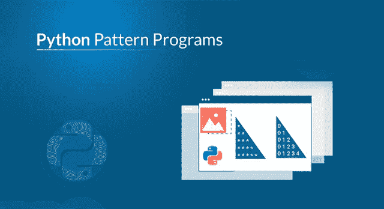
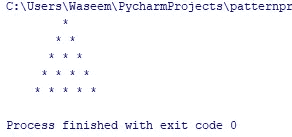
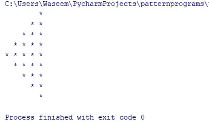
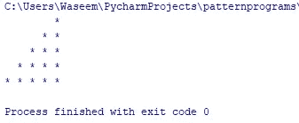
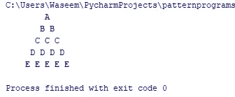

# 通过例子学习如何制作 Python 模式程序

> 原文：<https://medium.com/edureka/python-pattern-programs-75e1e764a42f?source=collection_archive---------0----------------------->



Python Pattern Programs — Edureka

Python 编程语言相当好学。各种库的实现和简单的语法使它脱颖而出，这也是它成为这十年来最流行的编程语言的原因之一。虽然学习部分很简单，但是面试官经常会问你如何为模式程序建立逻辑。这听起来可能很棘手，但用 python 来说却是小菜一碟。在本文中，我们将学习 python 中的各种模式程序。本博客涵盖了以下主题:

*   星形模式程序

1.  金字塔模式程序
2.  半金字塔模式程序
3.  菱形图案程序
4.  开始模式程序
5.  沙漏模式程序

*   数字模式程序

1.  金字塔中的简单数字
2.  帕斯卡三角模式
3.  菱形图案程序

*   字符模式程序

模式程序包含了许多嵌套循环。因此，如果您不熟悉 python 中的循环，请务必查看 python 中循环的详细教程。

# 星形模式程序

下面是 python 中的几个星型模式程序。

## 金字塔模式程序

```
def pattern(n):
      k = 2 * n - 2
      for i in range(0,n):
           for j in range(0,k):
               print(end=" ")
           k = k - 1
           for j in range(0, i+1):
                print("*", end=" ")
           print("\r")
pattern(5)
```

**输出:**



## 反向金字塔模式程序

```
def pattern(n):
      k = 2*n -2
      for i in range(n,-1,-1):
           for j in range(k,0,-1):
                print(end=" ")
           k = k +1
           for j in range(0, i+1):
                print("*", end=" ")
           print("\r")
pattern(5)
```

## **输出:**


## 右开始模式程序

```
def pattern(n):
      for i in range(0, n):
           for j in range(0, i + 1):
                print("* ", end="")
           print("\r")
      for i in range(n, 0 , -1):
          for j in range(0, i + 1):
               print("* ", end="")
          print("\r")

pattern(5)
```

## **输出:**


## 左侧开始模式程序

```
def pattern(n):
    k = 2 * n - 2
    for i in range(0, n-1):
        for j in range(0, k):
            print(end=" ")
        k = k - 2
        for j in range(0, i + 1):
            print("* ", end="")
        print("\r")
    k = -1
    for i in range(n-1,-1,-1):
        for j in range(k,-1,-1):
            print(end=" ")
        k = k + 2
        for j in range(0, i + 1):
            print("* ", end="")
        print("\r")

pattern(5)
```

## **输出:**



## 沙漏模式程序

```
def pattern(n):
     k = n - 2
     for i in range(n, -1 , -1):
          for j in range(k , 0 , -1):
               print(end=" ")
          k = k + 1    
          for j in range(0, i+1):
               print("* " , end="")
          print("\r")
      k = 2 * n  - 2
      for i in range(0 , n+1):
           for j in range(0 , k):
               print(end="")
           k = k - 1
            for j in range(0, i + 1):
                 print("* ", end="")
            print("\r")

pattern(5)
```

## **输出:**


## 半金字塔模式程序

```
def pattern(n):
     for i in range(0,n):
         for j in range(0, i+1):
              print("* " , end="")
         print("\r")

pattern(5)
```

## **输出:**


## 左半金字塔模式程序

```
def pattern(n):
     k = 2 * n - 2
     for i in range(0, n):
          for j in range(0, k):
               print(end=" ")
          k = k - 2
          for j in range(0, i + 1):
              print("* ", end="")
          print("\r")

pattern(5)
```

## **输出:**



## 向下半金字塔模式程序

```
def pattern(n):
      for i in range(n, -1, -1):
           for j in range(0, i + 1):
               print("* ", end="")
           print("\r")

pattern(5)
```

## **输出:**


## 菱形图案程序

```
def pattern(n):
     k = 2 * n - 2
     for i in range(0, n):
          for j in range(0 , k):
               print(end=" ")
          k = k - 1
          for j in range(0 , i + 1 ):
               print("* ", end="")
          print("\r")
     k = n - 2
     for i in range(n , -1, -1):
          for j in range(k , 0 , -1): 
               print(end=" ")
           k = k + 1
           for j in range(0 , i + 1):
                print("* ", end="")
           print("\r")

pattern(5)
```

## **输出:**


## 菱形星形图案程序

```
for i in range(5):
    for j in range(5):
        if i + j == 2 or i - j == 2 or i + j == 6 or j - i == 2:
            print("*", end="")
        else:
            print(end=" ")
    print()
```

## **输出:**


# 数字模式程序

下面是几个 java 中带有数字模式的程序。

## 简单数字程序

```
def pattern(n):
    x = 0
    for i in range(0 , n):
        x += 1 
        for j in range(0, i + 1):
            print(x , end=" ") 
        print("\r") 
pattern(5)
```

## **输出:**


## 帕斯卡三角程序

```
def pascal(n):
    for i in range(0, n):
        for j in range(0, i + 1):
            print(function(i, j)," ", end="")
        print()

def function(n, k):
    res = 1
    if (k > n - k):
        k = n - k
    for i in range(0, k):
        res = res * (n - i)
        res = res // (i + 1)

    return res

pascal(7)
```

## **输出:**


## 带数字的半金字塔图案

```
def pattern(n):
     for i in range(1, n):
         for j in range(1, i + 1):
             print(j, end= " ")
         print("\r")
pattern(5)
```

## **输出:**


## 带数字的菱形图案

```
def pattern(n):
    k = 2 * n - 2
    x = 0
    for i in range(0, n):
        x += 1
        for j in range(0, k):
            print(end=" ")
        k = k - 1
        for j in range(0, i + 1):
            print(x, end=" ")
        print("\r")
    k = n - 2
    x = n + 2
    for i in range(n, -1, -1):
        x -= 1
        for j in range(k, 0, -1):
            print(end=" ")
        k = k + 1
        for j in range(0, i + 1):
            print(x, end=" ")
        print("\r")

pattern(5)
```

## **输出:**


## 降序模式程序

```
def pattern(n):
    for i in range(n, 0, -1):
        for j in range(1, i + 1):
            print(j, end=" ")

        print("\r")

pattern(5)
```

## **输出:**


## 二进制数字模式程序

```
def pattern(n):
    k = 2 * n - 2
    for i in range(0, n):
        for j in range(0, k):
            print(end=" ")
        k = k - 1
        for j in range(0, i + 1):
            print('10', end="")

        print("\r")

pattern(5)
```

## **输出:**


# 字符模式程序

下面是几个用 python 编写的带字符的模式程序。

## 右字母三角形

```
def pattern(n):
    x = 65
    for i in range(0, n):
        ch = chr(x)
        x += 1
        for j in range(0, i + 1):
            print(ch, end=" ")
        print("\r")

pattern(5)
```

## **输出:**


## 字符模式程序

```
def pattern(n):
    k = 2 * n - 2
    x = 65
    for i in range(0, n):
        for j in range(0, k):
            print(end=" ")
        k = k - 1
        for j in range(0, i + 1):
            ch = chr(x)
            print(ch, end=" ")
            x += 1
        print("\r")

pattern(7)
```

## **输出:**


## k 形字符程序

```
for i in range(7):
    for j in range(7):
        if j == 0 or i - j == 3 or i + j == 3:
            print("*", end="")
        else:
            print(end=" ")
    print()
```

## **输出:**


## 三角形字符模式程序

```
def pattern(n):
    k = 2 * n - 2
    x = 65
    for i in range(0, n):
        ch = chr(x)
        x += 1
        for j in range(0, k):
            print(end=" ")
        k = k - 1
        for j in range(0, i + 1):
            print(ch, end=" ")
        print("\r")

pattern(5)
```

## **输出:**



## 菱形字符模式程序

```
def pattern(n):
    k = 2 * n - 2
    for i in range(0, n):
        for j in range(0, k):
            print(end=" ")
        k = k - 1
        x = 65
        for j in range(0, i + 1):
            ch = chr(x)
            print(ch, end=" ")
            x += 1
        print("\r")
    k = n - 2
    x = 65
    for i in range(n, -1, -1):
        for j in range(k, 0, -1):
            print(end=" ")
        k = k + 1
        for j in range(0, i + 1):
            ch = chr(x)
            print(ch, end=" ")
            x += 1
        print("\r")

pattern(5)
```

## **输出:**


这就把我们带到了本文的结尾，在这里我们学习了如何在 python 中借助循环使用星号、数字和字符来实现不同的模式。我希望你清楚本教程中与你分享的所有内容。

如果你想查看更多关于人工智能、DevOps、道德黑客等市场最热门技术的文章，你可以参考 Edureka 的官方网站。

请留意本系列中的其他文章，它们将解释 Python 和数据科学的各个方面。

> 1.[Python 中的机器学习分类器](/edureka/machine-learning-classifier-c02fbd8400c9)
> 
> 2.[Python Scikit-Learn Cheat Sheet](/edureka/python-scikit-learn-cheat-sheet-9786382be9f5)
> 
> 3.[机器学习工具](/edureka/python-libraries-for-data-science-and-machine-learning-1c502744f277)
> 
> 4.[用于数据科学和机器学习的 Python 库](/edureka/python-libraries-for-data-science-and-machine-learning-1c502744f277)
> 
> 5.[Python 中的聊天机器人](/edureka/how-to-make-a-chatbot-in-python-b68fd390b219)
> 
> 6. [Python 集合](/edureka/collections-in-python-d0bc0ed8d938)
> 
> 7. [Python 模块](/edureka/python-modules-abb0145a5963)
> 
> 8. [Python 开发者技能](/edureka/python-developer-skills-371583a69be1)
> 
> 9.[哎呀面试问答](/edureka/oops-interview-questions-621fc922cdf4)
> 
> 10.一个 Python 开发者的简历
> 
> 11.[Python 中的探索性数据分析](/edureka/exploratory-data-analysis-in-python-3ee69362a46e)
> 
> 12.[带 Python 的乌龟模块的贪吃蛇游戏](/edureka/python-turtle-module-361816449390)
> 
> 13. [Python 开发者工资](/edureka/python-developer-salary-ba2eff6a502e)
> 
> 14.[主成分分析](/edureka/principal-component-analysis-69d7a4babc96)
> 
> 15. [Python vs C++](/edureka/python-vs-cpp-c3ffbea01eec)
> 
> 16.[刺儿头教程](/edureka/scrapy-tutorial-5584517658fb)
> 
> 17. [Python SciPy](/edureka/scipy-tutorial-38723361ba4b)
> 
> 18.[最小二乘回归法](/edureka/least-square-regression-40b59cca8ea7)
> 
> 19. [Jupyter 笔记本小抄](/edureka/jupyter-notebook-cheat-sheet-88f60d1aca7)
> 
> 20. [Python 基础知识](/edureka/python-basics-f371d7fc0054)
> 
> 21.[用 Python 进行网页抓取](/edureka/web-scraping-with-python-d9e6506007bf)
> 
> 22.[Python 中的发电机](/edureka/generators-in-python-258f21e3d3ff)
> 
> 23. [Python 装饰师](/edureka/python-decorator-tutorial-bf7b21278564)
> 
> 24. [Python Spyder IDE](/edureka/spyder-ide-2a91caac4e46)
> 
> 25.[在 Python 中使用 Kivy 的移动应用](/edureka/kivy-tutorial-9a0f02fe53f5)
> 
> 26.[十大最佳学习书籍&练习 Python](/edureka/best-books-for-python-11137561beb7)
> 
> 27.[使用 Python 的机器人框架](/edureka/robot-framework-tutorial-f8a75ab23cfd)
> 
> 28.[使用 PyGame 的 Python 中的贪吃蛇游戏](/edureka/snake-game-with-pygame-497f1683eeaa)
> 
> 29. [Django 面试问答](/edureka/django-interview-questions-a4df7bfeb7e8)
> 
> 30.[十大 Python 应用](/edureka/python-applications-18b780d64f3b)
> 
> 31.[Python 中的哈希表和哈希表](/edureka/hash-tables-and-hashmaps-in-python-3bd7fc1b00b4)
> 
> 32. [Python 3.8](/edureka/whats-new-python-3-8-7d52cda747b)
> 
> 33.[支持向量机](/edureka/support-vector-machine-in-python-539dca55c26a)
> 
> 34. [Python 教程](/edureka/python-tutorial-be1b3d015745)

*原载于 2019 年 9 月 27 日*https://www.edureka.co