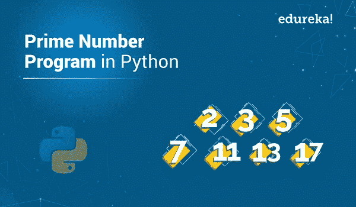

# Python 程序检查一个数是不是质数

> 原文：<https://medium.com/edureka/python-program-prime-number-28001c0d54f2?source=collection_archive---------0----------------------->



质数是大于 1 的自然数，除了 1 和它本身之外，它没有任何除数。你可以用 Python 写一段代码，帮助你找到所有的质数。在本文中，我们将看到如何按照以下顺序用 Python 编写一个素数程序:

*   什么是质数？
*   Python 程序检查质数
*   优化方法

让我们开始吧。

# 什么是质数？

一个大于 1 的正整数，除了 1 和这个数本身之外没有其他因数，称为素数。数字 2、3、5、7 等。是质数，因为它们没有任何其他因素。要在 Python 中找到一个质数，你必须使用循环的[从头到尾迭代该值，对于每个数字，如果它大于 1，检查它是否除以 n，如果我们找到任何其他可以除的数字，打印该值。](https://www.edureka.co/blog/loops-in-python/#Whatisforloopandwhileloop?)

# Python 程序检查质数

质数总是正数，它将在程序开始时被检查。这里你会把输入的数除以所有的数，看看有没有除了 1 和数本身以外的正约数。如果找到了任何除数，那么我们显示“这个数不是一个质数”，否则我们显示“这个数是一个质数”。

**Python 程序:**

```
num **=** 13
**if** num > 1:
**for** i **in** range(2, num**//**2):
**if** (num **%** i) **==** 0:
print(num, "is not a prime number")
**break
else**:
print(num, "is a prime number")
**else**:
print(num, "is not a prime number")
```

**输出:** 13 是一个素数

# 优化方法

在 Python 中有不同的方法来优化质数程序:

*   我们可以检查到√n，而不是检查到 n，因为 n 的较大因子必须是已经检查过的较小因子的倍数。
*   通过观察除了 2 和 3 之外，所有的素数都是 6k-1 的形式，可以进一步改进算法。这是因为对于某个整数 k，对于 i =，所有的整数都可以表示为(6k + i)？1、0、1、2、3 或 4；2 除(6k + 0)，(6k + 2)，(6k+4)；和 3 除(6k + 3)。因此，更有效的方法是测试 n 是否能被 2 或 3 整除，然后检查所有 6k 1 形式的数字。

**举例:**

```
**def** isPrime(n) :
**if** (n <**=** 1) :
**return** False
**if** (n <**=** 3) :
**return** True
**if** (n **%** 2 **==** 0 **or** n **%** 3 **==** 0) :
**return** False
i **=** 5
**while**(i ***** i <**=** n) :
**if** (n **%** i **==** 0 **or** n **%** (i **+** 2) **==** 0) :
**return** False
i **=** i **+** 6
**return** True
**if** (isPrime(11)) :
print(" true")
**else** :
print(" false")
**if**(isPrime(15)) :
print(" true")
**else** :
print(" false")
```

说到这里，我们的文章就到此为止了。我希望你明白如何用 Python 写一个质数程序。

如果你想查看更多关于人工智能、DevOps、道德黑客等市场最热门技术的文章，那么你可以参考 [Edureka 的官方网站。](https://www.edureka.co/blog/?utm_source=medium&utm_medium=content-link&utm_campaign=python-program-prime-number)

请留意本系列中的其他文章，它们将解释 Python 和数据科学的各个方面。

> *1。*[*Python 中的机器学习分类器*](/edureka/machine-learning-classifier-c02fbd8400c9)
> 
> *2。*[*Python Scikit-Learn Cheat Sheet*](/edureka/python-scikit-learn-cheat-sheet-9786382be9f5)
> 
> *3。* [*机器学习工具*](/edureka/python-libraries-for-data-science-and-machine-learning-1c502744f277)
> 
> *4。* [*用于数据科学和机器学习的 Python 库*](/edureka/python-libraries-for-data-science-and-machine-learning-1c502744f277)
> 
> *5。*[*Python 中的聊天机器人*](/edureka/how-to-make-a-chatbot-in-python-b68fd390b219)
> 
> *6。* [*Python 集合*](/edureka/collections-in-python-d0bc0ed8d938)
> 
> *7。* [*Python 模块*](/edureka/python-modules-abb0145a5963)
> 
> *8。* [*Python 开发者技能*](/edureka/python-developer-skills-371583a69be1)
> 
> *9。* [*哎呀面试问答*](/edureka/oops-interview-questions-621fc922cdf4)
> 
> *10。* [*一个 Python 开发者的简历*](/edureka/python-developer-resume-ded7799b4389)
> 
> *11。*[*Python 中的探索性数据分析*](/edureka/exploratory-data-analysis-in-python-3ee69362a46e)
> 
> *12。* [*蛇与蟒蛇的游戏*](/edureka/python-turtle-module-361816449390)
> 
> *13。* [*Python 开发者工资*](/edureka/python-developer-salary-ba2eff6a502e)
> 
> *14。* [*主成分分析*](/edureka/principal-component-analysis-69d7a4babc96)
> 
> *15。*[*Python vs c++*](/edureka/python-vs-cpp-c3ffbea01eec)
> 
> *16。* [*刺儿头教程*](/edureka/scrapy-tutorial-5584517658fb)
> 
> *17。*[*Python SciPy*](/edureka/scipy-tutorial-38723361ba4b)
> 
> *18。* [*最小二乘回归法*](/edureka/least-square-regression-40b59cca8ea7)
> 
> *19。* [*Jupyter 笔记本小抄*](/edureka/jupyter-notebook-cheat-sheet-88f60d1aca7)
> 
> 20。 [*Python 基础知识*](/edureka/python-basics-f371d7fc0054)
> 
> *21。* [*Python 模式程序*](/edureka/python-pattern-programs-75e1e764a42f)
> 
> *22。* [*用 Python 进行网页抓取*](/edureka/web-scraping-with-python-d9e6506007bf)
> 
> 23。 [*Python 装饰器*](/edureka/python-decorator-tutorial-bf7b21278564)
> 
> *二十四。*[*Python Spyder IDE*](/edureka/spyder-ide-2a91caac4e46)
> 
> *二十五。*[*Python 中使用 Kivy 的移动应用*](/edureka/kivy-tutorial-9a0f02fe53f5)
> 
> *26。* [*十大最佳学习书籍&练习 Python*](/edureka/best-books-for-python-11137561beb7)
> 
> *27。* [*机器人框架与 Python*](/edureka/robot-framework-tutorial-f8a75ab23cfd)
> 
> *28。*[*Python 中的贪吃蛇游戏*](/edureka/snake-game-with-pygame-497f1683eeaa)
> 
> *29。* [*Django 面试问答*](/edureka/django-interview-questions-a4df7bfeb7e8)
> 
> *30。* [*十大 Python 应用*](/edureka/python-applications-18b780d64f3b)
> 
> *31。*[*Python 中的哈希表和哈希表*](/edureka/hash-tables-and-hashmaps-in-python-3bd7fc1b00b4)
> 
> *32。*[*Python 3.8*](/edureka/whats-new-python-3-8-7d52cda747b)
> 
> *33。* [*支持向量机*](/edureka/support-vector-machine-in-python-539dca55c26a)
> 
> *34。* [*Python 教程*](/edureka/python-tutorial-be1b3d015745)

*原载于 2019 年 10 月 10 日*[*https://www.edureka.co*](https://www.edureka.co/blog/python-program-prime-number/)*。*