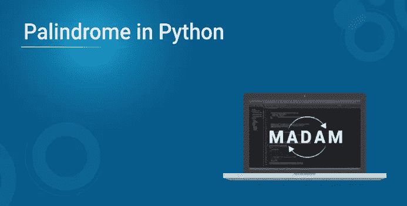
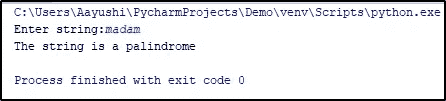

# Python 中的回文:如何检查一个数是回文？

> 原文：<https://medium.com/edureka/python-program-to-check-palindrome-494469f6353b?source=collection_archive---------1----------------------->



小时候，阅读反向字符串很有趣，当我们长大一点时，我们知道以任何一种方式阅读的字符串都被称为回文。好奇心让我们留在那里，所以我们希望我们的机器学习什么是回文，对于所有 Python 爱好者来说，没有其他语言能以更好的方式做到这一点。如果您是 python 爱好者和编码爱好者，请继续阅读，学习如何用 Python 创建回文。

我们开始吧。

*   什么是回文？
*   使用 while 循环的回文程序
*   使用内置函数的回文程序

# 什么是回文？

一个回文只不过是一个数字或者一个字符串，当它被反转时保持不变。

**例:**12321 是，一个回文数

**举例:**赛车
输出:是的，一个回文字符串

很明显，字母在反转时形成镜像。

现在你已经理解了这个概念，让我们简单地进入一个用 Python 检查回文的程序。

# 使用 While 循环的回文程序

这是使用 while 循环查找回文程序的最简单的程序之一。让我们深入一个例子来检查给定的输入是否是回文。

```
num**=**int(input("Enter a number:"))
temp**=**num
rev**=**0
**while**(num>0):
dig**=**num**%**10
rev**=**rev*****10**+**dig
num**=**num**//**10
**if**(temp**==**rev):
print("The number is palindrome!")
**else**:
print("Not a palindrome!")
```

**输出:**

输入一个数字:121
这个数字是一个回文！

继续 Python 回文程序示例，让我们看看如何使用内置函数检查一个字符串是否是回文。

# 使用内置方法的回文程序(字符串)

```
string**=**input(("Enter a string:"))
**if**(string**==**string[::**-**1]):
print("The string is a palindrome")
**else**:
print("Not a palindrome")
```

**输出:**



**解释:**在上面的程序中，首先从用户处获取输入(使用 input 或 raw_input()方法)来检查回文。然后使用切片操作[start:end: step]，检查字符串是否反转。这里，步长值-1 反转一个字符串。如果是，它打印一个其他的回文，而不是一个回文。

这就把我们带到了本文的结尾，在这里我们学习了如何在 Python 中找到回文。希望你清楚本教程中与你分享的所有内容。

如果你想查看更多关于人工智能、DevOps、道德黑客等市场最热门技术的文章，那么你可以参考 [Edureka 的官方网站。](https://www.edureka.co/blog/?utm_source=medium&utm_medium=content-link&utm_campaign=python-program-to-check-palindrome)

请留意本系列中的其他文章，它们将解释 Python 和数据科学的各个方面。

> *1。*[*Python 中的机器学习分类器*](/edureka/machine-learning-classifier-c02fbd8400c9)
> 
> *2。*[*Python Scikit-Learn Cheat Sheet*](/edureka/python-scikit-learn-cheat-sheet-9786382be9f5)
> 
> *3。* [*机器学习工具*](/edureka/python-libraries-for-data-science-and-machine-learning-1c502744f277)
> 
> *4。* [*用于数据科学和机器学习的 Python 库*](/edureka/python-libraries-for-data-science-and-machine-learning-1c502744f277)
> 
> *5。*[*Python 中的聊天机器人*](/edureka/how-to-make-a-chatbot-in-python-b68fd390b219)
> 
> *6。* [*蟒蛇收藏*](/edureka/collections-in-python-d0bc0ed8d938)
> 
> 7。 [*Python 模块*](/edureka/python-modules-abb0145a5963)
> 
> *8。* [*Python 开发者技能*](/edureka/python-developer-skills-371583a69be1)
> 
> *9。* [*哎呀面试问答*](/edureka/oops-interview-questions-621fc922cdf4)
> 
> *10。* [*一个 Python 开发者的简历*](/edureka/python-developer-resume-ded7799b4389)
> 
> *11。*[*Python 中的探索性数据分析*](/edureka/exploratory-data-analysis-in-python-3ee69362a46e)
> 
> *12。* [*蛇与 Python 的游戏*](/edureka/python-turtle-module-361816449390)
> 
> *13。* [*Python 开发者工资*](/edureka/python-developer-salary-ba2eff6a502e)
> 
> *14。* [*主成分分析*](/edureka/principal-component-analysis-69d7a4babc96)
> 
> *15。*[*Python vs c++*](/edureka/python-vs-cpp-c3ffbea01eec)
> 
> *16。* [*刺儿头教程*](/edureka/scrapy-tutorial-5584517658fb)
> 
> *17。*[*Python SciPy*](/edureka/scipy-tutorial-38723361ba4b)
> 
> *18。* [*最小二乘回归法*](/edureka/least-square-regression-40b59cca8ea7)
> 
> *19。* [*Jupyter 笔记本小抄*](/edureka/jupyter-notebook-cheat-sheet-88f60d1aca7)
> 
> *20。* [*Python 基础知识*](/edureka/python-basics-f371d7fc0054)
> 
> *21。* [*Python 模式程序*](/edureka/python-pattern-programs-75e1e764a42f)
> 
> 22。 [*用 Python 进行网页抓取*](/edureka/web-scraping-with-python-d9e6506007bf)
> 
> *23。* [*Python 装饰器*](/edureka/python-decorator-tutorial-bf7b21278564)
> 
> *24。*[*Python Spyder IDE*](/edureka/spyder-ide-2a91caac4e46)
> 
> 25。 [*移动应用使用 Python 中的 Kivy*](/edureka/kivy-tutorial-9a0f02fe53f5)
> 
> *二十六。* [*十大最佳学习书籍&练习 Python*](/edureka/best-books-for-python-11137561beb7)
> 
> 27。 [*机器人框架与 Python*](/edureka/robot-framework-tutorial-f8a75ab23cfd)
> 
> *28。*[*Python 中的贪吃蛇游戏*](/edureka/snake-game-with-pygame-497f1683eeaa)
> 
> *29。* [*Django 面试问答*](/edureka/django-interview-questions-a4df7bfeb7e8)
> 
> 30。 [*十大 Python 应用*](/edureka/python-applications-18b780d64f3b)
> 
> *31。*[*Python 中的哈希表和哈希表*](/edureka/hash-tables-and-hashmaps-in-python-3bd7fc1b00b4)
> 
> *32。*[*Python 3.8*](/edureka/whats-new-python-3-8-7d52cda747b)
> 
> *33。* [*支持向量机*](/edureka/support-vector-machine-in-python-539dca55c26a)
> 
> *34。* [*Python 教程*](/edureka/python-tutorial-be1b3d015745)

*原载于 2019 年 8 月 15 日*[*https://www.edureka.co*](https://www.edureka.co/blog/python-program-to-check-palindrome/)*。*