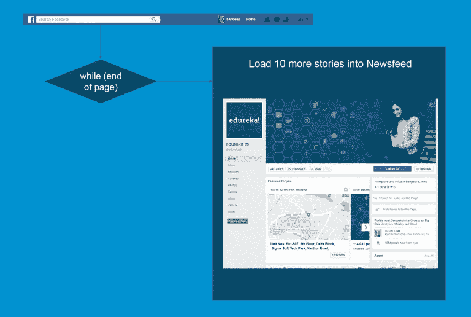

# 通过示例学习 Python 安装和基础

> 原文：<https://medium.com/edureka/python-programming-language-fc1015de7a6f?source=collection_archive---------1----------------------->


Python Programming Language - Edureka

Python 编程语言是由 Guido Van Rossum 于 1989 年发明的一种高级解释型编程语言。它于 1991 年首次发布，这导致了一种伟大的通用语言，能够创建从桌面软件到 web 应用程序和框架的任何东西。

对于那些熟悉 Java 或 C++的人来说，Python 将打破你为典型编程语言建立的模式。准备谈恋爱，和 Python！

在这篇博客中，我们将按照以下顺序学习 Python 编程语言:

1.  为什么要学习 Python 编程？
2.  Python 安装
3.  Python 基础
    3.1 数据类型
    3.2 流量控制
    3.3 函数
4.  文件处理
5.  对象和类

# 为什么要学习 Python 编程？

Python 是一种高级动态编程语言。它很容易学习，并提供强大的打字功能。Python 代码有一种非常“自然”的风格，因为它易于阅读和理解(由于没有分号和大括号)。Python 编程语言可以在任何平台上运行，从 Windows 到 Linux 到 Macintosh，Solaris 等等。Python 的简单性是它如此受欢迎的原因。下面重点介绍它的美学:

*   可读性很强的语言
*   简洁的视觉布局
*   较少的语法异常
*   高级字符串操作
*   优雅而动感的打字
*   解读自然
*   脚本和快速应用的理想选择
*   适合多种平台

***等等！Python 能做的更多。***

它在自动化、大数据、人工智能等多个领域都是非常流行的语言。全球众多公司都在使用它，这也会给你留下深刻的印象。


Companies Using Python - Python Tutorial

# Python 安装

现在让我们继续在 Windows 系统上安装 Python。

1.  进入链接:[***https://www.python.org/downloads/***](https://www.python.org/downloads/)*并在你的机器上安装最新版本。*

**

*Download Python - Python Programming Language*

*2.下载安装 ***PyCharm IDE*** 。*

**

*Download PyCharm - Python Tutorial*

*PyCharm 是一个用于计算机编程的集成开发环境(IDE ),专门用于 Python 编程语言。它提供了代码分析、图形调试器、集成单元测试器、与版本控制系统(VCSes)的集成，并支持使用 Django 进行 web 开发。*

# *Python 基础*

*以下是掌握 Python 所需的五个基础知识:*

1.  *数据类型*
2.  *流控制*
3.  *功能*
4.  *文件处理*
5.  *对象和类*

**

**Python Programming Fundamentals - Python Programming Language**

# *数据类型*

*Python 中的所有数据值都由对象表示，每个对象或值都有数据类型。*

**

*Datatypes Features - Python Programming Knowledge*

*Python 中有八种本地数据类型。*

1.  *布尔代数学体系的*
2.  *数字*
3.  *用线串*
4.  *字节和字节数组*
5.  *列表*
6.  *元组*
7.  *设置*
8.  *字典*

*下图将对此进行描述。*

**

*Native Datatypes - Python Programming Knowledge*

*让我们看看如何在 Python 中实现这些数据类型。*

```
*#Boolean
number **=** [1,2,3,4,5]
boolean **=** 3 **in** number
print(boolean)#Numbers
num1 **=** 5******3
num2 **=** 32**//**3
num3 **=** 32**/**3
print('num1 is',num1)
print('num2 is',num2)
print('num3 is',num3)#Strings
str1 **=** "Welcome"
str2 **=** " to Edureka's Python Programming Blog"
str3 **=** str1 **+** str2
print('str3 is',str3)
print(str3[0:10])
print(str3[**-**5:])
print(str3[:**-**5])#Listscountries **=** ['India', 'Australia', 'United States', 'Canada', 'Singapore']
print(len(countries))
print(countries)
countries.append('Brazil')
print(countries)
countries.insert(2, 'United Kingdom')
print(countries)#Tuples
sports_tuple **=** ('Cricket', 'Basketball', 'Football')
sports_list **=** list(sports_tuple)
sports_list.append('Baseball')
print(sports_list)
print(sports_tuple)#Dictionary
#Indian Government
Government **=** {'Legislature':'Parliament', 'Executive':'PM & Cabinet', 'Judiciary':'Supreme Court'}
print('Indian Government has ',Government)
#Modifying for USA
Government['Legislature']**=**'Congress'
Government['Executive']**=**'President & Cabinet'
print('USA Government has ',Government)*
```

*上述代码的输出如下:*

```
*True

num1 is 125
num2 is 10
num3 is 10.666666666666666

str3 is Welcome to Edureka's Python Programming Blog
Welcome to
 Blog
Welcome to Edureka's Python Programming

5
['India', 'Australia', 'United States', 'Canada', 'Singapore']
['India', 'Australia', 'United States', 'Canada', 'Singapore', 'Brazil']
['India', 'Australia', 'United Kingdom', 'United States', 'Canada', 'Singapore', 'Brazil']

['Cricket', 'Basketball', 'Football', 'Baseball']
('Cricket', 'Basketball', 'Football')

Indian Government has {'Legislature': 'Parliament', 'Judiciary': 'Supreme Court', 'Executive': 'PM & Cabinet'}
USA Government has {'Legislature': 'Congress', 'Judiciary': 'Supreme Court', 'Executive': 'President & Cabinet'}*
```

# *流控制*

*流控制让我们在执行程序时定义一个流。为了模拟真实世界，您需要将真实世界的情况转换到您的程序中。为此，您需要使用流控制来控制程序语句的执行。*

**

*Flow Control- Python Programming Language*

*Python 编程中使用了六种基本的流控制:*

1.  *如果*
2.  *为*
3.  *在…期间*
4.  *破裂*
5.  *继续*
6.  *及格*

# *如果语句*

*Python 复合语句‘if’允许您有条件地执行语句块。*

**If* 语句的语法:*

```
***if** expression:
     statement (s)
**elif** expression:
     statement (s)
**elif** expression:
     statement (s)
...
**else**:
    statement (s)*
```

**

**If - Facebook Login Example - Python Programming Language**

*上图以脸书登录为例解释了' **if** 语句的用法。*

1.  *脸书登录页面将根据您的用户名和密码是否与您的帐户匹配，将您导向两个页面。*
2.  *如果输入的密码是错误的，它会引导你到左边的页面。*
3.  *如果输入的密码是正确的，您将被引导到您的主页。*

*现在让我们看看脸书如何使用 If 语句。*

```
*password **=** facebook_hash(input_password)
**if** password **==** hash_password
   print('Login successful.')
**else** print('Login failed. Incorrect password.')*
```

*上面的代码只是给出了所使用的脸书登录示例中 If 语句的高级实现。 ***【脸书散列()*** 函数将 input_password 作为参数，并将其与为该特定用户存储的散列值进行比较。*

# *For 语句*

*for 语句支持重复执行由可迭代表达式控制的语句或语句块。*

*语句的*语法:**

```
***for** target **in** iterable:
    statement (s)*
```

**

**For - Facebook Friends Example - Python Programming Language**

*从上面的例子可以理解' **for** '语句。*

*   *从您的个人资料中列出“朋友”将显示您所有朋友的姓名和照片*
*   *为了做到这一点，脸书得到了你的“好友列表”,其中包含了你所有朋友的个人资料*
*   *然后，脸书开始显示所有配置文件的 HTML，直到列表索引达到“空”*
*   *将所有配置文件填充到页面上的操作由“for”语句控制*

*现在让我们看一个用 Python 编写的示例程序来演示 For 语句。*

```
*travelling **=** input("Are you travelling? Yes or No:")
**while** travelling **==** 'yes':
   num **=** int(input("Enter the number of people travelling:"))
   **for** num **in** range(1,num**+**1):
      name **=** input("Enter Details \n Name:")
      age **=** input("Age:")
      sex **=** input("Male or Female:") 
      print("Details Stored \n",name)
      print(age)
      print(sex)
   print("Thank you!")
   travelling **=** input("Are you travelling? Yes or No:")
print("Please come back again.")*
```

*输出如下所示:*

```
*Are you travelling? Yes or No:Yes
Enter the number of people travelling:1
Enter Details 
Name:Harry
Age:20
Male or Female:Male
Details Stored
Harry
20
Male
Thank you
Are you travelling? Yes or No:No
Please come back again.*
```

# *While 语句*

*Python 编程中的 while 语句支持重复执行由条件表达式控制的语句或语句块。*

*While 语句的语法:*

```
***while** expression:
     statement (s)*
```

**

**While - Facebook Newsfeed Example - Python Programming Language**

*我们将使用上面的脸书新闻提要来理解 while 循环的用法。*

*   *当我们登录我们在脸书的主页时，我们的新闻提要上大约有 10 个故事*
*   *当我们到达这一页的末尾时，脸书在我们的新闻订阅上加载了另外 10 个故事*
*   *这演示了如何使用“while”循环来实现这一点*

*现在让我们看一个用 Python 编写的示例程序来演示 While 语句。*

```
*count **=** 0
print('Printing numbers from 0 to 9')
**while** (count<10):
   print('The count is ',count)
   count **=** count**+**1
print('Good Bye')*
```

*这个程序使用 while 语句打印从 0 到 9 的数字，以限制循环，直到循环到达 9。输出如下所示:*

```
*The count is 0
The count is 1
The count is 2
The count is 3
The count is 4
The count is 5
The count is 6
The count is 7
The count is 8
The count is 9*
```

# *break 语句*

*只允许在循环体内部使用 break 语句。当 break 执行时，循环终止。如果一个循环嵌套在其他循环中，break 只会终止最里面的嵌套循环。*

*Break 语句的语法:*

```
***while** True:
     x **=** get_next()
     y **=** preprocess(x)
     **if** **not** keep_looking(x, y): **break** process(x, y)*
```

**

**Break - Alarm And Incoming Call- Python Programming Language**

*从上面的例子可以理解“中断”流控制语句。*

*   *让我们考虑在特定时间手机振铃报警的情况。*
*   *假设电话在闹铃响起的时间内收到来电，闹铃立即停止，电话铃声开始响起。*
*   *这就是 break 的基本工作原理。*

*现在让我们看一个用 Python 编写的示例程序来演示 Break 语句。*

```
*for letter in 'The Quick Brown Fox. Jumps, Over The Lazy Dog':
   if letter == '.':
      break
   print ('Current Letter :', letter)*
```

*这个程序打印给定字符串中的所有字母。每当遇到“.”时，它就会断开。或者一个句号。我们已经通过使用 Break 语句做到了这一点。输出如下所示。*

```
*Current Letter : T
Current Letter : h
Current Letter : e
Current Letter : 
Current Letter : Q
Current Letter : u
Current Letter : i
Current Letter : c
Current Letter : k
Current Letter : 
Current Letter : B
Current Letter : r
Current Letter : o
Current Letter : w
Current Letter : n
Current Letter : 
Current Letter : F
Current Letter : o
Current Letter : x*
```

# *连续语句*

*continue 语句只允许在循环体内部使用。当 continue 执行时，循环体的当前迭代终止，并继续执行循环的下一次迭代。*

**继续*语句的语法:*

```
***for** x **in** some_container:
    **if** **not** seems_ok(x): **continue** lowbound, highbound **=** bounds_to_test()
    **if** x<lowbound **or** x>**=**highbound: **continue
    if** final_check(x):
         do_processing(x)*
```

**

**Continue - Incoming Call And Alarm Example - Python Programming Knowledge**

***例子:**Continue 语句可以用来电和闹铃来理解。*

*   *假设我们正在通话，并且警报被安排在通话时间，那么警报触发器识别呼叫事件*
*   *一旦注意到呼叫事件，手机会在下一个打盹时间继续响铃*

*现在让我们看一个用 Python 编写的示例程序来演示 Continue 语句。*

```
***for** num **in** range(10, 21):
   **if** num **%** 5 **==** 0:
      print ("Found a multiple of 5")
      **pass** num **=** num **+** 1
      **continue** print ("Found number: ", num)*
```

*这个程序打印除了 10 到 20 的 5 的倍数以外的所有数字。输出如下。*

```
*Found a multiple of 5
Found number: 11
Found number: 12
Found number: 13
Found number: 14
Found a multiple of 5
Found number: 16
Found number: 17
Found number: 18
Found number: 19
Found a multiple of 5*
```

## *Pass 语句*

*pass 语句不执行任何操作，当语法上需要一个语句，但您没有具体要做的事情时，可以将它用作占位符。*

*Pass 语句的语法:*

```
***if** condition1(x):
    process1(x)
**elif** x>23 **or** condition2(x) **and** x<5:
    **pass
elif** condition3(x):
    process3(x)
**else**:
    process_default(x)*
```

*现在让我们看一个用 Python 编写的示例程序来演示 Pass 语句。*

```
***for** num **in** range(10, 21):
   **if** num **%** 5 **==** 0:
      print ("Found a multiple of 5: ")
      **pass** num**++** print ("Found number: ", num)*
```

*这个程序用一个单独的句子打印 5 的倍数。输出如下。*

```
*Found a multiple of 5: 10
Found number: 11
Found number: 12
Found number: 13
Found number: 14
Found a multiple of 5: 15
Found number: 16
Found number: 17
Found number: 18
Found number: 19
Found a multiple of 5: 20*
```

*在学习了上面的六个流控制语句之后，现在让我们来学习什么是函数。*

# *功能*

*[Python 编程中的函数](https://www.edureka.co/blog/python-functions?utm_source=medium&utm_medium=content-link&utm_campaign=python-programming-language)是一组执行特定任务的相关语句。函数使我们的程序更有条理，有助于代码的重用。*

**

**Understanding Functions - Python Programming Language**

## *功能的使用:*

1.  *函数有助于代码重用*
2.  *函数为代码提供组织*
3.  *函数提供抽象*
4.  *函数有助于扩展性*

**

**Demonstrating The Uses Of Functions - Python Programming Language**

*上述示例中使用的代码如下:*

```
*# Defining a function to reverse a string
**def** reverse_a_string():
    # Reading input from console
    a_string **=** input("Enter a string")
    new_strings **=** []

    # Storing length of input string
    index **=** len(a_string) # Reversing the string using while loop
    **while** index:
         index **-=** 1
         new_strings.append(a_string[index])

    #Printing the reversed string
    print(''.join(new_strings))
reverse_a_string()*
```

*因此，我们展示了在 Python 中使用函数的强大功能。*

# *文件处理*

*文件处理是指那些用来读或写文件的操作。*

*要执行文件处理，我们需要执行以下步骤:*

1.  *打开文件*
2.  *读/写文件*
3.  *关闭文件*

**

**File Handling In Python - Python Programming Language**

# *打开文件*

*   *Python 有一个内置函数 open()来打开文件*
*   *该函数返回一个文件对象，也称为句柄，因为它用于相应地读取或修改文件*

*示例程序:*

```
*file **=** open("C:/Users/Edureka/Hello.txt", "r")
**for** line **in** file:
   print (line)*
```

*输出如下所示:*

```
*One
Two
Three*
```

# *写入文件*

*   *为了写入一个文件，我们需要打开它，在***【w】******追加【a】***或 ***独占创建【x】***模式*
*   *我们需要小心使用“w”模式，因为如果它已经存在，它将覆盖到文件中。所有以前的数据都被删除*
*   *使用 write()方法写入一个字符串或字节序列(对于二进制文件)*

*示例程序:*

```
*with open("C:/Users/Edureka/Writing_Into_File.txt", "w") as f
f.write("First Line\n")
f.write("Second Line\n")file **=** open("D:/Writing_Into_File.txt", "r")
**for** line **in** file:
   print (line)*
```

*输出如下所示:*

```
*First Line
Second Line*
```

# *从文件中读取*

*   *要读取文件的内容，我们必须以阅读模式打开文件*
*   *我们可以使用 read(size)方法读入 size 数量的数据*
*   *如果没有指定 size 参数，它会一直读取并返回到文件的末尾*

*示例程序:*

```
*file **=** open("C:/Users/Edureka/Writing_Into_File.txt", "r")
print(file.read(5))
print(file.read(4))
print(file.read())*
```

*输出如下所示:*

```
*First Line
Second Line*
```

# *关闭文件*

*   *当我们完成对文件的操作时，我们需要正确地关闭它。*
*   *关闭文件将释放与文件绑定的资源，这是使用 close()方法完成的。*

*示例程序:*

```
*file **=** open("C:/Users/Edureka/Hello.txt", "r")
text **=** file.readlines()
print(text)
file.close()*
```

*输出如下所示:*

```
*['One\n', 'Two\n', 'Three']*
```

# *对象和类*

*Python 是一种面向对象的编程语言。对象只是数据(变量)和作用于这些数据的方法(函数)的集合。类是对象的蓝图。*

**

*Representation of Class and Objects - Python Programming Language*

# *定义类别*

*我们使用关键字“ **Class** ”来定义一个类。第一个字符串叫做 ***docstring*** 并且有一个类的简短描述。*

```
***class** MyNewClass:
'''This is a docstring. I have created a new class'''
**pass***
```

# *创建对象*

*类对象可用于创建该类的新对象实例(实例化)。创建对象的过程类似于函数调用。*

```
*ob = MyNewClass*
```

*我们已经学习了如何从一个给定的类中创建一个对象。*

*我们的 Python 编程博客到此结束。我希望你喜欢阅读这个博客，并发现它的信息量。到目前为止，您一定已经很好地理解了什么是 Python 编程语言。现在开始练习所有的例子。*

*如果你想查看更多关于人工智能、DevOps、道德黑客等市场最热门技术的文章，你可以参考 Edureka 的官方网站。*

*请留意本系列中的其他文章，它们将解释 Python 和数据科学的各个方面。*

> *1. [Python 教程](/edureka/python-tutorial-be1b3d015745)*
> 
> *2. [Python 函数](/edureka/python-functions-f0cabca8c4a)*
> 
> *3.[Python 中的文件处理](/edureka/file-handling-in-python-e0a6ff96ede9)*
> 
> *4. [Python Numpy 教程](/edureka/python-numpy-tutorial-89fb8b642c7d)*
> 
> *5. [Scikit Learn 机器学习](/edureka/scikit-learn-machine-learning-7a2d92e4dd07)*
> 
> *6. [Python 熊猫教程](/edureka/python-pandas-tutorial-c5055c61d12e)*
> 
> *7. [Matplotlib 教程](/edureka/python-matplotlib-tutorial-15d148a7bfee)*
> 
> *8. [Tkinter 教程](/edureka/tkinter-tutorial-f655d3f4c818)*
> 
> *9.[请求教程](/edureka/python-requests-tutorial-30edabfa6a1c)*
> 
> *10. [PyGame 教程](/edureka/pygame-tutorial-9874f7e5c0b4)*
> 
> *11. [OpenCV 教程](/edureka/python-opencv-tutorial-5549bd4940e3)*
> 
> *12.[用 Python 进行网页抓取](/edureka/web-scraping-with-python-d9e6506007bf)*
> 
> *13. [PyCharm 教程](/edureka/pycharm-tutorial-d0ec9ce6fb60)*
> 
> *14.[机器学习教程](/edureka/machine-learning-tutorial-f2883412fba1)*
> 
> *15.[Python 中从头开始的线性回归算法](/edureka/linear-regression-in-python-e66f869cb6ce)*
> 
> *16.[面向数据科学的 Python](/edureka/learn-python-for-data-science-1f9f407943d3)*
> 
> *17. [Python 正则表达式](/edureka/python-regex-regular-expression-tutorial-f2d17ffcf17e)*
> 
> *18.[Python 中的循环](/edureka/loops-in-python-fc5b42e2f313)*
> 
> *19. [Python 项目](/edureka/python-projects-1f401a555ca0)*
> 
> *20.[机器学习项目](/edureka/machine-learning-projects-cb0130d0606f)*
> 
> *21.[Python 中的数组](/edureka/arrays-in-python-14aecabec16e)*
> 
> *22.[在 Python 中设置](/edureka/sets-in-python-a16b410becf4)*
> 
> *23.[Python 中的多线程](/edureka/what-is-mutithreading-19b6349dde0f)*
> 
> *24. [Python 面试问题](/edureka/python-interview-questions-a22257bc309f)*
> 
> *25. [Java vs Python](/edureka/java-vs-python-31d7433ed9d)*
> 
> *26.[如何成为一名 Python 开发者？](/edureka/how-to-become-a-python-developer-462a0093f246)*
> 
> *27. [Python Lambda 函数](/edureka/python-lambda-b84d68d449a0)*
> 
> *28.[网飞如何使用 Python？](/edureka/how-netflix-uses-python-1e4deb2f8ca5)*
> 
> *29.[Python 中的套接字编程是什么](/edureka/socket-programming-python-bbac2d423bf9)*
> 
> *30. [Python 数据库连接](/edureka/python-database-connection-b4f9b301947c)*
> 
> *31. [Golang vs Python](/edureka/golang-vs-python-5ac32e1ef2)*
> 
> *32. [Python Seaborn 教程](/edureka/python-seaborn-tutorial-646fdddff322)*
> 
> *33. [Python 职业机会](/edureka/python-career-opportunities-a2500ce158de)*

**原载于 2017 年 6 月 16 日*[*【www.edureka.co*](https://www.edureka.co/blog/python-programming-language)*。**