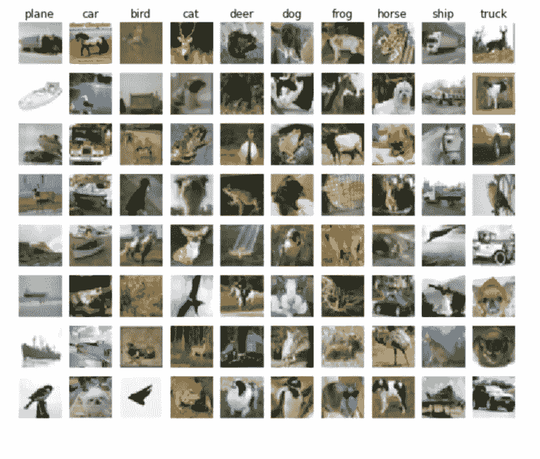
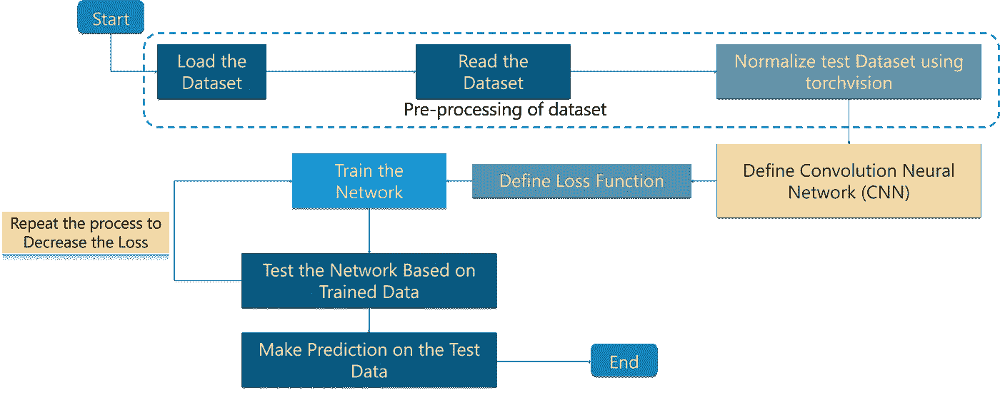

# 您应该练习的顶级 Python 项目——简单、中级和高级

> 原文：<https://medium.com/edureka/python-projects-1f401a555ca0?source=collection_archive---------1----------------------->


Python Projects — Edureka

在这篇文章中，让我们来看看你应该学习掌握 Python 和测试你的项目分析，开发和处理技能的三个层次的 Python 项目。如果我说学习和摆弄 Python 真的很有趣，很多人都会同意。

让我们从查看以下主题列表开始这篇文章:

*   Python 简介
*   如何着手学习 Python 项目？
*   初级 Python 项目:用 Python 玩 Hangman 游戏
*   中级 Python 项目:在 Python 中使用图表
*   高级 Python 项目:使用 Python 的机器学习
*   结论

我给你简单介绍一下 Python 才公平。

# Python 简介

Python 是一种高级的、面向对象的、解释性的编程语言，受到了全世界的关注。Stack Overflow 发现其 38.8%的用户主要将 Python 用于他们的项目。

Python 是由一个叫 Guido Van Rossum 的开发者创建的。

Python 一直以来都很容易学习和掌握。它对初学者非常友好，语法非常容易阅读和理解。这无疑让我们都很高兴，令人惊奇的是 python 在全球有数百万快乐的学习者！

根据该网站的调查，Python 的受欢迎程度在 2018 年超过了 c#—就像它在 2017 年超过了 PHP 一样。在 GitHub 平台上，Python 超过 Java 成为使用第二多的编程语言，2017 年打开的 pull 请求比 2016 年多 40%。

# 如何着手学习 Python 项目？

这个问题的答案相当简单明了。这一切都是从学习 Python 的基础和所有基本知识开始的。这基本上是一个衡量你使用 Python 的舒适程度的指标。

下一个主要步骤是看一看简单的基本代码，让自己熟悉代码中的语法和逻辑流程。这是非常重要的一步，也有助于为以后打下坚实的基础。

在这之后，你一定要看看 python 在现实生活中的用途。这将在找到你最初为什么想学习 Python 的原因时发挥主要作用。

如果不是这样，那么你将了解这些项目，你可以为你将考虑自己开始的项目实施某些策略。

接下来肯定是要看看你目前的 Python 知识可以解决哪些项目。深入 Python 将帮助您在每个阶段评估自己。

项目基本上是用来解决手头的一个问题。如果为各种简单和复杂的问题提供解决方案是你的事情，那么你绝对应该考虑从事 Python 项目。

在您接触了几个项目之后，您将离掌握 python 更近一步。这很重要，因为你将能够自发地实现你所学到的东西，就像编写一个计算器程序一样简单，直到帮助实现人工智能。

让我们先来看看 Python 项目的第一层。

# 初级 Python 项目:使用 Python 的 Hangman 游戏

我们可以考虑的最好的初学者项目是 Hangman 的游戏。我相信大多数阅读这篇文章的人都曾经玩过刽子手。用一句话来说， ***这里的主要目标是创建一个“猜单词”游戏。*** 听起来简单，但它有一定的关键之处需要你注意。

*   用户需要能够输入字母猜测。
*   还应该限制他们可以使用的猜测次数。
*   继续通知用户剩余的转弯。

这意味着你需要一种方法来抓取一个单词用于猜测。让我们保持简单，使用文本文件进行输入。文本文件由我们必须猜测的单词组成。

您还需要一些函数来检查用户是否真的输入了一个字母，检查输入的字母是否在隐藏的单词中(如果是，它出现了多少次)，打印字母，以及一个计数器变量来限制猜测。

***这个 Python 项目需要记住的关键概念:***

*   随意
*   变量
*   布尔代数学体系的
*   输入和输出
*   整数
*   茶
*   线
*   长度
*   打印

## **代码:**

1.  **Hangman.py**

```
from string import ascii_lowercase
from words import get_random_word

def get_num_attempts():
    """Get user-inputted number of incorrect attempts for the game."""
    while True:
        num_attempts = input(
            'How many incorrect attempts do you want? [1-25] ')
        try:
            num_attempts = int(num_attempts)
            if 1 <= num_attempts <= 25:
                return num_attempts
            else:
                print('{0} is not between 1 and 25'.format(num_attempts))
        except ValueError:
            print('{0} is not an integer between 1 and 25'.format(
                num_attempts))

def get_min_word_length():
    """Get user-inputted minimum word length for the game."""
    while True:
        min_word_length = input(
            'What minimum word length do you want? [4-16] ')
        try:
            min_word_length = int(min_word_length)
            if 4 <= min_word_length <= 16:
                 return min_word_length
             else:
                 print('{0} is not between 4 and 16'.format(min_word_length))
         except ValueError:
             print('{0} is not an integer between 4 and 16'.format(                 min_word_length))
 def get_display_word(word, idxs):     """Get the word suitable for display."""     
if len(word) != len(idxs):
         raise ValueError('Word length and indices length are not the same')
     displayed_word = ''.join(
         [letter if idxs[i] else '*' for i, letter in enumerate(word)])
     return displayed_word.strip()
 def get_next_letter(remaining_letters):     """Get the user-inputted next letter."""
     if len(remaining_letters) == 0:
         raise ValueError('There are no remaining letters')     while True:
         next_letter = input('Choose the next letter: ').lower()         if len(next_letter) != 1:
             print('{0} is not a single character'.format(next_letter))
         elif next_letter not in ascii_lowercase:             print('{0} is not a letter'.format(next_letter))
         elif next_letter not in remaining_letters:             print('{0} has been guessed before'.format(next_letter))         else:
             remaining_letters.remove(next_letter)             return next_letter def play_hangman():
     """Play a game of hangman.     At the end of the game, returns if the player wants to retry.     """     
# Let player specify difficulty
     print('Starting a game of Hangman...')
     attempts_remaining = get_num_attempts()
     min_word_length = get_min_word_length()
     # Randomly select a word     print('Selecting a word...')     word = get_random_word(min_word_length)
     print()     # Initialize game state variables
     idxs = [letter not in ascii_lowercase for letter in word]     remaining_letters = set(ascii_lowercase)
     wrong_letters = []
     word_solved = False
     # Main game loop
     while attempts_remaining > 0 and not word_solved:
        # Print current game state
        print('Word: {0}'.format(get_display_word(word, idxs)))
        print('Attempts Remaining: {0}'.format(attempts_remaining))
        print('Previous Guesses: {0}'.format(' '.join(wrong_letters)))

        # Get player's next letter guess
        next_letter = get_next_letter(remaining_letters)

        # Check if letter guess is in word
        if next_letter in word:
            # Guessed correctly
            print('{0} is in the word!'.format(next_letter))

            # Reveal matching letters
            for i in range(len(word)):
                if word[i] == next_letter:
                    idxs[i] = True
        else:
            # Guessed incorrectly
            print('{0} is NOT in the word!'.format(next_letter))

            # Decrement num of attempts left and append guess to wrong guesses
            attempts_remaining -= 1
            wrong_letters.append(next_letter)

        # Check if word is completely solved
        if False not in idxs:
            word_solved = True
        print()

    # The game is over: reveal the word
    print('The word is {0}'.format(word))

    # Notify player of victory or defeat
    if word_solved:
        print('Congratulations! You won!')
    else:
        print('Try again next time!')

    # Ask player if he/she wants to try again
    try_again = input('Would you like to try again? [y/Y] ')
    return try_again.lower() == 'y'

if __name__ == '__main__':
    while play_hangman():
        print()
```

2. **Words.py**

```
"""Function to fetch words."""

import random

WORDLIST = 'wordlist.txt'

def get_random_word(min_word_length):
    """Get a random word from the wordlist using no extra memory."""
    num_words_processed = 0
    curr_word = None
    with open(WORDLIST, 'r') as f:
        for word in f:
            if '(' in word or ')' in word:
                continue
            word = word.strip().lower()
            if len(word) < min_word_length:
                continue
            num_words_processed += 1
            if random.randint(1, num_words_processed) == 1:
                curr_word = word
    return curr_word
```

输出如下所示:


既然我们已经看到了如何处理像 Hangman 这样的初学者项目，那么让我们更进一步，接下来看看一个中级 Python 项目。

# 中级 Python 项目:在 Python 中使用图表

开始学习 Python 编程中级阶段的最佳方式是明确地开始使用 Python 支持的库。

在用 Python 编码时，你可以使用 l [到“n”个库。有些非常简单明了，而有些可能需要一些时间来掌握和掌握。](https://www.edureka.co/blog/python-libraries?utm_source=medium&utm_medium=content-link&utm_campaign=python-projects)

以下是一些您可以考虑开始使用的顶级库:

*   NumPy
*   SciPy
*   熊猫
*   Matplotlib

NumPy 总体上是指科学计算。

Scipy 使用数组，如用于线性代数、微积分和其他类似概念的基本数据结构。

Pandas 用于数据框，Matplotlib 用于以图形和符号的形式可视化数据。

Python 可能的最佳用途是数据可视化。尽管数字数据输出很有帮助，但对数据的可视化表示还有许多要求。

通过视觉表现，只是一种概括。从创建您的前端或图形用户界面(GUI)到将数字数据绘制为图表上的点。

**Matplotlib** 用于在图形上绘制数据点。而 **Matplotlib** 是 Python 编程语言及其数值数学扩展 NumPy 的绘图库。它提供了一个面向对象的 API，使用 Tkinter、wxPython、Qt 或 GTK+等通用 GUI 工具包将绘图嵌入到应用程序中。

用 Python 做 3D 绘图有很多选择，但是这里有一些使用 **Matplotlib** 的普通而简单的方法。

一般来说，第一步是创建一个 3D 轴，然后绘制任何能够最好地说明特定需求数据的 3D 图形。为了使用 **Matplotlib** ，必须导入 **Matplotlib** 安装中包含的 mplot3d 工具包:

```
from mpl_toolkits import mplot3d
```

然后，要创建一个 **3D 轴**你可以执行以下代码:

```
<pre id="3346" class="graf graf--pre graf-after--p">%matplotlib inline
import numpy as np
import matplotlib.pyplot as plt
fig = plt.figure()
ax = plt.axes(projection=’3d’)</pre>
```


在这个 3D 轴内可以绘制一个图，重要的是要知道什么类型的图(或图的组合)将更好地描述数据。

在这一点上，你需要注意这是我们进一步绘图的基础。

## **点和线:**

下图结合了两个图，一个图用一条线穿过数据的每一点，另一个图在本例中的每一个特定的 1000 个值上画一个点。

当你试图分析它时，代码实际上非常简单。我们已经利用标准三角函数来绘制一组随机值，以获得我们的三维投影。

**代码:**

```
ax = plt.axes(projection=’3d’)# Data for a three-dimensional line
zline = np.linspace(0, 15, 1000)
xline = np.sin(zline)
yline = np.cos(zline)
ax.plot3D(xline, yline, zline, ‘gray’)# Data for three-dimensional scattered points
zdata = 15 * np.random.random(100)
xdata = np.sin(zdata) + 0.1 * np.random.randn(100)
ydata = np.cos(zdata) + 0.1 * np.random.randn(100)
ax.scatter3D(xdata, ydata, zdata, c=zdata, cmap=’Greens’);
```


## **三维等高线图:**

等高线图的输入与之前的图略有不同，因为它需要二维网格上的数据。

请注意，在下面的示例中，在为 X 和 Y 赋值后，通过执行**“NP . mesh grid(X，Y)”**将它们组合在一个网格上，然后通过执行函数 f(X，Y)和网格值(Z=f(X，Y))来创建 Z 值。

同样，以下代码简化了基本的 3d 绘图:

```
def f(x, y):
    return np.sin(np.sqrt(x ** 2 + y ** 2))

x = np.linspace(-6, 6, 30)
y = np.linspace(-6, 6, 30)

X, Y = np.meshgrid(x, y)
Z = f(X, Y)fig = plt.figure()
ax = plt.axes(projection='3d')
ax.contour3D(X, Y, Z, 50, cmap='binary')
ax.set_xlabel('x')
ax.set_ylabel('y')
ax.set_zlabel('z');
```


在前面的图表中，数据是按顺序生成的，但在现实生活中，有时数据是无序的，对于这些情况，曲面三角剖分非常有用，因为它通过查找相邻点之间形成的三角形集来创建曲面。

## **表面三角测量:**

```
theta = 2 * np.pi * np.random.random(1000)
r = 6 * np.random.random(1000)
x = np.ravel(r * np.sin(theta))
y = np.ravel(r * np.cos(theta))
z = f(x, y)
ax = plt.axes(projection=’3d’)
ax.plot_trisurf(x, y, z,cmap=’viridis’, edgecolor=’none’);
```


现在我们已经熟悉了如何通过查看外部库来扩展我们学习 Python 的范围，我们可以继续学习 Python 项目的下一个级别，即高级级别。

# 使用 Python 的高级项目

Python 有广泛的应用——从“Hello World”到实现人工智能，无所不包。

实际上，使用 Python 可以从事无限的项目，但是如果您想深入了解 Python 的核心，这里是您可以考虑的主要项目。

*   用 PyTorch，TensorFlow，Keras 和任何你喜欢的机器学习库进行机器学习。
*   使用 OpenCV 和 PIL 的计算机视觉。
*   使用测试和文档创建和发布您自己的 pip 模块。

在所有这些当中，我最喜欢的肯定是致力于机器学习和[深度学习](https://www.edureka.co/blog/deep-learning-with-python?utm_source=medium&utm_medium=content-link&utm_campaign=python-projects)。让我们看一个非常好的用例来深入学习 Python。

# 用 TensorFlow 在 Python 中实现 CIFAR10

让我们**训练**一个**网络**使用内置 **TensorFlow** 的卷积神经网络对来自 **CIFAR10 数据集**的图像进行分类。



考虑下面的**流程图**到**理解**用例的**工作**:



让我们将这个流程图分解成简单的术语:

*   我们首先将图像加载到程序中
*   这些图像存储在程序可以访问的地方
*   我们需要 Python 来理解现有的信息，所以我们进行规范化的过程
*   我们定义了神经网络的基础
*   定义损失函数以确保我们在数据集上获得最大的准确性
*   对实际模型进行训练，以了解它一直看到的数据
*   测试模型以分析准确性，并通过训练过程迭代以实现更好的准确性

这个用例分为两个程序。一个是训练网络，另一个是测试网络。

让我们首先训练网络。

**训练网络:**

```
import numpy as np

import tensorflow as tf

from time import time

import math

from include.data import get_data_set

from include.model import model, lr

train_x, train_y = get_data_set("train")

test_x, test_y = get_data_set("test")

tf.set_random_seed(21)

x, y, output, y_pred_cls, global_step, learning_rate = model()

global_accuracy = 0

epoch_start = 0

# PARAMS

_BATCH_SIZE = 128

_EPOCH = 60

_SAVE_PATH = "./tensorboard/cifar-10-v1.0.0/"

# LOSS AND OPTIMIZER

loss = tf.reduce_mean(tf.nn.softmax_cross_entropy_with_logits_v2(logits=output, labels=y))

optimizer = tf.train.AdamOptimizer(learning_rate=learning_rate,

                                   beta1=0.9,

                                   beta2=0.999,

                                   epsilon=1e-08).minimize(loss, global_step=global_step)

# PREDICTION AND ACCURACY CALCULATION

correct_prediction = tf.equal(y_pred_cls, tf.argmax(y, axis=1))

accuracy = tf.reduce_mean(tf.cast(correct_prediction, tf.float32))

# SAVER

merged = tf.summary.merge_all()

saver = tf.train.Saver()

sess = tf.Session()

train_writer = tf.summary.FileWriter(_SAVE_PATH, sess.graph)

try:

    print("\nTrying to restore last checkpoint ...")

    last_chk_path = tf.train.latest_checkpoint(checkpoint_dir=_SAVE_PATH)

    saver.restore(sess, save_path=last_chk_path)

    print("Restored checkpoint from:", last_chk_path)

except ValueError:

    print("\nFailed to restore checkpoint. Initializing variables instead.")

    sess.run(tf.global_variables_initializer())

def train(epoch):

    global epoch_start

    epoch_start = time()

    batch_size = int(math.ceil(len(train_x) / _BATCH_SIZE))

    i_global = 0

    for s in range(batch_size):

        batch_xs = train_x[s*_BATCH_SIZE: (s+1)*_BATCH_SIZE]

        batch_ys = train_y[s*_BATCH_SIZE: (s+1)*_BATCH_SIZE]

        start_time = time()

        i_global, _, batch_loss, batch_acc = sess.run(

            [global_step, optimizer, loss, accuracy],

            feed_dict={x: batch_xs, y: batch_ys, learning_rate: lr(epoch)})

        duration = time() - start_time

        if s % 10 == 0:

            percentage = int(round((s/batch_size)*100))

            bar_len = 29

            filled_len = int((bar_len*int(percentage))/100)

            bar = '=' * filled_len + '>' + '-' * (bar_len - filled_len)

            msg = "Global step: {:>5} - [{}] {:>3}% - acc: {:.4f} - loss: {:.4f} - {:.1f} sample/sec"

            print(msg.format(i_global, bar, percentage, batch_acc, batch_loss, _BATCH_SIZE / duration))

    test_and_save(i_global, epoch)

def test_and_save(_global_step, epoch):

    global global_accuracy

    global epoch_start

    i = 0

    predicted_class = np.zeros(shape=len(test_x), dtype=np.int)

    while i < len(test_x):
 j = min(i + _BATCH_SIZE, len(test_x))
 batch_xs = test_x[i:j, :]
 batch_ys = test_y[i:j, :]
 predicted_class[i:j] = sess.run( y_pred_cls, feed_dict={x: batch_xs, y: batch_ys, learning_rate: lr(epoch)} )
 i = j
correct = (np.argmax(test_y, axis=1) == predicted_class)
acc = correct.mean()*100 correct_numbers = correct.sum()
hours, rem = divmod(time() - epoch_start, 3600) minutes, seconds = divmod(rem, 60) mes = "\nEpoch {} - accuracy: {:.2f}% ({}/{}) - time: {:0>2}:{:0>2}:{:05.2f}"

    print(mes.format((epoch+1), acc, correct_numbers, len(test_x), int(hours), int(minutes), seconds))

    if global_accuracy != 0 and global_accuracy < acc: summary = tf.Summary(value=[ tf.Summary.Value(tag="Accuracy/test", simple_value=acc), ])
train_writer.add_summary(summary, _global_step) saver.save(sess, save_path=_SAVE_PATH, global_step=_global_step)
mes = "This epoch receive better accuracy: {:.2f} > {:.2f}. Saving session..."

        print(mes.format(acc, global_accuracy))

        global_accuracy = acc

    elif global_accuracy == 0:

        global_accuracy = acc
    print("###########################################################################################################")

def main():

    train_start = time()

    for i in range(_EPOCH):

        print("\nEpoch: {}/{}\n".format((i+1), _EPOCH))

        train(i) hours, rem = divmod(time() - train_start, 3600)

    minutes, seconds = divmod(rem, 60)

    mes = "Best accuracy pre session: {:.2f}, time: {:0>2}:{:0>2}:{:05.2f}"

    print(mes.format(global_accuracy, int(hours), int(minutes), seconds))
if __name__ == "__main__":

    main()

sess.close()
```

## 输出:

```
Epoch: 60/60Global step: 23070 - [>-----------------------------]   0% - acc: 0.9531 - loss: 1.5081 - 7045.4 sample/sec
Global step: 23080 - [>-----------------------------]   3% - acc: 0.9453 - loss: 1.5159 - 7147.6 sample/sec
Global step: 23090 - [=>----------------------------]   5% - acc: 0.9844 - loss: 1.4764 - 7154.6 sample/sec
Global step: 23100 - [==>---------------------------]   8% - acc: 0.9297 - loss: 1.5307 - 7104.4 sample/sec
Global step: 23110 - [==>---------------------------]  10% - acc: 0.9141 - loss: 1.5462 - 7091.4 sample/sec
Global step: 23120 - [===>--------------------------]  13% - acc: 0.9297 - loss: 1.5314 - 7162.9 sample/sec
Global step: 23130 - [====>-------------------------]  15% - acc: 0.9297 - loss: 1.5307 - 7174.8 sample/sec
Global step: 23140 - [=====>------------------------]  18% - acc: 0.9375 - loss: 1.5231 - 7140.0 sample/sec
Global step: 23150 - [=====>------------------------]  20% - acc: 0.9297 - loss: 1.5301 - 7152.8 sample/sec
Global step: 23160 - [======>-----------------------]  23% - acc: 0.9531 - loss: 1.5080 - 7112.3 sample/sec
Global step: 23170 - [=======>----------------------]  26% - acc: 0.9609 - loss: 1.5000 - 7154.0 sample/sec
Global step: 23180 - [========>---------------------]  28% - acc: 0.9531 - loss: 1.5074 - 6862.2 sample/sec
Global step: 23190 - [========>---------------------]  31% - acc: 0.9609 - loss: 1.4993 - 7134.5 sample/sec
Global step: 23200 - [=========>--------------------]  33% - acc: 0.9609 - loss: 1.4995 - 7166.0 sample/sec
Global step: 23210 - [==========>-------------------]  36% - acc: 0.9375 - loss: 1.5231 - 7116.7 sample/sec
Global step: 23220 - [===========>------------------]  38% - acc: 0.9453 - loss: 1.5153 - 7134.1 sample/sec
Global step: 23230 - [===========>------------------]  41% - acc: 0.9375 - loss: 1.5233 - 7074.5 sample/sec
Global step: 23240 - [============>-----------------]  43% - acc: 0.9219 - loss: 1.5387 - 7176.9 sample/sec
Global step: 23250 - [=============>----------------]  46% - acc: 0.8828 - loss: 1.5769 - 7144.1 sample/sec
Global step: 23260 - [==============>---------------]  49% - acc: 0.9219 - loss: 1.5383 - 7059.7 sample/sec
Global step: 23270 - [==============>---------------]  51% - acc: 0.8984 - loss: 1.5618 - 6638.6 sample/sec
Global step: 23280 - [===============>--------------]  54% - acc: 0.9453 - loss: 1.5151 - 7035.7 sample/sec
Global step: 23290 - [================>-------------]  56% - acc: 0.9609 - loss: 1.4996 - 7129.0 sample/sec
Global step: 23300 - [=================>------------]  59% - acc: 0.9609 - loss: 1.4997 - 7075.4 sample/sec
Global step: 23310 - [=================>------------]  61% - acc: 0.8750 - loss: 1.5842 - 7117.8 sample/sec
Global step: 23320 - [==================>-----------]  64% - acc: 0.9141 - loss: 1.5463 - 7157.2 sample/sec
Global step: 23330 - [===================>----------]  66% - acc: 0.9062 - loss: 1.5549 - 7169.3 sample/sec
Global step: 23340 - [====================>---------]  69% - acc: 0.9219 - loss: 1.5389 - 7164.4 sample/sec
Global step: 23350 - [====================>---------]  72% - acc: 0.9609 - loss: 1.5002 - 7135.4 sample/sec
Global step: 23360 - [=====================>--------]  74% - acc: 0.9766 - loss: 1.4842 - 7124.2 sample/sec
Global step: 23370 - [======================>-------]  77% - acc: 0.9375 - loss: 1.5231 - 7168.5 sample/sec
Global step: 23380 - [======================>-------]  79% - acc: 0.8906 - loss: 1.5695 - 7175.2 sample/sec
Global step: 23390 - [=======================>------]  82% - acc: 0.9375 - loss: 1.5225 - 7132.1 sample/sec
Global step: 23400 - [========================>-----]  84% - acc: 0.9844 - loss: 1.4768 - 7100.1 sample/sec
Global step: 23410 - [=========================>----]  87% - acc: 0.9766 - loss: 1.4840 - 7172.0 sample/sec
Global step: 23420 - [==========================>---]  90% - acc: 0.9062 - loss: 1.5542 - 7122.1 sample/sec
Global step: 23430 - [==========================>---]  92% - acc: 0.9297 - loss: 1.5313 - 7145.3 sample/sec
Global step: 23440 - [===========================>--]  95% - acc: 0.9297 - loss: 1.5301 - 7133.3 sample/sec
Global step: 23450 - [============================>-]  97% - acc: 0.9375 - loss: 1.5231 - 7135.7 sample/sec
Global step: 23460 - [=============================>] 100% - acc: 0.9250 - loss: 1.5362 - 10297.5 sample/secEpoch 60 - accuracy: 78.81% (7881/10000)
This epoch receive better accuracy: 78.81 > 78.78\. Saving session...
###########################################################################################################
```

## **对测试数据集运行网络:**

```
import numpy as np

import tensorflow as tf

from include.data import get_data_set

from include.model import model

test_x, test_y = get_data_set("test")

x, y, output, y_pred_cls, global_step, learning_rate = model()

_BATCH_SIZE = 128

_CLASS_SIZE = 10

_SAVE_PATH = "./tensorboard/cifar-10-v1.0.0/"

saver = tf.train.Saver()

sess = tf.Session()

try:

    print("\nTrying to restore last checkpoint ...")

    last_chk_path = tf.train.latest_checkpoint(checkpoint_dir=_SAVE_PATH)

    saver.restore(sess, save_path=last_chk_path)

    print("Restored checkpoint from:", last_chk_path)

except ValueError:

    print("\nFailed to restore checkpoint. Initializing variables instead.")

    sess.run(tf.global_variables_initializer())

def main():

    i = 0

    predicted_class = np.zeros(shape=len(test_x), dtype=np.int)

    while i < len(test_x):

        j = min(i + _BATCH_SIZE, len(test_x))

        batch_xs = test_x[i:j, :]

        batch_ys = test_y[i:j, :]

        predicted_class[i:j] = sess.run(y_pred_cls, feed_dict={x: batch_xs, y: batch_ys})

        i = j

    correct = (np.argmax(test_y, axis=1) == predicted_class)

    acc = correct.mean() * 100

    correct_numbers = correct.sum()

    print()

    print("Accuracy on Test-Set: {0:.2f}% ({1} / {2})".format(acc, correct_numbers, len(test_x)))

if __name__ == "__main__":

    main()

sess.close()
```

## **简单输出:**

```
Trying to restore last checkpoint ...
Restored checkpoint from: ./tensorboard/cifar-10-v1.0.0/-23460Accuracy on Test-Set: 78.81% (7881 / 10000)
```

这是一个非常有趣的用例，不是吗？因此，我们看到了机器学习是如何工作的，并使用 Python 中的 TensorFlow 库开发了一个基本程序来实现它。

**结论**

本文中讨论的 Python 项目应该有助于您开始学习 Python，它会让您沉迷其中，并推动您实际学习更多关于 Python 的知识。当您试图考虑一个问题并使用 Python 提供解决方案时，这将非常方便。

Python 还将帮助您解决多个现实生活中的项目，这些概念将帮助您快速了解如何开始探索和理解项目设计、开发和处理的艺术。

我希望你喜欢这篇关于 Python 项目的文章。如果你对本教程有任何疑问，请在评论中告诉我。

如果你想查看更多关于人工智能、DevOps、道德黑客等市场最热门技术的文章，你可以参考 Edureka 的官方网站。

请留意本系列中的其他文章，它们将解释 Python 和数据科学的各个方面。

> 1. [Python 教程](/edureka/python-tutorial-be1b3d015745)
> 
> 2. [Python 编程语言](/edureka/python-programming-language-fc1015de7a6f)
> 
> 3. [Python 函数](/edureka/python-functions-f0cabca8c4a)
> 
> 4.[Python 中的文件处理](/edureka/file-handling-in-python-e0a6ff96ede9)
> 
> 5. [Python Numpy 教程](/edureka/python-numpy-tutorial-89fb8b642c7d)
> 
> 6. [Scikit 学习机器学习](/edureka/scikit-learn-machine-learning-7a2d92e4dd07)
> 
> 7. [Python 熊猫教程](/edureka/python-pandas-tutorial-c5055c61d12e)
> 
> 8. [Matplotlib 教程](/edureka/python-matplotlib-tutorial-15d148a7bfee)
> 
> 9. [Tkinter 教程](/edureka/tkinter-tutorial-f655d3f4c818)
> 
> 10.[请求教程](/edureka/python-requests-tutorial-30edabfa6a1c)
> 
> 11. [PyGame 教程](/edureka/pygame-tutorial-9874f7e5c0b4)
> 
> 12. [OpenCV 教程](/edureka/python-opencv-tutorial-5549bd4940e3)
> 
> 13.[用 Python 进行网页抓取](/edureka/web-scraping-with-python-d9e6506007bf)
> 
> 14. [PyCharm 教程](/edureka/pycharm-tutorial-d0ec9ce6fb60)
> 
> 15.[机器学习教程](/edureka/machine-learning-tutorial-f2883412fba1)
> 
> 16.[Python 中从头开始的线性回归算法](/edureka/linear-regression-in-python-e66f869cb6ce)
> 
> 17.[面向数据科学的 Python](/edureka/learn-python-for-data-science-1f9f407943d3)
> 
> 18.[Python 中的循环](/edureka/loops-in-python-fc5b42e2f313)
> 
> 19. [Python 正则表达式](/edureka/python-regex-regular-expression-tutorial-f2d17ffcf17e)
> 
> 20.[机器学习项目](/edureka/machine-learning-projects-cb0130d0606f)
> 
> 21.[Python 中的数组](/edureka/arrays-in-python-14aecabec16e)
> 
> 22.[在 Python 中设置](/edureka/sets-in-python-a16b410becf4)
> 
> 23.[Python 中的多线程](/edureka/what-is-mutithreading-19b6349dde0f)
> 
> 24. [Python 面试问题](/edureka/python-interview-questions-a22257bc309f)
> 
> 25. [Java vs Python](/edureka/java-vs-python-31d7433ed9d)
> 
> 26.[如何成为一名 Python 开发者？](/edureka/how-to-become-a-python-developer-462a0093f246)
> 
> 27. [Python Lambda 函数](/edureka/python-lambda-b84d68d449a0)
> 
> 28.[网飞如何使用 Python？](/edureka/how-netflix-uses-python-1e4deb2f8ca5)
> 
> 29.[Python 中什么是套接字编程](/edureka/socket-programming-python-bbac2d423bf9)
> 
> 30. [Python 数据库连接](/edureka/python-database-connection-b4f9b301947c)
> 
> 31. [Golang vs Python](/edureka/golang-vs-python-5ac32e1ef2)
> 
> 32. [Python Seaborn 教程](/edureka/python-seaborn-tutorial-646fdddff322)
> 
> 33. [Python 职业机会](/edureka/python-career-opportunities-a2500ce158de)

*原载于 2019 年 1 月 11 日*[*www.edureka.co*](https://www.edureka.co/blog/python-projects/)*。*