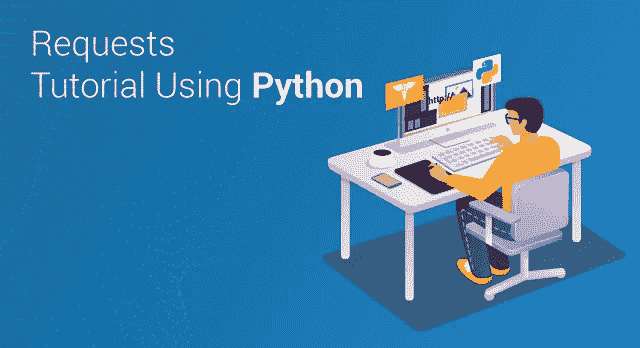

# Python 请求教程-用 Python 获取和发布请求

> 原文：<https://medium.com/edureka/python-requests-tutorial-30edabfa6a1c?source=collection_archive---------0----------------------->



在这篇请求教程文章中，您将学习使用 Python 的请求模块的所有基础知识，从而开始使用请求。我们将在本博客中讨论以下主题:

*   什么是请求模块？
*   安装请求模块
*   发出 GET 请求
*   下载带有请求的图像
*   提出发布请求
*   发送 Cookies 和标题
*   会话对象
*   结论

让我们从查看请求模块实际上是什么开始这篇“请求教程”博客。

# 什么是请求模块？

Requests 是一个 Python 模块，可以用来发送各种 HTTP 请求。这是一个易于使用的库，具有许多功能，从在 URL 中传递参数到发送自定义头和 SSL 验证。在本教程中，您将学习如何使用这个库在 Python 中发送简单的 HTTP 请求。

请求允许您发送 HTTP/1.1 请求。您可以使用简单的 Python 字典添加头、表单数据、多部分文件和参数，并以相同的方式访问响应数据。

# 安装请求模块

要安装请求，只需:

```
$ pip install requests
```

或者，如果你绝对必须:

```
$ easy_install requests
```

# 发出 GET 请求

使用请求发送 HTTP 请求相当简单。首先导入模块，然后发出请求。看看这个例子:

```
import requests 
req = requests.get('https://www.edureka.co/')
```

所以，所有的信息都存储在某个地方，对吗？

是的，它存储在一个名为 **req 的响应对象中。**

比方说，你想要一个网页的编码，这样你就可以验证它或者在其他地方使用它。这可以通过使用 **req.encoding** 属性来完成。

一个额外的好处是，您还可以提取许多特性，例如(请求的)状态代码。这可以使用 **req.status_code** 属性来完成。

```
req.encoding # returns 'utf-8' 
req.status_code # returns 200
```

我们还可以访问服务器发回的 cookies。使用 **req.cookies，**就这么简单！类似地，您也可以获得响应头。这是通过使用 **req.headers.** 来完成的

请注意， **req.headers** 属性将返回响应头的不区分大小写的字典。那么，这意味着什么呢？

这意味着**req . headers[' Content-Length ']**，**req . headers[' Content-Length ']**和**req . headers[' Content-Length ']**都将只返回 **'Content-Length'** 响应头的值。

我们还可以检查获得的响应是否是一个格式良好的 HTTP 重定向(或者不是),它可以使用 **req.is_redirect** 属性自动处理。这将根据获得的响应返回**真**或**假**。

您还可以使用另一个属性获得发送请求和获得响应之间的时间间隔。猜猜看。没错，就是 **req.elapsed** 属性。

还记得最初传递给 **get()** 函数的 URL 吗？因为很多原因，它可能不同于响应的最终 URL，这也包括重定向。

要查看实际的响应 URL，您可以使用 **req.url** 属性。

```
import requests
req = requests.get('http://www.edureka.co/')

req.encoding # returns 'utf-8'
req.status_code # returns 200
req.elapsed # returns datetime.timedelta(0, 1, 666890)
req.url # returns 'https://edureka.co/'

req.history 
# returns [&lt;Response [301]&gt;, &lt;Response [301]&gt;]

req.headers['Content-Type']
# returns 'text/html; charset=utf-8'
```

难道你不认为获得所有这些关于网页的信息是件好事吗？但是，问题是您最有可能想要访问实际的内容，对吗？

如果您正在访问的内容是文本，您总是可以使用 **req.text** 属性来访问它。请注意，内容随后将只被解析为 Unicode。您可以使用前面讨论过的 **req.encoding** 属性来传递解码文本的编码。

在非文本回复的情况下，您可以非常容易地访问它们。事实上，当您使用 **req.content.** 时，它是以二进制格式完成的。这个模块将自动为我们解码 **gzip** 和 **deflate** 传输编码。当您直接处理媒体文件时，这非常有用。此外，您还可以使用 **req.json()** 函数访问 JSON 编码的响应内容，如果它存在的话。

非常简单而且非常灵活，对吗？

此外，如果需要，您也可以通过使用 **req.raw 从服务器获得原始响应。**请记住，您必须在请求中传递 **stream=True** 才能根据需要获得原始响应。

但是，你用请求模块从网上下载的一些文件可能会很大，对吗？在这种情况下，一次性将整个响应或文件加载到内存中是不明智的。但是，建议您使用 **iter_content(chunk_size = 1，decode_unicode = False)** 方法分块下载文件。

因此，这个方法一次迭代 **chunk_size** 字节数的响应数据。当请求上的 **stream=True** 已被设置时，该方法将避免仅针对较大的响应一次性将整个文件读入内存。

请注意， **chunk_size** 参数可以是整数，也可以是 **None** 。但是，当设置为整数值时，chunk_size 确定应该一次读入内存的字节数。

当 **chunk_size** 被设置为 **None** 并且 **stream** 被设置为 **True** 时，数据将在到达时被读取，无论数据块的大小如何。但是，当 **chunk_size** 设置为 **None** 并且 **stream** 设置为 **False** 时，所有数据将仅作为单个数据块返回。

# 使用请求模块下载图像

因此，让我们使用我们所学的请求模块在 Pixabay 上下载下面的森林图像。这是实际的图像:


这是下载图像所需的代码:

```
import requests
req = requests.get('path/to/forest.jpg', stream=True)
req.raise_for_status()
with open('Forest.jpg', 'wb') as fd:
for chunk in req.iter_content(chunk_size=50000):
print('Received a Chunk')
fd.write(chunk)
```

注意， **'path/to/forest.jpg'** 是实际的图片 URL。你可以把任何其他图片的 URL 放在这里来下载其他的东西。这只是这里显示的一个例子，给定的图像文件大小约为 185kb，您已经将 **chunk_size** 设置为 50，000 字节。

这意味着“收到一大块”消息应该在终端中打印四次。最后一个块的大小将只有 39350 字节，因为在前三次迭代之后仍待接收的文件部分是 39350 字节。

请求还允许您在 URL 中传递参数。当您在网页上搜索一些结果(如教程或特定图像)时，这尤其有用。您可以在 GET 请求中使用 **params** 关键字将这些查询字符串作为字符串字典提供。看看这个简单的例子:

```
import requests

query = {'q': 'Forest', 'order': 'popular', 'min_width': '800', 'min_height': '600'}
req = requests.get('https://pixabay.com/en/photos/', params=query)

req.url
# returns 'https://pixabay.com/en/photos/?order=popular&amp;min_height=600&amp;q=Forest&amp;min_width=800'
```

接下来，在这个“请求教程”博客中，让我们来看看我们如何才能提出一个 POST 请求！

# 提出发布请求

发出 POST 请求和发出 GET 请求一样简单。你只是用了 **post()** 函数而不是 **get()** 。

这在自动提交表单时非常有用。例如，下面的代码将下载整个维基百科关于纳米技术的页面，并将其保存在您的 PC 上。

```
import requests
req = requests.post('https://en.wikipedia.org/w/index.php', data = {'search':'Nanotechnology'})
req.raise_for_status()
with open('Nanotechnology.html', 'wb') as fd:
for chunk in req.iter_content(chunk_size=50000):
fd.write(chunk)
```

# 发送 Cookies 和标题

如前所述，您可以使用 **req.cookiess** 和 **req.headers** 来访问服务器发回给您的 cookie 和头。请求还允许您随请求发送自己的自定义 cookies 和标题。比方说，当您想要为您的请求设置一个自定义用户代理时，这是很有帮助的。

要将 HTTP 头添加到请求中，只需在 **dict** 中将它们传递给 **headers** 参数。类似地，您也可以使用传递给 cookie**参数的 **dict** 将自己的 cookie 发送到服务器。**

```
import requests

url = 'http://some-domain.com/set/cookies/headers'

headers = {'user-agent': 'your-own-user-agent/0.0.1'}
cookies = {'visit-month': 'February'}

req = requests.get(url, headers=headers, cookies=cookies)
```

**Cookie 也可以在 Cookie Jar 中传递。它们提供了一个更完整的接口，允许您在多个路径上使用这些 cookies。**

**看看下面这个例子:**

```
import requests

jar = requests.cookies.RequestsCookieJar()
jar.set('first_cookie', 'first', domain='httpbin.org', path='/cookies')
jar.set('second_cookie', 'second', domain='httpbin.org', path='/extra')
jar.set('third_cookie', 'third', domain='httpbin.org', path='/cookies')

url = 'http://httpbin.org/cookies'
req = requests.get(url, cookies=jar)

req.text

# returns '{ "cookies": { "first_cookie": "first", "third_cookie": "third" }}'
```

**接下来，在这个“请求教程”博客中，让我们看看会话对象！**

# **会话对象**

**有时在多个请求中保留某些参数是有用的。会话对象正是这样做的。例如，它将跨使用同一会话的所有请求持久保存 cookie 数据。**

**会话对象使用 **urllib3 的**连接池。这意味着底层 TCP 连接将被对同一主机发出的所有请求重用。**

**这可以显著提高性能。还可以将 Requests 对象的方法用于 Session 对象。**

**当您希望在所有请求之间发送相同的数据时，会话也很有帮助。例如，如果您决定将带有所有请求的 cookie 或用户代理标头发送到给定的域，则可以使用会话对象。**

**这里有一个例子:**

```
import requests

ssn = requests.Session()
ssn.cookies.update({'visit-month': 'February'})

reqOne = ssn.get('http://httpbin.org/cookies')
print(reqOne.text)
# prints information about "visit-month" cookie

reqTwo = ssn.get('http://httpbin.org/cookies', cookies={'visit-year': '2017'})
print(reqTwo.text)
# prints information about "visit-month" and "visit-year" cookie

reqThree = ssn.get('http://httpbin.org/cookies')
print(reqThree.text)
# prints information about "visit-month" cookie
```

**如您所见，**“visit-month”**会话 cookie 与所有三个请求一起发送。然而,“visit-year”cookie 只在第二次请求时发送。第三个请求中也没有提到“visit-year”cookie。这证实了一个事实，即单个请求上的 cookies 或其他数据集不会与其他会话请求一起发送。**

# **结论**

**本教程中讨论的概念应该有助于您通过传递特定的头、cookies 或查询字符串向服务器发出基本请求。**

**当你试图从网页上搜集信息时，这将非常方便。现在，一旦你弄清楚了 URL 的模式，你也应该能够从不同的网站自动下载音乐文件和壁纸。**

**我希望你喜欢这个关于请求教程的帖子。如果你想查看更多关于人工智能、DevOps、道德黑客等市场最热门技术的文章，那么你可以参考 [Edureka 的官方网站。](https://www.edureka.co/blog/?utm_source=medium&utm_medium=content-link&utm_campaign=python-requests-tutorial)**

**请留意本系列中的其他文章，它们将解释 Python 和数据科学的各个方面。**

> **1. [Python 教程](/edureka/python-tutorial-be1b3d015745)**
> 
> **2. [](/edureka/python-functions-f0cabca8c4a) [Python 编程语言](/edureka/python-programming-language-fc1015de7a6f)**
> 
> **3. [Python 函数](/edureka/python-functions-f0cabca8c4a)**
> 
> **4.[Python 中的文件处理](/edureka/file-handling-in-python-e0a6ff96ede9)**
> 
> **5. [](/edureka/scikit-learn-machine-learning-7a2d92e4dd07) [Python Numpy 教程](/edureka/python-numpy-tutorial-89fb8b642c7d)**
> 
> **6. [Scikit 学习机](/edureka/scikit-learn-machine-learning-7a2d92e4dd07)**
> 
> **7. [Python 熊猫教程](/edureka/python-pandas-tutorial-c5055c61d12e)**
> 
> **8. [Matplotlib 教程](/edureka/python-matplotlib-tutorial-15d148a7bfee)**
> 
> **9. [Tkinter 教程](/edureka/tkinter-tutorial-f655d3f4c818)**
> 
> **10. [PyGame 教程](/edureka/pygame-tutorial-9874f7e5c0b4)**
> 
> **11. [OpenCV 教程](/edureka/python-opencv-tutorial-5549bd4940e3)**
> 
> **12.[用 Python 进行网页抓取](/edureka/web-scraping-with-python-d9e6506007bf)**
> 
> **13. [PyCharm 教程](/edureka/pycharm-tutorial-d0ec9ce6fb60)**
> 
> **14.[机器学习教程](/edureka/machine-learning-tutorial-f2883412fba1)**
> 
> **15.[Python 中从头开始的线性回归算法](/edureka/linear-regression-in-python-e66f869cb6ce)**
> 
> **16.[面向数据科学的 Python](/edureka/learn-python-for-data-science-1f9f407943d3)**
> 
> **17. [Python 正则表达式](/edureka/python-regex-regular-expression-tutorial-f2d17ffcf17e)**
> 
> **18.[Python 中的循环](/edureka/loops-in-python-fc5b42e2f313)**
> 
> **19. [Python 项目](/edureka/python-projects-1f401a555ca0)**
> 
> **20.[机器学习项目](/edureka/machine-learning-projects-cb0130d0606f)**
> 
> **21.[Python 中的数组](/edureka/arrays-in-python-14aecabec16e)**
> 
> **22.[在 Python 中设置](/edureka/sets-in-python-a16b410becf4)**
> 
> **23.[Python 中的多线程](/edureka/what-is-mutithreading-19b6349dde0f)**
> 
> **24. [Python 面试问题](/edureka/python-interview-questions-a22257bc309f)**
> 
> **25. [Java vs Python](/edureka/java-vs-python-31d7433ed9d)**
> 
> **26.[如何成为一名 Python 开发者？](/edureka/how-to-become-a-python-developer-462a0093f246)**
> 
> **27. [Python Lambda 函数](/edureka/python-lambda-b84d68d449a0)**
> 
> **28.[网飞如何使用 Python？](/edureka/how-netflix-uses-python-1e4deb2f8ca5)**
> 
> **29.[Python 中什么是套接字编程](/edureka/socket-programming-python-bbac2d423bf9)**
> 
> **30. [Python 数据库连接](/edureka/python-database-connection-b4f9b301947c)**
> 
> **31. [Golang vs Python](/edureka/golang-vs-python-5ac32e1ef2)**
> 
> **32. [Python Seaborn 教程](/edureka/python-seaborn-tutorial-646fdddff322)**
> 
> **33. [Python 职业机会](/edureka/python-career-opportunities-a2500ce158de)**

***原载于 2018 年 12 月 20 日*[*www.edureka.co*](https://www.edureka.co/blog/python-requests-tutorial/)*。***