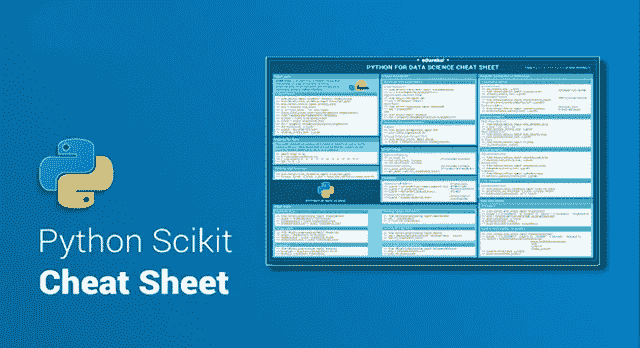
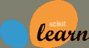
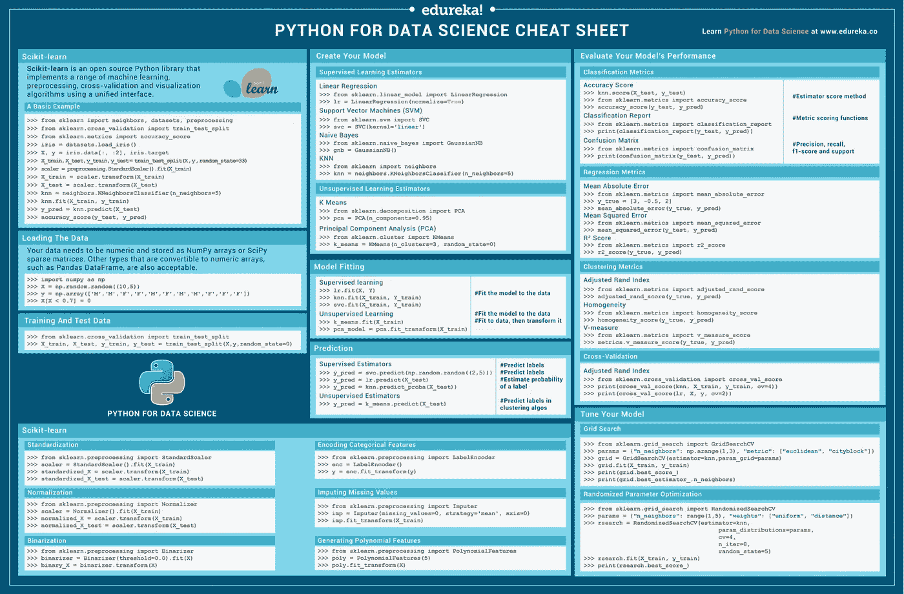

# python sci kit-学习机器学习的备忘单

> 原文：<https://medium.com/edureka/python-scikit-learn-cheat-sheet-9786382be9f5?source=collection_archive---------4----------------------->



Python Scikit Cheat Sheet — Edureka

你是一个正在寻找一个强大的机器学习库的 Python 程序员吗？如果是，那么您必须考虑 scikit-learn。python 中的 Scikit learn 在机器学习的概念中起着不可或缺的作用，并且需要通过 Python 获得 ***数据科学认证*** 。这份 scikit-learn 备忘单是为那些已经开始学习 Python 包但想要一本方便的参考资料的人设计的。如果你是一个初学者，不知道 scikit-learn 如何工作，不要担心，这个机器学习的 scikit-learn 备忘单将为你提供一个你必须知道的入门基础的快速参考。

# Scikit 的 Python 备忘单-学习



Scikit-learn 是一个开源 Python 库，用于机器学习、预处理、交叉验证和可视化算法。它在 Python 中提供了一系列监督和非监督学习算法。



# 一个基本例子

让我们使用 scikit-learn 库创建一个基本示例，它将用于

*   加载数据
*   将数据分为训练和测试，
*   使用 KNN 算法训练您的数据，
*   预测结果

```
>>> from sklearn import neighbors, datasets, preprocessing
>>> from sklearn.model_selection import train_test_split
>>> from sklearn.metrics import accuracy_score
>>> iris = datasets.load_iris() 
>>> X, y = iris.data[:, :2], iris.target
>>> X_train, X_test, y_train, y_test = train_test_split(X, y, random_state=33)
>>> scaler = preprocessing.StandardScaler().fit(X_train)
>>> X_train = scaler.transform(X_train) 
>>> X_test = scaler.transform(X_test)
>>> knn = neighbors.KNeighborsClassifier(n_neighbors=5)
>>> knn.fit(X_train, y_train)
>>> y_pred = knn.predict(X_test)
>>> accuracy_score(y_test, y_pred)
```

# 加载数据

您需要将数值数据存储在 NumPy 数组或 SciPy 稀疏矩阵中。也可以使用其他数值数组，比如 Pandas DataFrame。

```
>>> import numpy as np
>>> X = np.random.random((10,5))
>>> y = np.array(['M','M','F','F','M','F','M','M','F','F','F'])
>>> X[X < 0.7] = 0
```

# 培训和测试

加载数据后，您的下一个任务是将数据集拆分为训练数据和测试数据。

```
>>> from sklearn.model_selection import train_test_split
>>> X_train, X_test, y_train, y_test = train_test_split(X, y, random_state=0)
```

# 数据预处理

## 标准化

数据**标准化**是数据预处理步骤之一，用于重新调整一个或多个属性，使属性的平均值为 0，标准偏差为 1。**标准化**假设你的数据具有高斯(钟形曲线)分布。

```
>>> from sklearn.preprocessing import StandardScaler
>>> scaler = StandardScaler().fit(X_train)
>>> standardized_X = scaler.transform(X_train)
>>> standardized_X_test = scaler.transform(X_test)
```

# 正常化

**归一化**是一种通常用于为**机器学习**做数据准备的技术。**规范化**的主要目标是改变数据集中数值列的值，这样我们可以有一个共同的范围，而不会丢失信息或扭曲值范围的差异。

```
>>> from sklearn.preprocessing import Normalizer
>>> scaler = Normalizer().fit(X_train)
>>> normalized_X = scaler.transform(X_train)
>>> normalized_X_test = scaler.transform(X_test)
```

# 二值化

二值化是对文本计数数据执行的常见操作。例如，使用二值化，分析员可以决定考虑特征的存在或不存在，而不是具有量化的出现次数。

```
>>> from sklearn.preprocessing import Binarizer
>>> binarizer = Binarizer(threshold=0.0).fit(X)
>>> binary_X = binarizer.transform(X)
```

# 编码分类特征

LabelEncoder 是用于编码类级别的数据预处理的另一个类。它还可以用于将非数字标签转换为数字标签。

```
>>> from sklearn.preprocessing import LabelEncoder
>>> enc = LabelEncoder()
>>> y = enc.fit_transform(y)
```

# 输入缺失值

python 中的 Imputer 类将为您提供输入/填充缺失值的基本策略。它通过使用缺失值所在的行或列的平均值、中间值或最频繁出现的值来实现这一点。这个类还允许对不同的缺失值进行编码。

```
>>> from sklearn.preprocessing import Imputer
>>> imp = Imputer(missing_values=0, strategy='mean', axis=0)
>>> imp.fit_transform(X_train)
```

# 生成多项式要素

多项式特征生成新的特征矩阵，该矩阵由次数小于或等于指定次数的特征的所有多项式组合组成。例如，如果输入样本是二维的并且形式为[a，b ]，则 2 次多项式特征是[1，a，b，a，ab，b]。

```
>>> from sklearn.preprocessing import PolynomialFeatures
>>> poly = PolynomialFeatures(5)
>>> poly.fit_transform(X)
```

# 创建您的模型

# 监督学习估计器

**监督学习**是一种机器学习，它使模型能够在对**标记的数据**进行**训练**后预测未来的结果。

```
# Linear Regression Algorithm
>>> from sklearn.linear_model import LinearRegression
>>> lr = LinearRegression(normalize=True)
# Naive Bayes Algorithm
>>> from sklearn.naive_bayes import GaussianNB
>>> gnb = GaussianNB()
# KNN Algorithm
>>> from sklearn import neighbors
>>> knn = neighbors.KNeighborsClassifier(n_neighbors=5)
# Support Vector Machines (SVM)
>>> from sklearn.svm import SVC
>>> svc = SVC(kernel='linear’)
```

# 无监督学习估计器

**无监督学习**是一种机器学习，它使模型能够预测未来的结果**，而无需对**标记的数据**进行**训练**。**

```
# Principal Component Analysis (PCA)
>>> from sklearn.decomposition import PCA
>>> pca = PCA(n_components=0.95)
# K Means Clustering Algorithm
>>> from sklearn.cluster import KMeans
>>> k_means = KMeans(n_clusters=3, random_state=0)
```

# 模型拟合

**拟合**是对一个**机器学习模型**推广到与其被训练的数据相似的数据的程度的衡量

```
# For Supervised learning
>>> lr.fit(X, y) #Fits data into the model
>>> knn.fit(X_train, y_train)
>>> svc.fit(X_train, y_train)
# For Unsupervised Learning
>>> k_means.fit(X_train)#Fits data into the model
>>> pca_model = pca.fit_transform(X_train) #Fit to data, then transform it
```

# 预言；预测；预告

**拟合**是衡量一个**机器学习模型**推广到类似数据的程度

```
# For Supervised learning
>>> y_pred=svc.predict(np.random((2,5))) #predict label
>>> y_pred=lr.predict(x_test) #predict label
>>> y_pred=knn.predict_proba(x_test)#estimate probablity of a label
# For Unsupervised Learning
>>> y_pred=k_means.predict(x_test) #predict labels in clustering algorithm
```

# 评估模型的性能

## 分类指标

`[sklearn.metrics](http://scikit-learn.org/stable/modules/classes.html#module-sklearn.metrics)`模块实现了几个损失、得分和效用函数来测量分类性能。

```
# Mean Absolute Error
>>> from sklearn.metrics import mean_absolute_error
>>> y_true = [3, -0.5, 2]
>>> mean_absolute_error(y_true, y_pred)
# Mean Squared Error
>>> from sklearn.metrics import mean_squared_error
>>> mean_squared_error(y_test, y_pred)
# R² Score
>>> from sklearn.metrics import r2_score
>>> r2_score(y_true, y_pred)
```

# 聚类度量

```
# Adjusted Rand Index
>>> from sklearn.metrics import adjusted_rand_score
>>> adjusted_rand_score(y_true, y_pred)
# Homogeneity
>>> from sklearn.metrics import homogeneity_score
>>> homogeneity_score(y_true, y_pred)
# V-measure
>>> from sklearn.metrics import v_measure_score
>>> metrics.v_measure_score(y_true, y_pred)
```

# 回归度量

`[sklearn.metrics](http://scikit-learn.org/stable/modules/classes.html#module-sklearn.metrics)`模块实现了几个损失、得分和效用函数来测量回归性能。

```
# Accuracy Score
>>> knn.score(X_test, y_test)
>>> from sklearn.metrics import accuracy_score
>>> accuracy_score(y_test, y_pred)
# Classification Report
>>> from sklearn.metrics import classification_report
>>> print(classification_report(y_test, y_pred))
# Confusion Matrix
>>> from sklearn.metrics import confusion_matrix
>>> print(confusion_matrix(y_test, y_pred))
```

# 交互效度分析

```
>>> from sklearn.cross_validation import cross_val_score 
>>> print(cross_val_score(knn, X_train, y_train, cv=4)) 
>>> print(cross_val_score(lr, X, y, cv=2))
```

# 调整您的模型

## 网格搜索

GridSearchCV 实现了“fit”和“score”方法。它还实现“预测”、“预测 _proba”、“决策 _ 函数”、“变换”和“逆变换”，如果它们在所使用的估计器中实现的话。

```
>>> from sklearn.grid_search import GridSearchCV
>>> params = {"n_neighbors": np.arange(1,3), "metric": ["euclidean", "cityblock"]}
>>> grid = GridSearchCV(estimator=knn, param_grid=params)
>>> grid.fit(X_train, y_train)
>>> print(grid.best_score_)
>>> print(grid.best_estimator_.n_neighbors)
```

## 随机参数优化

RandomizedSearchCV 对超级参数执行随机搜索。与 GridSearchCV 相反，不是所有的参数值都被尝试，而是从指定的分布中采样固定数量的参数设置。尝试的参数设置的数量由 n_iter 给出。

```
>>> from sklearn.grid_search import RandomizedSearchCV
>>> params = {"n_neighbours": range(1,5), "weights":["uniform", "distance"]}
>>>rserach = RandomizedSearchCV(estimator=knn,param_distribution=params, cv=4, n_iter=8, random_state=5)
>>> rsearch.fit(X_train, Y_train)
>>> print(rsearch.best_score)
```

## [下载 Scikit 的 Python 备忘单-学习](http://bit.ly/2MU6jFF)

如果你想查看更多关于人工智能、DevOps、道德黑客等市场最热门技术的文章，那么你可以参考 [Edureka 的官方网站。](https://www.edureka.co/blog/?utm_source=medium&utm_medium=content-link&utm_campaign=python-scikit-learn-cheat-sheet)

请留意本系列中的其他文章，它们将解释 Python 和数据科学的各个方面。

> 1.[Python 中的机器学习分类器](/edureka/machine-learning-classifier-c02fbd8400c9)
> 
> 2. [Python 面试问题](/edureka/python-interview-questions-a22257bc309f)
> 
> 3.[机器学习工具](/edureka/python-libraries-for-data-science-and-machine-learning-1c502744f277)
> 
> 4.[用于数据科学和机器学习的 Python 库](/edureka/python-libraries-for-data-science-and-machine-learning-1c502744f277)
> 
> 5.[Python 中的聊天机器人](/edureka/how-to-make-a-chatbot-in-python-b68fd390b219)
> 
> 6. [Python 集合](/edureka/collections-in-python-d0bc0ed8d938)
> 
> 7. [Python 模块](/edureka/python-modules-abb0145a5963)
> 
> 8. [Python 开发者技能](/edureka/python-developer-skills-371583a69be1)
> 
> 9.[哎呀面试问答](/edureka/oops-interview-questions-621fc922cdf4)
> 
> 10.[Python 开发者简历](/edureka/python-developer-resume-ded7799b4389)
> 
> 11.[Python 中的探索性数据分析](/edureka/exploratory-data-analysis-in-python-3ee69362a46e)
> 
> 12.[带 Python 的乌龟模块的贪吃蛇游戏](/edureka/python-turtle-module-361816449390)
> 
> 13. [Python 开发者工资](/edureka/python-developer-salary-ba2eff6a502e)
> 
> 14.[主成分分析](/edureka/principal-component-analysis-69d7a4babc96)
> 
> 15. [Python vs C++](/edureka/python-vs-cpp-c3ffbea01eec)
> 
> 16.[刺儿头教程](/edureka/scrapy-tutorial-5584517658fb)
> 
> 17. [Python SciPy](/edureka/scipy-tutorial-38723361ba4b)
> 
> 18.[最小二乘回归法](/edureka/least-square-regression-40b59cca8ea7)
> 
> 19. [Jupyter 笔记本小抄](/edureka/jupyter-notebook-cheat-sheet-88f60d1aca7)
> 
> 20. [Python 基础知识](/edureka/python-basics-f371d7fc0054)
> 
> 21. [Python 模式程序](/edureka/python-pattern-programs-75e1e764a42f)
> 
> 22.[Python 中的发电机](/edureka/generators-in-python-258f21e3d3ff)
> 
> 23. [Python 装饰器](/edureka/python-decorator-tutorial-bf7b21278564)
> 
> 24. [Python Spyder IDE](/edureka/spyder-ide-2a91caac4e46)
> 
> 25.[在 Python 中使用 Kivy 的移动应用](/edureka/kivy-tutorial-9a0f02fe53f5)
> 
> 26.[十大最佳学习书籍&练习 Python](/edureka/best-books-for-python-11137561beb7)
> 
> 27.[用 Python 实现的机器人框架](/edureka/robot-framework-tutorial-f8a75ab23cfd)
> 
> 28.[使用 PyGame 的 Python 中的贪吃蛇游戏](/edureka/snake-game-with-pygame-497f1683eeaa)
> 
> 29. [Django 面试问答](/edureka/django-interview-questions-a4df7bfeb7e8)
> 
> 30.[十大 Python 应用](/edureka/python-applications-18b780d64f3b)
> 
> 31.[Python 中的哈希表和哈希表](/edureka/hash-tables-and-hashmaps-in-python-3bd7fc1b00b4)
> 
> 32. [Python 3.8](/edureka/whats-new-python-3-8-7d52cda747b)
> 
> 33.[支持向量机](/edureka/support-vector-machine-in-python-539dca55c26a)
> 
> 34. [Python 教程](/edureka/python-tutorial-be1b3d015745)