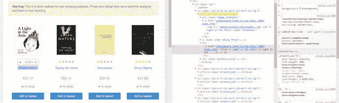

# 为初学者创建您的第一个 spider-01-Python scrapy 教程

> 原文：<https://medium.com/quick-code/python-scrapy-tutorial-for-beginners-01-creating-your-first-spider-13b1297886a2?source=collection_archive---------1----------------------->


了解如何使用 Python 和 Scrapy 框架在几分钟内获取任何网站的数据。在“Python scrapy 初学者教程”的第一课，我们将从一个[书店](http://books.toscrape.com)中抓取数据，提取所有信息并存储在一个文件中。

在这篇文章中，你将学到:

*   准备您的环境并安装一切
*   如何创建一个 Scrapy 项目和蜘蛛
*   如何从 HTML 中获取数据
*   操作数据并提取您想要的数据
*   如何将数据存储到. json 中。csv 和。xml 文件

> 本文的视频版本

# 准备您的环境并安装一切


在做任何事情之前，我们需要准备好我们的环境并安装好一切。

*在 Python 中，我们创建虚拟环境来拥有一个具有不同依赖关系的独立环境。*

*比如 Project1 有 Python 3.4 和 Scrapy 1.2，Project2 有 Python 3.7.4 和 Scrapy 1.7.3。*

由于我们保持独立的环境，一个项目一个环境，我们永远不会因为拥有不同版本的包而产生冲突。

您可以使用 [Conda](https://docs.conda.io/en/latest/) 、 [virtualenv](https://virtualenv.pypa.io/en/latest/) 或 [Pipenv](https://github.com/pypa/pipenv) 来创建虚拟环境。在本课程中，我将使用 pipenv。你只需要用 *pip install* 安装它，并用 *pipenv shell* 创建一个新的虚拟环境。

一旦设置好，用 *pip 安装 scrapy* 安装 Scrapy。这就是你所需要的。

是时候创建项目和你的蜘蛛了。


# 创建项目和蜘蛛——以及它们是什么


在此之前，我们需要创建一个 Scrapy 项目。在当前文件夹中，输入:

```
scrapy startproject books
```

这将创建一个名为“books”的项目。在里面你会找到一些文件。我将在更详细的帖子中解释它们。

创建项目后，导航到创建的项目(cd books ),进入文件夹后，通过传递名称和根 URL(不带“www ”)创建一个蜘蛛:

```
scrapy genspider spider books.toscrape.com
```

现在我们有我们的蜘蛛在蜘蛛文件夹里！你会得到这样的东西:

首先，我们进口 scrapy。然后，从 Scrapy 继承“Spider”创建了一个类。这个类有 3 个变量和一个方法。

变量是蜘蛛的名字，允许的域名和起始网址。不言自明。这个名字是我们马上要用来运行蜘蛛的，allowed_domains 限制了抓取过程的范围(它不能超出这里没有指定的任何 URL ), start _ URLs 是 scrapy 蜘蛛的起点。在这种情况下，只有一个。

当我们启动 Scrapy spider 时，会在内部调用 parse 方法。现在只有“通过”:它什么也不做。让我们解决这个问题。

# 如何从 HTML 中获取数据


我们将查询 HTML，为此我们需要 Xpath，一种查询语言。不要担心，即使一开始看起来很奇怪，也很容易学会，因为你需要的只是一些函数。

## 解析方法

但是首先，让我们看看我们有什么关于“解析”方法。

解析它在 Scrapy spider 启动时被自动调用。作为参数，我们有(类的实例)和一个*响应*。*响应*是当我们请求一个 HTML 时服务器返回的结果。在这个类中，我们请求 h*TTP://books . toscrape . com*，在这个类中，我们有一个包含所有 HTML、状态消息等等的对象。

将“pass”替换为*print(response . status)*并运行 spider:

```
scrapy crawl spider
```

这是我们得到的:


在很多信息之间，我们看到我们已经抓取了 start_url，得到了 200 HTTP 消息(成功)然后蜘蛛停止了。

除了‘地位’，我们蜘蛛还有很多方法。我们现在要用的是“xpath”。

## Xpath 的第一步

打开起始网址，[http://books.toscrape.com/](http://books.toscrape.com/)，右键- >查看任意一本书。将打开一个带有网站 HTML 结构的侧菜单(如果没有，请确保您选择了“元素”选项卡)。你会看到这样的东西:


我们可以看到每个“文章”标签包含了我们想要的所有信息。

计划是抓取所有的文章，然后一篇接一篇地从每本书中获取所有的信息。

首先，让我们看看如何选择所有文章。

如果我们点击 HTML 侧边菜单并按 Control + F，搜索菜单打开:


在右下角，你可以看到“通过字符串、选择器或 Xpath 查找”。Scrapy 用的是 Xpath，我们就用它吧。

要用 Xpath 开始一个查询，先写“//”，然后是您想要查找的内容。我们想抓取所有的文章，所以键入“//article”。我们希望更准确，所以我们抓取所有属性为' class = product_pod '的文章。若要指定属性，请在方括号中键入，如下所示:“//article[@ class = " product _ pod "]”。

你现在可以看到，我们已经选择了 20 个元素:20 本初始书籍。


好像我们成功了！让我们复制 Xpath 指令并使用它来选择我们蜘蛛中的文章。然后，我们储存所有的书。

# 提取数据


一旦我们有了所有的书，我们想要在每本书里面寻找我们想要的信息。先说题目。请访问您的 URL，搜索完整标题所在的位置。右键单击任何标题，然后选择“检查”。



在 h3 标签中，有一个“a”标签，将图书标题作为“title”属性。让我们把这些书翻一遍，然后摘录下来。

我们得到所有的书，对于每一本书，我们搜索“h3”标签，然后搜索“a”标签，并选择@title 属性。我们需要该文本，所以我们使用' *extract_first 【T1 ')(我们也可以'使用 extract '来提取所有文本)。*

因为我们抓取的不是整个 HTML，而是一个小的子集(book 中的子集)，所以我们需要在 Xpath 函数的开头放一个点。记住:'//'代表整个 HTML 响应，'。//'作为我们已经提取 HTML 的子集。

我们有标题，现在去的价格。右键点击价格并检查。


我们想要的文本在一个“p”标记内，而“price_color”类在一个“div”标记内。在标题后添加以下内容:

```
price = book.xpath('.//div/p[@class="price_color"]/text()').extract_first()
```

我们转到任何一个“div ”,带有一个包含“price_color”类的“p”子元素，然后我们使用“text()”函数来获取文本。然后，我们*提取 _first()* 我们的选择。

让我们看看我们有什么？打印价格和标题，并运行蜘蛛。

```
scrapy crawl spider
```


一切都在按计划进行。让我们把图片的网址也带上。右键单击图像，检查它:


我们这里没有网址，只有一部分。


“src”属性具有相对 URL，而不是完整的 URL。“books.toscrape.com”丢失。嗯，我们只需要添加它。把这个加到你方法的底部。

我们用类“thumbnail”获得“img”标签，用“src”获得相对 URL，然后添加第一个(也是唯一的)start_url。同样，让我们打印结果。再次运行蜘蛛。


看起来不错！打开任何一个网址，你都会看到封面的缩略图。

现在让我们提取网址，这样我们就可以购买任何感兴趣的书。


图书 URL 存储在标题和缩略图的 href 中。两者都可以。

再次运行蜘蛛:


点击任何一个网址，你就会进入那本书的网站。

现在我们选择了我们想要的所有字段，但是我们没有对它做任何事情，对吗？我们需要“让出”(或“归还”)它们。对于每本书，我们将返回它的标题，价格，图像和图书的网址。

删除所有的打印，并产生像字典一样的项目:

运行蜘蛛程序，查看终端:


# 将数据保存到文件中

虽然在终端上看起来很酷，但是没有任何用处。我们为什么不把它存储到一个文件中，以便以后使用呢？

当我们运行蜘蛛时，我们有可选的参数。其中之一是您想要存储的文件的名称。运行这个。

```
scrapy crawl spider -o books.json
```

等到完成…一个新的文件出现了！双击它将其打开。


我们在终端上看到的所有信息现在都存储在一个“books.json”中。是不是很酷？我们也可以这样做。csv 和。xml 文件:


# 结论

我知道第一次很棘手，但你已经学到了 Scrapy 的基本知识。您知道如何:

*   创建一个 Scrapy 蜘蛛导航一个网址
*   一个杂乱的项目是结构化的
*   使用 Xpath 提取数据
*   将数据存储在中。json，。csv 和。xml 文件

建议你继续训练。寻找一个你想要抓取的 URL，尝试提取几个字段，就像你在[美汤教程](https://letslearnabout.net/python/beautiful-soup/your-first-web-scraping-script-with-python-beautiful-soup/)中所做的那样。Scrapy 的诀窍是学习 Xpath 是如何工作的。

但是…你记得每本书都有一个像这样的 URL吗？

在我们收集的每一件物品中，我们可以获取更多的信息。我们将在本系列的[第二课](https://letslearnabout.net/tutorial/scrapy-tutorial/python-scrapy-tutorial-for-beginners-02-extract-all-the-data/)中进行讲解。

[Github 上的最终代码](https://github.com/david1707/scrapy_tutorial/tree/01_lesson)

[在 Twitter 上联系我](https://twitter.com/DavidMM1707)

[我的 Youtube 教程视频](https://www.youtube.com/channel/UC9OLm6YFRzr4yjlw4xNWYvg?sub_confirmation=1)

[你的第一个用 Python 和美汤编写的网页抓取脚本](https://letslearnabout.net/python/beautiful-soup/your-first-web-scraping-script-with-python-beautiful-soup/)

*原载于 2019 年 9 月 1 日*[*https://letslearnabout.net*](https://letslearnabout.net/tutorial/scrapy-tutorial/python-scrapy-tutorial-for-beginners-01-creating-your-first-spider/)*。*