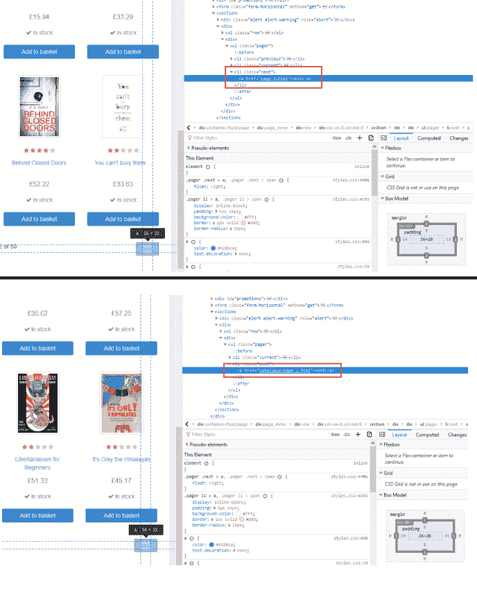

# Python 初学者 Scrapy 教程— 03 —如何进入下一页

> 原文：<https://medium.com/quick-code/python-scrapy-tutorial-for-beginners-03-how-to-go-to-the-next-page-d29827e0544b?source=collection_archive---------0----------------------->

在上一课中，[用 Scrapy 提取所有数据，](https://letslearnabout.net/tutorial/python-scrapy-tutorial-for-beginners-02-extract-all-the-data/)我们设法获取了所有书籍的 URL，然后从每本书中提取数据。我们被限制在主页上的书籍，因为我们不知道如何使用 Scrapy 进入下一页。

直到现在。

在这篇文章中，你将学习如何:

*   导航到“下一页”
*   解决路由问题
*   提取每本书的所有数据

> 本课的视频版本

# 我们的游戏计划

最初，我们只是列出所有书籍的网址，然后，一个接一个，我们提取数据。

因为我们有 20 本书，所以我们只列出了 20 本书的 URL，然后解析这 20 个 URL，产生结果。

我们只需要再增加一个步骤。

现在，我们将列出 20 个图书 URL，解析它们，然后，如果有“下一页”,我们将导航到它以重复这个过程，列出并产生新的 20 个图书 URL，直到没有更多的页面。

在我们的[美汤教程](https://letslearnabout.net/python/beautiful-soup/your-first-web-scraping-script-with-python-beautiful-soup/)中，我们使用了同样的策略:

这就是我们现在要开始使用的。

# 检查是否有“下一页”可用

让我们从第二课中使用的代码开始，[提取所有数据](https://letslearnabout.net/tutorial/python-scrapy-tutorial-for-beginners-02-extract-all-the-data/)

由于这目前正在工作，我们只需要在 for 循环结束后检查是否有“下一步”按钮。右键单击下一步按钮:

下一页 URL 在一个*标签内，一个*标签内，一个 *li* 标签内。您知道如何提取它，所以创建一个我们可以导航到的 *next_page_url* 。请注意，它是一个部分 URL，所以您需要添加基本 URL。就像我们以前做的那样，你可以自己做。试试看。

我是这样做的:

使用*scrapy crawl spider-o next _ page . JSON*运行代码并检查结果。

这是怎么回事？文件中只有 20 个元素！让我们检查日志，看看发生了什么事。

我们设法弄到了第一批 20 本书，但是突然之间，我们再也买不到更多的书了…

*books.toscrape.com*是[抓取中心](https://scrapinghub.com/)做的一个网站，用来培训人们抓取网页，里面有你需要注意的小陷阱。比较成功的 URL(蓝色下划线)和失败的 URL(红色下划线)。每条路线上都缺少一个*/目录*。他们添加它不是为了让你失败。

让我们解决这个问题。

# 解决“图书”路线问题

由于有些 URL 缺少*/目录*，我们来检查一下:如果路由没有，我们就把它加到部分 URL 的前缀上。就这么简单。

继续之前，请自行尝试。你可以在这里查看我的代码:

让我们再次运行代码！应该管用吧？*刺儿头爬行蜘蛛-o next_page.json*

现在我们有更多的书了！但只有 40 岁。我们设法得到了第一个 20，然后是下一个 20。然后，发生了一件事。我们没有从第二页拿到第三页。让我们转到第二页，看看“下一步”按钮是怎么回事，并将其与第一个按钮(及其到第二个按钮的链接)进行比较

我们遇到了与书籍相同的问题:一些链接有*/目录*，一些没有。

# 解决“下一个”路由问题

因为我们有同样的问题，所以我们有同样的解决方案。一个你可以轻松解决的问题。你为什么不试试？同样，你只需要检查链接和前缀*/目录*，以防子字符串不存在。

如果你不能解决它，这是我的解决方案:

您可以看到这种模式:我们获取部分 URL，检查是否缺少*/catalog*，如果缺少，我们添加它。然后，我们添加 base_url，我们就有了我们的绝对 url。

再次运行蜘蛛:*刺儿爬蜘蛛-o next_page.json* 。

现在我们有 1000 本书了。每一个都是。🙂

这是最后的代码:

# 结论

你今天达到了一个里程碑。现在你可以从一个网站中提取每一个元素。

你已经知道了你需要得到第一页上的所有元素，单独地删除它们，以及如何转到下一页重复这个过程。让我再一次展示这张图表:

不仅如此。这个例子很棘手，因为我们必须检查部分 URL 是否有*/目录*来添加它。

通常情况下，用 Scrapy 对网站进行分页更容易，因为“下一步”按钮包含完整的 URL，所以这个例子比正常情况下更难，但你还是成功了！

但是…如果我告诉你这比我们以前做的更容易呢？

不要拿着你的干草叉去我家，而是去第四课[那里你将学习如何使用爬行器以更简单的方式刮每一件物品。](https://letslearnabout.net/tutorial/python-scrapy-tutorial-for-beginners-04-crawler-rules-and-linkextractor/)

[我的 Youtube 教程视频](https://www.youtube.com/channel/UC9OLm6YFRzr4yjlw4xNWYvg?sub_confirmation=1)

[Github 上的最终代码](https://github.com/david1707/scrapy_tutorial/tree/02_lesson)

[在推特上联系我](https://twitter.com/DavidMM1707)

[上一课:02 —创建您的第一个蜘蛛](https://letslearnabout.net/tutorial/python-scrapy-tutorial-for-beginners-02-extract-all-the-data/)

*原载于 2019 年 9 月 12 日*[*【https://letslearnabout.net】*](https://letslearnabout.net/tutorial/python-scrapy-tutorial-for-beginners-03-how-to-go-to-the-next-page/)*。*