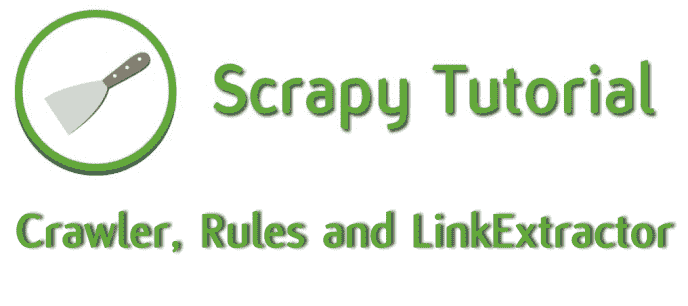
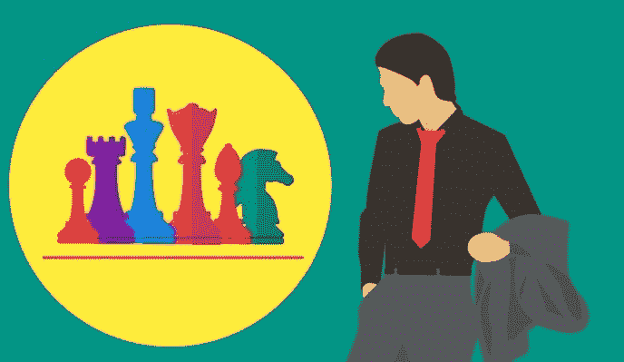
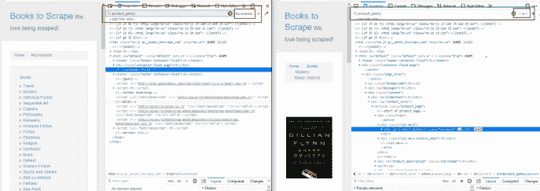
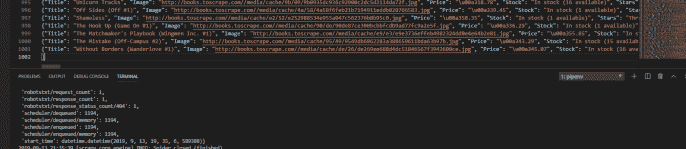

# 如何在 Python 中构建爬虫、规则和链接提取器

> 原文：<https://medium.com/quick-code/python-scrapy-tutorial-for-beginners-04-crawler-rules-and-linkextractor-7a79aeb8d72?source=collection_archive---------0----------------------->

## Python 初学者 Scrapy 教程— 04

在我们上一课[如何进入下一页](https://letslearnabout.net/tutorial/python-scrapy-tutorial-for-beginners-03-how-to-go-to-the-next-page/)中，我们浏览了整个网站直到最后一本书。但是今天，我们将学习一个工具，它将使我们的网络抓取任务变得更加简单。

我们在谈论爬行蜘蛛。

在这篇文章中，你将学习如何:

*   如何使用新蜘蛛:CrawlSpider
*   什么是规则和链接提取器
*   不费吹灰之力就刮光了整个网站

你准备好了吗？

# 我们的游戏计划

到目前为止，我们完成的每一项任务都帮助了我们两件事:获取所需的 URL 或提取信息。

我们提取了部分 URL，对它们进行了操作，添加到基本 URL 中以创建绝对 URL，虽然这很有效，但是太多了。嗯，可能不会太多，因为只有几行代码，但是我们可以让它更简单。

简单多了。

这里，我们将再次使用代码的两个部分。一个获取 URL，另一个提取信息。

因为我们将使用相同的结构，我们不应该做任何修改。我们将改进提取网址的方式。

我们要把它变得简单到你都不会相信。

我说的是新的蜘蛛:爬行蜘蛛。

# 新蜘蛛:爬行蜘蛛

我们从上一课开始学起。这是我们目前的[蜘蛛](https://letslearnabout.net/tutorial/python-scrapy-tutorial-for-beginners-03-how-to-go-to-the-next-page/):

哇…这个*解析*方法太乱了…对不起！请删除它。

不，我没开玩笑。移除整个函数。

还记得我们将要简化 URL 的提取吗？现在删除那个该死的大*解析*函数..

检查主 SpiderSpider 类。我们继承了 *scrapy.Spider.* 我们不要那个蜘蛛，它太笨了！所以，我们应该用爬虫代替。去顶部的进口和进口的爬行蜘蛛从刺痒的蜘蛛。让你的蜘蛛蜘蛛继承它:

好多了。

但是…记住蜘蛛总是调用 *parse* 方法来开始读取代码？嗯，不是这个。

在这里，我们不需要寻找一个*解析*方法，我们可以指示这个蜘蛛去做我们想要的事情。但要做到这一点，我们需要制定基本规则，对吗？同样，Python 初学者可以从[最佳 Python 教程](https://blog.coursesity.com/learning-plan-learn-coding-in-python-like-a-tiger/)中学习，以增强他们的学习。

# 规则和链接提取器

爬虫蜘蛛除了拥有与普通蜘蛛相同的属性之外，还有一个新的属性:*规则*。

“规则”是一个或多个规则对象的列表，其中每个规则定义了一种用于爬取站点的行为类型。

此外，我们将使用 LinkExtractor:一个定义如何从每个被抓取的页面中提取链接的对象。

规则设定了如何抓取网站的行为，以及如何提取链接。但是我们最好能看到它是如何工作的，对吗？让我们导入规则和 LinkExtractor，然后定义规则:

我们导入资源并创建一个规则:在这个规则中，我们将设置如何提取链接，从哪里提取以及如何处理它们。

首先，我们设置*allow = ' catalog/'*。现在，如果网址中没有“目录/”，我们甚至不会处理它。比我们以前用的如果好多了，对吧？

我们还有一个*回调*:编程中的回调是我们在当前进程完成后做的事情。在这种情况下，它意味着“在获得一个有效的 URL 之后，调用 *parse_filter_book* 方法。

而 *follow* 只是指定是否应该从每个响应中跟踪链接。当我们将它设置为 True 时，我们将获得任何嵌套的 URL。整个网站。

现在，将 *parse_book* 改为 *parse_filter_book* 并运行代码！

哦…我们有一个错误:

*属性错误:“NoneType”对象没有属性“replace”*

当然:我们正在提取代码中的每个 URL！不仅是书，还有分页(page-1.html，page-2.html 等)和蜘蛛找到的每个网址。

只有当页面是有效的图书 URL 时，我们才应该使用 *parse_filter_book* 方法！

# 过滤网址

在 *parse_filter_book* 中，我们将执行一个小检查:如果 URL 是一个图书 URL，则提取数据。如果不是，什么都不做。

但是我们如何知道一个 URL 是属于一本书还是属于其他 URL 呢？

好吧，我们来查一个:打开[http://books . toscrape . com/catalogue/sharp-objects _ 997/index . html](http://books.toscrape.com/catalogue/sharp-objects_997/index.html)和一个非图书的网址，比如[http://books.toscrape.com/index.html](http://books.toscrape.com/index.html)

现在我们需要从书籍中寻找一个非书籍 URL 中没有的元素。例如，我注意到书籍有一个 *product_gallery* 类:

我们可以用这个来区分书籍和非书籍的网址！

像这样修改您的代码:

关键是前两行:我们尝试用“product_gallery”类获取 div。如果存在，我们解析 URL。如果没有，我们就打印出来。

现在让我们运行代码…

我们的一千本书都在那里！太好了！

# 结论

今天我们学习了如何:

*   履带式工程
*   设置规则和链接提取器
*   提取网站中的每个 URL
*   我们必须过滤收到的网址，从书籍的网址提取数据，而不是每个网址

这不是你网络抓取学习的又一步，这是一个巨大的飞跃。

正如你在本课中所看到的，使用爬虫可以帮助你简化你的代码。

这是一个简单的例子，但是如果像亚马逊和易贝那样，我们有书、乐器、食物等等，而不是书，会怎么样呢？没有爬虫，蜘蛛会变得疯狂。可行，但有点疯狂。欢迎你来试试！

你现在对 Scrapy 有了一个基本的了解。现在我们需要更深入。在下一课，我们将学习管道和物品。

但在此之前…

* *第五课正在建设中。谢谢你的耐心。*

# 锻炼

现在，您已经知道如何使用 Spider 和 CrawlSpider 获取所需的 URL，如何使用 Xpath 提取数据，以及如何将信息生成到文件中。

现在是你自己工作的时候了！找一个容易报废的网站，自己试着报废。

你可以使用帮助，例如寻找过去的教训，搜索谷歌，查看 [Scrapy 文档](https://docs.scrapy.org/en/latest/)等。但是你需要自己去做。

之后，在这里留下你的网站和代码的评论，这样每个人都可以看到你是如何独立完成的，你有多自豪！

[我的 Youtube 教程视频](https://www.youtube.com/channel/UC9OLm6YFRzr4yjlw4xNWYvg?sub_confirmation=1)

[Github 上的最终代码](https://github.com/david1707/scrapy_tutorial/tree/03_lesson)

[在 Twitter 上联系我](https://twitter.com/DavidMM1707)

[上一课:03 —如何进入下一页](https://letslearnabout.net/tutorial/python-scrapy-tutorial-for-beginners-03-how-to-go-to-the-next-page/)

*原载于 2019 年 9 月 14 日*[*letslearnabout.net*](https://letslearnabout.net/tutorial/python-scrapy-tutorial-for-beginners-04-crawler-rules-and-linkextractor/)*。*