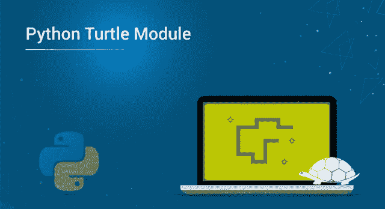
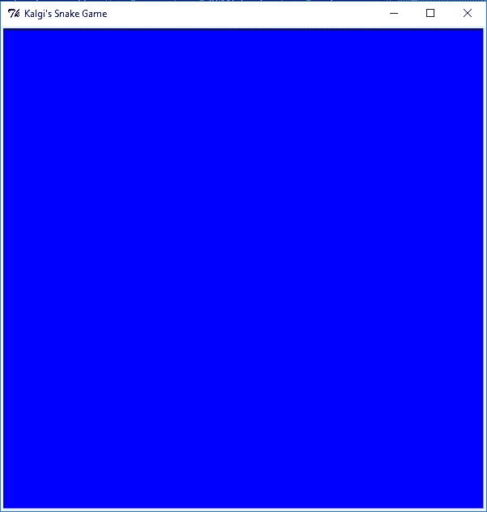
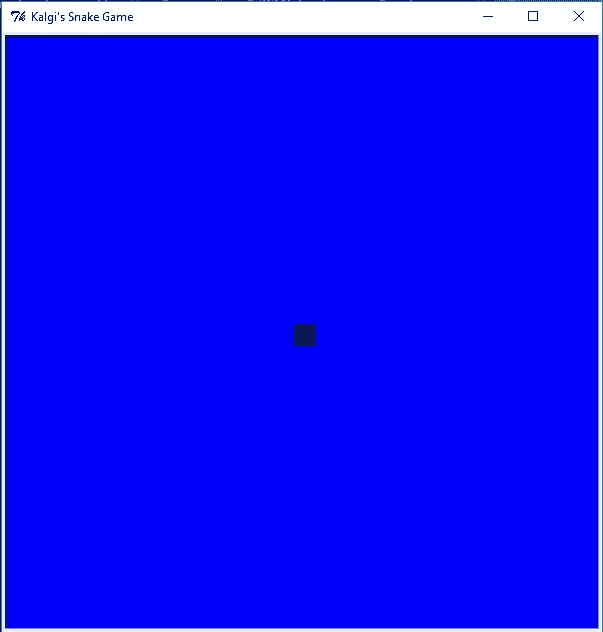
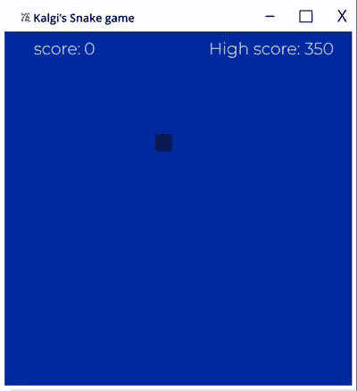
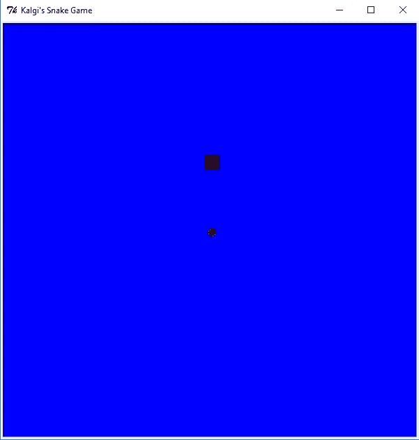
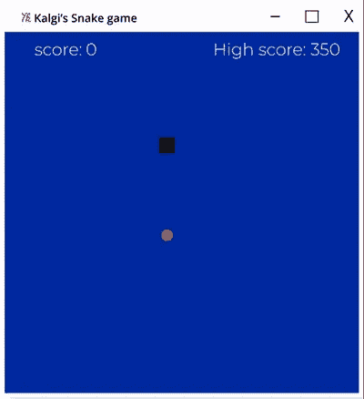
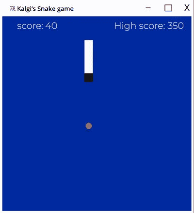
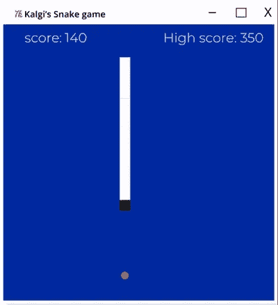

# 用 Python 的乌龟模块构建著名的贪吃蛇游戏

> 原文：<https://medium.com/edureka/python-turtle-module-361816449390?source=collection_archive---------0----------------------->



Python Turtle Module — Edureka

小时候，我相信每个人都玩过著名的贪吃蛇游戏。事实上，这是最早上市的手机游戏之一。自己建岂不是很酷？太好了。在本文中，我将使用 Python 的 Turtle 模块从头开始构建它。

议程:

*   Python 的海龟模块是什么？
*   开始构建游戏

1.  设置屏幕
2.  创建蛇头
3.  移动蛇的功能
4.  加点食物
5.  建造蛇的身体
6.  添加边界冲突
7.  添加身体碰撞
8.  添加分数

# **Python 的海龟模块是什么？**

我相信每个人小时候都用过画板。现在，想象一下，你可以命令系统为你画图，而不是手动在板上画图。是不是很酷？Python 的 turtle 模块可以让你做到这一点。它基本上让你创建一个画板，命令一只乌龟为你画画。

让我们继续前进，开始构建游戏。在本文中，我使用了 Python 版的 PyCharm。

# **开始构建游戏**

在开始构建之前，让我们先了解一下这个游戏。这个游戏有两个元素——蛇和食物。玩家必须移动蛇，让它接触(吃掉)食物，然后变大。如果蛇接触到自己的身体或窗户的边界，它就会死亡。显而易见，玩家需要获胜，从而避免死亡。

## **设置屏幕**

要开始使用该模块，您需要像 python 中的任何其他模块一样导入它。

`import turtle`

**龟的功能。Screen()** 用来创建一个窗口。在这种情况下，我们的窗口是游戏的*赢*。用函数 **window.title("Kalgi 的蛇游戏")**给这个窗口起个名字。使用函数**window . bgcolor(" Color ")**设置窗口的背景颜色。使用功能 **window.setup(width=X，height=Y)** 设置窗口高度和宽度。函数 **window.tracer()** 关闭屏幕更新。除了记分牌，我们不需要任何屏幕更新，因此设置为 0。

```
#set up the screen
win = turtle.Screen()
win.title("Kalgi's snake game")
win.bgcolor("blue")
win.setup(width=600,height=600)
win.tracer(0)
```



## **创建蛇头**

一旦你创建了窗口，我们需要的下一件事是一个蛇头。Snake 基本上就是一只四处活动的乌龟(用 python 语言来说)。用函数**创建一只乌龟。龟()**并给它取名为*头。*我们将机头速度设置为 0，因为我们只是在这一部分进行初始化，机头不需要移动。为此，我们使用函数 **turtle_name.speed()** 。接下来，我们需要初始化头部的形状和颜色。我们使用函数 **turtle_name.shape()** 和 **turtle_name.color()** 。

我们需要画出蛇走过的路吗？不要！函数 **turtle_name.penup()** 确保不画出蛇走过的路线。我希望我的蛇头的位置是窗口的中心，方向是“停止”。我们为它使用了函数 **turtle_name.goto()** 和 **turtle_name.direction()** 。

```
#Snake Head
head = turtle.Turtle()
head.speed(0)
head.shape("square")
head.color("black")
head.penup()
head.goto(0, 100)
head.direction = "stop"
```

一旦头部被创建，我需要主游戏循环总是设置为真。我将使用函数 **window.update()** 更新我的窗口。这个函数基本上是随着循环不断更新我的屏幕。

```
# Main game loop
while True:
    win.update()
```



## **移动蛇的功能**

现在我们已经创建了一条蛇，让它动起来。我们定义了一个叫做 **move()的函数。**如果机头*上升*,‘y’坐标增加，如果机头*下降*,‘y’坐标减少，如果机头*右移*,‘x’坐标增加，如果机头*左移*,‘x’坐标减少。

```
def move():
    if head.direction == "up":
        y = head.ycor() #y coordinate of the turtle
        head.sety(y + 20)

    if head.direction == "down":
        y = head.ycor() #y coordinate of the turtle
        head.sety(y - 20)

    if head.direction == "right":
        x = head.xcor() #y coordinate of the turtle
        head.setx(x + 20)

    if head.direction == "left":
        x = head.xcor() #y coordinate of the turtle
        head.setx(x - 20)
```

这个函数在被调用之前什么都不做。所以我们每次更新屏幕或者窗口都需要调用这个函数。按如下方式更新主游戏循环:

```
#Main Game Loop
while: True
    win.update()
    move()
```

您可以尝试执行到目前为止的代码，您会注意到蛇移动的速度非常快。这是 move 函数的默认行为。为了放慢速度，我们需要使用时间模块。转到代码的导入部分，导入时间模块。我们将名为*的变量延迟*初始化为 0.1。然后调用函数 **time.sleep(delay)** 降低龟速。

```
import turtle
import time
delay=0.1
# Main game loop
while True:
    wn.update()
    move()
    time.sleep(delay)
```

我们做了让乌龟上下左右移动的函数。但是计算机怎么知道什么是上、下、左、右呢？我们需要为这些方向中的每一个定义一个函数，并将**方向**设置为*向上、*向下、*向右、*和*向左。*

注意:蛇不能从左往右，从左往右，从下往上，从上往下。

```
def go_up():
    if head.direction != "down":
        head.direction = "up"

def go_down():
    if head.direction != "up":
        head.direction = "down"

def go_right():
    if head.direction != "left":
        head.direction = "right"

def go_left():
    if head.direction != "right":
        head.direction = "left"
```

我们需要系统来监听我们的控制键。我们添加了一个名为 **win.listen()** 的函数来监听按键。每一次按键都需要绑定到一个执行动作的函数。同样，我们使用函数 **win.onkeypress(function，" key")** 。

```
# keyboard bindings
win.listen()
win.onkey(go_up, "w")
win.onkey(go_down, "s")
win.onkey(go_right, "d")
win.onkey(go_left, "a")
```



## **加点食物**

食物也是一只静止不动的乌龟，直到它被触摸(吃掉)。一旦蛇吃了食物，它会占据另一个随机位置，游戏继续。让我们继续以类似的方式创建一只乌龟作为食物。我们将使用与创建蛇头相同的函数。

```
# Snake food
food = turtle.Turtle()
food.speed(0)
food.shape("circle")
food.color("red")
food.penup()
food.shapesize(0.50, 0.50)
food.goto(0, 0)
```



现在我们已经创建了蛇头和食物，并赋予了移动的功能，蛇应该在接触食物时吃掉它，而食物需要占据一个新的位置。我将使用函数 **head.distance(food)** 来计算两个对象之间的距离。如果距离小于 15(食物和头部接触)，食物被重新放置到窗口内的任意位置。让我们继续在主游戏循环中添加这个特性。

```
if head.distance(food) <15:
# move the food to a random position on screen
x = random.randint(-290, 290)
y = random.randint(-290, 290)
food.goto(x, y)
```

## **打造蛇的身体**

现在我们需要一种功能，它能在蛇每次接触食物时增加蛇的身体。为此，我们使用数组。我们创建一个名为 segments 的数组，它被初始化为空。

```
segments = []
```

我们需要在蛇每次接触食物的时候给它的身体增加一段。我们已经有了检查头部与食物碰撞的条件。创建一只新的海龟，命名为 *new_segment，*定义它的速度、形状和颜色，并将其添加到 segments 数组中。

```
# add a segment
        new_segment = turtle.Turtle()
        new_segment.speed(0)
        new_segment.shape("square")
        new_segment.color("grey")
        new_segment.penup()
        segments.append(new_segment)
```

把段加到蛇头身上还不够。当蛇头移动时，这些部分也需要移动。我使用的逻辑是将位置 x 的最后一段移动到 x-1 和 x-1 到 x-2，依此类推。

```
# move the end segment in reverse order
    for index in range(len(segments)-1, 0, -1):
        x = segments[index-1].xcor()
        y = segments[index-1].ycor()
        segments[index].goto(x, y)
```

但是头部正上方的部分是一个特例。那通向哪里？它在头部的位置。

```
# Move segment 0 to where the head is
    if len(segments) &amp;gt; 0:
        x = head.xcor()
        y = head.ycor()
        segments[0].goto(x, y)
```



## **添加边界碰撞**

我们需要确保蛇在与边界相撞时死亡。我们已经有了边界的坐标，我们只需要在蛇头触及这些坐标时重置它的位置。此外，蛇需要停止移动，因此改变方向停止。

```
# Check for collision
    if head.xcor() > 290 or head.xcor() < -290 or head.ycor() > 290 or head.ycor() < -290:
        time.sleep(1)
        head.goto(0, 0)
        head.direction = "stop"
```

此外，当蛇死亡时，这些部分需要消失。为此，我们需要做的就是，将线段的位置设置在窗口坐标之外。现在，当游戏重新开始时，我们需要新的片段，因此清除片段列表。

```
# Hide the segments
        for segment in segments:
           segment.goto(1000, 1000)

        # clear segment list
        segments = []
```



## **添加身体碰撞**

蛇碰到自己就需要死。所以我们要遍历整个段列表，检查段和头之间的距离是否小于 20。如果是，重置磁头位置和磁头方向。

```
# Check for head collision
    for segment in segments:
        if segment.distance(head) < 20:
            time.sleep(1)
            head.goto(0, 0)
            head.direction = "stop"

# Hide the segments
            for segment in segments:
                segment.goto(1000, 1000)

# clear segment list
            segment.clear()
```



## **添加分数**

Turtle module 有一个惊人的功能，可以让你在屏幕上写字。我将从创建一只乌龟开始，把它当作钢笔使用。

```
pen = turtle.Turtle()
pen.speed(0)
pen.shape("square")
pen.color("white")
pen.penup()
pen.hideturtle()
pen.goto(0, 260)
pen.write("Score: 0 High Score: {}".format(high_score), align="center", font=("Courier", 24, "normal"))
```

让我们将名为 *score* 的变量初始化为 0，并将 *high_score* 也初始化为 0。

```
# score 
score = 0 
high_score = 0
```

我们需要分析分数增加时的情况。第一个是当头部与食物碰撞时。增加*分数*并更新 *high_score* 。我们使用 **pen.write()** 在屏幕上写下分数。

```
# Increase the score
        score = score+10

        if score > high_score:
            high_score = score
```

当蛇头与边界和自己的线段发生碰撞时，我们需要重置分数。在这两个地方添加以下行

```
# reset score
            score = 0

    # update score
            pen.clear()
            pen.write("score: {} High Score: {}".format(score, high_score), align="center", font=("Courier", 24, "normal"))
```

还有 Tadaaaaa！！你的游戏准备好了。Python 是一种广泛使用的编程语言，有 820 万开发人员在使用它。你会惊讶地发现它能创造什么奇迹。另一个让你开发游戏的很酷的模块是 Pygame。

我希望这个 Python 的 turtle 模块已经帮助你了解了如何用它来构建游戏。请用它来制作更多这样的游戏，并在下面的评论区告诉我。我很想玩。如果你想查看更多关于人工智能、DevOps、道德黑客等市场最热门技术的文章，你可以参考 Edureka 的官方网站。

请留意本系列中的其他文章，它们将解释 Python 和数据科学的各个方面。

> 1.[Python 中的机器学习分类器](/edureka/machine-learning-classifier-c02fbd8400c9)
> 
> 2.[Python Scikit-Learn Cheat Sheet](/edureka/python-scikit-learn-cheat-sheet-9786382be9f5)
> 
> 3.[机器学习工具](/edureka/python-libraries-for-data-science-and-machine-learning-1c502744f277)
> 
> 4.[用于数据科学和机器学习的 Python 库](/edureka/python-libraries-for-data-science-and-machine-learning-1c502744f277)
> 
> 5.[Python 中的聊天机器人](/edureka/how-to-make-a-chatbot-in-python-b68fd390b219)
> 
> 6. [Python 集合](/edureka/collections-in-python-d0bc0ed8d938)
> 
> 7. [Python 模块](/edureka/python-modules-abb0145a5963)
> 
> 8. [Python 开发者技能](/edureka/python-developer-skills-371583a69be1)
> 
> 9.[哎呀面试问答](/edureka/oops-interview-questions-621fc922cdf4)
> 
> 10.一个 Python 开发者的简历
> 
> 11.[Python 中的探索性数据分析](/edureka/exploratory-data-analysis-in-python-3ee69362a46e)
> 
> 12.[带 Python 的乌龟模块的贪吃蛇游戏](/edureka/python-turtle-module-361816449390)
> 
> 13. [Python 开发者工资](/edureka/python-developer-salary-ba2eff6a502e)
> 
> 14.[主成分分析](/edureka/principal-component-analysis-69d7a4babc96)
> 
> 15. [Python vs C++](/edureka/python-vs-cpp-c3ffbea01eec)
> 
> 16.[刺儿头教程](/edureka/scrapy-tutorial-5584517658fb)
> 
> 17. [Python SciPy](/edureka/scipy-tutorial-38723361ba4b)
> 
> 18.[最小二乘回归法](/edureka/least-square-regression-40b59cca8ea7)
> 
> 19. [Jupyter 笔记本小抄](/edureka/jupyter-notebook-cheat-sheet-88f60d1aca7)
> 
> 20. [Python 基础知识](/edureka/python-basics-f371d7fc0054)
> 
> 21. [Python 模式程序](/edureka/python-pattern-programs-75e1e764a42f)
> 
> 22.[Python 中的生成器](/edureka/generators-in-python-258f21e3d3ff)
> 
> 23. [Python 装饰器](/edureka/python-decorator-tutorial-bf7b21278564)
> 
> 24. [Python Spyder IDE](/edureka/spyder-ide-2a91caac4e46)
> 
> 25.[在 Python 中使用 Kivy 的移动应用](/edureka/kivy-tutorial-9a0f02fe53f5)
> 
> 26.[十大最佳学习书籍&练习 Python](/edureka/best-books-for-python-11137561beb7)
> 
> 27.[用 Python 实现机器人框架](/edureka/robot-framework-tutorial-f8a75ab23cfd)
> 
> 28.[用 Python 进行网页抓取](/edureka/web-scraping-with-python-d9e6506007bf)
> 
> 29. [Django 面试问答](/edureka/django-interview-questions-a4df7bfeb7e8)
> 
> 30.[十大 Python 应用](/edureka/python-applications-18b780d64f3b)
> 
> 31.[Python 中的哈希表和哈希表](/edureka/hash-tables-and-hashmaps-in-python-3bd7fc1b00b4)
> 
> 32. [Python 3.8](/edureka/whats-new-python-3-8-7d52cda747b)
> 
> 33.[支持向量机](/edureka/support-vector-machine-in-python-539dca55c26a)
> 
> 34. [Python 教程](/edureka/python-tutorial-be1b3d015745)

*原载于 2019 年 8 月 23 日*[*https://www.edureka.co*](https://www.edureka.co/blog/python-turtle-module/)*。*