# Python 101—Python 初学者指南

> 原文：<https://medium.com/edureka/python-tutorial-be1b3d015745?source=collection_archive---------0----------------------->


Python Tutorial — Edureka

我将从给你足够多的学习 Python 的理由开始这篇 Python 教程。Python 非常简单，可读性非常好，因为它非常像英语。通过这篇 Python 教程，我将向您介绍 Python 的各个方面，并帮助您理解一切是如何结合在一起的，以便从中获得深刻的见解。

在这个 Python 教程博客中，我将涉及以下主题:

*   你好世界节目
*   Python &它的特性
*   Python 应用程序
*   变量
*   数据类型
*   经营者
*   条件语句
*   环
*   功能

# 你好世界节目

Python 是一门伟大的语言，适合初学者，也适合经验丰富的专业人士。在 Python 中，你不必处理复杂的语法，让我给你举个例子:

如果我想用 Python 打印“Hello World”，我只需写:

```
print ('Hello World')
```

就这么简单！

# Python &它的特性

Python 是一种开源脚本语言，由 ***吉多·范·罗苏姆*** 于 1989 年创建。它是一种带有动态语义的解释性语言，非常容易学习。让我们来看看 Python 的一些很酷的特性。

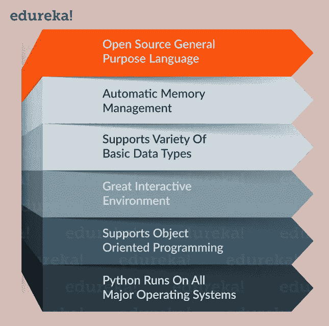

Features of Python — Python Tutorial

让我再给你一个学习 Python 的动力，它支持各种各样的应用。

# Python 应用程序:

Python 在许多领域都有应用，以下是其中的几个:

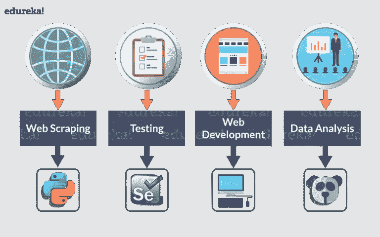

Applications of Python — Python Tutorial

这还不是全部，它还用于自动化和执行许多其他任务。

让我们继续学习 Python 教程，理解变量在 Python 中是如何工作的。

# Python 中的变量:

变量只是用来存储值的保留内存位置。这意味着当你创建一个变量时，你在内存中保留了一些空间。

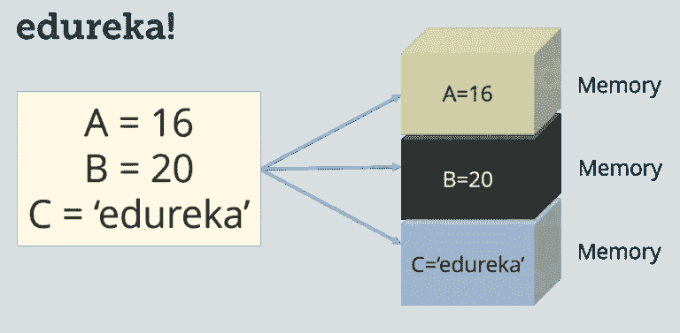

Three Variables A, B, and C — Python Tutorial

在 Python 中，你不需要在使用它之前声明变量，不像其他语言如 Java，C 等等。

# 为变量赋值:

Python 变量不需要显式声明来保留内存空间。当你给一个变量赋值时，声明自动发生。等号(=)用于给变量赋值。考虑下面的例子:

```
S = 10 
print(S)
```

这会将值‘10’赋给变量‘S’并打印出来。你自己试试。

现在在这个 Python 教程中，我们将了解 ***数据类型*** 。

# Python 中的数据类型:

Python 支持各种数据类型，这些数据类型定义了对变量可能的操作和存储方法。以下是 Python 中可用的标准数据类型列表:

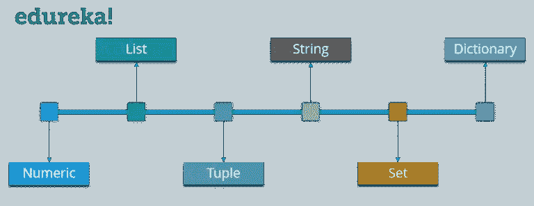

Python Data Types — Python Tutorial

让我们详细讨论其中的每一个。在本 Python 教程中，我们将从“数字”数据类型开始。

## 数字:

正如预期的数字数据类型存储数值一样。它们是不可变的数据类型，这意味着你不能改变它的值。Python 支持三种不同的数字数据类型:

> **整数类型:**保存所有的整数值，即所有的正负整数，例如— 10。
> 
> **浮点型:**保存实数，用十进制表示，有时甚至用科学符号表示，用 E 或 E 表示 10 的幂(2.5e2 = 2.5 x 102 = 250)，例如— 10.24。
> 
> **复杂类型:**它们的形式是 a + bj，其中 a 和 b 是浮点数，J 代表-1(虚数)的平方根，例如-10+6j。

现在，您甚至可以执行类型转换。例如，您可以将整数值转换为浮点值，反之亦然。考虑下面的例子:

```
A **=** 10
# Convert it into float type
B **=** float(A)
print(B)
```

上面的代码将把整数值转换成浮点类型。同样，您可以将浮点值转换为整数类型:

```
A **=** 10.76
# Convert it into float type
B **=** int(A)
print(B)
```

现在让我们了解一下 Python 教程中的列表到底是什么。

## 列表:

*   在 C 中，你可以把列表看作数组，但是在 List 中，你可以存储不同类型的元素，但是在 Array 中，所有的元素应该是同一类型的。
*   列表是 Python 中最通用的数据类型，可以写成方括号中的*逗号分隔值(项目)的列表。考虑下面的例子:*

```
Subjects = ['Physics', 'Chemistry', 'Maths', 2]
print(Subjects)
```

请注意，主题列表既包含单词，也包含数字。现在，让我们在主题列表上执行一些操作。

让我们来看看可以对列表执行的一些操作:

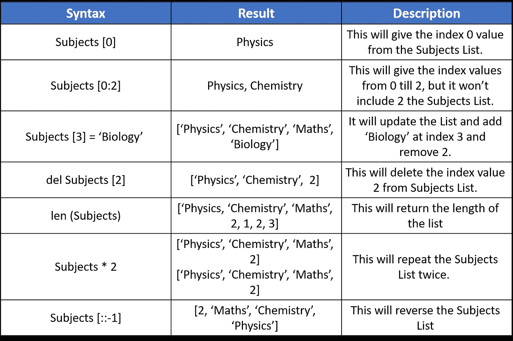

Operations in Lists — Python Tutorial

接下来，在这个 Python 教程中，让我们来关注一下元组。

## 元组:

元组是一系列不可变的 Python 对象。元组是序列，就像列表一样。 ***元组和列表的区别有*** :

*   与列表不同，元组不能更改
*   元组使用括号，而列表使用方括号。考虑下面的例子:

```
Chelsea = ('Hazard', 'Lampard', 'Terry')
```

现在你一定在想 ***为什么我们有列表*** 的时候还要有元组？

所以简单的答案是， ***元组比列表*** 要快。如果你正在定义一组常量值，你只是想迭代，那么使用元组而不是列表。

伙计们，所有的元组操作都类似于列表，但你不能更新，删除或添加一个元素到一个元组。

接下来，在这个 Python 教程中，我们来理解一下字符串。

## 字符串:

字符串是 Python 中最流行的数据类型之一。我们可以简单地用引号将字符括起来来创建它们。Python 以完全相同的方式处理单引号和双引号。考虑下面的例子:

```
S = "Welcome To edureka!"
D = 'edureka!'
```

让我们来看几个可以用字符串执行的操作。

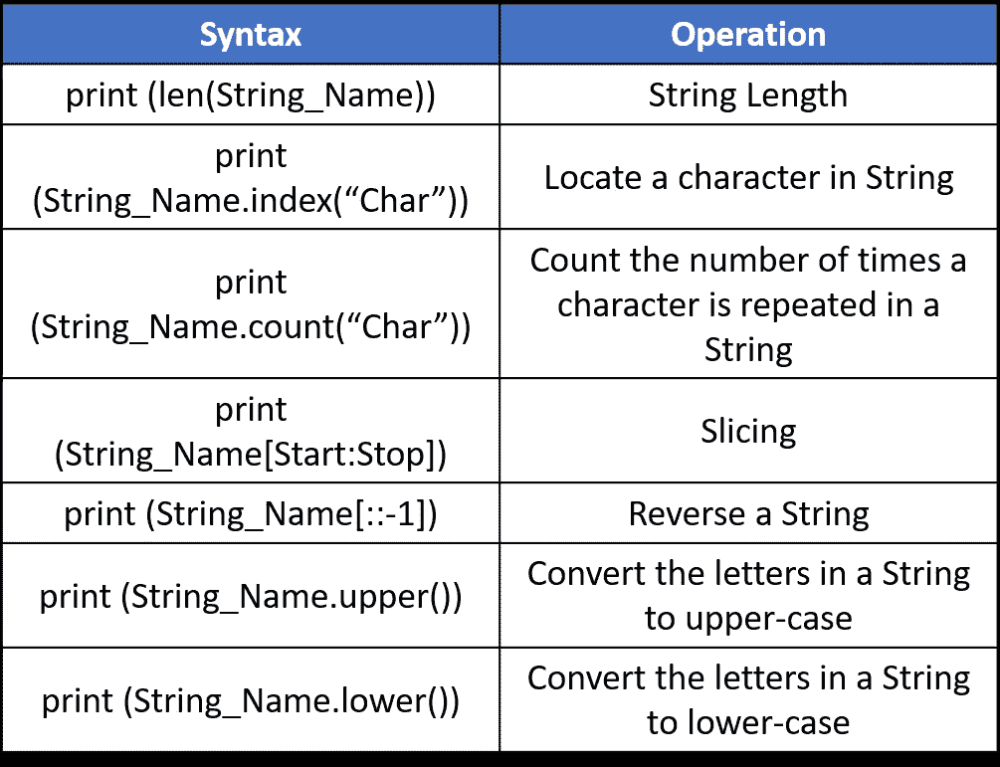

Operations In String — Python Tutorial

我希望你喜欢这本书。接下来，在这个 Python 教程中，我们将关注 Set。

## 设置:

*   集合是项目的无序集合。每个元素都是独一无二的。
*   集合是通过将所有项目(元素)放在花括号{}内，用逗号分隔来创建的。考虑下面的例子:

```
Set_1 **=** {1, 2, 3}
```

在集合中，每个元素都必须是唯一的。尝试打印以下代码:

```
Set_2 = {1, 2, 3, 3}
```

这里 3 重复了两次，但它只会打印一次。

让我们来看一些集合运算:

## 工会:

A 和 B 的并集是两个集合中所有元素的集合。使用|运算符执行 Union。考虑下面的例子:

```
A **=** {1, 2, 3, 4}
B **=** {3, 4, 5, 6}
print ( A | B)**Output** **= {1, 2, 3, 4, 5, 6}**
```

## 交叉点:

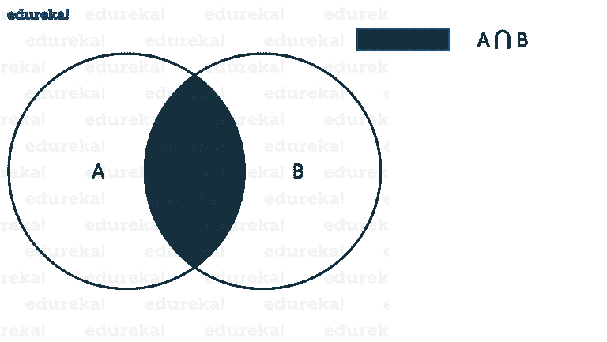

Representation of Intersection — Python Tutorial

A 和 B 的交集是两个集合中共有的一组元素。使用&运算符执行交集。考虑下面的例子:

```
A **=** {1, 2, 3, 4}
B **=** {3, 4, 5, 6}
print ( A & B )**Output** **= {3, 4}**
```

## 差异:

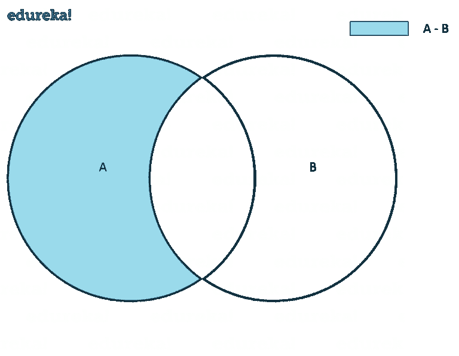

Representation of Set Difference — Python Tutorial

A 和 B(A-B)的区别是一组只在 A 中而不在 B 中的元素。类似地，B-A 是一组在 B 中而不在 A 中的元素。考虑下面的例子:

```
A **=** {1, 2, 3, 4, 5}
B **=** {4, 5, 6, 7, 8}
print(A **-** B)**Output = {1, 2, 3}**
```

## 对称差异:

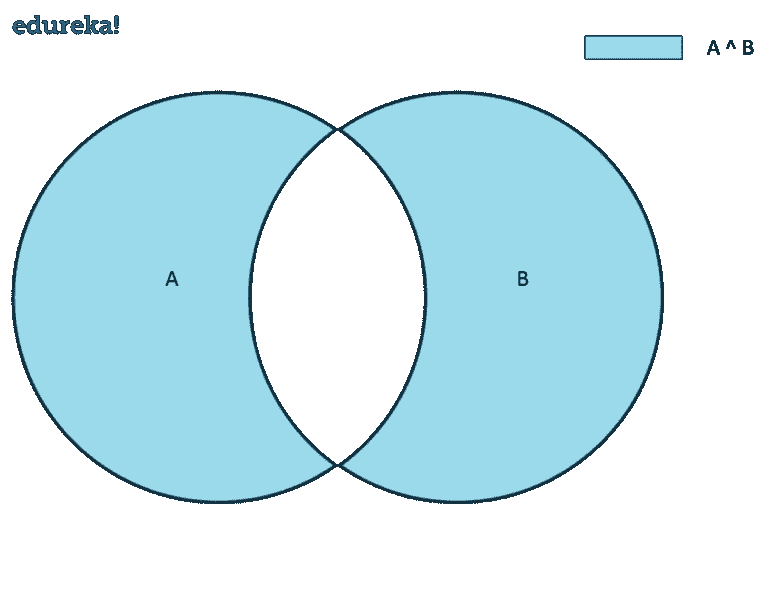

Representation of Symmetric Difference — Python Tutorial

A 和 B 的对称差是 A 和 B 中除了两者共有的元素之外的一组元素。使用^算子进行对称差分。考虑下面的例子:

```
A **=** {1, 2, 3, 4, 5}
B **=** {4, 5, 6, 7, 8}
print(A ^ B)**Output = {1, 2, 3, 6, 7, 8}**
```

接下来，在 Python 教程中，是时候关注最后一种数据类型了，即字典

## 词典:

现在让我用一个例子来解释你的字典。

我猜你们知道阿德哈尔卡。对于那些不知道它是什么的人来说，它只不过是发给所有印度公民的一个唯一的 ID。因此，对于每个 Adhaar 号码，都有一个名称和一些其他的详细信息。

现在你可以把 Adhaar 号码看作是一把“钥匙”,把这个人的详细资料看作是这把钥匙的“价值”。

字典包含这些用花括号括起来的“键值”对，键和值用“:”分隔。考虑下面的例子:

```
Dict = {'Name' : 'Saurabh', 'Age' : 23}
```

你知道该怎么做，现在是各种字典操作。

***从字典中获取元素:***

```
Dict **=** {'Name' : 'Saurabh', 'Age' : 23}
print(Dict['Name'])**Output = Saurabh**
```

***改变字典中的元素:***

```
Dict **=** {'Name' : 'Saurabh', 'Age' : 23}
Dict['Age'] **=** 32
Dict['Address'] **=** 'Starc Tower'**Output = {'Name' = 'Saurabh', 'Age' = 32, 'Address' = 'Starc Tower'}**
```

接下来，在这个 Python 教程中，我们来了解一下 Python 中的各种运算符。

# Python 中的运算符:

运算符是可以操作操作数值的结构。考虑表达式 2 + 3 = 5，这里 2 和 3 是操作数，+称为运算符。

Python 支持以下类型的运算符:


Operators in Python — Python Tutorial

让我们逐一关注这些操作符。

## 算术运算符:

这些运算符用于执行加法、减法等数学运算。假设下表中 A = 10，B = 20。

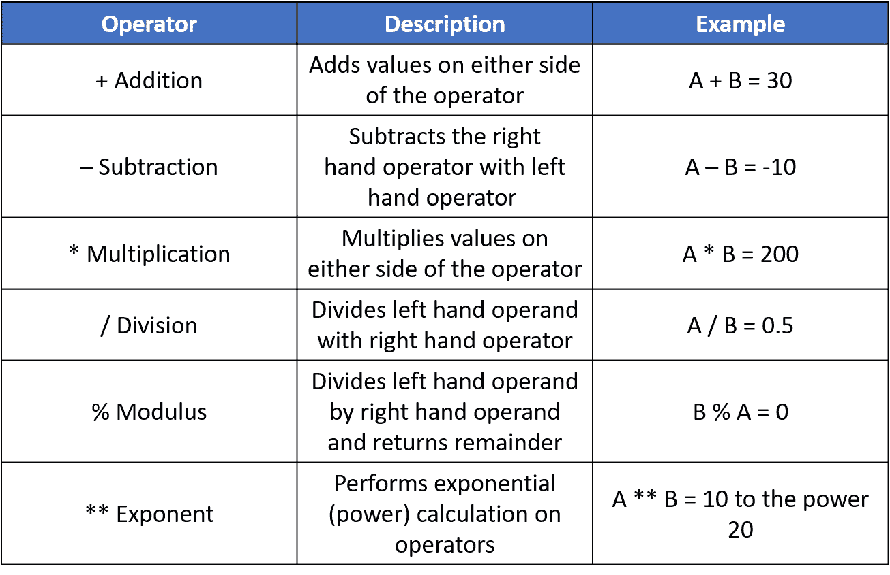

Arithmetic Operators in Python — Python Tutorial

考虑下面的例子:

```
a **=** 21
b **=** 10
c **=** 0c **=** a **+** b
print ( c )c **=** a **-** b
print ( c )c **=** a ***** b
print ( c )c **=** a **/** b
print ( c )c **=** a **%** b
print ( c )a **=** 2
b **=** 3
c **=** a******b
print ( c )**Output = 31, 11, 210, 2.1, 1, 8**
```

现在让我们看看比较运算符。

## 比较运算符:

这些运算符比较两边的值，并确定它们之间的关系。假设 A = 10，B = 20。

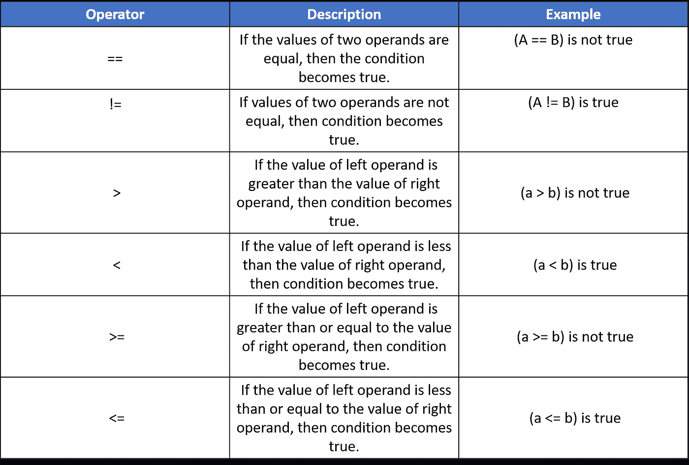

Comparison Operators in Python — Python Tutorial

考虑下面的例子:

```
a **=** 21
b **=** 10
c **=** 0**if** ( a **==** b ):
 print ("a is equal to b")
**else**:
 print ("a is not equal to b")**if** ( a !**=** b ):
 print ("a is not equal to b")
**else**:
 print ("a is equal to b")**if** ( a < b ): print ("a is less than b")
 **else**: print ("a is not less than b")**if** ( a > b ):
 print ("a is greater than b")
**else**:
 print ("a is not greater than b")a **=** 5
b **=** 20
**if** ( a <**=** b ): print ("a is either less than or equal to b")
 **else**: print ("a is neither less than nor equal to b")**if** ( a >**=** b ): print ("a is either greater than  or equal to b")
 **else**: print ("a is neither greater than  nor equal to b")**Output = a is not equal to b
         a is not equal to b
         a is not less than b
         a is greater than b
         a is either less than or equal to b
         b is either greater than or equal to b**
```

在上面的例子中，我使用了条件语句(if，else)。它的基本意思是，如果条件为真，则执行 print 语句，否则在 else 中执行 print 语句。我们将在这个 Python 教程博客的后面理解这些陈述。

# 赋值运算符:

*赋值操作符*是一个*操作符*，用于*给*一个变量赋值。假设下表中 A = 10，B = 20。

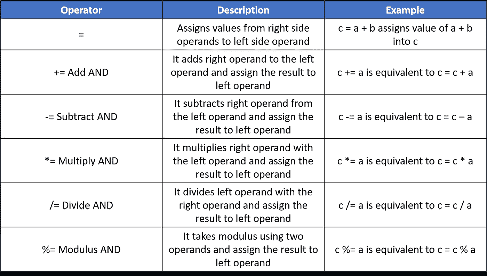

Assignment Operator in Python — Python Tutorial

考虑下面的例子:

```
a **=** 21
b **=** 10
c **=** 0c **=** a **+** b
print ( c )c **+=** a
print ( c )c ***=** a
print ( c )c **/=** a
print ( c )c  **=** 2
c **%=** a
print ( c )c ****=** a
print ( c )**Output = 31, 52, 1092, 52.0, 2, 2097152, 99864**
```

## 按位运算符:

这些操作直接操作**位**。在所有的计算机中，数字都是用比特，一系列的 0 和 1 来表示的。事实上，计算机中几乎所有的东西都是用比特来表示的。考虑下面的例子:

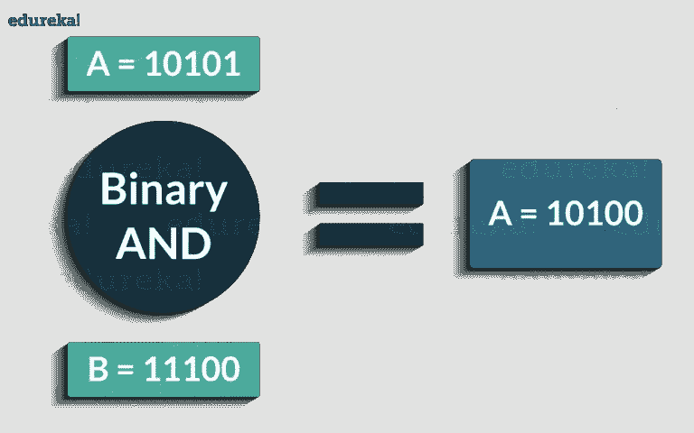

Bitwise Binary AND- Python Tutorial

以下是 Python 支持的按位运算符:

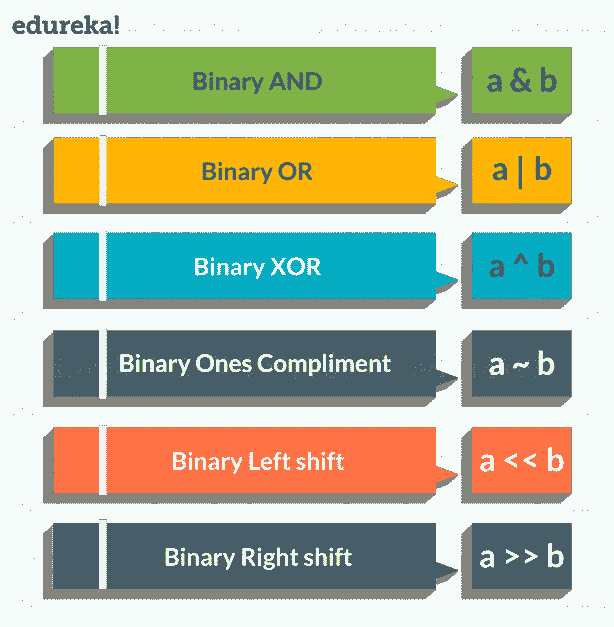

Bitwise Operators in Python — Python Tutorial

考虑下面的例子:

```
a **=** 58        # 111010
b **=** 13        # 1101
c **=** 0c **=** a & b
print ( c )   # 8 = 1000c **=** a | b
print ( c )   # 63 = 111111c **=** a ^ b
print ( c )   # 55 = 110111c **=** a << 2
print ( c )   # 232 = 11101000c **=** a >> 2
print ( c )   # 14 = 1110**Output = 8,63,55,232,14**
```

接下来，在这个 Python 教程中，我们将关注逻辑操作符。

## 逻辑运算符:

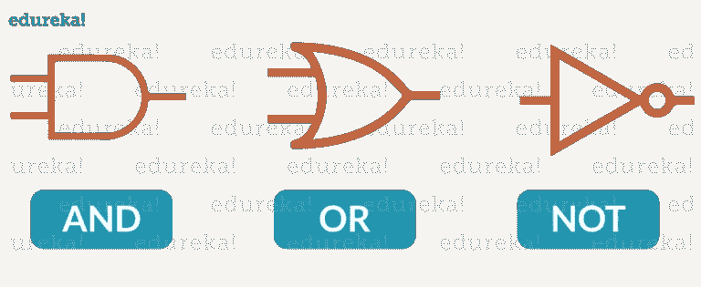

Logical Operators — Python Tutorial

以下是 Python 中的逻辑运算符:

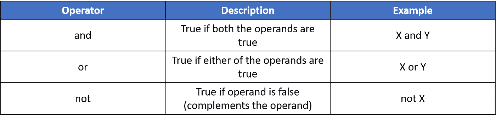

Logical Operators in Python — Python Tutorial

考虑下面的例子:

```
x **=** True
y **=** Falseprint('x and y is',x **and** y)print('x or y is',x **or** y)print('not x is',**not** x)**Output = x and y is False
         x or y is True
         not x is False**
```

现在在 Python 教程中，我们将学习成员操作符。

## 成员资格运算符:

这些操作符用于测试一个值或变量是否出现在一个序列(列表、元组、集合、字符串、字典)中。下面是成员运算符:

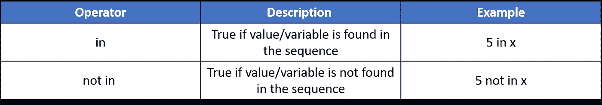

Membership Operators in Python — Python Tutorial

考虑下面的例子:

```
X = [1, 2, 3, 4]
A = 3
print(A in X)
print(A not in X)**Output = True
         False**
```

接下来，在本 Python 教程中，我们将了解最后一个运算符，即恒等运算符。

# 标识运算符:

这些运算符用于检查两个值(或变量)是否位于内存的同一部分。两个变量相等并不意味着它们是相同的。

以下是 Python 中的标识运算符:


Identity Operators in Python — Python Tutorial

考虑下面的例子:

```
X1 **=** 'Welcome To edureka!'
X2 **=** 1234 
Y1 **=** 'Welcome To edureka!'
Y2 **=** 1234
print(X1 **is** Y1)
print(X1 **is** **not** Y1)
print(X1 **is** **not** Y2)
print(X1 **is** X2)**Output = True
         False
         True
         False**
```

我希望你喜欢这本书。接下来在 Python 教程中，我们来看看各种 ***条件语句*** 。

# 条件语句:

条件语句用于在某些条件为真时执行一条或一组语句。也就是说，有三个条件语句——If、Elif、Else。

考虑下面显示的流程图:

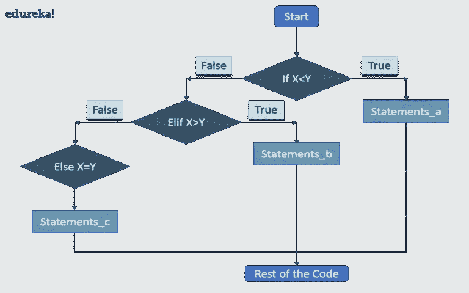

Representation of Conditional Statements — Python Tutorial

让我告诉你它实际上是如何工作的。

*   首先，如果出现条件，控制器将检查**。如果为真，那么控件将执行 If 条件后的语句。**
*   当“如果”条件为假时，控制将检查“ **Elif** ”条件。如果 Elif 条件为真，则控制将在 Elif 条件之后执行语句。
*   如果“Elif”条件也为假，则控制将执行 **Else** 语句。

下面是语法:

```
**if** condition1:
   statements**elif** condition2:
     statements**else**:
    statements
```

考虑下面的例子:

```
X **=** 10
Y **=** 12**if** X < Y: print('X is less than Y')
 **elif** X > Y:
    print('X is greater than Y')
**else**:
    print('X and Y are equal')**Output = X is less than Y**
```

现在是理解循环的时候了。

# 循环:

*   一般来说，语句是按顺序执行的。首先执行函数中的第一条语句，然后执行第二条语句，依此类推
*   可能会出现需要多次执行一个代码块的情况

循环语句允许我们多次执行一条语句或一组语句。下图说明了一个循环语句:

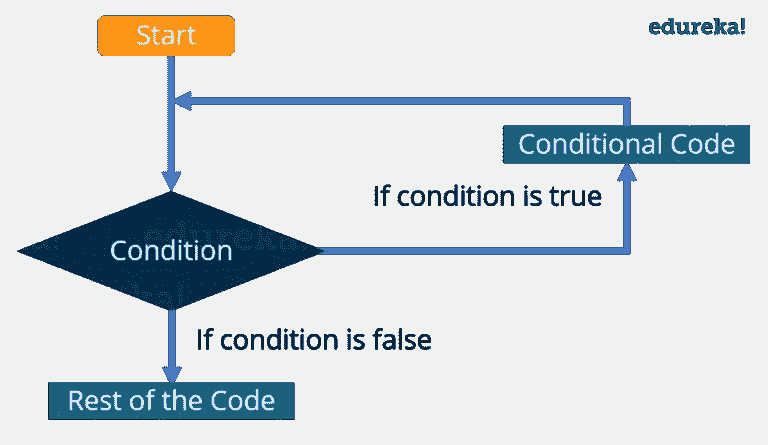

A Loop Statement — Python Tutorial

让我给你解释一下上面的图表:

*   首先，控制将检查条件。如果为真，则控制将移动到循环内部，并执行循环内部的语句。
*   现在，控制将再次检查条件，如果它仍然为真，那么它将再次执行循环内的语句。
*   这个过程将不断重复，直到条件变为假。一旦条件变为假，控制将移出循环。

有两种类型的循环:

*   ***无限:*** 当条件永远不会变成假
*   ***有限:*** 在某一时刻，条件将变为假，控制将移出循环

还有一种对循环进行分类的方法:

*   ***预测试:*** 在此类循环中，首先检查条件，然后仅控制在循环内移动
*   ***后期测试:*** 这里首先执行循环内的语句，然后检查条件

Python 不支持测试后循环。

# Python 中的循环:

在 Python 中，有三个循环:

*   在…期间
*   为
*   嵌套的

***While 循环:*** 这里，首先检查条件，如果条件为真，控制将在循环内移动并执行循环内的语句，直到条件为假。当我们不确定我们需要执行一组语句多少次时，我们使用这个循环，或者你可以说当我们不确定迭代的次数时。

考虑这个例子:

```
count = 0
while (count < 10):
   print ( count )
   count = count + 1

print ("Good bye!")**Output = 0
         1
         2
         3
         4
         5
         6
         7
         8
         9
         Good bye!**
```

**For 循环:**和 While 循环一样，For 循环也允许代码块重复一定的次数。不同之处在于，在 For 循环中，我们知道所需的迭代次数，这与 While 循环不同，While 循环的迭代次数取决于条件。通过查看语法，您将更好地了解两者之间的区别:

```
**for** variable **in** Sequence:
    statements
```

请注意，我们已经指定了范围，这意味着我们知道代码块将被执行的次数。

考虑这个例子:

```
fruits **=** ['Banana', 'Apple',  'Grapes']**for** index **in** range(len(fruits)):
   print (fruits[index])**Output = Banana
         Apple
         Grapes**
```

**嵌套循环:**基本意思是循环里面的循环。它可以是 While 循环中的 For 循环，反之亦然。甚至 For 循环也可以在 For 循环内部，While 循环也可以在 While 循环内部。

考虑这个例子:

```
count **=** 1
**for** i **in** range(10):
    print (str(i) ***** i)

    **for** j **in** range(0, i):
        count **=** count **+**1**Output = 
1
22
333
4444
55555
666666
7777777
88888888
999999999**
```

现在是本 Python 教程介绍 ***函数*** 的最佳时机。

# 功能:

函数是一种将你的代码分成有用的块的便捷方式，它允许我们对代码进行排序，使其更具可读性，重用它并节省一些时间。

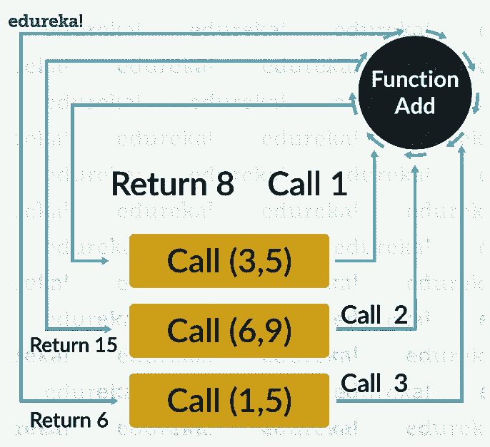

Functions in Python — Python Tutorial

```
**def** add (a, b):
    **return** a **+** b
c **=** add(10,20)
print(c)**Output = 30**
```

我希望你喜欢阅读这篇 Python 教程。我们已经介绍了 Python 的所有基础知识，所以您现在可以开始练习了。如果你想查看更多关于人工智能、DevOps、道德黑客等市场最热门技术的文章，你可以参考 Edureka 的官方网站。

请留意本系列中的其他文章，它们将解释 Python 的各个方面

> 1. [Python 编程语言](/edureka/python-programming-language-fc1015de7a6f)
> 
> 2. [Python 函数](/edureka/python-functions-f0cabca8c4a)
> 
> 3.[Python 中的文件处理](/edureka/file-handling-in-python-e0a6ff96ede9)
> 
> 4. [Python Numpy 教程](/edureka/python-numpy-tutorial-89fb8b642c7d)
> 
> 5. [Scikit 学习机](/edureka/scikit-learn-machine-learning-7a2d92e4dd07)
> 
> 6. [Python 熊猫教程](/edureka/python-pandas-tutorial-c5055c61d12e)
> 
> 7. [Matplotlib 教程](/edureka/python-matplotlib-tutorial-15d148a7bfee)
> 
> 8. [Tkinter 教程](/edureka/tkinter-tutorial-f655d3f4c818)
> 
> 9.[请求教程](/edureka/python-requests-tutorial-30edabfa6a1c)
> 
> 10. [PyGame 教程](/edureka/pygame-tutorial-9874f7e5c0b4)
> 
> 11. [OpenCV 教程](/edureka/python-opencv-tutorial-5549bd4940e3)
> 
> 12.[用 Python 进行网页抓取](/edureka/web-scraping-with-python-d9e6506007bf)
> 
> 13. [PyCharm 教程](/edureka/pycharm-tutorial-d0ec9ce6fb60)
> 
> 14.[机器学习教程](/edureka/machine-learning-tutorial-f2883412fba1)
> 
> 15.[Python 中从头开始的线性回归算法](/edureka/linear-regression-in-python-e66f869cb6ce)
> 
> 16.[面向数据科学的 Python](/edureka/learn-python-for-data-science-1f9f407943d3)
> 
> 17. [Python 正则表达式](/edureka/python-regex-regular-expression-tutorial-f2d17ffcf17e)
> 
> 18.[Python 中的循环](/edureka/loops-in-python-fc5b42e2f313)
> 
> 19. [Python 项目](/edureka/python-projects-1f401a555ca0)
> 
> 20.[机器学习项目](/edureka/machine-learning-projects-cb0130d0606f)
> 
> 21.[Python 中的数组](/edureka/arrays-in-python-14aecabec16e)
> 
> 22.[在 Python 中设置](/edureka/sets-in-python-a16b410becf4)
> 
> 23.[Python 中的多线程](/edureka/what-is-mutithreading-19b6349dde0f)
> 
> 24. [Python 面试问题](/edureka/python-interview-questions-a22257bc309f)
> 
> 25. [Java vs Python](/edureka/java-vs-python-31d7433ed9d)
> 
> 26.[如何成为一名 Python 开发者？](/edureka/how-to-become-a-python-developer-462a0093f246)
> 
> 27. [Python Lambda 函数](/edureka/python-lambda-b84d68d449a0)
> 
> 28.[网飞如何使用 Python？](/edureka/how-netflix-uses-python-1e4deb2f8ca5)
> 
> 29.[什么是 Python 中的 Socket 编程](/edureka/socket-programming-python-bbac2d423bf9)
> 
> 30. [Python 数据库连接](/edureka/python-database-connection-b4f9b301947c)
> 
> 31. [Golang vs Python](/edureka/golang-vs-python-5ac32e1ef2)
> 
> 32. [Python Seaborn 教程](/edureka/python-seaborn-tutorial-646fdddff322)
> 
> 33. [Python 职业机会](/edureka/python-career-opportunities-a2500ce158de)

*原载于 2017 年 5 月 5 日 www.edureka.co*[](https://www.edureka.co/blog/python-tutorial/)**。**