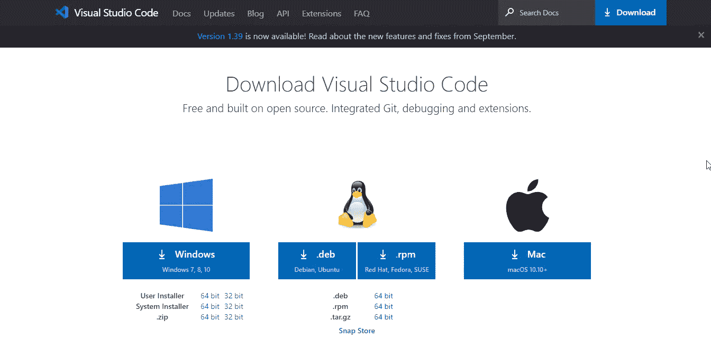

# 学习如何制作你的第一个 Python 程序

> 原文：<https://medium.com/edureka/python-visual-studio-cef3ad98a9e2?source=collection_archive---------1----------------------->

Python 编程语言是一种通用的语言，可以扩展对其他技术的支持。Visual studio 代码就是这样一个代码编辑器，它使用 python 扩展扩展了对 python 编程语言的支持。在这篇文章中，我们将学习如何使用 python 的 visual studio 代码。本文涵盖了以下主题。

*   什么是 Visual Studio 代码？
*   Visual Studio 代码安装
*   Visual Studio 代码中的 Python 扩展
*   用 Visual Studio 代码编写第一个 Python 程序
*   编辑现有项目
*   林挺
*   调试支持
*   Jupyter 笔记本支持
*   交互式 Python
*   环境

# 什么是 Visual Studio 代码？

visual studio 代码是一个轻量级但功能强大的源代码编辑器，可以在您的桌面上运行。它适用于 Windows、macOS 和 Linux。

它还提供了对 node.js、javascript 和 typescript 的内置支持，以及对 python、c、c++等其他语言的广泛外部支持。

## **扩展**

以下是一些最流行的 visual studio 代码扩展。

现在我们对 visual studio 代码有了一个模糊的概念，让我们看看如何在我们的系统中下载和安装 visual studio 代码。

# Visual Studio 代码安装

完成安装后，您可以用 visual studio 代码开始您的 python 之旅。

# Visual Studio 代码中的 Python 扩展

要在 visual studio 中使用 python，您需要从市场安装 python 扩展。在市场上很容易找到 python 扩展。

您需要安装的 python 扩展名为 python，由微软发布。让我们来看看 python 扩展的一些特性。

*   智能感知
*   林挺
*   代码格式
*   排除故障
*   测试
*   Jupyter 笔记本
*   环境
*   重构

完成安装后，您可以开始使用您的第一个 python 程序。

# 用 Visual Studio 代码编写第一个程序

要启动您的第一个 python 程序，请转到命令提示符并输入以下命令。

它将使用 hello 目录打开 vs 代码，然后您可以添加一个扩展名为. py 的新文件来编写您的第一个 python 程序。

当你创建了一个新的文件，打开这个文件并创建一个简单的 hello world 程序。

这就是我们如何使用 python 扩展用 visual studio 代码制作一个简单的 hello world 程序。Python 扩展提供了许多在 **vs 代码**中编辑 python 源代码的特性。

## **自动完成和智能感知:**

它们是为存储在标准位置的所有 python 包提供的，您可以右键单击不同的标识符来利用这几个命令。

*   转到定义
*   峰值定义
*   转到声明
*   Peek 声明

## **终端运行选择/线路:**

它用于将所选行带到 python 终端。

## **格式:**

它通过实现缩进、运算符周围的间距、行间距等特定规则，使代码更容易阅读。

## **重构:**

python 扩展添加了以下重构命令

*   提取变量—它提取当前范围内所选文本的所有相似匹配项。
*   提取方法-它提取当前范围内所选表达式或块的所有相似匹配项
*   排序导入—排序导入使用 isort 包将来自同一模块的特定导入合并到单个导入语句中，并按字母顺序导入语句。

现在让我们看看如何使用 vs 代码编辑现有的项目。

# 编辑现有项目

您可以在 visual studio 代码中编辑现有项目，只需在命令行中导航到该项目，然后输入以下命令。

输入此命令后，vs 代码将打开该位置上的现有项目，您可以运行该项目或在 visual studio 代码中编辑代码。

现在我们知道了如何在 visual studio 代码中编辑现有的项目，让我们了解一下林挺。

# 林挺

它主要强调了 python 源代码中的语法和样式问题。要启用 linter，我们可以使用下面的方法，尽管 python 扩展默认启用了 pylint linter。按“ctrl+shift+p”并选择 python:在托盘中选择 linter。

尽管林挺会在您保存文件时自动运行。您可以通过在命令选项板中选择以下选项来运行林挺。

以下是一些特定的棉绒:

*   pylint–
*   薄片 8
*   mypy
*   pydocstyle
*   探矿者
*   Pep8
*   皮拉马
*   强盗

# 调试支持

让我们试着理解在我们简单的 hello world 程序中调试是如何工作的。

只需点击编辑器左侧的装订线并在该行设置一个断点，然后按 f5。

选择配置，它将打开如下所示的调试工具栏。

再次按 f5 键运行程序直到完成，您将在终端中看到输出。这就是我们如何在 visual studio 代码中调试程序，你可以看到许多选项和一个调试工具栏，这样你也可以悬停在代码上。

现在我们已经完成了调试，让我们了解一下 visual studio 代码中对 jupyter 笔记本的支持。

# Jupyter 笔记本支持

要在 vs 代码中打开 jupyter 记事本，请打开命令托盘并选择以下选项

打开笔记本后，您可以简单地运行代码并保存它。

现在我们知道了如何在 visual studio 代码中使用 jupyter notebook，让我们了解一下如何在 vs 代码中使用交互式 python。

# 交互式 Python

您可以简单地在代码中添加“#%%”，并将其保存在. py 扩展名文件中。单击运行单元按钮时，将打开 python 交互式面板，您可以直接使用 python 交互式窗口运行代码。只需键入您的代码，然后按“ctrl+enter”。

# 环境

Python 扩展通常会寻找环境，选择系统路径中的第一个解释器。要选择特定的环境，您可以使用命令托盘搜索环境。

选择此项后，它会显示可供您选择的解释器。

这就把我们带到了本文的结尾，在这里我们学习了如何使用 python 扩展来使用 visual studio 代码。我希望你清楚本教程中与你分享的所有内容。

如果你想查看更多关于人工智能、DevOps、道德黑客等市场最热门技术的文章，你可以参考 Edureka 的官方网站。

请留意本系列中的其他文章，它们将解释 Python 和数据科学的各个方面。

> 1.[Python 中的机器学习分类器](/edureka/machine-learning-classifier-c02fbd8400c9)
> 
> 2.[Python Scikit-Learn Cheat Sheet](/edureka/python-scikit-learn-cheat-sheet-9786382be9f5)
> 
> 3.[机器学习工具](/edureka/python-libraries-for-data-science-and-machine-learning-1c502744f277)
> 
> 4.[用于数据科学和机器学习的 Python 库](/edureka/python-libraries-for-data-science-and-machine-learning-1c502744f277)
> 
> 5.[Python 中的聊天机器人](/edureka/how-to-make-a-chatbot-in-python-b68fd390b219)
> 
> 6. [Python 集合](/edureka/collections-in-python-d0bc0ed8d938)
> 
> 7. [Python 模块](/edureka/python-modules-abb0145a5963)
> 
> 8. [Python 开发者技能](/edureka/python-developer-skills-371583a69be1)
> 
> 9.[哎呀面试问答](/edureka/oops-interview-questions-621fc922cdf4)
> 
> 10.一个 Python 开发者的简历
> 
> 11.[Python 中的探索性数据分析](/edureka/exploratory-data-analysis-in-python-3ee69362a46e)
> 
> 12.[带 Python 的乌龟模块的贪吃蛇游戏](/edureka/python-turtle-module-361816449390)
> 
> 13. [Python 开发者工资](/edureka/python-developer-salary-ba2eff6a502e)
> 
> 14.[主成分分析](/edureka/principal-component-analysis-69d7a4babc96)
> 
> 15. [Python vs C++](/edureka/python-vs-cpp-c3ffbea01eec)
> 
> 16.[刺儿头教程](/edureka/scrapy-tutorial-5584517658fb)
> 
> 17. [Python SciPy](/edureka/scipy-tutorial-38723361ba4b)
> 
> 18.[最小二乘回归法](/edureka/least-square-regression-40b59cca8ea7)
> 
> 19. [Jupyter 笔记本小抄](/edureka/jupyter-notebook-cheat-sheet-88f60d1aca7)
> 
> 20. [Python 基础知识](/edureka/python-basics-f371d7fc0054)
> 
> 21. [Python 模式程序](/edureka/python-pattern-programs-75e1e764a42f)
> 
> 22.[Python 中的生成器](/edureka/generators-in-python-258f21e3d3ff)
> 
> 23. [Python 装饰器](/edureka/python-decorator-tutorial-bf7b21278564)
> 
> 24. [Python Spyder IDE](/edureka/spyder-ide-2a91caac4e46)
> 
> 25.[在 Python 中使用 Kivy 的移动应用](/edureka/kivy-tutorial-9a0f02fe53f5)
> 
> 26.[十大最佳学习书籍&练习 Python](/edureka/best-books-for-python-11137561beb7)
> 
> 27.[用 Python 实现机器人框架](/edureka/robot-framework-tutorial-f8a75ab23cfd)
> 
> 28.[使用 PyGame 的 Python 中的贪吃蛇游戏](/edureka/snake-game-with-pygame-497f1683eeaa)
> 
> 29. [Django 面试问答](/edureka/django-interview-questions-a4df7bfeb7e8)
> 
> 30.[十大 Python 应用](/edureka/python-applications-18b780d64f3b)
> 
> 31.[Python 中的哈希表和哈希表](/edureka/hash-tables-and-hashmaps-in-python-3bd7fc1b00b4)
> 
> 32. [Python 3.8](/edureka/whats-new-python-3-8-7d52cda747b)
> 
> 33.[支持向量机](/edureka/support-vector-machine-in-python-539dca55c26a)
> 
> 34. [Python 教程](/edureka/python-tutorial-be1b3d015745)

*原载于 2019 年 10 月 18 日*[*https://www.edureka.co*](https://www.edureka.co/blog/python-visual-studio/)*。*