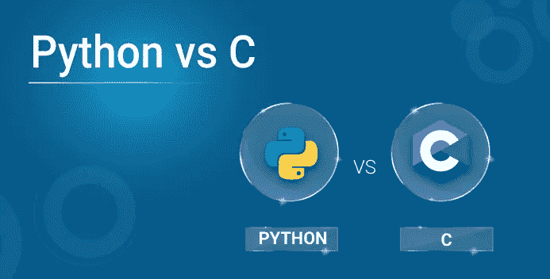
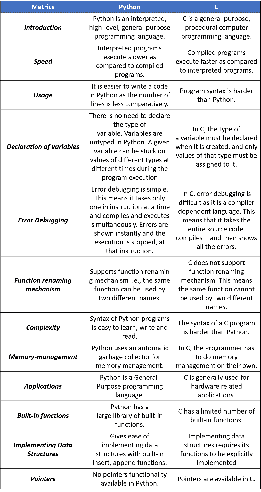

# Python 与 C:彻底的比较

> 原文：<https://medium.com/edureka/python-vs-c-b83446bc2c23?source=collection_archive---------3----------------------->



编程可能是建立职业道路的一种有趣且有利可图的方式，但在真正开始学习这项技能之前，你需要明确某些事情。摆在你面前的一个主要选择是编程语言的选择(例如 Python 和 C)。在开始学习任何形式的编程之前，您需要弄清楚哪种语言最适合您。

Python 与 C 的比较可能会导致很多观点，因为每个程序员都有自己的观点。在这篇博客中，我试着整理了其中的一些，让你有一个清晰的印象。



# **一个 Python 程序的例子**—

`print("Hello, World!")`

# **一个 C 程序的例子—**

```
#include <stdio.h>
int main()
{
// printf() displays the string inside quotation
printf("Hello, World!");
return 0;
}
```

Python 和 C 语言很相似，但也有很多不同之处。在决定使用哪种语言之前，请考虑以下几点

***易于开发*** — Python 拥有更少的关键字和更自由的英语语法，而 C 语言则更难编写。因此，如果你想要一个简单的开发过程，就去用 Python 吧。

***性能*** — Python 比 C 慢，因为它需要大量的 CPU 时间来解释。因此，速度型 C 是一个更好的选择。

至此，我们结束了 Python 和 c 的比较。我希望你们喜欢这篇文章，并且理解这两种语言各有利弊。当我们比较两种声名狼藉的编程语言时，这主要取决于你自己的个人偏好。

确保你尽可能多地练习，并恢复你的经验。

既然您已经了解了数据科学背后的统计数据，如果您希望查看更多关于 Python、DevOps、Ethical Hacking 等市场最热门技术的文章，那么您可以参考 Edureka 的官方网站。

*原载于 2019 年 9 月 19 日*[*https://www.edureka.co*](https://www.edureka.co/blog/python-vs-c/)*。*