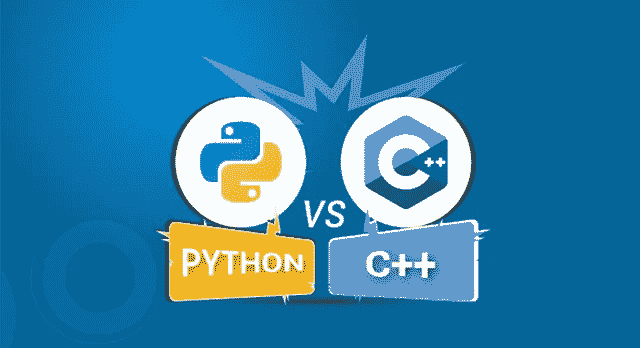
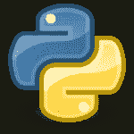
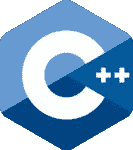
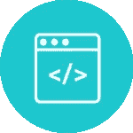
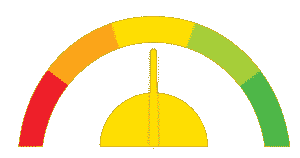
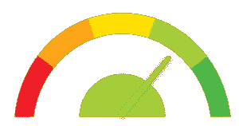
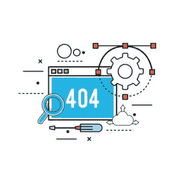

# Python vs C++:知道有什么区别吗

> 原文：<https://medium.com/edureka/python-vs-cpp-c3ffbea01eec?source=collection_archive---------0----------------------->

Python vs C++ — Edureka

C++的引入是为了使程序对程序员个人来说更容易和更愉快。但是 Python 因其简洁易读的代码而广受欢迎，并因其易用性和简单性在新开发人员中赢得了高度评价。这篇关于 **Python 与 C++** 的文章将按以下顺序区分这两种编程语言:

*   介绍
*   使用
*   汇编
*   表演
*   变量的范围
*   功能
*   流行
*   薪水

# 介绍

## **巨蟒**

它是一种解释型、高级、通用编程语言，帮助程序员为小型和大型项目编写清晰的逻辑代码。

## **C++**

它是一种通用的面向对象编程语言，允许对 CPU 的密集功能进行过程化编程，并提供对硬件的控制。

# 使用

## 计算机编程语言

用 Python 写代码更容易，因为行数相对较少。

## C++

与 Python 相比，由于复杂的语法，用 C++编写代码并不容易。

# 汇编

## 计算机编程语言

Python 是一种解释型语言，它在编译过程中通过解释器运行。

## C++

C++是一种预编译的编程语言，在编译过程中不需要任何解释器。

# 表演

## 计算机编程语言

与 C++相比，Python 是一种动态语言，它降低了协作的复杂性，优化了程序员的效率。

## C++

C++的优势在于它是一种静态类型的语言。C++创造了更紧凑、更快速的运行时代码，成为了性能之冠。

# 变量的范围

## 计算机编程语言

在 Python 中，变量甚至可以在[循环](https://www.edureka.co/blog/loops-in-python/)之外访问。

## C++

在 C++中，变量的范围被限制在循环内。

# 功能

## 计算机编程语言

Python 函数对参数的类型及其返回值的类型没有限制。

## C++

在 C++中，函数可以接受并返回已经定义的值类型。

# 流行

## 计算机编程语言

Python 拥有巨大的社区支持。说到流行，初学者和新手程序员倾向于转向 Python。

## C++

C++在网上也有专门的追随者。但是只有在这个领域有一些经验的人才会对 C++表现出浓厚的兴趣。

# 薪水

## 计算机编程语言

Python 开发人员的平均年薪预计为 92，000 美元，大致相当于每月 7670 美元。

## C++

C++开发人员预计年收入约为 95，000 美元，或每月约 7920 美元。

至此，我们结束了对 **Python 和 C++** 的比较。我希望你们喜欢这篇文章，并且理解两种 ***语言各有利弊。*** 当我们比较两种如此恶名昭彰的编程语言时，这主要取决于你自己的个人偏好。

如果你想查看更多关于人工智能、DevOps、道德黑客等市场最热门技术的文章，你可以参考 Edureka 的官方网站。

请留意本系列中的其他文章，它们将解释 Python 和数据科学的各个方面。

> 1.[Python 中的机器学习分类器](/edureka/machine-learning-classifier-c02fbd8400c9)
> 
> 2. [Python Scikit-Learn 备忘单](/edureka/python-scikit-learn-cheat-sheet-9786382be9f5)
> 
> 3.[机器学习工具](/edureka/python-libraries-for-data-science-and-machine-learning-1c502744f277)
> 
> 4.[用于数据科学和机器学习的 Python 库](/edureka/python-libraries-for-data-science-and-machine-learning-1c502744f277)
> 
> 5.[Python 中的聊天机器人](/edureka/how-to-make-a-chatbot-in-python-b68fd390b219)
> 
> 6. [Python 集合](/edureka/collections-in-python-d0bc0ed8d938)
> 
> 7. [Python 模块](/edureka/python-modules-abb0145a5963)
> 
> 8. [Python 开发者技能](/edureka/python-developer-skills-371583a69be1)
> 
> 9.[哎呀面试问答](/edureka/oops-interview-questions-621fc922cdf4)
> 
> 10.[Python 开发者简历](/edureka/python-developer-resume-ded7799b4389)
> 
> 11.[Python 中的探索性数据分析](/edureka/exploratory-data-analysis-in-python-3ee69362a46e)
> 
> 12.[带 Python 的乌龟模块的贪吃蛇游戏](/edureka/python-turtle-module-361816449390)
> 
> 13. [Python 开发者工资](/edureka/python-developer-salary-ba2eff6a502e)
> 
> 14.[主成分分析](/edureka/principal-component-analysis-69d7a4babc96)
> 
> 15.[用 Python 进行网页抓取](/edureka/web-scraping-with-python-d9e6506007bf)
> 
> 16.[刺儿头教程](/edureka/scrapy-tutorial-5584517658fb)
> 
> 17. [Python SciPy](/edureka/scipy-tutorial-38723361ba4b)
> 
> 18.[最小二乘回归法](/edureka/least-square-regression-40b59cca8ea7)
> 
> 19. [Jupyter 笔记本备忘单](/edureka/jupyter-notebook-cheat-sheet-88f60d1aca7)
> 
> 20. [Python 基础知识](/edureka/python-basics-f371d7fc0054)
> 
> 21. [Python 模式程序](/edureka/python-pattern-programs-75e1e764a42f)
> 
> 22.[Python 中的生成器](/edureka/generators-in-python-258f21e3d3ff)
> 
> 23. [Python 装饰器](/edureka/python-decorator-tutorial-bf7b21278564)
> 
> 24. [Python Spyder IDE](/edureka/spyder-ide-2a91caac4e46)
> 
> 25.[在 Python 中使用 Kivy 的移动应用](/edureka/kivy-tutorial-9a0f02fe53f5)
> 
> 26.[十大最佳学习书籍&练习 Python](/edureka/best-books-for-python-11137561beb7)
> 
> 27.[用 Python 实现的机器人框架](/edureka/robot-framework-tutorial-f8a75ab23cfd)
> 
> 28.[使用 PyGame 的 Python 中的贪吃蛇游戏](/edureka/snake-game-with-pygame-497f1683eeaa)
> 
> 29. [Django 采访问答](/edureka/django-interview-questions-a4df7bfeb7e8)
> 
> 30.[十大 Python 应用](/edureka/python-applications-18b780d64f3b)
> 
> 31.[Python 中的哈希表和哈希表](/edureka/hash-tables-and-hashmaps-in-python-3bd7fc1b00b4)
> 
> 32. [Python 3.8](/edureka/whats-new-python-3-8-7d52cda747b)
> 
> 33.[支持向量机](/edureka/support-vector-machine-in-python-539dca55c26a)
> 
> 34. [Python 教程](/edureka/python-tutorial-be1b3d015745)

*原载于 2019 年 7 月 29 日*[*https://www.edureka.co*](https://www.edureka.co/blog/python-vs-cpp/)*。*