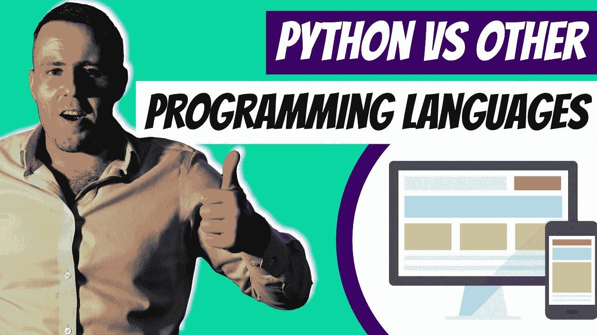

# 2022 年 Python vs 其他编程语言

> 原文：<https://medium.com/duomly-blockchain-online-courses/python-vs-other-programming-languages-in-2022-12aaa5609199?source=collection_archive---------7----------------------->

[Python vs Other Programming Languages in 2022](https://www.blog.duomly.com/python-vs-other-programming-languages/)

本文最初发布于:[https://www . blog . duomly . com/python-vs-other-programming-languages/](https://www.blog.duomly.com/python-vs-other-programming-languages/)

Python 是一种优点很多缺点很少的编程语言。它一直是最受欢迎的学习语言之一，因为它的语法很容易掌握，阅读起来相对简单，而且它还通过减少键入错误使编码更容易，因为 Python…