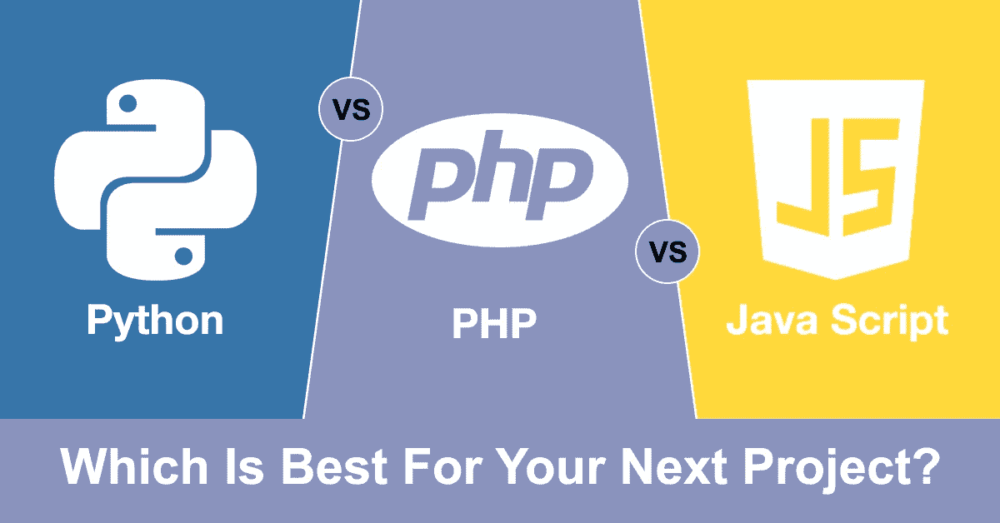

# Python vs PHP vs JavaScript:哪个最适合你的下一个项目？

> 原文：<https://medium.com/quick-code/python-vs-php-vs-javascript-which-is-best-for-your-next-project-e8df4c93c93f?source=collection_archive---------3----------------------->

## python vs PHP vs JavaScript:2021 年的比较研究

Image By: Author

你正在寻找为你的企业创建你的网络或 [**移动应用**](https://www.suntecindia.com/mobile-app-development-services.html) ？还是从实体店迁移到数码店？你可能需要 [**雇佣网络开发人员**](https://www.suntecindia.com/hire-web-developers.html) 来完成你的项目。但在此之前，让我们试着了解一下你的开发人员将要使用的技术。它将帮助您做出明智的决定，并选择最适合您的应用程序。

# **目录**

> 了解挑战
> 
> 三种编程语言简介
> 
> 对三种语言的详细研究:Python、PHP 和 JavaScript
> 
> 速度和性能
> 
> 社区支持
> 
> 一般性
> 
> 展开性
> 
> 学习曲线
> 
> 结论

# **了解挑战**

当您比较应用程序时，您可能经常想知道幕后发生了什么，使它们如此强大而又易于使用。用户界面/UX 的设计、特性、复杂性、他们的后端、他们的前端，都有助于创造一个杰作。其中最重要的因素是您选择用来开发应用程序的技术。如果你选择投资一种旧的、过时的编程语言，那么你可能会将所有的努力置于风险之中。您可能不会像使用新版本的其他人一样成功。

真正的挑战来自于当你开始一个新项目时，你需要选择正确的编程语言。作为产品负责人，这可能是你必须做出的最艰难的决定。目前市场上有很多用于服务器端、客户端或后端编程的技术。每一种都有自己独特的优点和缺点。有些可能在某些情况下适用，但并非在所有情况下都适用。

> 另一个问题出现了，哪种技术在哪种情况下效果最好？

别担心，我们会让你更容易理解和比较 Python、PHP 和 JavaScript 这三种主流语言。它将帮助您决定哪一个是适合您的业务需求的。让我们从每个案例的介绍开始。

# **要了解关于这三种编程语言的更多信息，请详细阅读本文:**

> [**https://hacker noon . com/python-vs-PHP-vs-JavaScript-哪个最适合你的下一个项目-i33v31y1**](https://hackernoon.com/python-vs-php-vs-javascript-which-is-best-for-your-next-project-i33v31y1)