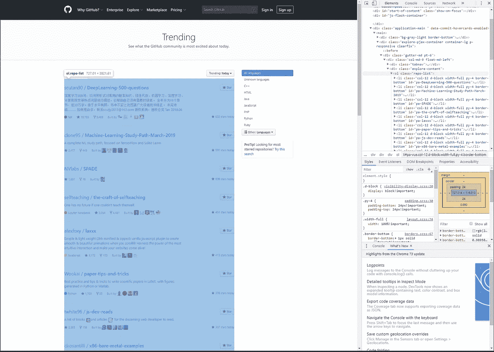

# Python 网页抓取教程

> 原文：<https://medium.com/quick-code/python-web-scraping-tutorial-74ace70e01?source=collection_archive---------0----------------------->


Picture taken from [Unsplash](https://unsplash.com/photos/nJX74kn1yn4)

# 介绍

如果你对数据分析、大数据、机器学习甚至人工智能项目感兴趣，你很可能需要从各种网站收集数据。Python 因其**稳定性**、**丰富的统计库**和**简单性**而非常常用于操作和处理数据(这些只是我的观点)。然后我们将使用 Python 来抓取 GitHub 的趋势库。

# 先决条件

在我们开始本教程之前，请在您的机器上设置 Python 环境。如果你还没有安装，请点击这里的官方页面[进行安装。](https://www.python.org/downloads/)

在本教程中，我将使用 *Visual Studio 代码*作为在 *Windows* *机器*上的 IDE，但是您可以自由选择您的 IDE。如果您正在使用 VS 代码，请按照这里的说明[来设置 Python 对 VS 代码的支持。](https://docs.microsoft.com/en-us/visualstudio/python/installing-python-support-in-visual-studio?view=vs-2017)

我们还将从 Python 中安装 ***【美汤】*** 和 ***请求*** 模块到我们的*虚拟环境*中。

***Request*** 库让我们可以轻松地发出 HTTP 请求，而***beautiful soup***会让抓取变得更加容易。

# 辅导的

让我们先来看看我们将收集哪些信息:

[](https://github.com/trending) [## 一起打造更好的软件

### GitHub 是人们构建软件的地方。超过 3100 万人使用 GitHub 来发现、分享和贡献超过…

github.com](https://github.com/trending) 

GitHub Trending Page

我们要做的是提取关于趋势库的所有信息，如名称、明星、链接等。

## 创建项目

在磁盘上的某个地方创建一个文件夹，我们称之为`python-scraper-github.`导航到该文件夹，让我们首先创建一个虚拟环境。

```
python -m venv env
```

等待这一步完成，你会发现这在我们项目的根目录下创建了一个名为`env` 的文件夹。这将包含 Python 需要的所有必需的包。所有安装的新模块都将安装到这个文件夹中。

> 虚拟环境是一种工具，通过为不同项目创建隔离的 python 虚拟环境，有助于保持不同项目所需的依赖关系分离。这是大多数 Python 开发人员使用的最重要的工具之一。

在命令行中键入`code .`,在 VS 代码中打开文件夹，或者在 VS 代码主窗口中找到要打开的文件夹。


How our project will look

按`ctrl + shift + p`打开所有命令，如下图选择命令`Python: Select Interpreter`，选择`env`


Choose our env folder as the interpreter

很好，现在您已经设置了解释器，我们可以在我们的文件夹中启动一个终端。通过 ***端子- >新建端子打开一个新端子。*** 你会看到第一行类似于
`(env) PS E:\Projects\Tutorials\python-scraper-github>`
那是因为当我们通过 VS 代码打开一个新的终端时，它会自动激活我们的虚拟环境。

## 安装依赖项

在终端中，输入以下内容(pip 预装在 Python 2.7.9 / 3.4 及更高版本中) :

```
pip install requests beautifulsoup4
```

现在我们已经完成了模块的安装，让我们创建一个新文件，命名为`scraper-github-trending.py`

```
*import* requests
*from* bs4 *import* BeautifulSoup
*# Collect the github page*page = requests.get('https://github.com/trending')
print(page)
```

我们已经导入了库，然后请求获取 GitHub 趋势页面。让我们运行这个文件，看看输出是什么。

*要运行一个特定的 python 文件，右击该文件- >在终端中运行 Python 文件*

```
<Response [200]>
```

这将是我们得到的输出。太好了，响应 200 表示页面获取成功。现在让我们使用漂亮的 Soup 模块来创建一个对象。将以下内容添加到文件中。

```
*# Create a BeautifulSoup object*soup = BeautifulSoup(page.text, 'html.parser')print(soup)
```


Output when running this new file

当我们运行该文件时，我们可以获得 GitHub 趋势页面的整个 html 页面！现在让我们探索如何提取有用的数据。

## 提取数据



Highlighted shows ‘repo-list’

打开你的浏览器(这里是 Chrome ),打开 GitHub 趋势页面。单击 inspect anywhere，您可以看到我们需要的全部数据都在标签`<div class="repo-list">`中，因此类`repo-list`应该是我们最初的关注点。


Each individual repository information

接下来，我们可以看到每个存储库都在`<li class='col-12 d-block width-full py-4 border-bottom'>`中定义，这是我们接下来要检索的内容

您的代码现在应该如下所示。如果您现在运行这个脚本，输出应该显示`25`

接下来，我们将遍历每个列表来检索所需的信息。强烈推荐 2021 年[学 Python](https://blog.coursesity.com/best-python-tutorials/) 编程。

## 存储库名称


Highlighted shows the tag that displays full repository name

上面的截图显示了完整的存储库名称出现在第一个`<a>`标签下。我们可以从中提取文本。因为它返回一个中间有`/`的字符串，所以我们可以使用`/`来分割这个字符串以获得一个字符串数组。第一个索引将有*开发者名称*，下一个索引将有*存储库名称*。

## 星星的数量


Stars are defined using <svg> tag with class <octagon>

因为不是所有的存储库都包含作为第一个元素的恒星数量，所以我们不能使用 position 来检索恒星数量。但是我们可以看到，定义恒星的`<svg>`和恒星本身的数量是在同一个母体下。因此，如果我们通过使用类`octicon octicon-star`获得`<svg>`，我们可以获得父类，然后提取文本(这将是星星的数量)。

## For 循环

我已经实现了如上所示的循环。对于我们的`repo_list` (包含 25 个项目)中的每个项目，让我们找到开发商、回购名称和星星。

运行上面的代码，输出应该是这样的:


Output showing the 3 field information requested

太好了！我们可以打印出我们计划要实现的目标。打印本身是好的，但是如果我们能把它储存在某个地方，比如一个`csv`文件上，那就更好了。让我们把这些信息保存在这里。

## 将其保存为 CSV

首先，我们需要导入内置的`csv`模块:

```
import csv
```

然后我们需要打开一个文件，将文件头写入我们的`csv`文件:

```
*# Open writer with name*file_name = "github_trending_today.csv"*# set newline to be '' so that that new rows are appended without skipping any*f = csv.writer(open(file_name, 'w', *newline*=''))*# write a new row as a header*f.writerow(['Developer', 'Repo Name', 'Number of Stars'])
```

接下来，在 for 循环中，我们需要在我们的`csv`文件中写入一个新行

```
f.writerow([developer, repo_name, stars])
```

这就是将趋势信息保存到我们的`csv`文件中所需的全部内容！

这就是我们的剧本最终的样子。一旦你运行进去，你会有一个新的文件`github_trending_today.csv`出现在我们的文件夹里。如果你打开它，它看起来像这样:


Scraped Information

太好了！您已经完成了使用 python 提取网站信息的简单教程！

# 最后的想法

各种有用模块的可用性使我们从网站上为我们的项目收集数据变得非常简单。然而，在使用这些数据产生有用的结果之前，仍然需要做大量的工作来准确地提取数据和清理数据。

再者，如果网站的结构，如 ***类名*** ， ***标签*** 或 ***id*** 发生变化，脚本也需要相应地改变，因而我们需要进一步考虑脚本的可维护性。

我希望这对那些希望自己从零开始提取各种信息的人有用！您可以在同一个项目中为您希望抓取的每个网页创建多个脚本。

如果有人觉得这些有用，请随意分享或者让我知道是否有错误/不好的实践/实现。

祝编码愉快！