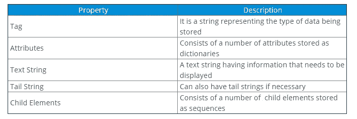
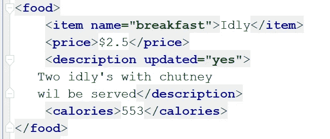
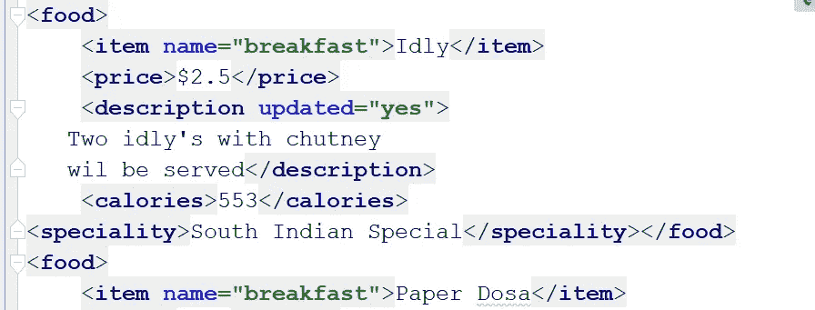
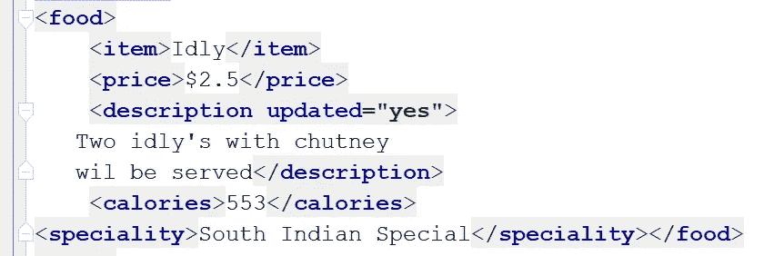
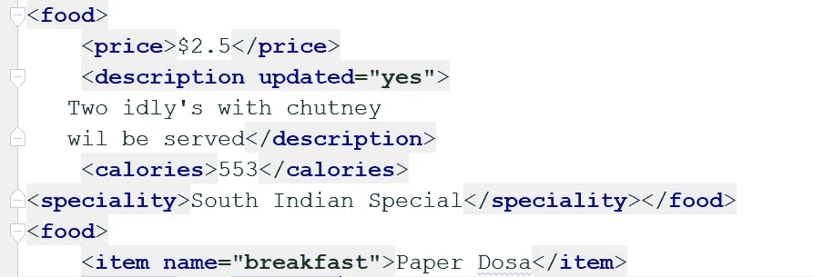

# 如何用 Python 解析和修改 XML？

> 原文：<https://medium.com/edureka/python-xml-parser-tutorial-cd381626a5d3?source=collection_archive---------1----------------------->


我们经常需要解析用不同语言编写的数据。Python 提供了许多库来解析或拆分用其他语言编写的数据。在这篇 Python XML 解析器教程中，您将学习如何使用 Python 解析 XML。

以下是本教程涵盖的所有主题:

1.  什么是 XML？
2.  Python XML 解析模块
3.  xml.etree.ElementTree 模块

*   使用 parse()函数
*   使用 fromstring()函数
*   寻找感兴趣的元素
*   修改 XML 文件
*   添加到 XML
*   从 XML 中删除

4.xml.dom.minidom 模块

*   使用 parse()函数
*   使用 fromString()函数
*   寻找感兴趣的元素

所以让我们开始吧。:)

# 什么是 XML？

XML 代表可扩展标记语言。它在外观上类似于 HTML，但是 XML 用于数据表示，而 HTML 用于定义使用什么数据。XML 专门设计用于在客户机和服务器之间来回发送和接收数据。看一下下面的例子:

**举例:**

```
<?xml version="1.0" encoding="UTF-8"?>
<metadata>
<food>
    <item name="breakfast">Idly</item>
    <price>$2.5</price>
    <description>
   Two idly's with chutney
   </description>
    <calories>553</calories>
</food>
<food>
    <item name="breakfast">Paper Dosa</item>
    <price>$2.7</price>
    <description>
    Plain paper dosa with chutney
    </description>
    <calories>700</calories>
</food>
<food>
    <item name="breakfast">Upma</item>
    <price>$3.65</price>
    <description>
    Rava upma with bajji
    </description>
    <calories>600</calories>
</food>
<food>
    <item name="breakfast">Bisi Bele Bath</item>
    <price>$4.50</price>
    <description>
   Bisi Bele Bath with sev
    </description>
    <calories>400</calories>
</food>
<food>
    <item name="breakfast">Kesari Bath</item>
    <price>$1.95</price>
    <description>
    Sweet rava with saffron
    </description>
    <calories>950</calories>
</food>
</metadata>
```

上面的例子显示了我命名为“Sample.xml”的文件的内容，我将在本 Python XML 解析器教程中对所有即将到来的例子使用相同的内容。

# Python XML 解析模块

Python 允许使用两个模块解析这些 XML 文档，即 xml.etree.ElementTree 模块和 Minidom(最小 dom 实现)。解析意味着从文件中读取信息，并通过识别特定 XML 文件的各个部分将信息拆分成片段。让我们进一步看看如何使用这些模块来解析 XML 数据。

## xml.etree.ElementTree 模块:

这个模块帮助我们将 XML 数据格式化为树形结构，这是分层数据最自然的表现形式。元素类型允许在内存中存储分层数据结构，并具有以下属性:



ElementTree 是一个包装元素结构的类，允许与 XML 相互转换。现在让我们尝试使用 python 模块解析上面的 XML 文件。

使用“ElementTree”模块有两种方法来解析文件。第一个是通过使用 ***parse()函数*** ，第二个是 ***fromstring()函数*** 。parse()函数解析以文件形式提供的 XML 文档，而 fromstring 解析以字符串形式(即在三重引号内)提供的 XML 文档。

## 使用 parse()函数:

如前所述，这个函数获取文件格式的 XML 来解析它。看一下下面的例子:

**示例:**

```
**import** xml.etree.ElementTree as ET
mytree **=** ET.parse('sample.xml')
myroot **=** mytree.getroot()
```

如您所见，您需要做的第一件事是导入 xml.etree.ElementTree 模块。然后，parse()方法解析“Sample.xml”文件。getroot()方法返回“Sample.xml”的根元素。

当您执行上面的代码时，您将不会看到返回的输出，但是不会有指示代码已成功执行的错误。要检查根元素，只需使用如下的 print 语句:

**举例:**

```
**import** xml.etree.ElementTree as ET
mytree **=** ET.parse('sample.xml')
myroot **=** mytree.getroot()
print(myroot)
```

**输出:** <元素“元数据”在 0x033589F0 >

上面的输出表明我们的 XML 文档中的根元素是“元数据”。

## 使用 fromstring()函数:

您也可以使用 fromstring()函数来解析您的字符串数据。如果您想这样做，请将 XML 作为三重引号内的字符串传递，如下所示:

```
**import** xml.etree.ElementTree as ET
data**=**'''<?xml version="1.0" encoding="UTF-8"?>
<metadata>
<food>
<item name="breakfast">Idly</item>
<price>$2.5</price>
<description>
Two idly's with chutney
</description>
<calories>553</calories>
</food>
</metadata>
'''
myroot **=** ET.fromstring(data)
#print(myroot)
print(myroot.tag)
```

上述代码将返回与上一个代码相同的输出。请注意，用作字符串的 XML 文档只是“Sample.xml”的一部分，我使用它是为了更好地显示。您也可以使用完整的 XML 文档。

您还可以通过使用“tag”对象来检索根标记，如下所示:

**举例:**

```
print(myroot.tag)
```

**输出:**元数据

您还可以通过指定想要在输出中看到的字符串部分来分割标签字符串输出。

**举例:**

```
print(myroot.tag[0:4])
```

**输出:**元

如前所述，标签也可以有字典属性。要检查根标签是否有任何属性，您可以使用“attrib”对象，如下所示:

```
print(myroot.attrib)
```

**输出:** {}

如您所见，输出是一个空字典，因为我们的根标签没有属性。

## 寻找感兴趣的元素:

根也由子标签组成。要检索根标记的子标记，可以使用以下方法:

**示例:**

```
print(myroot[0].tag)
```

**输出:**食物

现在，如果您想要检索根的所有第一个子标记，您可以使用 for 循环对其进行迭代，如下所示:

**示例:**

```
for x in myroot[0]: print(x.tag, x.attrib)
```

**输出:**

项目{ '名称':'早餐' }
价格{}
描述{}
卡路里{}

返回的所有项目都是食物的子属性和标签。

要使用 ElementTree 从 XML 中分离出文本，可以使用 text 属性。例如，如果我想检索第一个食物项目的所有信息，我应该使用下面这段代码:

**例如:**

```
for x in myroot[0]:
print(x.text)
```

**输出:**

两个懒懒的酸辣酱三明治

如您所见，第一项的文本信息已经作为输出返回。现在，如果您想显示所有商品及其特定价格，您可以使用 get()方法。这个方法访问元素的属性。

```
**for** x **in** myroot.findall('food'):
item **=**x.find('item').text
price **=** x.find('price').text
print(item, price)
```

**输出:**

懒懒地 2.5 美元
纸 Dosa 2.7 美元
Upma 3.65 美元
比西贝莱浴场 4.5 美元
凯萨里浴场 1.95 美元

上面的输出显示了所有需要的商品以及它们的价格。使用 ElementTree，您还可以修改 XML 文件。

## 修改 XML 文件:

XML 文件中的元素是可以操作的。为此，可以使用 set()函数。让我们首先看看如何向 XML 添加内容。

## 添加到 XML:

以下示例显示了如何向项目描述中添加内容。

**例如:**

```
**for** description **in** myroot.iter('description'):
new_desc **=** str(description.text)**+**'wil be served'
description.text **=** str(new_desc)
description.set('updated', 'yes')
mytree.write('new.xml')
```

write()函数帮助创建一个新的 XML 文件，并将更新后的输出写入该文件。但是，您也可以使用相同的功能修改原始文件。执行上述代码后，您将能够看到一个新文件已经用更新后的结果创建。



上图显示了修改后的食品描述。要添加新的子标记，可以使用 SubElement()方法。例如，如果您要将新的专业标签添加到第一个闲置项目，您可以执行以下操作:

**举例:**

```
ET.SubElement(myroot[0], 'speciality')
**for** x **in** myroot.iter('speciality'):
new_desc **=** 'South Indian Special'
x.text **=** str(new_desc)
mytree.write('output5.xml')
```

**输出:**



如您所见，在第一个食品标签下添加了一个新标签。通过在[]括号中指定下标，您可以在任何需要的地方添加标签。现在让我们来看看如何使用这个模块删除项目。

**从 XML 中删除:**

要使用 ElementTree 删除属性或子元素，可以使用 pop()方法。该方法将删除用户不需要的属性或元素。

**举例:**

```
myroot[0][0].attrib.pop('name', None)
# create a new XML file with the results
mytree.write('output5.xml')
```

**输出:**



上图显示 name 属性已经从 item 标签中删除。要删除完整的标记，可以使用相同的 pop()方法，如下所示:

**示例:**

```
myroot[0].remove(myroot[0][0])
mytree.write('output6.xml')
```

输出显示食品标签的第一个子元素已被删除。如果您想要删除所有标签，您可以使用 clear()函数，如下所示:

**示例:**

```
myroot[0].clear()
mytree.write('output7.xml')
```

**输出:**



当执行上述代码时，食品标签的第一个子标签将被完全删除，包括所有子标签。到目前为止，我们一直在使用 Python XML 解析器教程中的 xml.etree.ElementTree 模块。现在让我们看看如何使用 minidom 解析 XML。

# xml.dom.minidom 模块:

这个模块基本上是精通 DOM(文档对象模块)的人用的。DOM 应用程序通常从将 XML 解析成 DOM 开始。在 xml.dom.minidom 中，这可以通过以下方式实现:

## 使用 parse()函数:

第一种方法是通过提供要解析的 XML 文件作为参数来利用 parse()函数。例如:

**例如:**

```
from xml.dom import minidom
p1 = minidom.parse("sample.xml");
```

一旦执行了这个操作，您就能够分割 XML 文件并获取所需的数据。您也可以使用这个函数解析一个打开的文件。

**示例:**

```
dat=open('sample.xml')
p2=minidom.parse(dat)
```

在这种情况下，存储打开文件的变量作为参数提供给 parse 函数。

## 使用 parseString()方法:

当您希望提供要作为字符串进行解析的 XML 时，可以使用此方法。

**例子:**

```
p3 = minidom.parseString('<myxml>Using<empty/> parseString</myxml>')
```

您可以使用上述任何一种方法解析 XML。现在让我们尝试使用这个模块来获取数据。

## 寻找感兴趣的元素:

在我的文件被解析后，如果我试图打印它，返回的输出会显示一条消息，说明存储解析数据的变量是 DOM 的一个对象。

**例如:**

```
dat=minidom.parse('sample.xml')
print(dat)
```

**输出:**

**使用 GetElementByTagName 访问元素:** **示例:**

```
tagname= dat.getElementsByTagName('item')[0]
print(tagname)
```

如果我尝试使用 GetElementByTagName 方法获取第一个元素，我将看到以下输出:

**输出:**

请注意，只返回了一个输出，因为为了方便起见，我使用了[0]下标，在后面的例子中会删除它。

要访问属性的值，我必须使用 value 属性，如下所示:

**示例:**

```
dat = minidom.parse('sample.xml') tagname= dat.getElementsByTagName('item') print(tagname[0].attributes['name'].value)
```

**输出:**早餐

要检索这些标记中的数据，您可以使用 data 属性，如下所示:

**示例:**

```
print(tagname[1].firstChild.data)
```

**输出:**纸张 Dosa

还可以使用 value 属性拆分和检索属性值。

**示例:**

```
print(items[1].attributes['name'].value)
```

**输出:**早餐

要打印出菜单中所有可用的项目，您可以遍历这些项目并返回所有项目。

**例如:**

```
for x in items:
print(x.firstChild.data)
```

**输出:**

要计算菜单上的项目数量，您可以使用 len()函数，如下所示:

**例如:**

```
print(len(items))
```

**输出:** 5

输出指定我们的菜单由 5 个项目组成。

这就把我们带到了 Python XML 解析器教程的结尾。我希望你已经明白了一切。

伙计们，这就把我们带到了这篇关于如何在 Python 中输入 A-List 的文章的结尾？如果你想查看更多关于人工智能、DevOps、道德黑客等市场最热门技术的文章，那么你可以参考 [Edureka 的官方网站。](https://www.edureka.co/blog/?utm_source=medium&utm_medium=content-link&utm_campaign=python-xml-parser-tutorial)

请留意本系列中的其他文章，它们将解释 Python 和数据科学的各个方面。

> *1。*[*Python 中的机器学习分类器*](/edureka/machine-learning-classifier-c02fbd8400c9)
> 
> *2。*[*Python Scikit——学习小抄*](/edureka/python-scikit-learn-cheat-sheet-9786382be9f5)
> 
> *3。* [*机器学习工具*](/edureka/python-libraries-for-data-science-and-machine-learning-1c502744f277)
> 
> *4。* [*用于数据科学和机器学习的 Python 库*](/edureka/python-libraries-for-data-science-and-machine-learning-1c502744f277)
> 
> *5。*[*Python 中的聊天机器人*](/edureka/how-to-make-a-chatbot-in-python-b68fd390b219)
> 
> *6。* [*Python 集合*](/edureka/collections-in-python-d0bc0ed8d938)
> 
> *7。* [*Python 模块*](/edureka/python-modules-abb0145a5963)
> 
> *8。* [*Python 开发者技能*](/edureka/python-developer-skills-371583a69be1)
> 
> 9。 [*哎呀面试问答*](/edureka/oops-interview-questions-621fc922cdf4)
> 
> *10。* [*一个 Python 开发者的简历*](/edureka/python-developer-resume-ded7799b4389)
> 
> *11。*[*Python 中的探索性数据分析*](/edureka/exploratory-data-analysis-in-python-3ee69362a46e)
> 
> *12。* [*蛇与蟒蛇的游戏*](/edureka/python-turtle-module-361816449390)
> 
> *13。* [*Python 开发者工资*](/edureka/python-developer-salary-ba2eff6a502e)
> 
> *14。* [*主成分分析*](/edureka/principal-component-analysis-69d7a4babc96)
> 
> *15。*[*Python vs c++*](/edureka/python-vs-cpp-c3ffbea01eec)
> 
> *16。* [*刺儿头教程*](/edureka/scrapy-tutorial-5584517658fb)
> 
> *17。*[*Python SciPy*](/edureka/scipy-tutorial-38723361ba4b)
> 
> *18。* [*最小二乘回归法*](/edureka/least-square-regression-40b59cca8ea7)
> 
> *19。* [*Jupyter 笔记本小抄*](/edureka/jupyter-notebook-cheat-sheet-88f60d1aca7)
> 
> *20。* [*Python 基础知识*](/edureka/python-basics-f371d7fc0054)
> 
> *21。* [*Python 模式程序*](/edureka/python-pattern-programs-75e1e764a42f)
> 
> *22。*[*Python 中的发电机*](/edureka/generators-in-python-258f21e3d3ff)
> 
> *23。* [*Python 装饰器*](/edureka/python-decorator-tutorial-bf7b21278564)
> 
> *24。*[](/edureka/spyder-ide-2a91caac4e46)*[*Python 中的套接字编程是什么*](/edureka/socket-programming-python-bbac2d423bf9)*
> 
> **25。*[*Python 中使用 Kivy 的移动应用*](/edureka/kivy-tutorial-9a0f02fe53f5)*
> 
> **26。* [*十大最佳学习书籍&练习 Python*](/edureka/best-books-for-python-11137561beb7)*
> 
> *27。 [*机器人框架用 Python*](/edureka/robot-framework-tutorial-f8a75ab23cfd)*
> 
> *28。[*Python 中的贪吃蛇游戏*](/edureka/snake-game-with-pygame-497f1683eeaa)*
> 
> **29。* [*Django 面试问答*](/edureka/django-interview-questions-a4df7bfeb7e8)*
> 
> *30。 [*十大 Python 应用*](/edureka/python-applications-18b780d64f3b)*
> 
> **31。*[*Python 中的哈希表和哈希表*](/edureka/hash-tables-and-hashmaps-in-python-3bd7fc1b00b4)*
> 
> *32。[*Python 3.8*](/edureka/whats-new-python-3-8-7d52cda747b)*
> 
> **33。* [*支持向量机*](/edureka/support-vector-machine-in-python-539dca55c26a)*
> 
> **34。* [*Python 教程*](/edureka/python-tutorial-be1b3d015745)*
> 
> **35。*[*Python Spyder*](/edureka/spyder-ide-2a91caac4e46)*

**原载于 2019 年 7 月 22 日*[*https://www.edureka.co*](https://www.edureka.co/blog/python-xml-parser-tutorial/)*。**