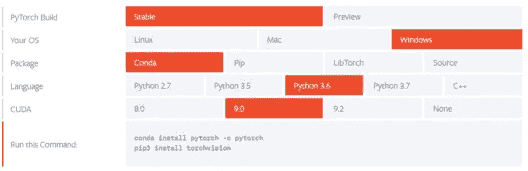
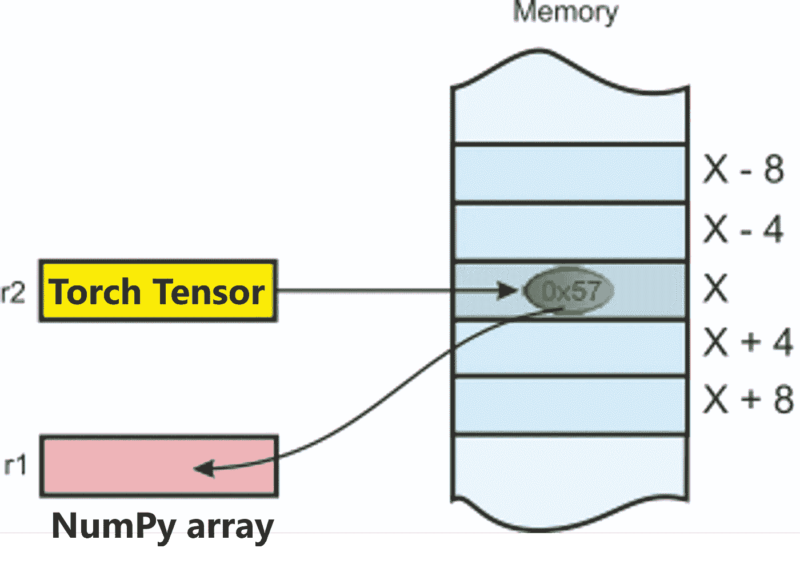
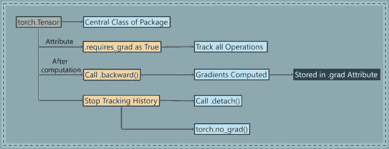
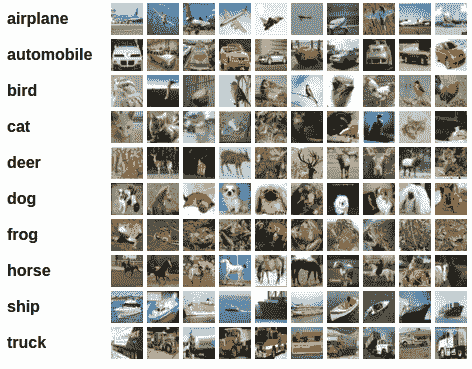
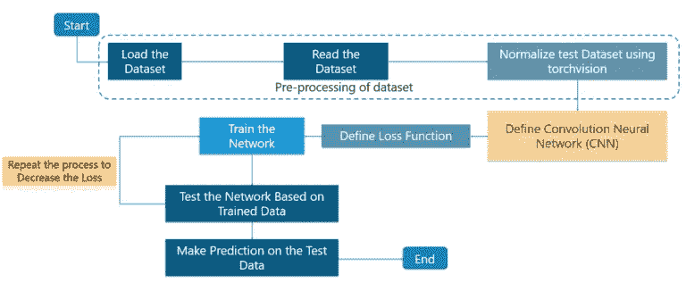
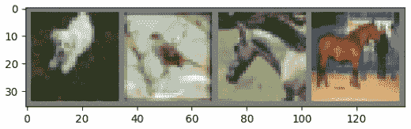
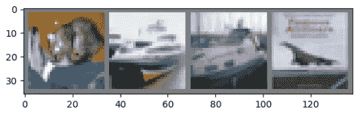

# PyTorch 教程—使用 PyTorch 实现深度神经网络

> 原文：<https://medium.com/edureka/pytorch-tutorial-9971d66f6893?source=collection_archive---------1----------------------->


PyTorch Tutorial — Edureka

让我们从这篇 **PyTorch 教程**文章开始，首先确立一个事实，即深度学习是今天**每个人**都在使用的东西，从**虚拟协助**到在**购物**时获得**推荐**！随着更好地利用深度学习的更新工具的出现，编程和实现变得更加容易。

本 **PyTorch 教程**将按以下顺序让您**全面了解**py torch:

*   PyTorch 是什么？
*   PyTorch 的特点
*   安装 PyTorch
*   NumPy 桥
*   PyTorch:亲笔签名的模块
*   用例:图像分类器

# Python 中的深度学习框架

对于编码和处理深度学习来说，Python 是首选的，因此有很多框架可供选择。比如:

*   张量流
*   PyTorch
*   克拉斯
*   Theano
*   千层面


# PyTorch 是什么？

这是一个基于 **Python 的**科学计算**包**针对两组受众:

*   NumPy 的一个**替代**，以利用**GPU**的能力。
*   深度学习**研究平台**提供最大的**灵活性**和**速度**。

# PyTorch 的特点—亮点

1.  **Python 的本地支持**及其库的使用
2.  在脸书的**开发中被积极使用，用于平台中所有的深度学习需求。**
3.  PyTorch 确保了一个**易于使用的 API** ，这有助于在使用 API 时更容易使用和更好理解。
4.  **动态计算图**是这里的一大亮点，因为它们确保了图形的动态构建——在代码执行的每一点，图形都是独立构建的，并且可以在运行时进行操作。
5.  **PyTorch 很快**和**感觉很自然**，因此确保容易编码和快速处理。
6.  **对 CUDA** 的支持确保了代码可以在 GPU 上运行，从而减少了运行代码所需的时间，提高了系统的整体性能。

# 安装 PyTorch

在本文中，让我们看看在您的机器上安装 PyTorch 是多么简单。



基于系统属性，如**操作系统**或包管理器，这是非常简单的**。它可以从**命令提示符**安装，也可以安装在 **IDE** 中，如 **PyCharm** 等。**

在本文的下一部分，让我们看看 **NumPy** 是如何集成到 PyTorch 中的。

## 张量

张量类似于 NumPy 的 n 维数组，另外张量也可以在 GPU 上使用，以加速计算。

让我们构造一个简单的张量并检查输出。首先，让我们看看如何构建一个 5×3 的矩阵，它是未知的:

```
x = torch.empty(5, 3)
print(x)
```

**输出:**

```
tensor([[8.3665e+22, 4.5580e-41, 1.6025e-03],
        [3.0763e-41, 0.0000e+00, 0.0000e+00],
        [0.0000e+00, 0.0000e+00, 3.4438e-41],
        [0.0000e+00, 4.8901e-36, 2.8026e-45],
        [6.6121e+31, 0.0000e+00, 9.1084e-44]])
```

现在让我们构造一个随机初始化的矩阵:

```
x = torch.rand(5, 3)
print(x)
```

**输出:**

```
tensor([[0.1607, 0.0298, 0.7555],
        [0.8887, 0.1625, 0.6643],
        [0.7328, 0.5419, 0.6686],
        [0.0793, 0.1133, 0.5956],
        [0.3149, 0.9995, 0.6372]])
```

直接从数据构建张量:

```
x = torch.tensor([5.5, 3]) 
print(x)
```

**输出:**

```
tensor([5.5000, 3.0000])
```

## **张量运算**

操作有多种语法。在下面的例子中，我们将看看加法运算:

```
y = torch.rand(5, 3) 
print(x + y)
```

**输出:**

```
tensor([[ 0.2349, -0.0427, -0.5053],
            [ 0.6455,  0.1199,  0.4239],
            [ 0.1279,  0.1105,  1.4637],
            [ 0.4259, -0.0763, -0.9671],
            [ 0.6856,  0.5047,  0.4250]])
```

**调整大小:**如果您想要调整张量的形状/大小，您可以使用“torch.view”:

```
x = torch.randn(4, 4)
y = x.view(16)
z = x.view(-1, 8) # the size -1 is inferred from other dimensions
print(x.size(), y.size(), z.size())
```

**输出:**

```
torch.Size([4, 4]) torch.Size([16]) torch.Size([2, 8])
```

# PyTorch 的数字


**NumPy 是 Python 编程语言的库**，增加了对大型多维**数组**和**矩阵**的支持，以及对这些数组进行操作的大量**高级数学函数**。

它还被用作:

*   **库**提供**工具**用于集成 C/C++和 FORTRAN 代码。
*   运算具有**线性代数**、**傅立叶变换**和**随机数**功能。

除了其明显的科学用途，NumPy 还可以用作通用数据的有效**多维容器**，并且可以定义任意数据类型。

这允许 **NumPy** 到**无缝**并快速**将**与各种**数据库集成！**

# NumPy 桥——阵列和张量


**将**火炬张量转换为 NumPy 数组，反之亦然**轻而易举！**



Torch 张量和 NumPy 数组将**共享它们的底层内存位置**，改变一个将改变另一个。

# 将 Torch 张量转换为 NumPy 数组:

创建火炬张量:

```
a = torch.ones(5) 
print(a)
```

**输出:**

```
tensor([1., 1., 1., 1., 1.])
```

创建 NumPy 数组:

```
b = a.numpy() 
print(b)
```

**输出:**

```
[1\. 1\. 1\. 1\. 1.]
```

让我们执行**求和运算**并检查**值的变化**:

```
a.add_(1)
print(a)
print(b)
```

**输出:**

```
tensor([2., 2., 2., 2., 2.]) [2\. 2\. 2\. 2\. 2.]
```

# 将 NumPy 数组转换为 Torch 张量:

```
import numpy as no
a = np.ones(5)
b = torch.from_numpy(a)
np.add(a, 1, out=a)
print(a)
print(b)
```

**输出:**

```
[2\. 2\. 2\. 2\. 2.] 
tensor([2., 2., 2., 2., 2.], dtype=torch.float64)
```

所以，如你所见，就是这么**简单**就这么简单！

接下来，让我们看看 PyTorch 的**亲笔签名模块**。

# PyTorch:亲笔签名的模块

**亲笔签名**包为张量上的所有操作提供**自动微分**。



这是一个**的运行定义框架**，这意味着你的反向开发是由你的代码如何运行来定义的，并且每一次**迭代**都可以**不同**。

接下来，在这篇文章中，让我们看一个有趣而简单的用例。

# PyTorch 用例:训练图像分类器

一般来说，当你必须处理图像、文本、音频或视频数据时，你可以使用**标准 python 包**将数据加载到 **Numpy** 数组中。然后你可以把这个阵列转换成一个**火炬。*张量**。

*   对于**图像**，像**枕头**和 **OpenCV** 这样的包是有用的。
*   对于**音频**，包如 **Scipy** 和 **Librosa** 。
*   对于**文本**，基于原始 Python、 **Cython** 的加载或 **NLTK** 和 **SpaCy** 都是有用的。

具体到视觉，有一个名为 **torchvision** 的包，其中有**数据加载器**用于常见数据集，如 **Imagenet、CIFAR10、MNIST 等**。和图像数据转换器。

这为**提供了巨大的便利**和**避免了编写样板代码。**

对于本教程，我们将使用 **CIFAR10** 数据集。

它有**类**:‘飞机’，‘汽车’，‘鸟’，‘猫’，‘鹿’，‘狗’，‘青蛙’，‘马’，‘船’，‘卡车’。CIFAR-10 中的图像大小为 3x32x32，即 32×32 像素的 3 通道彩色图像，如下所示:



# PyTorch:训练 CIFAR10 分类器



我们将依次执行以下步骤:

1.  加载和规范化 CIFAR10
2.  定义一个卷积神经网络
3.  定义损失函数
4.  根据训练数据训练网络
5.  根据测试数据测试网络

## 加载和规范化 CIFAR10

使用**火炬视觉**，加载 cifar 10**非常容易**！

它就像下面这样简单:

```
import torch
import torchvision
import torchvision.transforms as transforms
```

torchvision 数据集的输出是范围[0，1]的 **PILImage** 图像。我们把它们转换成归一化范围[-1，1]的张量。

```
transform = transforms.Compose(
[transforms.ToTensor(),
transforms.Normalize((0.5, 0.5, 0.5), (0.5, 0.5, 0.5))])
trainset = torchvision.datasets.CIFAR10(root='./data', train=True,
download=True, transform=transform)
trainloader = torch.utils.data.DataLoader(trainset, batch_size=4,
shuffle=True, num_workers=2)
testset = torchvision.datasets.CIFAR10(root='./data', train=False,
download=True, transform=transform)
testloader = torch.utils.data.DataLoader(testset, batch_size=4,
shuffle=False, num_workers=2)
classes = ('plane', 'car', 'bird', 'cat',
'deer', 'dog', 'frog', 'horse', 'ship', 'truck')
```

**输出:**

```
Downloading https://www.cs.toronto.edu/~kriz/cifar-10-python.tar.gz to ./data/cifar-10-python.tar.gz Files already downloaded and verified
```

接下来，让我们打印一些来自**数据集的**训练图像**！**

```
import matplotlib.pyplot as plt
import numpy as np

# functions to show an image

def imshow(img):
img = img / 2 + 0.5 # unnormalize
npimg = img.numpy()
plt.imshow(np.transpose(npimg, (1, 2, 0)))

# get some random training images
dataiter = iter(trainloader)
images, labels = dataiter.next()

# show images
imshow(torchvision.utils.make_grid(images))
# print labels
print(' '.join('%5s' % classes[labels[j]] for j in range(4)))
```



**输出:**

```
dog  bird horse horse
```

## 定义一个卷积神经网络

考虑使用**三通道图像**(红色、绿色和蓝色)的情况。下面是定义 CNN 架构的**代码**:

```
import torch.nn as nn
import torch.nn.functional as F

class Net(nn.Module):
def __init__(self):
super(Net, self).__init__()
self.conv1 = nn.Conv2d(3, 6, 5)
self.pool = nn.MaxPool2d(2, 2)
self.conv2 = nn.Conv2d(6, 16, 5)
self.fc1 = nn.Linear(16 * 5 * 5, 120)
self.fc2 = nn.Linear(120, 84)
self.fc3 = nn.Linear(84, 10)

def forward(self, x):
x = self.pool(F.relu(self.conv1(x)))
x = self.pool(F.relu(self.conv2(x)))
x = x.view(-1, 16 * 5 * 5)
x = F.relu(self.fc1(x))
x = F.relu(self.fc2(x))
x = self.fc3(x)
return x

net = Net()
```

## 定义损失函数和优化器

我们将需要**定义**损失函数。在这种情况下，我们可以利用**分类交叉熵**损失。我们也将使用 **SGD** 和**动量**。

基本上，交叉熵损失是一个范围从 0 到 1 的概率值。**完美模型**的交叉熵损失为 **0** ，但也有可能**的期望值**可能是 0.2，但你得到的是 2。这将导致**非常高的损耗**并且完全没有效率！

```
import torch.optim as optim

criterion = nn.CrossEntropyLoss()
optimizer = optim.SGD(net.parameters(), lr=0.001, momentum=0.9)
```

## 训练网络

这是事情开始变得有趣的时候！我们只需让**在**数据迭代器**上循环**，然后**将**输入到**网络**和**优化**。

```
for epoch in range(2): # loop over the dataset multiple times

running_loss = 0.0
for i, data in enumerate(trainloader, 0):
# get the inputs
inputs, labels = data

# zero the parameter gradients
optimizer.zero_grad()

# forward + backward + optimize
outputs = net(inputs)
loss = criterion(outputs, labels)
loss.backward()
optimizer.step()

# print statistics
running_loss += loss.item()
if i % 2000 == 1999: # print every 2000 mini-batches
print('[%d, %5d] loss: %.3f' %
(epoch + 1, i + 1, running_loss / 2000))
running_loss = 0.0

print('Finished Training')
```

**输出:**

```
[1,  2000] loss: 2.236
[1,  4000] loss: 1.880
[1,  6000] loss: 1.676
[1,  8000] loss: 1.586
[1, 10000] loss: 1.515
[1, 12000] loss: 1.464
[2,  2000] loss: 1.410
[2,  4000] loss: 1.360
[2,  6000] loss: 1.360
[2,  8000] loss: 1.325
[2, 10000] loss: 1.312
[2, 12000] loss: 1.302
Finished Training
```

## 根据测试数据测试网络

我们已经在**训练数据集**上为 **2 遍**训练了网络。但是我们需要**检查**网络是否已经学习了任何东西。

我们将通过**预测神经网络输出的类别标签** l，并**对照实际情况对其进行检查。**如果预测是**正确的**，我们**将**样本添加到正确预测的列表中。

好了，第一步！让我们展示一个测试集中的图片来熟悉一下。

```
dataiter = iter(testloader)
images, labels = dataiter.next()

# print images
imshow(torchvision.utils.make_grid(images))
print('GroundTruth: ', ' '.join('%5s' % classes[labels[j]] for j in range(4)))
```



**输出:**

```
GroundTruth: cat ship ship plane
```

好了，现在让我们看看神经网络认为上面这些例子是什么:

```
outputs = net(images)
```

输出为 10 个等级的**能量**。一个类别的能量越高，网络越认为该图像属于特定的类别。那么，让我们得到**最高能量**的指数:

```
predicted = torch.max(outputs, 1)

print('Predicted: ', ' '.join('%5s' % classes[predicted[j]]
for j in range(4)))
```

**输出:**

```
Predicted: cat car car plane
```

***结果好像还不错。***

接下来，让我们看看网络在整个数据集上的表现！

```
correct = 0
total = 0
with torch.no_grad():
for data in testloader:
images, labels = data
outputs = net(images)
_, predicted = torch.max(outputs.data, 1)
total += labels.size(0)
correct += (predicted == labels).sum().item()

print('Accuracy of the network on the 10000 test images: %d %%' % (
100 * correct / total))
```

**输出:**

```
Accuracy of the network on the 10000 test images: 54 %
```

那看起来**比 chance** 要好，后者是 **10%** 的准确率(从 10 个类中随机挑选一个类)。

**看来好像网络学到了什么！**

有哪些**表现好**的课，**表现不好**的课？

```
class_correct = list(0\. for i in range(10))
class_total = list(0\. for i in range(10))
with torch.no_grad():
for data in testloader:
images, labels = data
outputs = net(images)
_, predicted = torch.max(outputs, 1)
c = (predicted == labels).squeeze()
for i in range(4):
label = labels[i]
class_correct[label] += c[i].item()
class_total[label] += 1

for i in range(10):
print('Accuracy of %5s : %2d %%' % (
classes[i], 100 * class_correct[i] / class_total[i]))
```

**输出:**

```
Accuracy of plane : 61 %
Accuracy of   car : 85 %
Accuracy of  bird : 46 %
Accuracy of   cat : 23 %
Accuracy of  deer : 40 %
Accuracy of   dog : 36 %
Accuracy of  frog : 80 %
Accuracy of horse : 59 %
Accuracy of  ship : 65 %
Accuracy of truck : 46 %
```

在这篇 **PyTorch 教程**文章中，我们确保**训练**一个小型的**神经网络**，该网络**对**图像进行分类，结果完全符合预期！

*这就把我们带到了“PyTorch 教程”这篇文章的结尾。我希望这篇文章对你有所帮助，并增加了你的知识价值。*

如果你想查看更多关于人工智能、DevOps、道德黑客等市场最热门技术的文章，那么你可以参考 [Edureka 的官方网站。](https://www.edureka.co/blog/?utm_source=medium&utm_medium=content-link&utm_campaign=pytorch-tutorial)

请留意本系列中的其他文章，它们将解释深度学习的各个其他方面。

> 1.[张量流教程](/edureka/tensorflow-tutorial-ba142ae96bca)
> 
> 2.[tensor flow 中的对象检测](/edureka/tensorflow-object-detection-tutorial-8d6942e73adc)
> 
> 3.[感知器学习算法](/edureka/perceptron-learning-algorithm-d30e8b99b156)
> 
> 4.[神经网络教程](/edureka/neural-network-tutorial-2a46b22394c9)
> 
> 5.什么是反向传播？
> 
> 6.[卷积神经网络](/edureka/convolutional-neural-network-3f2c5b9c4778)
> 
> 7.[胶囊神经网络](/edureka/capsule-networks-d7acd437c9e)
> 
> 8.[递归神经网络](/edureka/recurrent-neural-networks-df945afd7441)
> 
> 9.[自动编码器教程](/edureka/autoencoders-tutorial-cfdcebdefe37)
> 
> 10.[受限玻尔兹曼机教程](/edureka/restricted-boltzmann-machine-tutorial-991ae688c154)
> 
> 11. [PyTorch vs TensorFlow](/edureka/pytorch-vs-tensorflow-252fc6675dd7)
> 
> 12.[用 Python 进行深度学习](/edureka/deep-learning-with-python-2adbf6e9437d)
> 
> 13.[人工智能教程](/edureka/artificial-intelligence-tutorial-4257c66f5bb1)
> 
> 14.[张量流图像分类](/edureka/tensorflow-image-classification-19b63b7bfd95)
> 
> 15.[人工智能应用](/edureka/artificial-intelligence-applications-7b93b91150e3)
> 
> 16.[如何成为一名人工智能工程师？](/edureka/become-artificial-intelligence-engineer-5ac2ede99907)
> 
> 17.[问学习](/edureka/q-learning-592524c3ecfc)
> 
> 18. [Apriori 算法](/edureka/apriori-algorithm-d7cc648d4f1e)
> 
> 19.[用 Python 实现马尔可夫链](/edureka/introduction-to-markov-chains-c6cb4bcd5723)
> 
> 20.[人工智能算法](/edureka/artificial-intelligence-algorithms-fad283a0d8e2)
> 
> 21.[机器学习的最佳笔记本电脑](/edureka/best-laptop-for-machine-learning-a4a5f8ba5b)
> 
> 22.[12 大人工智能工具](/edureka/top-artificial-intelligence-tools-36418e47bf2a)
> 
> 23.[人工智能(AI)面试问题](/edureka/artificial-intelligence-interview-questions-872d85387b19)
> 
> 24. [Theano vs TensorFlow](/edureka/theano-vs-tensorflow-15f30216b3bc)
> 
> 25.[什么是神经网络？](/edureka/what-is-a-neural-network-56ae7338b92d)
> 
> 26.[模式识别](/edureka/pattern-recognition-5e2d30ab68b9)
> 
> 27.[人工智能中的阿尔法贝塔剪枝](/edureka/alpha-beta-pruning-in-ai-b47ee5500f9a)

*原载于 2018 年 10 月 29 日 www.edureka.co**的* [*。*](https://www.edureka.co/blog/pytorch-tutorial/)