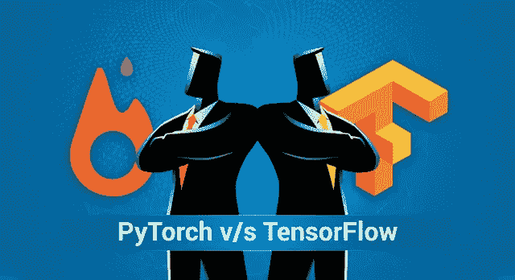
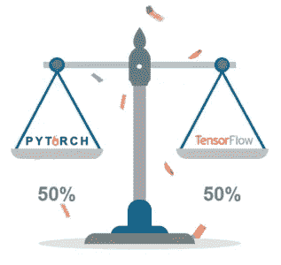
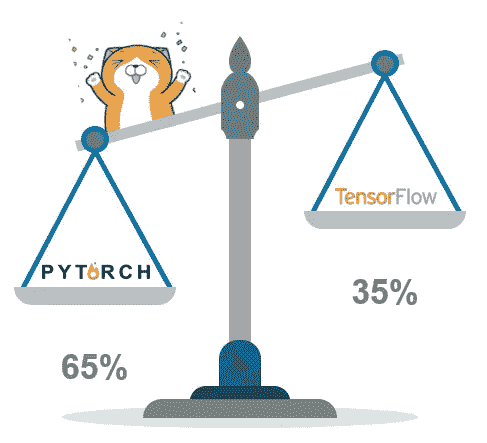
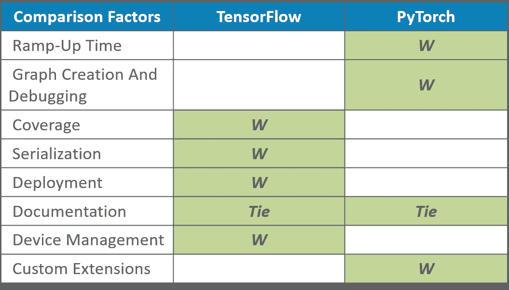

# py torch v/s tensor flow——哪个框架更好？

> 原文：<https://medium.com/edureka/pytorch-vs-tensorflow-252fc6675dd7?source=collection_archive---------4----------------------->

PyTorch vs TensorFlow — Edureka

这篇关于 **PyTorch v/s TensorFlow** 的对比文章旨在对任何考虑开始**新项目**的人有用，使**从一个深度学习框架**或**学习**切换到另一个。在设置**深度学习**堆栈的训练和部署的组件时，重点基本上是**可编程性**和**灵活性**。

让我们看看我们将用于**比较**的**因素**:

*   **上升时间**
*   **图形构建和调试**
*   **覆盖范围**
*   **序列化**
*   **部署**
*   **文档**
*   **设备管理**
*   **自定义扩展**

所以让战斗开始吧！

我将从基于加速时间的两个框架的比较开始这篇文章。

# 斜坡上升时间:

PyTorch 基本上是**开发的 NumPy** ，具有使用**显卡**的能力。

由于 NumPy 中的**简单是先决条件，这使得 PyTorch **非常容易**学习和掌握。**

使用 **Tensorflow** ，我们都知道主要的事情是图形首先被**编译**，然后我们有**实际的**图形输出。

那么这里的**动力**在哪里呢？另外， **TensorFlow** 具有依赖关系，其中编译后的代码是**使用 **TensorFlow** **执行引擎**运行**。嗯，对我来说，**依赖**越少，整体越好。

回到 **PyTorch** ，众所周知代码以**闪电般的速度**执行，结果证明**总体上非常高效**，这里**不需要**额外的概念来学习。

对于 **TensorFlow，**我们需要变量范围、占位符和会话等概念。这也导致**更多的样板代码**，我敢肯定**这里没有一个程序员喜欢这些。**

***所以在我看来，PyTorch 赢了这一场！***

# 图形构建和调试:

从 **PyTorch** 开始，明显的**优势**就是创建一个图的整个过程的**动态性**。

可以通过**解释**对应于**图**的特定方面的**代码行**来构建这些图。

所以这是完全在运行时**上**构建的**，我非常喜欢这一点。**

使用 **TensorFlow** 时，**构造是静态的**，图形需要经过**编译**，然后在我之前提到的**执行引擎**上运行。

PyTorch 代码让我们的生活变得更加容易，因为可以使用 PDB。同样，通过使用**标准 python 调试器**，我们将**而不是**要求**学习**使用来自 **scratch** 的另一个调试器。

嗯，有了 **TensorFlow** ，你需要在**上投入一点额外的努力**。有两个选项可供调试:

*   你需要**学习**TF 调试器。
*   **从**会话**中请求**您想要检查的**变量**。

嗯，PyTorch 也赢了！

# 覆盖范围:

某些操作，如:

1.**翻转**一个张量沿着一个**维度**

2.**检查**张量为**楠**和**无穷大**

3.支持快速**傅立叶**变换

**由 **TensorFlow** 原生支持。**

**我们还有 **contrib** 包，可以用来创建**更多的** **模型**。**

**这允许支持**使用更高级的功能**，并为您提供更广泛的**选项**。**

**随着 **PyTorch** 的出现，到目前为止它已经实现了**更少的功能**，但是我确信**的差距将很快被弥补**，因为 **PyTorch** 吸引了所有的注意力。**

**但是在**自由职业者**和学习者中**不如 **TensorFlow** 受欢迎**。嗯，这是**主观的**但这就是它是什么家伙！**

*****TensorFlow 在这一轮把它钉死了！*****

# **序列化:**

****

**嗯，**毫不奇怪**保存和**加载**模型是相当简单的，因为**和**都是框架。**

**PyTorch 有一个简单的 API。API 既可以保存一个模型的所有权重，也可以保存整个类。**

**然而， **TensorFlow** 的主要**优势**在于**整个图形**可以保存为**协议缓冲区**，是的，这也包括**参数**和**操作**。**

**然后可以根据**需求**用其他支持的**语言**加载**图形，例如 **C++或 Java** 。****

**这对于**部署栈**来说至关重要，其中 **Python** 是**而不是**一个**选项**。此外，当您更改**型号源代码**但希望能够**运行旧型号**时，这也很有用。**

*****嗯，一清二楚，TensorFlow 拿到了这个！*****

# **部署:**

****

**对于**小规模的**服务器端部署来说，**两个**框架都很容易包装在例如 Flask web 服务器中。**

**对于**移动**和**嵌入式部署来说，** **TensorFlow** 确实工作得很好。这超过了大多数其他深度学习框架，包括 **PyTorch** 。**

**部署到 **Android** 或 **iOS** 确实需要在 **TensorFlow 中进行**大量的工作。******

**你**不必**用 **Java 或 C++** 重写**你的模型的整个推理部分。****

**除了**性能**之外， **TensorFlow** **服务**的一个显著特点是模型可以**轻松热插拔**而不会使服务停机。**

*****我想这一轮我也要给 TensorFlow！*****

# **文档:**

****

**嗯，不用说，我已经**在两个框架的官方文档中找到了我需要的一切**。**

****Python API**被**很好地记录了**，并且有足够的**示例**和**教程**来学习任何一个框架。**

**但是有一件小事引起了我的注意，那就是 **PyTorch C 库**大部分是没有文档记录的**。****

**然而，当编写一个**自定义 C 扩展**时，也许如果**将**贡献给**软件**时，这只**重要。****

**总而言之，我可以说我们在这里打成了平手！**

**然而，如果你认为你倾向于某件事，请到评论区发表你的观点。 ***我们在那里交战吧！*****

# **设备管理:**

****

****TensorFlow** 中的设备管理是一件轻而易举的事情——你**不需要指定**任何东西，因为**默认值**已经设置好了。**

**例如， **TensorFlow** 自动假设您希望**在 GPU** 上运行，如果有可用的 GPU 的话。**

**在 **PyTorch 中，**您必须**明确地将**所有东西移动到设备**上，即使 CUDA 已启用。****

**使用 **TensorFlow** 设备管理的**唯一的缺点是，默认情况下，它**会消耗所有可用 GPU 上的所有内存**，即使只有一个**正在使用，也会消耗**。****

**使用 **PyTorch** ，我发现**代码**需要更多**频繁检查**CUDA 可用性和更明确的设备管理。尤其是当**编写的代码**应该能够在 CPU 和 **GPU** 上运行的时候。**

**TensorFlow 在这里轻松获胜！**

# **自定义扩展:**

****

**继续，最后但同样重要的是，我为你们挑选了**自定义扩展**。**

****构建或绑定用 **C、C++或 CUDA** 编写的定制扩展**在两种框架下都是可行的。**

****TensorFlow** 需要**更多的样板代码**，尽管可以说**清理器**支持多种**类型**和**设备**。**

**然而在 **PyTorch** 中，你只需**为每个 **CPU** 和 **GPU** 版本编写一个接口**和相应的**实现**。**

****编译**扩展也是**直接**和**的**框架和**都不需要**下载 **pip 安装**之外的任何头文件或源代码。**

*****而 PyTorch 在这点上占了上风！*****

# **结论:**

****

**好吧，乐观点说，我会说 PyTorch 和 TensorFlow 是相似的，我会打成平手。**

****

**但是，在我个人看来，我会**更喜欢 PyTorch** 而不是 **TensorFlow** (比例为 **65%** 比 **35%** )**

**但是，这个**并不** PyTorch 更好！**

**在一天结束的时候，它归结为你想用什么**编码**和你的**组织需要什么**！**

**我在**家里**用 **PyTorch** 但是在**工作**用 **TensorFlow** ！**

****

**我个人相信 **TensorFlow** 和 **PyTorch** 都将**彻底改变**深度学习**的各个方面，从**虚拟辅助**一直到**带着你**在镇上转悠。这将是简单的和微妙的，并将对深度学习和所有用户产生重大影响！****

**我希望你喜欢我的对比文章。如果你想查看更多关于 Python、DevOps、Ethical Hacking 等市场最热门技术的文章，那么你可以参考 [Edureka 的官方网站。](https://www.edureka.co/blog/?utm_source=medium&utm_medium=content-link&utm_campaign=pytorch-vs-tensorflow)**

**请留意本系列中的其他文章，它们将解释深度学习的各个其他方面。**

> **1. [TensorFlow 教程](/edureka/tensorflow-tutorial-ba142ae96bca)**
> 
> **2. [PyTorch 教程](/edureka/pytorch-tutorial-9971d66f6893)**
> 
> **3.[感知器学习算法](/edureka/perceptron-learning-algorithm-d30e8b99b156)**
> 
> **4.[神经网络教程](/edureka/neural-network-tutorial-2a46b22394c9)**
> 
> **5.[什么是反向传播？](/edureka/backpropagation-bd2cf8fdde81)**
> 
> **6.[卷积神经网络](/edureka/convolutional-neural-network-3f2c5b9c4778)**
> 
> **7.[胶囊神经网络](/edureka/capsule-networks-d7acd437c9e)**
> 
> **8.[递归神经网络](/edureka/recurrent-neural-networks-df945afd7441)**
> 
> **9.[自动编码器教程](/edureka/autoencoders-tutorial-cfdcebdefe37)**
> 
> **10.[受限玻尔兹曼机教程](/edureka/restricted-boltzmann-machine-tutorial-991ae688c154)**
> 
> **11.[tensor flow 中的物体检测](/edureka/tensorflow-object-detection-tutorial-8d6942e73adc)**
> 
> **12.[用 Python 进行深度学习](/edureka/deep-learning-with-python-2adbf6e9437d)**
> 
> **13.[人工智能教程](/edureka/artificial-intelligence-tutorial-4257c66f5bb1)**
> 
> **14.[张量流图像分类](/edureka/tensorflow-image-classification-19b63b7bfd95)**
> 
> **15.[人工智能应用](/edureka/artificial-intelligence-applications-7b93b91150e3)**
> 
> **16.[如何成为一名人工智能工程师？](/edureka/become-artificial-intelligence-engineer-5ac2ede99907)**
> 
> **17.[问学习](/edureka/q-learning-592524c3ecfc)**
> 
> **18. [Apriori 算法](/edureka/apriori-algorithm-d7cc648d4f1e)**
> 
> **19.[用 Python 实现马尔可夫链](/edureka/introduction-to-markov-chains-c6cb4bcd5723)**
> 
> **20.[人工智能算法](/edureka/artificial-intelligence-algorithms-fad283a0d8e2)**
> 
> **21.[机器学习的最佳笔记本电脑](/edureka/best-laptop-for-machine-learning-a4a5f8ba5b)**
> 
> **22.[12 大人工智能工具](/edureka/top-artificial-intelligence-tools-36418e47bf2a)**
> 
> **23.[人工智能(AI)面试问题](/edureka/artificial-intelligence-interview-questions-872d85387b19)**
> 
> **24. [Theano vs TensorFlow](/edureka/theano-vs-tensorflow-15f30216b3bc)**
> 
> **25.[什么是神经网络？](/edureka/what-is-a-neural-network-56ae7338b92d)**
> 
> **26.[模式识别](/edureka/pattern-recognition-5e2d30ab68b9)**
> 
> **27.[人工智能中的阿尔法贝塔剪枝](/edureka/alpha-beta-pruning-in-ai-b47ee5500f9a)**

***原载于 2018 年 10 月 18 日*[*www.edureka.co*](https://www.edureka.co/blog/pytorch-vs-tensorflow/)*。***