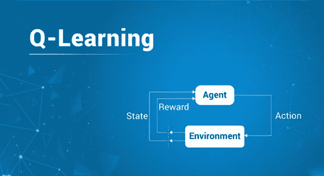
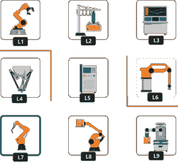
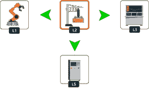
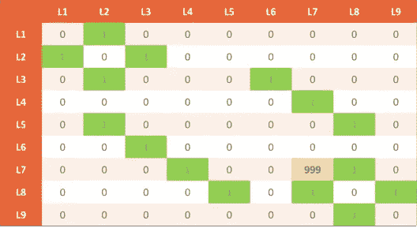
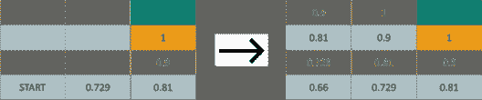
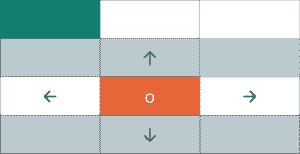
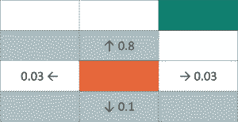
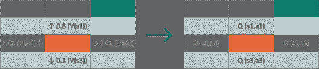
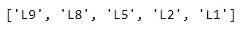

# q 学习:关于强化学习你需要知道的一切

> 原文：<https://medium.com/edureka/q-learning-592524c3ecfc?source=collection_archive---------0----------------------->



Q Learning — Edureka

人工智能和机器学习是行业中最热门的几个领域，这是有充分理由的。考虑到其主要目标是让机器模仿人类行为，人工智能将在 2020 年前创造 230 万个工作岗位。很奇怪，不是吗？因此，今天我们将按以下顺序讨论 Q 学习，即强化学习的构建模块:

*   什么是强化学习？
*   q-学习过程
*   贝尔曼方程
*   马尔可夫决策过程
*   演示:NumPy

# 什么是强化学习？

让我们看看我们的日常生活。我们在环境中执行许多任务，有些任务会给我们带来回报，有些则不会。我们不断寻找不同的途径，试图找出哪条途径会带来回报，并根据我们的行动改进我们实现目标的策略。这是强化学习的一个最简单的类比。

主要关注领域:

*   环境
*   行动
*   报酬
*   状态


强化学习是机器学习的一个分支，它允许系统从自己的决策结果中学习。它解决了一种特殊的问题，即决策是连续的，目标是长期的。

# q-学习过程

让我们用这里的问题陈述来理解什么是 Q 学习。它将帮助我们定义强化学习解决方案的主要组成部分，即代理、环境、行动、奖励和状态。

## **汽车工厂类比:**

我们在一个装满机器人的汽车工厂。这些机器人帮助工厂工人运送组装汽车所需的必要零件。这些不同的零件位于工厂内 9 个工位的不同位置。零件包括底盘、车轮、仪表板、发动机等。工厂主将安装机箱的位置作为最高优先级。让我们看看这里的设置:



**州:**


机器人在特定情况下所处的位置称为其状态。因为对它进行编码比用名字来记忆更容易。让我们把位置映射到数字上。

**动作:**

动作只不过是机器人移动到任何地方。假设一个机器人位于 L2 位置，它可以移动到的直接位置是 L5、L1 和 L3。让我们更好地理解这一点，如果我们把它形象化:



**奖励:**

机器人直接从一个州到另一个州会得到奖励。例如，您可以从 L2 直接到达 L5，反之亦然。因此，在任何一种情况下都将提供 1 的奖励。让我们来看看奖励表:


还记得工厂主优先考虑底盘位置的时候吗？它是 L7，所以我们将把这个事实纳入我们的奖励表。因此，我们将在(L7，L7)位置分配一个非常大的数字(本例中为 999)。



# 贝尔曼方程

现在假设一个机器人需要从 A 点到 b 点，它会选择一条能产生积极回报的路径。为此，假设我们为它提供一个足迹奖励。


但是，如果机器人从两者之间的某个地方开始，它可以看到两条或更多的路径。机器人因此不能做出决定，这主要是因为它没有**记忆**。这就是贝尔曼方程发挥作用的地方。

> **V(s) = max(R(s，a)+𝜸v(s')**

其中:

*   s =特定的州
*   a =行动
*   s′=机器人从 s 进入的状态
*   𝜸 =贴现因子
*   R(s，a) =采用状态(s)和动作(a)并输出奖励值的奖励函数
*   V(s) =处于特定状态的值

现在目的地下面的方块会有 1 的奖励，这是最高的奖励，但是另一个方块呢？嗯，这就是折现系数的来源。让我们假设一个折扣系数为 0.9，并逐一填充所有的块。



# 马尔可夫决策过程

想象一个机器人在橙色方块上，需要到达目的地。但是，即使有轻微的功能障碍，机器人也会不知道该走哪条路，而不是向上走。



所以我们需要修改决策过程。它必须**部分随机**和**部分受控于机器人**。部分是随机的，因为我们不知道机器人什么时候会出故障，部分是可控的，因为这仍然是机器人的决定。这构成了马尔可夫决策过程的基础。

**马尔可夫决策过程(MDP)是一种离散时间随机控制过程。它提供了一个数学框架，用于在结果部分随机、部分受决策者控制的情况下对决策进行建模。**

所以我们将使用我们最初的贝尔曼方程，并对其进行修改。我们不知道的是下一个状态。**s’。**我们所知道的是转弯的所有可能性，让我们改变等式。

**V(s) = max(R(s，a)+𝜸v(s ')**

**V(s) = max(R(s，a)+𝜸σs ' p(s，a，s ')v(s ')**

**σs ' P(s，a，s') V(s') :** 机器人的随机性期望



V(s) = max(R(s，a) + 𝜸 ((0.8V(房间向上))+ (0.1V(房间向下)+ …。))

现在，让我们过渡到 Q 学习。Q-Learning 提出了一种评估移动到一个状态的动作的质量的思想，而不是确定它被移动到的状态的可能值。



这就是我们所得到的，如果我们把评估移动到某个状态 s '的动作质量的想法结合进来。从更新后的贝尔曼方程中，如果我们去掉它们的**最大**分量，我们假设可能的动作只有一个足迹，除了动作的**质量**之外什么都没有。

**Q(s，a) = (R(s，a)+𝜸σs ' p(s，a，s ')v(s ')**

在这个量化行动质量的等式中，我们可以假设 V(s)是 Q(s，a)所有可能值的最大值。所以让我们用 Q()的函数来代替 v(s ')。

**Q(s，a) = (R(s，a)+𝜸σs ' p(s，a，s') max Q(s '，a ')**

我们离 Q 学习的最终方程式只有一步之遥。我们将引入一个**时间差**来计算环境随时间变化的 Q 值。但是我们如何观察 Q 的变化呢？

**TD(s，a) = (R(s，a)+𝜸σs ' p(s，a，s') max Q(s '，a ')—q(s，a)**

我们用同样的公式重新计算新的 Q(s，a)，并从中减去以前已知的 Q(s，a)。所以，上面的等式变成了:

**Qt (s，a) = Qt-1 (s，a) + α TDt (s，a)**

**Qt (s，a) =** 当前 Q 值

**Qt-1 (s，a) =** 前一个 Q 值

**Qt (s，a) = Qt-1 (s，a) + α (R(s，a) + 𝜸最大 Q(s '，a') — Qt-1(s，a))**

# 演示:NumPy

我将使用 Python NumPy 来演示 Q 学习是如何工作的。

**步骤 1:导入、参数、状态、动作和奖励**

```
import numpy as np

gamma = 0.75 # Discount factor
alpha = 0.9 # Learning rate

location_to_state = {
    'L1' : 0,
    'L2' : 1,
    'L3' : 2,
    'L4' : 3,
    'L5' : 4,
    'L6' : 5,
    'L7' : 6,
    'L8' : 7,
    'L9' : 8
}

actions = [0,1,2,3,4,5,6,7,8]

rewards = np.array([[0,1,0,0,0,0,0,0,0],
              [1,0,1,0,0,0,0,0,0],
              [0,1,0,0,0,1,0,0,0],
              [0,0,0,0,0,0,1,0,0],
              [0,1,0,0,0,0,0,1,0],
              [0,0,1,0,0,0,0,0,0],
              [0,0,0,1,0,0,0,1,0],
              [0,0,0,0,1,0,1,0,1],
              [0,0,0,0,0,0,0,1,0]])
```

**步骤 2:将索引映射到位置**

```
state_to_location = dict((state,location) for location,state in location_to_state.items())
```

**第三步:使用 Q 学习过程获得最佳路线**

```
def get_optimal_route(start_location,end_location):
    rewards_new = np.copy(rewards)
    ending_state = location_to_state[end_location]
    rewards_new[ending_state,ending_state] = 999

    Q = np.array(np.zeros([9,9]))

    # Q-Learning process
    for i in range(1000):
        # Picking up a random state
        current_state = np.random.randint(0,9) # Python excludes the upper bound
        playable_actions = []
        # Iterating through the new rewards matrix
        for j in range(9):
            if rewards_new[current_state,j] > 0:
                playable_actions.append(j)
        # Pick a random action that will lead us to next state
        next_state = np.random.choice(playable_actions)
        # Computing Temporal Difference
        TD = rewards_new[current_state,next_state] + gamma * Q[next_state, np.argmax(Q[next_state,])] - Q[current_state,next_state]
        # Updating the Q-Value using the Bellman equation
        Q[current_state,next_state] += alpha * TD

    # Initialize the optimal route with the starting location
    route = [start_location]
    #Initialize next_location with starting location
    next_location = start_location

    # We don't know about the exact number of iterations needed to reach to the final location hence while loop will be a good choice for iteratiing
    while(next_location != end_location):
        # Fetch the starting state
        starting_state = location_to_state[start_location]
        # Fetch the highest Q-value pertaining to starting state
        next_state = np.argmax(Q[starting_state,])
        # We got the index of the next state. But we need the corresponding letter.
        next_location = state_to_location[next_state]
        route.append(next_location)
        # Update the starting location for the next iteration
        start_location = next_location

    return route
```

**第四步:打印路线**

```
print(get_optimal_route('L1', 'L9'))
```



这样，我们就结束了 Q-Learning。我希望你已经了解了 Q 学习的工作原理以及各种各样的依赖关系，比如时间差，贝尔曼方程等等。

如果你想查看更多关于人工智能、DevOps、道德黑客等市场最热门技术的文章，你可以参考 Edureka 的官方网站。

请留意本系列中的其他文章，它们将解释深度学习的各个其他方面。

> 1. [TensorFlow 教程](/edureka/tensorflow-tutorial-ba142ae96bca)
> 
> 2. [PyTorch 教程](/edureka/pytorch-tutorial-9971d66f6893)
> 
> 3.[感知器学习算法](/edureka/perceptron-learning-algorithm-d30e8b99b156)
> 
> 4.[神经网络教程](/edureka/neural-network-tutorial-2a46b22394c9)
> 
> 5.什么是反向传播？
> 
> 6.[卷积神经网络](/edureka/convolutional-neural-network-3f2c5b9c4778)
> 
> 7.[胶囊神经网络](/edureka/capsule-networks-d7acd437c9e)
> 
> 8.[递归神经网络](/edureka/recurrent-neural-networks-df945afd7441)
> 
> 9.[自动编码器教程](/edureka/autoencoders-tutorial-cfdcebdefe37)
> 
> 10.[受限玻尔兹曼机教程](/edureka/restricted-boltzmann-machine-tutorial-991ae688c154)
> 
> 11. [PyTorch vs TensorFlow](/edureka/pytorch-vs-tensorflow-252fc6675dd7)
> 
> 12.[用 Python 进行深度学习](/edureka/deep-learning-with-python-2adbf6e9437d)
> 
> 13.[人工智能教程](/edureka/artificial-intelligence-tutorial-4257c66f5bb1)
> 
> 14.[张量流图像分类](/edureka/tensorflow-image-classification-19b63b7bfd95)
> 
> 15.[人工智能应用](/edureka/artificial-intelligence-applications-7b93b91150e3)
> 
> 16.[如何成为一名人工智能工程师？](/edureka/become-artificial-intelligence-engineer-5ac2ede99907)
> 
> 17.[tensor flow 中的对象检测](/edureka/tensorflow-object-detection-tutorial-8d6942e73adc)
> 
> 18. [Apriori 算法](/edureka/apriori-algorithm-d7cc648d4f1e)
> 
> 19.[马尔可夫链与 Python](/edureka/introduction-to-markov-chains-c6cb4bcd5723)
> 
> 20.[人工智能算法](/edureka/artificial-intelligence-algorithms-fad283a0d8e2)
> 
> 21.[机器学习的最佳笔记本电脑](/edureka/best-laptop-for-machine-learning-a4a5f8ba5b)
> 
> 22.[12 大人工智能工具](/edureka/top-artificial-intelligence-tools-36418e47bf2a)
> 
> 23.[人工智能(AI)面试问题](/edureka/artificial-intelligence-interview-questions-872d85387b19)
> 
> 24. [Theano vs TensorFlow](/edureka/theano-vs-tensorflow-15f30216b3bc)
> 
> 25.[什么是神经网络？](/edureka/what-is-a-neural-network-56ae7338b92d)
> 
> 26.[模式识别](/edureka/pattern-recognition-5e2d30ab68b9)
> 
> 27.[人工智能中的阿尔法贝塔剪枝](/edureka/alpha-beta-pruning-in-ai-b47ee5500f9a)

*原载于 2019 年 6 月 12 日 https://www.edureka.co*[](https://www.edureka.co/blog/q-learning/)**。**