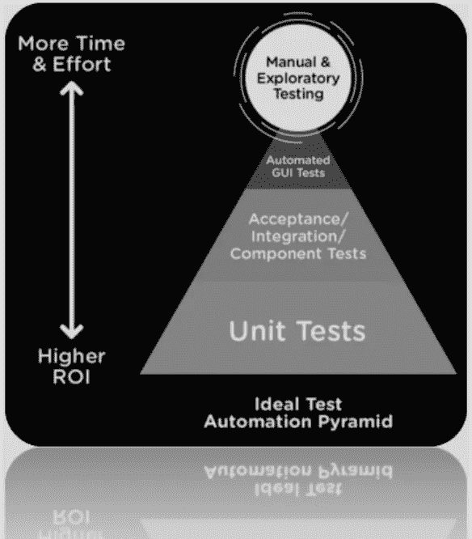

# 来自战壕的 QA

> 原文：<https://medium.com/globant/qa-from-the-trenches-195dc06bbf5a?source=collection_archive---------0----------------------->

简单介绍一下我，我的名字是 Agustin Perez，我已经参与多个软件项目超过 11 年，其中一些项目比其他项目更复杂。这篇文章将基于我在软件质量保证、管理测试和敏捷方法学方面的经验。

我有机会参与多种类型的项目:小型、中型和大型项目；20 到 350 多名工程师一起为客户创造价值，为了在一些概念上保持一致，让我们试着回顾一下过去…

这篇文章将解释软件质量保证(SQA)、方法和参与是如何从传统方法发展到敏捷方法的。我们将从他们的问题、误解、缺点和优点方面探讨更多的细节。此外，我会给你一些建议或提示，以避免对质量保证概念和实践在**敏捷**软件开发中的参与或贡献的误解。

# 瀑布

它是软件开发的线性方法；这个模型强调一个连续的过程/步骤:需求、分析、设计、编码、测试和维护。该模型是软件开发生命周期(SDLC)方法论中第一个在软件工程中广泛使用的模型，其特点是在下一阶段开始之前 100%完成一个阶段。

*   在瀑布中，**测试是一个独立的阶段**
*   开发团队和测试团队**分别** **工作**。
*   **无法灵活应对内部或外部变化**
*   测试仅在开发完成后**进行——无变化**
*   仅在最后执行**回归测试。**
*   测试**级别不能重叠。**

Waterfall model

在传统的瀑布方法中，超过 60% — 80%的测试项目时间可以用于计划测试工作和定义测试用例，然后在项目结束时，20% — 40%的工作与测试用例的执行相关。通常，需要额外的 15%到 40%来修复产品中没有通过测试的缺陷和差距。

# 优势

*   这种方法是结构化的，在软件实现之前就捕捉到了设计错误。
*   适用于需求非常明确的小型项目。
*   通过参考定义的里程碑来衡量进展更容易。
*   在定义需求之后，可以准确地估计项目的总成本。

# 不足之处

*   SDLC 期间不支持需求更改。
*   由于早期阶段的误解，项目交付通常需要更长的时间。
*   直到生命周期的最后阶段，才生产出可工作的软件。
*   在此过程中调整范围可能会取消项目。

# v 型车

V-model 是一个**高度规范的** SDLC 模型，其中有一个测试阶段**与每个开发阶段**并行。v 模型的应用与瀑布模型几乎相同，因为两个模型都是顺序型的。

V-model

# 优势

*   这是一个高度规范的模型，并且一次完成一个阶段。
*   主动缺陷跟踪，在早期发现缺陷。
*   由于模型的刚性，易于管理。每个阶段都有具体的交付成果和审查流程。

# 不足之处

*   V 模型中的测试只有在实现完成后才开始。
*   非常坚硬，最不灵活。
*   长期和正在进行的项目的糟糕模型
*   一旦一个应用程序处于测试阶段，就很难回头去改变它的功能

通过这些经典和传统的方式，软件质量保证(SQA)由于项目的**复杂性**和**不确定性**而失败，作为筒仓参与 SDLC 极大地影响了 SQA，此外 **QC 成员位于壕沟**；那么我们如何解决这种情况呢？

在新的数字化转型过程中，老式的测试方法似乎不再像过去那样有效，持续集成/部署、敏捷方法、开发运维、更短的交付时间或自动化等新元素将 SQA 推向了新的边界，并开辟了多个领域，在这些领域中，QC 成员必须参与才能成功离开战壕。

**你了解敏捷测试象限吗？你知道左移测试吗？**

“敏捷测试象限”是一个可视化工具，用于理解或分类不同的 SQA 测试，源自 Brain Marick scope，使用该工具 QC 成员能够发现、构建、计划和执行所需的测试。

该工具提供了区分面向业务和技术的测试，以及那些“支持团队”或“评论产品”的测试的一瞥，以便整个团队能够成功地理解测试过程。

左边的测试是那些指导开发的测试，那些在编码发生之前或编码进行时编写的测试。右边的测试是那些在编码完成后对产品进行评论(评估)的测试。 "*

***书—敏捷测试浓缩****

重要的是要强调象限数字并不意味着任何顺序，概括起来象限仅仅是一个分类，以帮助和支持团队计划他们的测试方法，并确保他们拥有完成它们所需的所有资源。

# 左移测试

正如我上面提到的，典型的质量模型只关注 SDLC 的最后一部分，通常是在测试和维护阶段完成质量目标，另一方面谈到左移测试，质量必须通过所有涉及的过程:范围界定、需求、设计、代码、客户交互、客户评审、测试、验收、生产、维护等等。

如今，BDD、TDD、ATDD、CI/CD、APIOps 或 DevOps 等术语变得非常流行，随着这些测试方法或实践的出现，关于测试活动的发展与过去“有点”不同，左移测试是一种与软件开发相关的方法，其中测试在生命周期的早期执行，左移测试的目标之一是尽快防止或检测错误，以便通过 SDLC 从头到尾减少昂贵的缺陷或障碍。

这种方法涉及开发人员、客户或项目的任何利益相关者，根据这一点，质量成为 pod 中的一个关键因素，在整个组织中传播质量文化。

Shift Left Model

# 优势

*   敏捷测试作为一个整体**团队在周期中更早**，这节省了时间和金钱。
*   **减少了**人为错误率以为所有的 SDLC(范围界定到发布)
*   **监控**一段时间内的表现
*   质量**持续增加**
*   **自动化测试**增加

# 不足之处

*   没有敏捷测试**的思维**，目标不能作为一个团队完成，孤立的问题(BA、SM、PO、QC 等。)
*   **在实施过程中缺乏**领导、文化或支持。

随着左移、右移测试的实现，这种方法也出现了，它涉及到在开发过程的后期执行操作的想法，例如在预发布和发布后阶段

右移测试涉及的技术包括:

*   金丝雀放生。
*   混沌测试
*   A/B 测试。
*   基于 CX 的测试
*   故障注入测试。
*   生产监控
*   破坏性测试。
*   用户验收测试(UAT)

*[https://lisacrispin.com/2020/11/01/shifting-left-right-in-our-continuous-world/](https://lisacrispin.com/2020/11/01/shifting-left-right-in-our-continuous-world/)

如您所见，我们将测试重心转移到流程中，在 SDLC 中**将测试提前**进行，同时将测试重心转移到应用部署后的测试实践**上。随着这些方法的结合，敏捷项目中出现了"*"持续测试实践，这是一种当变更到来时，我们试图驱动快速反馈到开发的实践，识别检测到的问题，让开发团队知道，修复它，提升和提高质量。自动化测试用例在这里是一个关键的元素，然而，要考虑你所处的层次:单元、API、UI 或探索性测试；请注意，**要实施持续测试**，必须通过整个 SDLC 和定义的流程(BA、DEV、QA 等)生成**整体质量视图**。***

**

*很明显，每种方法都有优点和缺点，作为 QC 成员，我们的责任是定义或创建最佳策略或过程，但是软件质量保证不是一个独立的领域，我们应该与治理保持一致并集成。*

*根据之前展示的全景图，**没有解决任何项目或方法中可能出现的所有问题**的灵丹妙药，因此，我将为您提供一些提示或关键因素**以安全离开沟渠。***

*首先，软件质量保证必须是一个优先事项，不仅与 QC 成员相关，所有不同的利益相关者必须在这方面进行合作。尽管整个 SDLC，它不仅在产品中需要，而且在过程中也需要。敏捷方法的目标是在项目生命周期的每个阶段实施 QA，以便在过程中您可以频繁、早期和连续地进行测试。*

*其次，与第一点一致的是，参与涵盖 SDLC 是很重要的，例如在 SCRUM 中，仪式给你机会改进多个方面:精化、计划、评估等等；在这些 SCRUM 事件中，我们能够提供与其他“艺术”相关的反馈或评论，如业务分析师、产品管理或开发(如果是这样的话)。*

*第三，必须正确定义 QA 流程，并根据项目的需要，范围可以涵盖功能性、非功能性或自动化，在这一点上，领导和管理是关键因素，以完成质量目标，否则结果将是项目大量的差距、误解、行动失败点，并可能是一个疲惫的团队，不会投入。*

*最后但同样重要的是，不幸的是，质量保证领域成为项目的瓶颈是常见的行为，在这些情况下，压力和紧急情况导致错误的方法；请创建数字指标和 KPI 是有用的，执行 RCA 以确定痛点，减少对您的回归或自动化测试套件的信心不足…并请在做出任何决定之前记住这句话，“你不可能通过让九名妇女怀孕在一个月内产生一个婴儿。”*

*很可能，如果你遵循这些建议，你会在战壕里或战壕外生存下来。*

*如果你在这里，非常感谢你的时间，希望这是一个愉快的和适用的阅读。*