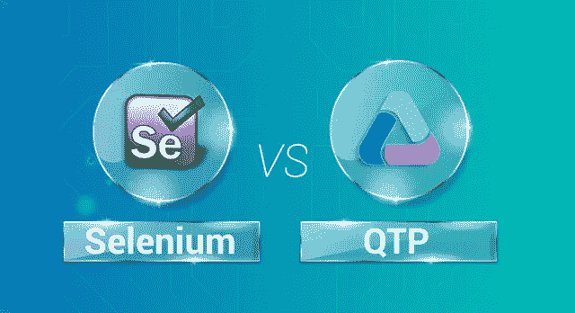
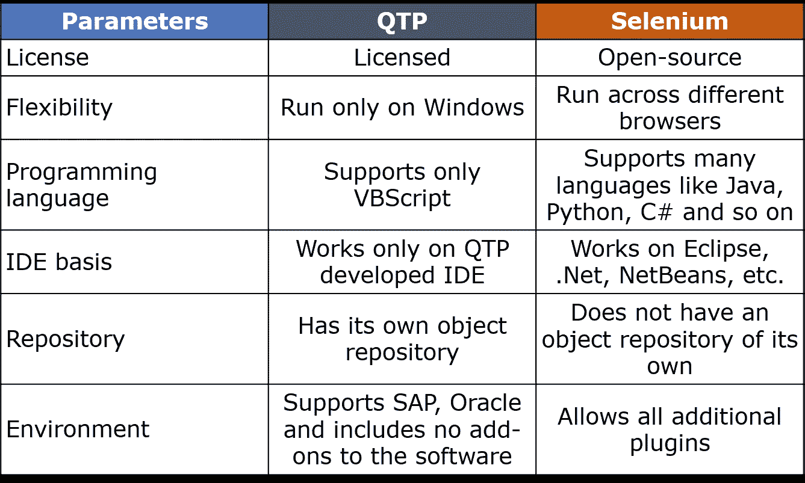

# QTP vs Selenium——自动化测试巨头之间的战争

> 原文：<https://medium.com/edureka/qtp-vs-selenium-338f3d3bbfa7?source=collection_archive---------0----------------------->

Selenium vs QTP

软件测试是最近的主流之一。排除万难测试系统使整个过程变得更容易。因此，软件测试市场主要由强大的动态工具所主导，如 Selenium、QTP 等等。因此，在这篇 QTP vs Selenium 的文章中，我们将讨论这两种自动化测试工具之间的主要区别。

但是在我们比较 QTP 和硒之前，让我们先来看看本文将要涉及的主题

*   什么是 QTP/UFT？
*   硒是什么？
*   这些工具相互之间的优势
*   它们之间有什么区别？
*   结论

在我们了解什么是 QTP 之前，我们先来了解一下 QTP 的历史。

QTP 是 Quick Test Professional 的首字母缩写，最初由 Mercury Interactive 开发，后来被惠普收购，他们称之为 UFT(统一功能测试)。该 UFT 与惠普 QTP 和惠普服务测试合并为一个软件包，该软件包显然将持续到 2016 年，直到整个部门被出售给 Microfocus。

所以，让我们先了解一下 QTP，了解一下它的功能。

# 什么是 QTP？

QTP 是一个自动化测试工具，它帮助测试人员无缝地执行自动化的[功能测试](https://www.edureka.co/blog/what-is-functional-testing?utm_source=medium&utm_medium=content-link&utm_campaign=qtp-vs-selenium)，而不需要间隔地监控系统。

*   QTP/UFT 基本上是为测试各种软件应用及其环境而设计的。
*   它是许可的，并且这个工具的成本非常高。
*   QTP 用于测试基于 UI 的测试用例，甚至可以自动化非 UI 测试用例，比如文件操作、数据库测试等等。
*   用户需要具备 VBScript 知识来运行测试用例。
*   此脚本引擎安装不是明确必需的，因为它是 Windows 操作系统的一部分。
*   QTP 只能在 Windows 平台上运行，不能跨其他浏览器运行，比如 Chrome、Firefox 等等。
*   它还有助于为测试中的软件提供质量保证。
*   它易于使用，因为它易于导航、结果验证和生成报告。

现在，让我们来了解一下硒。

# 硒是什么？

Selenium 是一个用于测试 web 应用程序的自动化工具。

*   Selenium 是一个开源的可移植框架，用于自动测试 web 应用程序。
*   在测试功能和回归测试用例时，它是高度灵活的。
*   Selenium 中的测试脚本可以用不同的编程语言编写，比如 Java、Python、C#等等。
*   这些测试脚本可以跨各种浏览器运行，如 Chrome、Safari、Firefox、Opera，并且还提供跨各种平台的支持，如 Windows、Mac OS、Linux、Solaris。
*   Selenium 还支持交叉浏览，其中测试用例同时在不同的平台上运行
*   帮助创建健壮的、基于浏览器的回归自动化套件并执行测试。
*   使用 ***元素定位符*** 可以很容易地找到网页上的元素，比如 name、 ***XPath*** ，class、 ***CSS 选择器*** 等等。
*   Selenium 可以与 TestNG & JUnit 等工具集成，用于管理测试用例并生成报告。
*   也可以与 Maven、***Jenkins***&***Docker***等工具集成，实现连续测试。

# 这些工具相互之间的优势

我们将首先看到硒相对于 QTP 的优势。

*   QTP 是有执照的，执照费用太高了。

*   它只支持 VBScript 编程语言，测试脚本不能用任何其他语言编写。
*   这些测试脚本只在 windows 环境下运行，并不支持所有浏览器。
*   QTP 不支持不同的 ide。它只能在 QTP 开发的 IDE 上工作。
*   它只允许有限的附加到过程中。
*   它还可以像 Selenium 一样执行并行测试，但只能使用 Quality Centre，这也是惠普的付费产品。

现在，让我们看看 QTP 比硒有什么优势

*   QTP 可以测试网络、移动和桌面应用程序。

*   它有自己的内置对象存储库，有助于组织应用程序中的数据。
*   与 Selenium 相比，自动化的速度更快。
*   QTP 还可以处理浏览器中的控件，如收藏夹栏、地址栏、后退和前进按钮等。
*   如果用户面临某些问题，它还会提供企业支持。
*   测试报告会自动生成。

# QTP 和硒有什么区别？

QTP 和硒是两个主要使用的自动化测试工具，被所有软件测试人员广泛使用。

我们将根据某些参数来比较这些工具-

*   许可证
*   灵活性
*   程序设计语言
*   IDE 基础
*   贮藏室ˌ仓库
*   环境

我们将首先根据他们的执照对他们进行比较。

**许可:** QTP 获得许可，成本太高，用户必须为该工具的所有版本付费，而 Selenium 是开源工具，用户不必为该工具的任何版本付费。

灵活性:在跨不同平台执行测试用例时，QTP 不是很灵活。它主要支持 Windows 并在那里执行测试。它还测试 Web、移动和桌面应用程序，而 Selenium 非常灵活，因为测试用例可以跨不同平台运行，如 Chrome、Firefox、IE 等。它只能测试 web 应用程序，不能测试移动或桌面应用程序。

编程语言: QTP 测试脚本仅使用 VBScript 编写，VBScript 是微软开发的一种主动脚本语言，测试脚本不能使用任何简单的编程语言编写，而 Selenium 测试脚本使用简单的用户友好编程语言编写，如 Java、Python、C#、Scala、Ruby 等，但其中最常用的语言是 Java。

**IDE 基础:** QTP 测试用例只在 QTP 开发的环境下工作，除此之外不能在任何其他 IDE 上工作，而 Selenium 测试脚本集成并运行在不同的 IDE 上，如 Eclipse、NetBeans 等。Net 等等。

**存储库:** QTP 有一个内置的对象存储库，它是所有对象的公共存储位置，并且是所有对象及其属性的集合，QTP 将能够识别它们并对其进行操作，而 Selenium 没有任何内置的存储库，因为它使用用户界面中的 web 元素来测试应用程序。

**环境:** QTP 支持不同的环境，如 SAP、Oracle 等，它不支持软件的附加插件，而 Selenium 支持所有附加插件及其特性。

这就是两个最常用的测试巨头 QTP 和硒之间的主要区别。

# 结论

每种工具都有其优缺点。这完全取决于用户想要测试什么以及他想要如何执行某些操作。这些工具各有优缺点。根据某些参数，硒领先于 QTP，根据另一组参数，QTP 也领先于硒。

如果你想查看更多关于人工智能、DevOps、道德黑客等市场最热门技术的文章，那么你可以参考 [Edureka 的官方网站。](https://www.edureka.co/blog/?utm_source=medium&utm_medium=content-link&utm_campaign=qtp-vs-selenium)

请留意本系列中的其他文章，它们将解释硒的各个方面。

> 1.[硒教程](/edureka/selenium-tutorial-77879a1d9af1)
> 
> 2.[Selenium web driver:TestNG For Test Case Management&报告生成](/edureka/selenium-webdriver-tutorial-e3e6219f21ad)
> 
> 3.[构建数据驱动、关键字驱动的&混合 Selenium 框架](/edureka/selenium-framework-data-keyword-hybrid-frameworks-ea8d4f4ce99f)
> 
> 4.[硒中的定位器](/edureka/locators-in-selenium-f6e6b282aed8)
> 
> 5. [XPath 教程](/edureka/xpath-in-selenium-cd659373e01a)
> 
> 6.[在硒里等待](/edureka/waits-in-selenium-5b57b56f5e5a)
> 
> 7.[为分布式硒测试建立硒网格](/edureka/selenium-grid-tutorial-ef342799c484)
> 
> 8.[硒用 Python](/edureka/selenium-using-python-edc22a44f819)
> 
> 9.[使用 LambdaTest 的跨浏览器测试](/edureka/cross-browser-testing-9299b04ce277)
> 
> 10.[使用 Selenium 进行跨浏览器测试](/edureka/cross-browser-testing-using-selenium-90b1911c6d60)
> 
> 11.[在 Selenium 中处理多个窗口](/edureka/handle-multiple-windows-in-selenium-727ba5f8f6a7)
> 
> 12.[Selenium 中的页面对象模型](/edureka/page-object-model-in-selenium-bc4d7c8c4203)
> 
> 13.[硒项目](/edureka/selenium-projects-b2df15d35fe2)
> 
> 14.[硒 vs RPA](/edureka/selenium-vs-rpa-84159dbcd0f2)
> 
> 15. [Selenium WebDriver 架构](/edureka/selenium-webdriver-architecture-565e2db26dd5)
> 
> 16.[在 Selenium 中处理异常](/edureka/exceptions-in-selenium-369c38155e7d)
> 
> 17.[使用黄瓜&硒](/edureka/cucumber-selenium-tutorial-aefec05f4733)进行网站测试

*原载于 2019 年 4 月 4 日*[*https://www.edureka.co*](https://www.edureka.co/blog/qtp-vs-selenium/)*。*