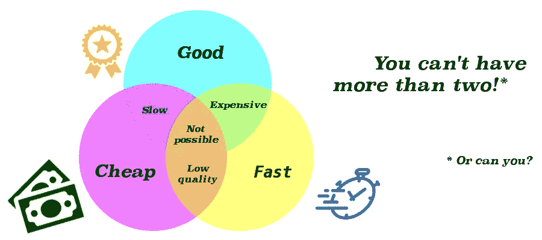
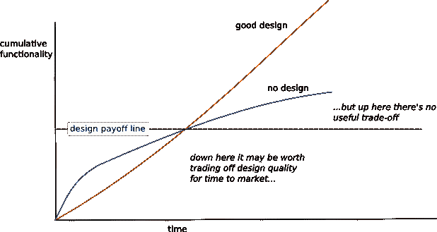

# 质量更便宜

> 原文：<https://blog.kotlin-academy.com/quality-is-cheaper-42977fcedb27?source=collection_archive---------6----------------------->

The so-called Iron Triangle

我们经常听说人们想要快速、便宜、高质量的项目，但是你只能选择其中的两种。这句话非常适用于许多现实世界的产品，无论我们是谈论建造房子还是购买汽车，这似乎很符合逻辑:优质的材料很贵，优质的工作需要关注细节，这需要时间，而时间就是金钱…

但当你开始从长远考虑时，这个口号就达到了极限:如果你买了一个低质量的产品，它可能会很便宜，生产很快，但它很可能不会持续很长时间，这意味着你必须很快买一个新的。另一方面，质量肯定经得起时间的考验。刚开始收购要花更多的钱，但从长远来看是值得的。我们周围的世界充满了这样的例子，城市或公司最终支付的费用比他们预期的高得多，因为他们起初决定选择最便宜的方案，在第一次尝试证明不可靠后不得不支付第二次费用(想想如果你谈论为一个非常大的项目支付两次费用会有什么损失，比如[造桥](https://en.wikipedia.org/wiki/Quebec_Bridge#First_design_and_collapse_of_August_29,_1907)或[设计飞机](https://medium.com/@gregoryreedtravis/the-case-of-the-737-max-b6b1869839b6))。便宜要花很多钱。

 [## 魁北克大桥

### 魁北克桥(法语为 Pont de Québec)是一座横跨下圣劳伦斯河的公路、铁路和人行桥，分别于 1906 年和 1907 年倒塌两次

en.wikipedia.org](https://en.wikipedia.org/wiki/Quebec_Bridge#First_design_and_collapse_of_August_29,_1907) 

# 从长远考虑

基本上时间、价格、质量的竞争只适用于一次性费用。如果你希望你的投资持续很长时间，因为你知道一旦失败就需要更换，那么前期投入更多的钱会更有意义，这样你就不必因为快速失败而花费更多的额外费用。

现在想象另一个例子:[你决定给自己做一张桌子](https://www.monkeyuser.com/2019/v-201/)。这可能是一个快速和廉价的项目，如果你只是把一些薄木板粘在一起，然后就结束了。起初，它似乎与高端产品没有太大区别。它可能不是最漂亮的一个，但它的工作，你很高兴它没有花你一大笔钱或花时间来建立。但随着时间的推移，你开始意识到，即使你涵盖了一些基本选项，如果你花更多的时间考虑这张桌子的所有可能用途，你可能会做一些不同的事情。或者你意识到你犯了一个小错误，需要拆下桌子来修理。或者，随着时间的推移，你的需求发生了变化:书桌变成了一张桌子，承受的重量超出了你的预期。不管什么原因，你只是意识到你原来的设计不再适合你。是时候让它适应新的要求了。由于你在第一个版本中做出了明确的决定(使用胶水而不是更通用的连接方法)，你不能简单地拆卸桌子来修改它，而是必须重新开始，再次面对所有相同的成本。另一方面，如果你花时间以一种适应性更强的方式仔细组装每一件东西，你将能够通过稍微改变设计来重新使用原始材料，并且可能只做微小的修改来满足你的新需求，从而大大降低你的成本。

# 软件从来都不是一次性的

那么和软件工程有什么联系呢？嗯，似乎我们一般都[难以定义我们所说的质量发展](https://martinfowler.com/articles/is-quality-worth-cost.html)。因为快速和便宜通常意味着低质量的想法，我们倾向于接受较低的标准以满足短的期限。如果你对质量的看法仅限于外部可见的特征(如[漂亮的图形](https://www.youtube.com/watch?v=kH-Mx9TsS_I)或精心设计的 UX ),并且你只期望交付你的软件一次，这可能是部分正确的。

问题是这种情况很少发生。首先，质量开发意味着更少的错误。正如我们大多数人被教导的那样，越早发现问题，修复它的成本就越低。因此，一旦在产品中发现错误，修补的成本将会更高，这还没有考虑到公司声誉的损失(如果你正在为航空、银行或任何其他生命攸关的领域制作关键软件，这一点就更重要了)。

其次，软件需求总是在发展。一旦你的第一次分娩结束，你马上就要开始一些进化的工作了。添加新功能、纠正错误……这些意味着你必须改变项目内部的工作方式。这就是你的代码质量会产生巨大差异的地方:好的设计和干净的架构会让你在重用你已经拥有的东西和限制你的努力方面走得很远。另一方面，如果你尽可能用最快最脏的方式把一些代码放在一起以节省时间和金钱，那么最简单的错误也要花很长时间来跟踪和修复。

> “没有快速和肮脏，只有肮脏。”经典程序员谚语

有些人可能认为这个维护阶段仍然太遥远，不需要担心，到那时他们会有时间改进事情。现在一些有质量的让步将帮助他们加快发展，到时候他们可以解决问题。这正是[技术债务](https://martinfowler.com/bliki/TechnicalDebt.html)的概念所在:在利益(由于糟糕的设计导致的生产力损失)累积到太多之前，现在就牺牲质量，以便更快发货，以后再偿还债务。

在这里，这个观点又有点荒谬，因为需求的变化不会等到你的第一次交付。POs 经常改变他们的想法，当你还在实现它们的时候，规范就在变化，你的设计在它的第一个版本完成之前就已经进化了。这意味着你将比预期更快地面对技术债务的额外成本。 [Martin Fowler 预测，几周](https://martinfowler.com/bliki/DesignStaminaHypothesis.html)，而不是几个月，就足以感受到这些影响，并看到你的设计选择开始影响你的速度。

Source: [https://martinfowler.com/bliki/DesignStaminaHypothesis.html](https://martinfowler.com/bliki/DesignStaminaHypothesis.html) (by Martin Fowler)

# 散布消息

所以有很多理论和推测，但是到目前为止我还没有任何具体的证据来支持我的观点。由于我们的勇气(即使作为有经验的软件工程师)经常促使我们降低标准，作为更快达到目标的手段，一些适当的数字将是对本文的一个很好的补充。不幸的是，在工作场所，证明这些正确的实际数据往往很少，部分原因是，除了质量水平不同之外，我们很少有完全相同的项目在相同的条件下构建两次，以比较哪个项目先完成，哪个项目产生的结果最好，或者哪个项目的错误最少。

为了回答这个问题，我们将用一些基本的数学知识做一个小小的思维实验。但是这个帖子已经够长了。让我们为将来保留它。与此同时，让我们记住，我们的经理经常被教导三个约束规则，当涉及到软件时，这被证明是基于错误的假设。因此，作为开发人员，我们有责任教育他们，并向他们展示为什么要求我们保留自动化测试以备后用，而现在关注附加值实际上是错误的方法，对他们和我们都是如此。

> "[在软件中，质量和速度之间没有权衡。从来没有过。低质量意味着低速度。一直都是。走得快唯一的方法就是走得好。](https://twitter.com/unclebobmartin/status/1163789159309434880)[罗伯特“鲍勃叔叔”马丁](https://twitter.com/unclebobmartin)

# 单击👏说“谢谢！”并帮助他人找到这篇文章。

了解卡帕头最新的重大新闻。学院，[订阅时事通讯](https://kotlin-academy.us17.list-manage.com/subscribe?u=5d3a48e1893758cb5be5c2919&id=d2ba84960a)，[观察 Twitter](https://twitter.com/ktdotacademy) 并在 medium 上关注我们。

如果您需要 Kotlin 工作室，请查看我们如何帮助您: [kt.academy](https://www.kt.academy/) 。

