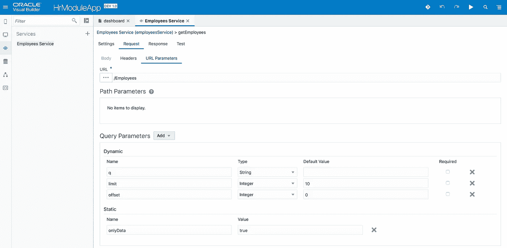

# ADF BC REST 在 VBCS 的查询逻辑实现

> 原文：<https://medium.com/oracledevs/query-logic-implementation-in-vbcs-for-adf-bc-rest-a8e3c3a03b00?source=collection_archive---------0----------------------->

Oracle Visual Builder Cloud Service 允许定义外部 REST 服务连接。在这篇文章中，我将解释如何针对这样的服务实现查询逻辑。为 ADF BC REST 服务定义了连接。

向导提供了添加静态和动态查询参数的选项。我设置了一个静态参数 onlyData=true，只从服务返回数据。我还创建了多个动态参数，在这个用例中使用的是— *q* 参数。此参数接受查询表达式来筛选数据。稍后，在 VBCS 操作链中，我将为该参数赋值，服务将重新执行以带来过滤后的数据:

将为搜索表单元素分配页面范围变量，以保存用户查询输入。单击搜索按钮时，将调用 VBCS 操作链来读取这些值并更新查询参数。页面范围变量:

变量 firstNameQueryVar 和 lastNameQueryVar 被分配给搜索表单字段，示例如下:

搜索按钮调用动作链:

动作链做两件事—调用 JS 函数来构造查询参数，然后将返回值赋给 rest 服务查询参数来执行搜索:

JS 函数被映射为接受来自搜索表单输入字段的输入参数:

JS 函数代码-参数被加入到 ADF BC REST 查询字符串中:

JS 函数结果与页面范围变量映射—结果被分配给此变量:

REST 服务查询参数 *q* 变量被赋予该值。一旦值发生变化，查询会自动重新执行:

在我的下一篇文章中，我将解释如何在服务连接之上用转换函数实现过滤和分页:

VBCS 示例应用程序代码可在 [GitHub](https://github.com/abaranovskis-redsamurai/vbcssandboxapp) 上获得(如果您从 GitHub 下载 ZIP，请确保将其解压缩并直接创建包含解压缩内容的新档案，无需顶层文件夹)。

*原载于 2018 年 9 月 19 日*[*andrejusb.blogspot.com*](http://andrejusb.blogspot.com/2018/09/query-logic-implementation-in-vbcs-for.html)*。*